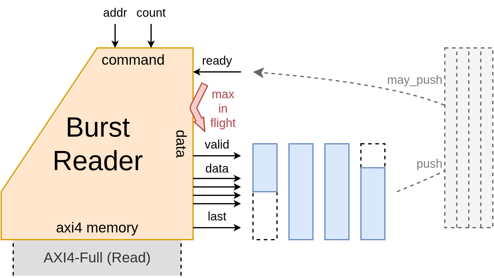
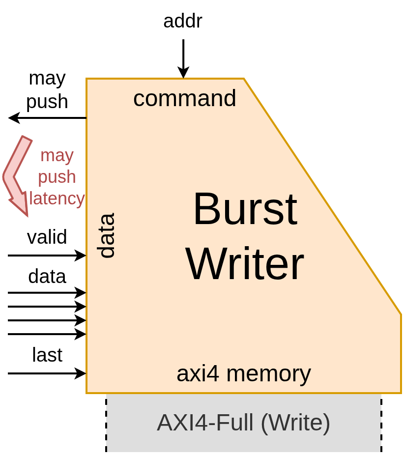
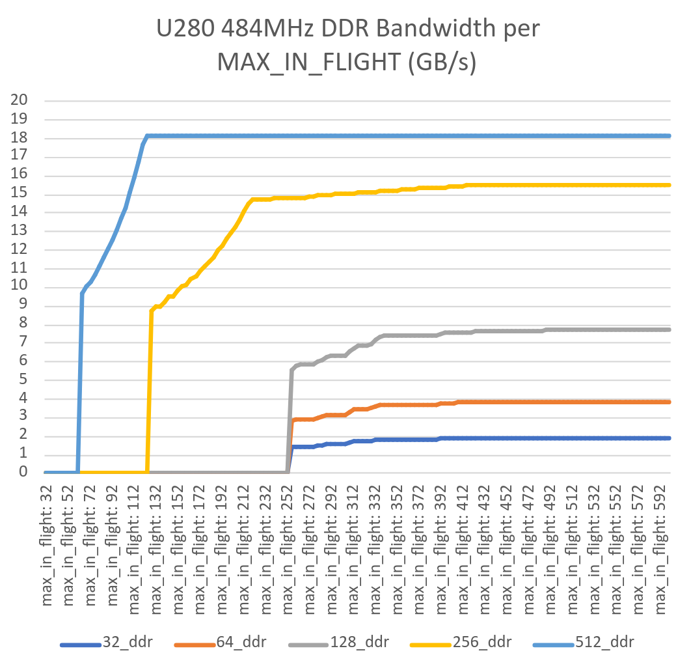
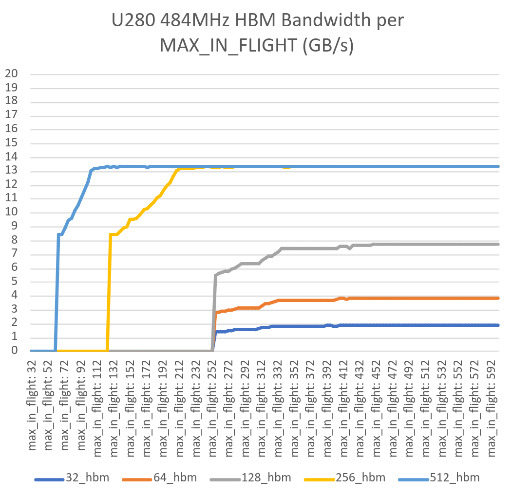
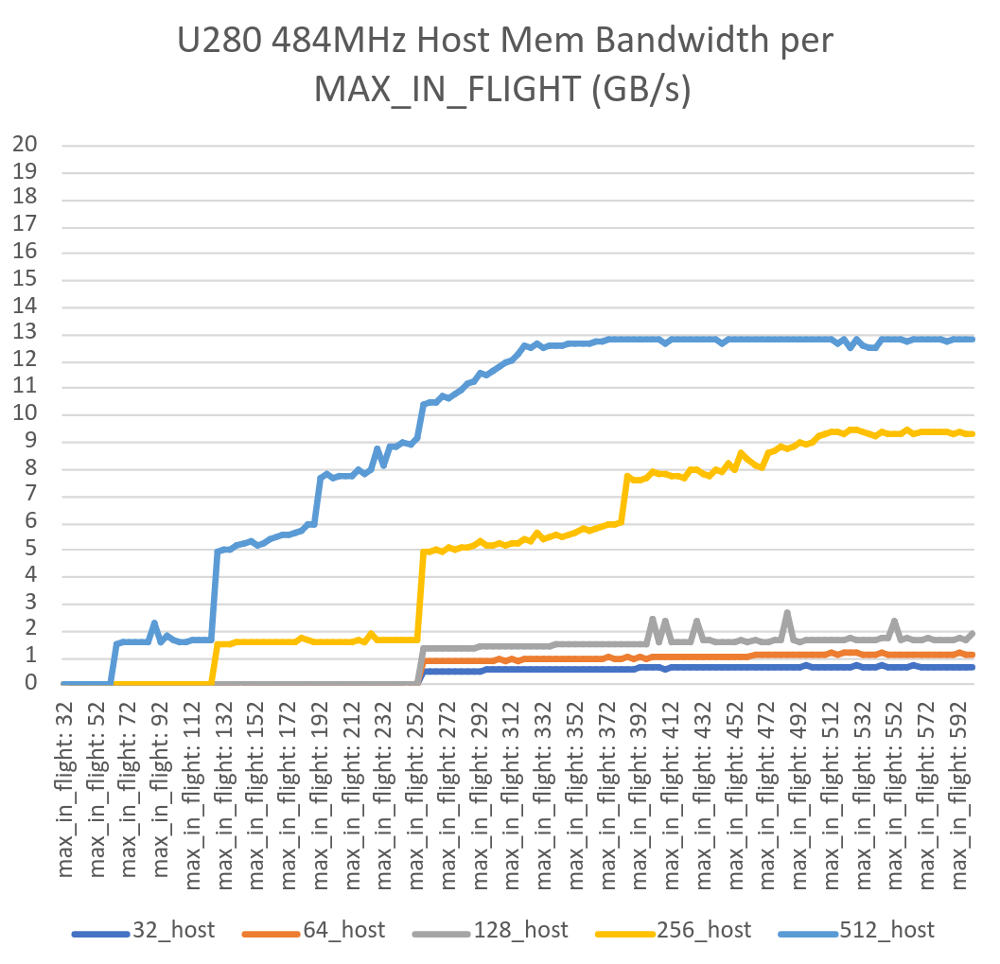
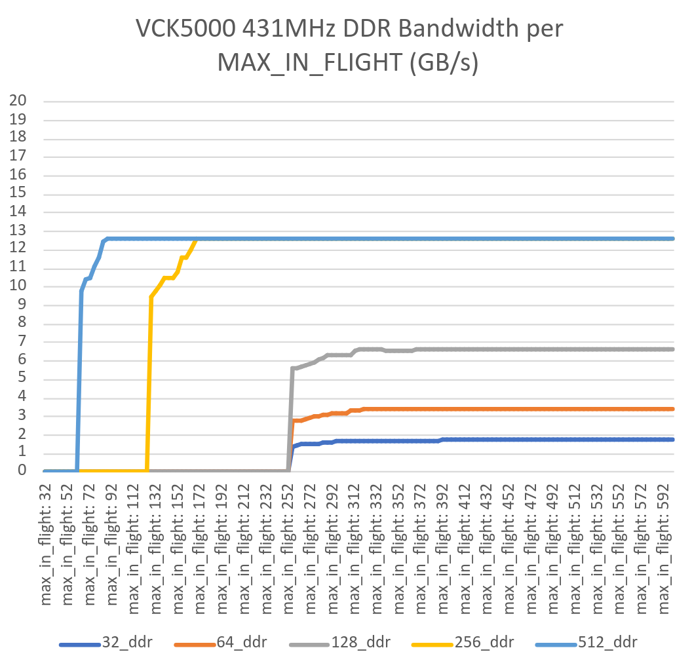

# XRT interface library for SUS
This library provides AXI slaves and masters for integrating with Xilinx' [XRT](https://github.com/Xilinx/XRT)

The following building blocks are provided:
- `axi_ctrl_slave`: AXI control slave with input & output registers. Output registers only useable in XRT User-Managed Kernels
- `axi_memory_reader`: Low-bandwidth AXI reader
- `axi_memory_writer`: Low-bandwidth AXI writer
- `axi_burst_reader`: High-bandwidth bursting AXI reader
- `axi_burst_writer`: High-bandwidth bursting AXI writer
- `axis_master_fifo`: Latency Sensitive FIFO to AXI Stream Master

Minimum [SUS](https://github.com/pc2/sus-compiler) version: **0.3.10**. 

## Usage
To use this library, include it in your `sus_compiler` build command: `sus_compiler sus-xrt/axi.sus other_files.sus...`

For full examples, buildable from source, see [tests/burst_reader](tests/burst_reader), [tests/burst_writer](tests/burst_writer), or [tests/memory_doubler](tests/memory_doubler). They employ a bursting axi reader, writer, and both respectively. 

### `axi_ctrl_slave`
This module is the interface of your [XRT kernel](https://xilinx.github.io/XRT/master/html/xrt_native_apis.html#kernel-and-run). It is responsible the starting and stopping of your kernel, and for accepting the parameters your kernel has, as well as returning the results. (Note: This is only for small results. If you wish to work with larger data structures you should use the memory interfaces instead.)

The control slave maps the incoming AXI4-Lite address space to an array of 32-bit registers. Register `0x000` is used as the control register, to which `0x00000001` is written to start the kernel. Once running, the control register is continuously polled, until it returns `0x00000004` to indicate it is done. 

Input registers start from `0x010`, and increment by 4 bytes for each register. So going `0x010`, `0x014`, `0x018`, etc. Output registers start after the last input register, and continue similarly. 

**Usage example:**
```sus
module SumExample {
    clock aclk
    input bool aresetn
    gen int ADDR_WIDTH

    axi_ctrl_slave #(NUM_INPUT_REGS: 2, NUM_OUTPUT_REGS: 1, ADDR_WIDTH, AXI_WIDTH: 32) ctrl

    // Export AXI4-Lite interface
    domain axi_control
    input  int#(FROM: 0, TO: 1 << ADDR_WIDTH)  s_axi_control_awaddr
    input  bool                                s_axi_control_awvalid
    output bool                                s_axi_control_awready = ctrl.awready
    input  bool[32]                            s_axi_control_wdata
    input  bool[4]                             s_axi_control_wstrb
    input  bool                                s_axi_control_wvalid
    output bool                                s_axi_control_wready  = ctrl.wready
    output bool[2]                             s_axi_control_bresp   = ctrl.bresp
    output bool                                s_axi_control_bvalid  = ctrl.bvalid
    input  bool                                s_axi_control_bready
    input  int#(FROM: 0, TO: 1 << ADDR_WIDTH)  s_axi_control_araddr
    input  bool                                s_axi_control_arvalid
    output bool                                s_axi_control_arready = ctrl.arready
    output bool[32]                            s_axi_control_rdata   = ctrl.rdata
    output bool[2]                             s_axi_control_rresp   = ctrl.rresp
    output bool                                s_axi_control_rvalid  = ctrl.rvalid
    input  bool                                s_axi_control_rready
    ctrl.awaddr  =                             s_axi_control_awaddr
    ctrl.awvalid =                             s_axi_control_awvalid
    ctrl.wdata   =                             s_axi_control_wdata
    ctrl.wstrb   =                             s_axi_control_wstrb
    ctrl.wvalid  =                             s_axi_control_wvalid
    ctrl.bready  =                             s_axi_control_bready
    ctrl.araddr  =                             s_axi_control_araddr
    ctrl.arvalid =                             s_axi_control_arvalid
    ctrl.rready  =                             s_axi_control_rready

    state bool stored_sum_valid
    state int stored_sum
    when ctrl.start {
        stored_sum_valid = true
        stored_sum = ctrl.input_regs[0] + ctrl.input_regs[1] mod pow2#(E: 32)
    }

    when stored_sum_valid {
        ctrl.finish([stored_sum])
        stored_sum_valid = false
    }

    when !aresetn {
        ctrl.rst()
        stored_sum_valid = false
    }
}
```
To make your kernel parameters visible to XRT, you must declare them in your `pack_kernel.tcl`, like so:
```tcl
# ... other kernel packing stuff
set CTRL_ADDR_BLOCK [ipx::get_address_blocks reg0 -of_objects [ipx::get_memory_maps s_axi_control -of_objects [ipx::current_core]]]

ipx::add_register CTRL $CTRL_ADDR_BLOCK
set_property description    {Control Signals} [ipx::get_registers CTRL -of_objects $CTRL_ADDR_BLOCK]
set_property address_offset {0x00}            [ipx::get_registers CTRL -of_objects $CTRL_ADDR_BLOCK]
set_property size           {32}              [ipx::get_registers CTRL -of_objects $CTRL_ADDR_BLOCK]

ipx::add_register PARAM_A $CTRL_ADDR_BLOCK
set_property description    {Sum Param A}     [ipx::get_registers PARAM_A  -of_objects $CTRL_ADDR_BLOCK]
set_property address_offset {0x010}           [ipx::get_registers PARAM_A  -of_objects $CTRL_ADDR_BLOCK]
set_property size           {32}              [ipx::get_registers PARAM_A  -of_objects $CTRL_ADDR_BLOCK]

ipx::add_register PARAM_B $CTRL_ADDR_BLOCK
set_property description    {Sum Param B}     [ipx::get_registers PARAM_B  -of_objects $CTRL_ADDR_BLOCK]
set_property address_offset {0x014}           [ipx::get_registers PARAM_B  -of_objects $CTRL_ADDR_BLOCK]
set_property size           {32}              [ipx::get_registers PARAM_B  -of_objects $CTRL_ADDR_BLOCK]
# ... other kernel packing stuff
```
Output parameters can't be declared since XRT doesn't expose those for `xrt::kernel`. For those you have to use `xrt::ip`, and call `ip.read_register(0x018)` yourself. 

### `axi_burst_reader`
The burst reader is used for high-bandwidth streaming from DDR, HBM, or Host Memory. It has two user-facing interfaces: One for requesting bursts - `may_request_new_read/request_new_read(start_addr, num_elements)`, and one for the data stream itself: `ready_for_lots_of_data/chunk_valid(elements, chunk_length, chunk_offset, last)`. 

Burst lengths are expressed in **elements**, an **element** is the smallest aligned component of a **transfer**. 

Once a burst has been requested, data streams out of the `chunk_valid` interface. A **burst** consists of one or more **transfers**, each of which consists of 1 to `AXI_WIDTH / (ADDR_ALIGN * 8)` **elements**. The part of the output data stream that is valid is communicated through the `chunk_length` and `chunk_offset` values. 

Since the burst reader itself does not spend any resources on realigning elements within a transfer, the first transfer within a burst may not have valid elements at the front (denoted by a nonzero `chunk_offset`), and the last transfer may not have valid elements at the end (denoted by non-maximum `chunk_length`). 

**Backpressure** on the data stream can only be provided on the address channel, as it is forbidden to backpressure the data stream itself. Hence, the long latency difference between `ready_for_lots_of_data'-MAX_IN_FLIGHT` and `chunk_valid'0`. You must account for being able to receive this amount of in-flight data by using an appropriately sized FIFO downstream. (The latency sensitive may_push/push interface on the FIFO should figure out this appropriate size automatically.)

You can also attach extra data to the burst read. Whatever extra data you pass to `request_new_read` you receive again on every `chunk_valid`. 

**Example:** In the FIFO below, a request for 13 4-byte elements was made from address `0x00000010000008`, at an AXI_WIDTH of 128-bit. This results in 4 transfers, of 2, 4, 4, and 3 elements respectively. The last transfer will have `last=1`. 

For setting **MAX_IN_FLIGHT** for your specific case, refer to the values in [Optimal `MAX_IN_FLIGHT` values for `axi_burst_reader`](README.md#optimal-max_in_flight-values-for-axi_burst_reader)

<p align="center">
    
</p>

**Usage example:**
```sus
module BasicHash {
    clock aclk
    input bool aresetn

    gen int MEM_ADDR_WIDTH = 64
    gen int AXI_WIDTH = 512
    gen int ELEM_BITWIDTH = 32
    gen int NUM_PARALLEL_ELEMENTS = AXI_WIDTH / ELEM_BITWIDTH

    axi_ctrl_slave #(NUM_INPUT_REGS: 3, NUM_OUTPUT_REGS: 1, ADDR_WIDTH: 12, AXI_WIDTH: 32) ctrl
    domain axi_control
    // ...

    axi_burst_reader#(AXI_WIDTH, ADDR_WIDTH: MEM_ADDR_WIDTH, ADDR_ALIGN: 4, COUNT_TO: pow2#(E: 32), MAX_IN_FLIGHT: 110) reader
    domain mem_read
    output bool                                    m_axi_arvalid'0 = reader.arvalid
    input  bool                                    m_axi_arready
    output int#(FROM: 0, TO: 1 << MEM_ADDR_WIDTH)  m_axi_araddr = reader.araddr
    output int#(FROM: 0, TO: 256)                  m_axi_arlen = reader.arlen
    output int#(FROM: 0, TO: 8)                    m_axi_arsize  = reader.arsize
    output bool[2]                                 m_axi_arburst = reader.arburst
    output bool[3]                                 m_axi_arprot = reader.arprot
    output bool[4]                                 m_axi_arcache = reader.arcache
    output int#(FROM: 0, TO: 16)                   m_axi_arqos = reader.arqos
    output bool                                    m_axi_arlock = reader.arlock
    output int#(FROM: 0, TO: 16)                   m_axi_arregion = reader.arregion
    input  bool                                    m_axi_rvalid
    output bool                                    m_axi_rready = reader.rready
    input  bool[AXI_WIDTH]                         m_axi_rdata
    input  bool[2]                                 m_axi_rresp
    input  bool                                    m_axi_rlast
    reader.arready =                               m_axi_arready
    reader.rvalid =                                m_axi_rvalid
    reader.rdata =                                 m_axi_rdata
    reader.rresp =                                 m_axi_rresp
    reader.rlast =                                 m_axi_rlast

    axi_writer_tie_off writer
    domain mem_write
    // ...  tie off the write half of the AXI4-Full interface

    state bool[32] hash
    when ctrl.start {
        bool[64] addr_bits
        addr_bits[:32] = ctrl.input_regs[0]
        addr_bits[32:] = ctrl.input_regs[1]
        int num_to_transfer = BitsToUInt(ctrl.input_regs[2])
        reader.request_new_read(BitsToUInt(addr_bits), num_to_transfer, [])

        hash = 32'h00000000
    }

    reader.ready_for_lots_of_data = true
    when reader.chunk_valid :
        bool[ELEM_BITWIDTH][NUM_PARALLEL_ELEMENTS] elements,
        int#(FROM: 0, TO: NUM_PARALLEL_ELEMENTS+1) chunk_length,
        int#(FROM: 0, TO: NUM_PARALLEL_ELEMENTS) chunk_offset,
        bool last,
        bool[0] _unused_extra_data {

        reg reg bool[NUM_PARALLEL_ELEMENTS] mask = MakeStrobe(chunk_length, chunk_offset)
        bool[ELEM_BITWIDTH][NUM_PARALLEL_ELEMENTS] masked_elements
        for int i in 0..NUM_PARALLEL_ELEMENTS {
            when mask[i] {
                reg masked_elements[i] = elements[i]
            } else {
                reg masked_elements[i] = RepeatGen#(SIZE: ELEM_BITWIDTH, T: type bool, V: false)
            }
        }
        bool[32] new_hash_contrib
        for int i in 0..32 {
            reg reg new_hash_contrib[i] = ^(masked_elements[:][i])
        }
        bool[32] new_hash = hash ^ new_hash_contrib
        when last {
            ctrl.finish([new_hash])
        }
        hash = new_hash
    }
    when !aresetn {
        reader.rst()
        ctrl.rst()
    }
}
```

`pack_kernel.tcl`:
```tcl
# ... other kernel packing stuff
set CTRL_ADDR_BLOCK [ipx::get_address_blocks reg0 -of_objects [ipx::get_memory_maps s_axi_control -of_objects [ipx::current_core]]]

ipx::add_register CTRL $CTRL_ADDR_BLOCK
set_property description    {Control Signals} [ipx::get_registers CTRL -of_objects $CTRL_ADDR_BLOCK]
set_property address_offset {0x00}            [ipx::get_registers CTRL -of_objects $CTRL_ADDR_BLOCK]
set_property size           {32}              [ipx::get_registers CTRL -of_objects $CTRL_ADDR_BLOCK]

ipx::add_register ADDR $CTRL_ADDR_BLOCK
set_property description    {buffer addr}     [ipx::get_registers ADDR  -of_objects $CTRL_ADDR_BLOCK]
set_property address_offset {0x010}           [ipx::get_registers ADDR  -of_objects $CTRL_ADDR_BLOCK]
set_property size           {64}              [ipx::get_registers ADDR  -of_objects $CTRL_ADDR_BLOCK]
ipx::add_register_parameter ASSOCIATED_BUSIF  [ipx::get_registers ADDR  -of_objects $CTRL_ADDR_BLOCK]
set_property value          {m_axi}           [ipx::get_register_parameters ASSOCIATED_BUSIF -of_objects [ipx::get_registers ADDR -of_objects $CTRL_ADDR_BLOCK]]

ipx::add_register ELEMENT_COUNT $CTRL_ADDR_BLOCK
set_property description    {element count}   [ipx::get_registers ELEMENT_COUNT  -of_objects $CTRL_ADDR_BLOCK]
set_property address_offset {0x018}           [ipx::get_registers ELEMENT_COUNT  -of_objects $CTRL_ADDR_BLOCK]
set_property size           {32}              [ipx::get_registers ELEMENT_COUNT  -of_objects $CTRL_ADDR_BLOCK]
# ... other kernel packing stuff
```

### `axi_burst_writer`
The burst writer is used for high-bandwidth streaming from DDR, HBM, or Host Memory. It has two user-facing interfaces: One for requesting bursts - `may_request_new_write/request_new_write(start_addr)`, and one for the data stream itself: `may_write/write(elements, chunk_length, chunk_offset, last)`. 

As with the reader, burst lengths are expressed in **elements**, an **element** is the smallest aligned component of a **transfer**. 

After a burst has been requested, you may stream your data into the `write` interface. A **burst** consists of one or more **transfers**, each of which consists of 1 to `AXI_WIDTH / (ADDR_ALIGN * 8)` **elements**. The part of the input data stream that is valid is communicated through the `chunk_length` and `chunk_offset` values. 

As opposed to the burst reader, the burst writer *does* contain data realigning logic. Besides freeing you from the worry of alignment, this comes with the bonus of letting you send your data in smaller transfers. The internal FIFO buffers your transfers anyway, and saves them up until it has full burst to submit to the memory interface. 

**Backpressure:** The backpressure behaves identically to a regular FIFO. 

**Example:** In the FIFO below, a write request for 4-byte elements was made to address `0x0000000100000000`, at an AXI_WIDTH of 128-bit. In 4 separate transfers, 1, 1, 4, and 2 elements were written, with `last=1` on the last transfer. Upon the last transfer, the burst writer submits a memory write for 2 128-bit AXI transfers. 

<p align="center">
    
</p>

**Usage example:**
```sus
module MemoryZeroer {
    clock aclk
    input bool aresetn

    gen int AXI_WIDTH = 256
    gen int MEM_ADDR_WIDTH = 64

    gen int NUM_PARALLEL_ELEMENTS = AXI_WIDTH / 32

    axi_ctrl_slave #(NUM_INPUT_REGS: 2, NUM_OUTPUT_REGS: 0, ADDR_WIDTH: 12, AXI_WIDTH: 32) ctrl

    // Export AXI4-Lite interface
    domain axi_control
    // ...

    axi_burst_writer#(AXI_WIDTH, ADDR_WIDTH: MEM_ADDR_WIDTH, ADDR_ALIGN: 4) writer
    domain mem_write
    output bool                                    m_axi_awvalid = writer.awvalid
    input  bool                                    m_axi_awready
    output int#(FROM: 0, TO: 1 << MEM_ADDR_WIDTH)  m_axi_awaddr = writer.awaddr
    output int#(FROM: 0, TO: 256)                  m_axi_awlen = writer.awlen
    output int#(FROM: 0, TO: 8)                    m_axi_awsize  = writer.awsize
    output bool[2]                                 m_axi_awburst = writer.awburst
    output bool[3]                                 m_axi_awprot = writer.awprot
    output bool[4]                                 m_axi_awcache = writer.awcache
    output int#(FROM: 0, TO: 16)                   m_axi_awqos = writer.awqos
    output bool                                    m_axi_awlock = writer.awlock
    output int#(FROM: 0, TO: 16)                   m_axi_awregion = writer.awregion
    output bool                                    m_axi_wvalid = writer.wvalid
    input  bool                                    m_axi_wready
    output bool[AXI_WIDTH]                         m_axi_wdata = writer.wdata
    output bool[AXI_WIDTH / 8]                     m_axi_wstrb = writer.wstrb
    output bool                                    m_axi_wlast = writer.wlast
    input  bool                                    m_axi_bvalid
    output bool                                    m_axi_bready = writer.bready
    input  bool[2]                                 m_axi_bresp
    writer.awready =                               m_axi_awready
    writer.wready  =                               m_axi_wready
    writer.bvalid  =                               m_axi_bvalid
    writer.bresp   =                               m_axi_bresp

    axi_reader_tie_off reader
    domain mem_read
    // ...  tie off the read half of the AXI4-Full interface


    state int left_to_transfer
    when ctrl.start {
        bool[64] addr_bits
        addr_bits[:32] = ctrl.input_regs[0]
        addr_bits[32:] = ctrl.input_regs[1]
        
        left_to_transfer = BitsToUInt(ctrl.input_regs[2])
        writer.request_new_write(BitsToUInt(addr_bits))
    }
    when left_to_transfer > 0 & writer.may_write {
        when num_left_to_transfer > 8 {
            writer.write([32'h00000000, 32'h00000000, 32'h00000000, 32'h00000000, 32'h00000000, 32'h00000000, 32'h00000000, 32'h00000000], 8, 0, false)
            left_to_transfer = num_left_to_transfer - 8
        } else {
            writer.write([32'h00000000, 32'h00000000, 32'h00000000, 32'h00000000, 32'h00000000, 32'h00000000, 32'h00000000, 32'h00000000], left_to_transfer mod 8, 0, true)
            left_to_transfer = 0
        }
    }
    when writer.write_has_been_committed {
        ctrl.finish([])
    }

    when !aresetn {
        ctrl.rst()
        writer.rst()
        left_to_transfer = 0
    }
}
```

`pack_kernel.tcl`:
```tcl
# ... other kernel packing stuff
set CTRL_ADDR_BLOCK [ipx::get_address_blocks reg0 -of_objects [ipx::get_memory_maps s_axi_control -of_objects [ipx::current_core]]]

ipx::add_register CTRL $CTRL_ADDR_BLOCK
set_property description    {Control Signals} [ipx::get_registers CTRL -of_objects $CTRL_ADDR_BLOCK]
set_property address_offset {0x00}            [ipx::get_registers CTRL -of_objects $CTRL_ADDR_BLOCK]
set_property size           {32}              [ipx::get_registers CTRL -of_objects $CTRL_ADDR_BLOCK]

ipx::add_register ADDR $CTRL_ADDR_BLOCK
set_property description    {buffer addr}     [ipx::get_registers ADDR  -of_objects $CTRL_ADDR_BLOCK]
set_property address_offset {0x010}           [ipx::get_registers ADDR  -of_objects $CTRL_ADDR_BLOCK]
set_property size           {64}              [ipx::get_registers ADDR  -of_objects $CTRL_ADDR_BLOCK]
ipx::add_register_parameter ASSOCIATED_BUSIF  [ipx::get_registers ADDR  -of_objects $CTRL_ADDR_BLOCK]
set_property value          {m_axi}           [ipx::get_register_parameters ASSOCIATED_BUSIF -of_objects [ipx::get_registers ADDR -of_objects $CTRL_ADDR_BLOCK]]

ipx::add_register ELEMENT_COUNT $CTRL_ADDR_BLOCK
set_property description    {element count}   [ipx::get_registers ELEMENT_COUNT  -of_objects $CTRL_ADDR_BLOCK]
set_property address_offset {0x018}           [ipx::get_registers ELEMENT_COUNT  -of_objects $CTRL_ADDR_BLOCK]
set_property size           {32}              [ipx::get_registers ELEMENT_COUNT  -of_objects $CTRL_ADDR_BLOCK]
# ... other kernel packing stuff
```

## Benchmarks
[Extra U280 Benchmark Details](U280_details.md)
[Extra VCK5000 Benchmark Details](VCK5000_details.md)

### U280 Read @ 484MHz
| Memory   | AXI_WIDTH | Bandwidth (GB/s) | Bytes/cycle |
|----------|-----------|------------------|-------------|
| DDR      | 32        | 1.93             | 3.99        |
| DDR      | 64        | 3.87             | 7.99        |
| DDR      | 128       | 7.73             | 15.97       |
| DDR      | 256       | 15.49            | 32.00       |
| DDR      | 512       | 18.16            | 37.53       |
| HBM      | 32        | 1.94             | 4.00        |
| HBM      | 64        | 3.87             | 8.00        |
| HBM      | 128       | 7.74             | 16.00       |
| HBM      | 256       | 13.36            | 27.61       |
| HBM      | 512       | 13.36            | 27.60       |
| Host Mem | 32        | 0.67             | 1.38        |
| Host Mem | 64        | 1.13             | 2.34        |
| Host Mem | 128       | 1.60             | 3.31        |
| Host Mem | 256       | 9.47             | 19.56       |
| Host Mem | 512       | 12.90            | 26.64       |

| Memory   | Cycles | Latency (ns) |
|----------|--------|--------------|
| DDR      | 107    | 221          |
| HBM      | 96     | 199          |
| Host Mem | 502    | 1038         |

### U280 Write @ 455MHz
| Memory   | AXI_WIDTH | Bandwidth (GB/s) | Bytes/cycle |
|----------|-----------|------------------|-------------|
| DDR      | 32        | 1.82             | 4.00        |
| DDR      | 64        | 3.64             | 8.00        |
| DDR      | 128       | 7.28             | 16.00       |
| DDR      | 256       | 14.56            | 32.00       |
| DDR      | 512       | 15.92            | 34.99       |
| HBM      | 32        | 1.82             | 4.00        |
| HBM      | 64        | 3.64             | 8.00        |
| HBM      | 128       | 7.28             | 16.00       |
| HBM      | 256       | 13.18            | 28.97       |
| HBM      | 512       | 13.18            | 28.97       |
| Host Mem | 32        | 1.82             | 4.00        |
| Host Mem | 64        | 3.64             | 8.00        |
| Host Mem | 128       | 7.27             | 15.98       |
| Host Mem | 256       | 14.18            | 31.16       |
| Host Mem | 512       | 14.17            | 31.15       |

| Memory   | Cycles | Latency (ns) |
|----------|--------|--------------|
| DDR      | 63     | 139          |
| HBM      | 52     | 115          |
| Host Mem | 145    | 318          |

### VCK5000 Read @ 431MHz
| Memory | AXI_WIDTH | Bandwidth (GB/s) | Bytes/cycle |
|--------|-----------|------------------|-------------|
| DDR    | 32        | 1.72             | 4.00        |
| DDR    | 64        | 3.45             | 8.00        |
| DDR    | 128       | 6.62             | 15.44       |
| DDR    | 256       | 12.63            | 29.31       |
| DDR    | 512       | 12.63            | 29.31       |

| Memory | Cycles | Latency (ns) |
|--------|--------|--------------|
| DDR    | 62–94  | 144–218      |

### VCK5000 Write @ 427MHz
| Memory | AXI_WIDTH | Bandwidth (GB/s) | Bytes/cycle |
|--------|-----------|------------------|-------------|
| DDR    | 32        | 1.67             | 3.91        |
| DDR    | 64        | 3.23             | 7.57        |
| DDR    | 128       | 6.21             | 14.55       |
| DDR    | 256       | 10.77            | 25.23       |
| DDR    | 512       | 11.87            | 27.79       |

| Memory | Cycles | Latency (ns) |
|--------|--------|--------------|
| DDR    | 43–53  | 101–124      |

## Optimal `MAX_IN_FLIGHT` values for `axi_burst_reader`
Using `axi_burst_reader_benchmarker` we can vary the `MAX_IN_FLIGHT` parameter to find the lowest value that still produces optimal bandwidth. These benchmarks are run at very high frequencies, such that we have a confident upper bound. 

<p align="center">
    
    
    
    
</p>

Interpreting these results, we recommend the following `MAX_IN_FLIGHT` values:
| AXI_WIDTH | U280 DDR | U280 HBM | U280 Host Mem | VCK5000 DDR |
| --- | --- | --- | ---       | --- |
| 32  | 512 | 512 | don't use | 392 | 
| 64  | 512 | 512 | don't use | 392 |
| 128 | 512 | 512 | don't use | 392 |
| 256 | 448 | 256 | 512       | 192 |
| 512 | 128 | 128 | 384       | 110 |
