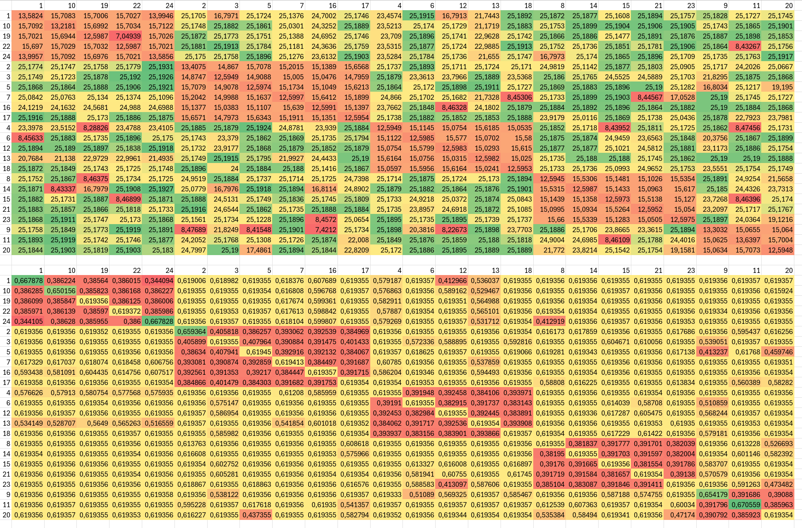
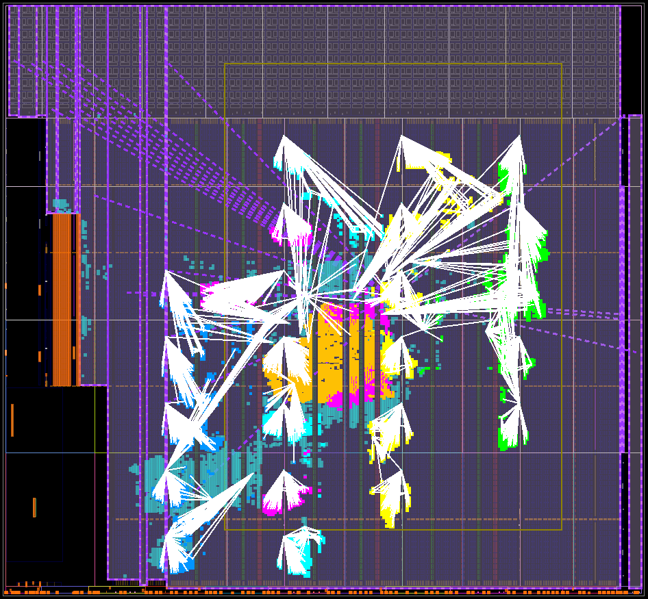
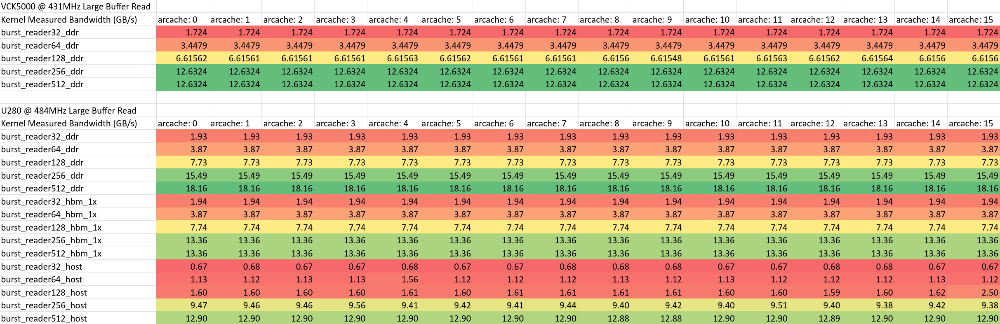
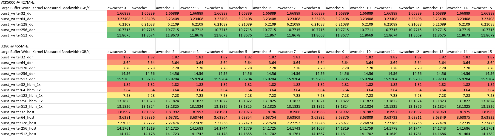

# AXI Slaves and Masters for XRT
[SUS](https://github.com/pc2/sus-compiler) library that provides AXI slaves and masters for Xilinx' [XRT](https://github.com/Xilinx/XRT)

This Library Provides: 
- AXI control slave: Provides input & output registers. Output registers only useable in XRT User-Managed Kernels
- Low-bandwidth AXI reader
- Low-bandwidth AXI writer
- High-bandwidth bursting AXI reader
- High-bandwidth bursting AXI writer

## Usage
### `axi_ctrl_slave`
This module is the interface of your [XRT kernel](https://xilinx.github.io/XRT/master/html/xrt_native_apis.html#kernel-and-run). It is responsible the starting and stopping of your kernel, and for accepting the parameters your kernel has, as well as returning the results. (Note: This is only for small results. If you wish to work with larger data structures you should use the memory interfaces instead.)

The control slave maps the incoming AXI4-Lite address space to an array of 32-bit registers. Register `0x000` is used as the control register, to which `0x00000001` is written to start the kernel. Once running, the control register is continuously polled, until it returns `0x00000004` to indicate it is done. 

Input registers start from `0x010`, and increment by 4 bytes for each register. So going `0x010`, `0x014`, `0x018`, etc. Output registers start after the last input register, and continue similarly. 

**Usage example:**
```sus
module SumExample {
    domain aclk
    input bool aresetn
    axi_ctrl_slave #(NUM_INPUT_REGS: 2, NUM_OUTPUT_REGS: 1, ADDR_WIDTH: 12, AXI_WIDTH: 32) ctrl

    gen int ATO = pow2#(E: 12)
    
    // Export AXI4-Lite interface
    domain axi_control
    input  int#(FROM: 0, TO: ATO)   s_axi_control_awaddr
    input  bool                     s_axi_control_awvalid
    output bool                     s_axi_control_awready = ctrl.awready
    input  bool[32]                 s_axi_control_wdata
    input  bool[4]                  s_axi_control_wstrb
    input  bool                     s_axi_control_wvalid
    output bool                     s_axi_control_wready  = ctrl.wready
    output bool[2]                  s_axi_control_bresp   = ctrl.bresp
    output bool                     s_axi_control_bvalid  = ctrl.bvalid
    input  bool                     s_axi_control_bready
    input  int#(FROM: 0, TO: ATO)   s_axi_control_araddr
    input  bool                     s_axi_control_arvalid
    output bool                     s_axi_control_arready = ctrl.arready
    output bool[32]                 s_axi_control_rdata   = ctrl.rdata
    output bool[2]                  s_axi_control_rresp   = ctrl.rresp
    output bool                     s_axi_control_rvalid  = ctrl.rvalid
    input  bool                     s_axi_control_rready
    ctrl.awaddr  = s_axi_control_awaddr
    ctrl.awvalid = s_axi_control_awvalid
    ctrl.wdata   = s_axi_control_wdata
    ctrl.wstrb   = s_axi_control_wstrb
    ctrl.wvalid  = s_axi_control_wvalid
    ctrl.bready  = s_axi_control_bready
    ctrl.araddr  = s_axi_control_araddr
    ctrl.arvalid = s_axi_control_arvalid
    ctrl.rready  = s_axi_control_rready

    state bool stored_sum_valid
    state int stored_sum
    when ctrl.start {
        stored_sum_valid = true
        stored_sum = ctrl.input_regs[0] + ctrl.output_regs[0] mod pow2#(E: 32)
    }

    when stored_sum_valid {
        ctrl.finish([stored_sum])
        stored_sum_valid = false
    }

    when !aresetn {
        ctrl.rst()
        stored_sum_valid = false
    }
}
```
To make your kernel parameters visible to XRT, you must declare them in your `pack_kernel.tcl`, like so:
```tcl
# ... other kernel packing stuff
set CTRL_ADDR_BLOCK [ipx::get_address_blocks reg0 -of_objects [ipx::get_memory_maps s_axi_control -of_objects [ipx::current_core]]]

ipx::add_register CTRL $CTRL_ADDR_BLOCK
set_property description    {Control Signals} [ipx::get_registers CTRL -of_objects $CTRL_ADDR_BLOCK]
set_property address_offset {0x00}            [ipx::get_registers CTRL -of_objects $CTRL_ADDR_BLOCK]
set_property size           {32}              [ipx::get_registers CTRL -of_objects $CTRL_ADDR_BLOCK]

ipx::add_register PARAM_A $CTRL_ADDR_BLOCK
set_property description    {Sum Param B}     [ipx::get_registers PARAM_A  -of_objects $CTRL_ADDR_BLOCK]
set_property address_offset {0x010}           [ipx::get_registers PARAM_A  -of_objects $CTRL_ADDR_BLOCK]
set_property size           {32}              [ipx::get_registers PARAM_A  -of_objects $CTRL_ADDR_BLOCK]

ipx::add_register PARAM_B $CTRL_ADDR_BLOCK
set_property description    {Sum Param B}     [ipx::get_registers PARAM_B  -of_objects $CTRL_ADDR_BLOCK]
set_property address_offset {0x014}           [ipx::get_registers PARAM_B  -of_objects $CTRL_ADDR_BLOCK]
set_property size           {32}              [ipx::get_registers PARAM_B  -of_objects $CTRL_ADDR_BLOCK]
# ... other kernel packing stuff
```
Output parameters can't be declared since XRT doesn't expose those for `xrt::kernel`. For those you have to use `xrt::ip`, and call `ip.read_register(0x018)` yourself. 

### `axi_burst_reader`
<p align="center">
    
</p>

**Usage example:**
```sus
module BasicHash {
    domain aclk
    input bool aresetn

    gen int MTO = pow2#(E: 64)
    gen int AXI_WIDTH = 512
    gen int ELEM_BITWIDTH = 32
    gen int NUM_PARALLEL_ELEMENTS = AXI_WIDTH / ELEM_BITWIDTH

    axi_ctrl_slave #(NUM_INPUT_REGS: 3, NUM_OUTPUT_REGS: 1, ADDR_WIDTH: 12, AXI_WIDTH: 32) ctrl
    domain axi_control
    // ...

    axi_burst_reader#(AXI_WIDTH, ADDR_ALIGN: 4, COUNT_TO: pow2#(E: 32), ATO: pow2#(E: 64), MAX_IN_FLIGHT: 110) reader
    domain mem_read
    output bool                     m_axi_arvalid'0 = reader.arvalid
    input  bool                     m_axi_arready
    output int#(FROM: 0, TO: MTO)   m_axi_araddr = reader.araddr
    output int#(FROM: 0, TO: 256)   m_axi_arlen = reader.arlen
    output int#(FROM: 0, TO: 8)     m_axi_arsize  = reader.arsize
    output bool[2]                  m_axi_arburst = reader.arburst
    output bool[3]                  m_axi_arprot = reader.arprot
    output bool[4]                  m_axi_arcache = reader.arcache
    output int#(FROM: 0, TO: 16)    m_axi_arqos = reader.arqos
    output bool                     m_axi_arlock = reader.arlock
    output int#(FROM: 0, TO: 16)    m_axi_arregion = reader.arregion
    input  bool                     m_axi_rvalid
    output bool                     m_axi_rready = reader.rready
    input  bool[AXI_WIDTH]          m_axi_rdata
    input  bool[2]                  m_axi_rresp
    input  bool                     m_axi_rlast
    reader.arready =                m_axi_arready
    reader.rvalid =                 m_axi_rvalid
    reader.rdata =                  m_axi_rdata
    reader.rresp =                  m_axi_rresp
    reader.rlast =                  m_axi_rlast

    axi_memory_writer_tie_off writer
    domain mem_write
    // ...  tie off the write half of the AXI4-Full interface

    state bool[32] hash
    when ctrl.start {
        bool[64] addr_bits
        addr_bits[:32] = ctrl.input_regs[0]
        addr_bits[32:] = ctrl.input_regs[1]
        int num_to_transfer = BitsToUInt(ctrl.input_regs[2])
        reader.request_new_read(BitsToUInt(addr_bits), num_to_transfer)

        hash = 32'h00000000
    }

    when reader.element_packet_valid :
        bool[ELEM_BITWIDTH][NUM_PARALLEL_ELEMENTS] elements,
        int#(FROM: 0, TO: NUM_PARALLEL_ELEMENTS+1) chunk_length,
        int#(FROM: 0, TO: NUM_PARALLEL_ELEMENTS) chunk_offset,
        bool last {

        reg reg bool[NUM_PARALLEL_ELEMENTS] mask = MakeStrobe(chunk_length, chunk_offset)
        bool[ELEM_BITWIDTH][NUM_PARALLEL_ELEMENTS] masked_elements
        for int i in 0..NUM_PARALLEL_ELEMENTS {
            when mask[i] {
                reg masked_elements[i] = elements[i]
            } else {
                reg masked_elements[i] = RepeatGen#(SIZE: ELEM_BITWIDTH, T: type bool, V: false)
            }
        }
        bool[32] new_hash_contrib
        for int i in 0..32 {
            reg reg new_hash_contrib[i] = ^(masked_elements[:][i])
        }
        bool[32] new_hash = hash ^ new_hash_contrib
        when last {
            ctrl.finish([new_hash])
        }
        hash = new_hash
    }
    when !aresetn {
        reader.rst()
        ctrl.rst()
    }
}
```

`pack_kernel.tcl`:
```tcl
# ... other kernel packing stuff
set CTRL_ADDR_BLOCK [ipx::get_address_blocks reg0 -of_objects [ipx::get_memory_maps s_axi_control -of_objects [ipx::current_core]]]

ipx::add_register CTRL $CTRL_ADDR_BLOCK
set_property description    {Control Signals} [ipx::get_registers CTRL -of_objects $CTRL_ADDR_BLOCK]
set_property address_offset {0x00}            [ipx::get_registers CTRL -of_objects $CTRL_ADDR_BLOCK]
set_property size           {32}              [ipx::get_registers CTRL -of_objects $CTRL_ADDR_BLOCK]

ipx::add_register ADDR $CTRL_ADDR_BLOCK
set_property description    {buffer addr}     [ipx::get_registers ADDR  -of_objects $CTRL_ADDR_BLOCK]
set_property address_offset {0x010}           [ipx::get_registers ADDR  -of_objects $CTRL_ADDR_BLOCK]
set_property size           {64}              [ipx::get_registers ADDR  -of_objects $CTRL_ADDR_BLOCK]
ipx::add_register_parameter ASSOCIATED_BUSIF  [ipx::get_registers ADDR  -of_objects $CTRL_ADDR_BLOCK]
set_property value          {m_axi}           [ipx::get_register_parameters ASSOCIATED_BUSIF -of_objects [ipx::get_registers ADDR -of_objects $CTRL_ADDR_BLOCK]]

ipx::add_register ELEMENT_COUNT $CTRL_ADDR_BLOCK
set_property description    {element count}   [ipx::get_registers ELEMENT_COUNT  -of_objects $CTRL_ADDR_BLOCK]
set_property address_offset {0x018}           [ipx::get_registers ELEMENT_COUNT  -of_objects $CTRL_ADDR_BLOCK]
set_property size           {32}              [ipx::get_registers ELEMENT_COUNT  -of_objects $CTRL_ADDR_BLOCK]
# ... other kernel packing stuff
```

### `axi_burst_writer`
<p align="center">
    
</p>

**Usage example:**
```sus
module MemoryZeroer {
    domain aclk
    input bool aresetn

    gen int AXI_WIDTH = 256
    gen int MEM_ATO = pow2#(E: 64)

    gen int NUM_PARALLEL_ELEMENTS = AXI_WIDTH / 32

    axi_ctrl_slave #(NUM_INPUT_REGS: 2, NUM_OUTPUT_REGS: 0, ADDR_WIDTH: 12, AXI_WIDTH: 32) ctrl

    // Export AXI4-Lite interface
    domain axi_control
    // ...

    axi_burst_writer#(ATO: MEM_ATO, ADDR_ALIGN: 4) writer
    domain mem_write
    output bool                        m_axi_awvalid = writer.awvalid
    input  bool                        m_axi_awready
    output int#(FROM: 0, TO: MEM_ATO)  m_axi_awaddr = writer.awaddr
    output int#(FROM: 0, TO: 256)      m_axi_awlen = writer.awlen
    output int#(FROM: 0, TO: 8)        m_axi_awsize  = writer.awsize
    output bool[2]                     m_axi_awburst = writer.awburst
    output bool[3]                     m_axi_awprot = writer.awprot
    output bool[4]                     m_axi_awcache = writer.awcache
    output int#(FROM: 0, TO: 16)       m_axi_awqos = writer.awqos
    output bool                        m_axi_awlock = writer.awlock
    output int#(FROM: 0, TO: 16)       m_axi_awregion = writer.awregion
    output bool                        m_axi_wvalid = writer.wvalid
    input  bool                        m_axi_wready
    output bool[AXI_WIDTH]             m_axi_wdata = writer.wdata
    output bool[AXI_WIDTH / 8]         m_axi_wstrb = writer.wstrb
    output bool                        m_axi_wlast = writer.wlast
    input  bool                        m_axi_bvalid
    output bool                        m_axi_bready = writer.bready
    input  bool[2]                     m_axi_bresp
    writer.awready = m_axi_awready
    writer.wready  = m_axi_wready
    writer.bvalid  = m_axi_bvalid
    writer.bresp   = m_axi_bresp

    axi_memory_reader_tie_off reader
    domain mem_read
    // ...  tie off the read half of the AXI4-Full interface


    state int left_to_transfer
    when ctrl.start {
        bool[64] addr_bits
        addr_bits[:32] = ctrl.input_regs[0]
        addr_bits[32:] = ctrl.input_regs[1]
        
        left_to_transfer = BitsToUInt(ctrl.input_regs[2])
        writer.request_new_write(BitsToUInt(addr_bits))
    }
    when left_to_transfer > 0 & writer.may_write {
        when num_left_to_transfer > 8 {
            writer.write([32'h00000000, 32'h00000000, 32'h00000000, 32'h00000000, 32'h00000000, 32'h00000000, 32'h00000000, 32'h00000000], 8, 0, false)
            left_to_transfer = num_left_to_transfer - 8
        } else {
            writer.write([32'h00000000, 32'h00000000, 32'h00000000, 32'h00000000, 32'h00000000, 32'h00000000, 32'h00000000, 32'h00000000], left_to_transfer mod 8, 0, true)
            left_to_transfer = 0
        }
    }
    when writer.write_has_been_committed {
        ctrl.finish([])
    }

    when !aresetn {
        ctrl.rst()
        writer.rst()
        left_to_transfer = 0
    }
```

`pack_kernel.tcl`:
```tcl
# ... other kernel packing stuff
set CTRL_ADDR_BLOCK [ipx::get_address_blocks reg0 -of_objects [ipx::get_memory_maps s_axi_control -of_objects [ipx::current_core]]]

ipx::add_register CTRL $CTRL_ADDR_BLOCK
set_property description    {Control Signals} [ipx::get_registers CTRL -of_objects $CTRL_ADDR_BLOCK]
set_property address_offset {0x00}            [ipx::get_registers CTRL -of_objects $CTRL_ADDR_BLOCK]
set_property size           {32}              [ipx::get_registers CTRL -of_objects $CTRL_ADDR_BLOCK]

ipx::add_register ADDR $CTRL_ADDR_BLOCK
set_property description    {buffer addr}     [ipx::get_registers ADDR  -of_objects $CTRL_ADDR_BLOCK]
set_property address_offset {0x010}           [ipx::get_registers ADDR  -of_objects $CTRL_ADDR_BLOCK]
set_property size           {64}              [ipx::get_registers ADDR  -of_objects $CTRL_ADDR_BLOCK]
ipx::add_register_parameter ASSOCIATED_BUSIF  [ipx::get_registers ADDR  -of_objects $CTRL_ADDR_BLOCK]
set_property value          {m_axi}           [ipx::get_register_parameters ASSOCIATED_BUSIF -of_objects [ipx::get_registers ADDR -of_objects $CTRL_ADDR_BLOCK]]

ipx::add_register ELEMENT_COUNT $CTRL_ADDR_BLOCK
set_property description    {element count}   [ipx::get_registers ELEMENT_COUNT  -of_objects $CTRL_ADDR_BLOCK]
set_property address_offset {0x018}           [ipx::get_registers ELEMENT_COUNT  -of_objects $CTRL_ADDR_BLOCK]
set_property size           {32}              [ipx::get_registers ELEMENT_COUNT  -of_objects $CTRL_ADDR_BLOCK]
# ... other kernel packing stuff
```

## Lessons Learned - VCK5000
Extrapolated from various benchmarks, more info in [MIXED.md](measurements/MIXED.md), [24x512.md](measurements/24x512.md), [20x256.md](measurements/20x256.md)

### Bandwidths
Single-Reader Measurements at 355.2MHz
| AXI Width | Bandwidth | % useful cycles |
| --- | ---       | ---  |
| 32  | 1.41GB/s  | 100% |
| 64  | 2.82GB/s  | 100% |
| 128 | 5.56GB/s  | 98%  |
| 256 | 10.50GB/s | 93%  |
| 512 | 13.55GB/s | 60%  |

The startup latency (so latency between a read request being made, and the first data element arriving) appears to be 70 cycles for 32-wide AXI, but 50 cycles for 64-wide. Larger widths weren't measured

#### Multi-reader bandwidth
(Combined from 512-bit@320MHz and 256-bit@348MHz benchmarks)

| #parallel | 512-bit BW (GB/s) | 256-bit BW (GB/s) |
| --- | --- | --- |
| 1   | 13.5623 | 10.4925 |
| 2   | 25.1748 | 20.9844 |
| 3   | 22.0688 | 27.6769 |
| 4   | 29.2881 | 33.6021 |
| 5   | 25.6728 | 31.8993 |
| 6   | 17.7485 | 37.9892 |
| 7   | 27.5624 | 44.2615 |
| 8   | 31.4736 | 48.7837 |
| 9   | 35.4239 | 44.8638 |
| 10  | 39.2506 | 49.1469 |
| 11  | 42.9778 | 29.0227 |
| 12  | 46.4071 | 46.3362 |
| 13  | 47.063  | 48.4111 |
| 14  | 50.8537 | 50.2339 |
| 15  | 54.0014 | 53.9341 |
| 16  | 47.826  | 53.3576 |
| 17  | 44.5466 | 56.3916 |
| 18  | 46.6465 | 57.1011 |
| 19  | 47.7573 | 54.6633 |
| 20  | 49.944  | 56.767  |
| 21  | 52.1049 |   N/A   |
| 22  | 51.6131 |   N/A   |
| 23  | 52.3697 |   N/A   |
| 24  | 47.9105 |   N/A   |

(we're simply starting from kernel #1, and adding kernels sequentially)

Total bandwidth does tend to increase with more readers, but some conflicts seem to cut the bandwidth significantly (Such as 256-bit/11 parallel). 

Peak bandwidth ever measured: **~57GB/s**. 

#### Conflicts
It appears that NoC interfaces on the same Vertical NoC conflict. Worse - NoC interfaces on the same VNoC sometimes conflict so badly that total bandwidth is less than if a single interface were communicating. 



#### Number of hard-logic NoC connection points: 23
If more memory masters than this are instantiated, programmable logic "virtual" NoC switches are instantiated. Single-interface bandwidth appears maintained, but multi-interface bandwidth on the same virtual NoC suffers tremendously. Recommendation: **Don't exceed 23 Interfaces**


Observe the NoC endpoint isn't directly connected to the two pink kernels - Kernel 1 and 24 - the worst pairing in the conflicts benchmark. Instead, the large blob of orange logic is the virtual extension to the NoC, which both kernels then connect to. 

#### Optimal MAX_IN_FLIGHT values on VCK5000
From benchmarking the 256-bit case, it appears for optimal bandwidth 64 elements over the burst size is good enough. For 512-bit, a slightly lower bound is good enough, and may allow smaller FIFOs. 
| AXI_WIDTH | MAX_IN_FLIGHT |
| --- | --- |
| 32  | 320 |
| 64  | 320 |
| 128 | 320 |
| 256 | 192 |
| 512 | 110 |

### Misc
- **Around 460MHz 256-bit AXI readers attain identical bandwidth to 512-bit readers**
- **ArCACHE[1] bit does not seem to have an effect**
- **The VCK5000 does not appear to have NUMA-like memory regions. While `kernel.group_id(0)` returns different values, buffers created with these have no appreciable difference in access bandwidth.**
- **There is only one Memory Bank**
- **No Host DMA is supported**
- **Rarely XRT has a 'blip', which includes a 500ms delay after a set of kernels finish**

## Lessons Learned - U280
- **On the U280, grouping multiple HBM banks together (a la `sp=burst_reader512_hbm_2x.m_axi:HBM[16:17]`) does not actually improve bandwidth, yet does introduce lots of cruft around the HBM interfaces**

## AxCACHE has no effect



## Benchmarks
| Platform | Frequency | Memory   | Mode  | AXI_WIDTH | Bandwidth (GB/s) | Bytes/cycle |
|----------|----------|----------|-------|-----------|------------------|-------------|
| U280     | 484MHz   | DDR      | Read  | 32        | 1.93             | 3.99        |
| U280     | 484MHz   | DDR      | Read  | 64        | 3.87             | 7.99        |
| U280     | 484MHz   | DDR      | Read  | 128       | 7.73             | 15.97       |
| U280     | 484MHz   | DDR      | Read  | 256       | 15.49            | 32.00       |
| U280     | 484MHz   | DDR      | Read  | 512       | 18.16            | 37.53       |
| U280     | 484MHz   | HBM      | Read  | 32        | 1.94             | 4.00        |
| U280     | 484MHz   | HBM      | Read  | 64        | 3.87             | 8.00        |
| U280     | 484MHz   | HBM      | Read  | 128       | 7.74             | 16.00       |
| U280     | 484MHz   | HBM      | Read  | 256       | 13.36            | 27.61       |
| U280     | 484MHz   | HBM      | Read  | 512       | 13.36            | 27.60       |
| U280     | 484MHz   | Host Mem | Read  | 32        | 0.67             | 1.38        |
| U280     | 484MHz   | Host Mem | Read  | 64        | 1.13             | 2.34        |
| U280     | 484MHz   | Host Mem | Read  | 128       | 1.60             | 3.31        |
| U280     | 484MHz   | Host Mem | Read  | 256       | 9.47             | 19.56       |
| U280     | 484MHz   | Host Mem | Read  | 512       | 12.90            | 26.64       |
| U280     | 455MHz   | DDR      | Write | 32        | 1.82             | 4           |
| U280     | 455MHz   | DDR      | Write | 64        | 3.64             | 8           |
| U280     | 455MHz   | DDR      | Write | 128       | 7.28             | 16          |
| U280     | 455MHz   | DDR      | Write | 256       | 14.56            | 32          |
| U280     | 455MHz   | DDR      | Write | 512       | 15.9203          | 34.9897     |
| U280     | 455MHz   | HBM      | Write | 32        | 1.82             | 4           |
| U280     | 455MHz   | HBM      | Write | 64        | 3.64             | 8           |
| U280     | 455MHz   | HBM      | Write | 128       | 7.28             | 16          |
| U280     | 455MHz   | HBM      | Write | 256       | 13.1823          | 28.972      |
| U280     | 455MHz   | HBM      | Write | 512       | 13.1826          | 28.9728     |
| U280     | 455MHz   | Host Mem | Write | 32        | 1.81997          | 3.99994     |
| U280     | 455MHz   | Host Mem | Write | 64        | 3.6381           | 7.99582     |
| U280     | 455MHz   | Host Mem | Write | 128       | 7.27023          | 15.9785     |
| U280     | 455MHz   | Host Mem | Write | 256       | 14.1761          | 31.1562     |
| U280     | 455MHz   | Host Mem | Write | 512       | 14.174           | 31.1517     |
| VCK5000  | 431MHz   | DDR      | Read  | 32        | 1.724            | 4           |
| VCK5000  | 431MHz   | DDR      | Read  | 64        | 3.4479           | 7.99982     |
| VCK5000  | 431MHz   | DDR      | Read  | 128       | 6.61562          | 15.4371     |
| VCK5000  | 431MHz   | DDR      | Read  | 256       | 12.6324          | 29.3096     |
| VCK5000  | 431MHz   | DDR      | Read  | 512       | 12.6324          | 29.3096     |
| VCK5000  | 427MHz   | DDR      | Write | 32        | 1.66889          | 3.9084      |
| VCK5000  | 427MHz   | DDR      | Write | 64        | 3.23408          | 7.57396     |
| VCK5000  | 427MHz   | DDR      | Write | 128       | 6.2109           | 14.5454     |
| VCK5000  | 427MHz   | DDR      | Write | 256       | 10.7715          | 25.2261     |
| VCK5000  | 427MHz   | DDR      | Write | 512       | 11.8675          | 27.7928     |

## Optimal `MAX_IN_FLIGHT` values for `axi_burst_reader`
Using `axi_burst_reader_benchmarker` we can vary the `MAX_IN_FLIGHT` parameter to find the lowest value that still produces optimal bandwidth. These benchmarks are run at very high frequencies, such that we have a confident upper bound. 

<p align="center">
    
    
    
    
</p>

Interpreting these results, we recommend the following values:
| AXI_WIDTH | U280 DDR | U280 HBM | U280 Host Mem | VCK5000 DDR |
| --- | --- | --- | ---       | --- |
| 32  | 512 | 512 | don't use | 392 | 
| 64  | 512 | 512 | don't use | 392 |
| 128 | 512 | 512 | don't use | 392 |
| 256 | 448 | 256 | 512       | 192 |
| 512 | 128 | 128 | 384       | 110 |
