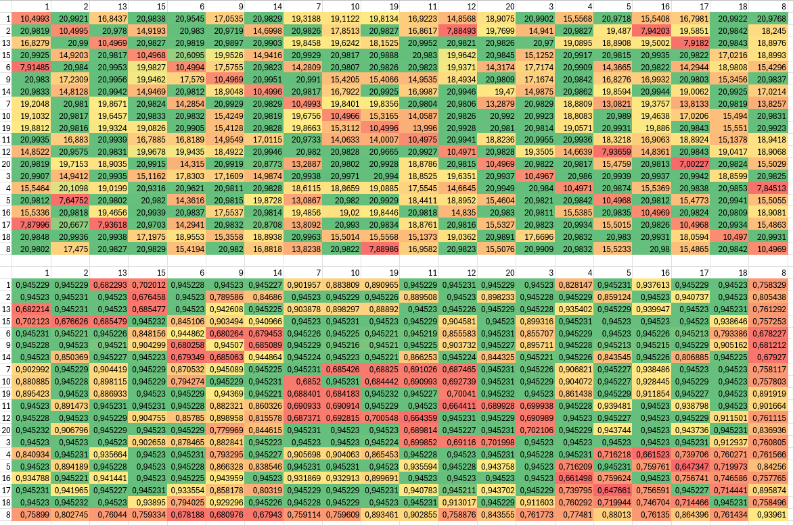
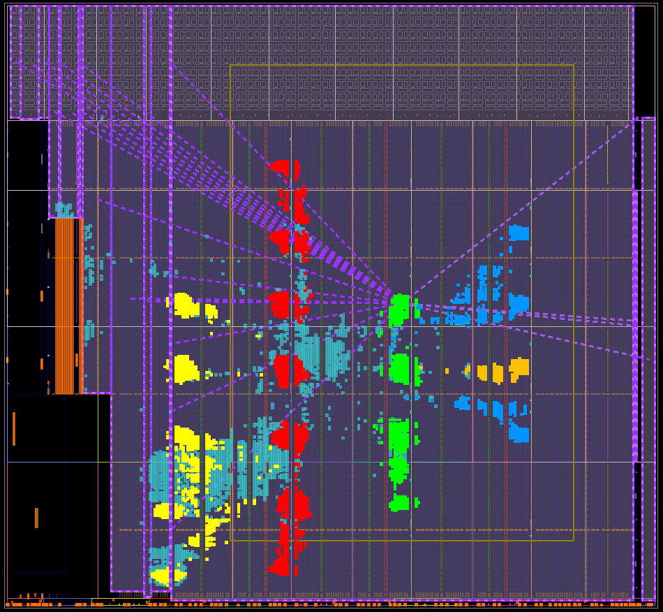
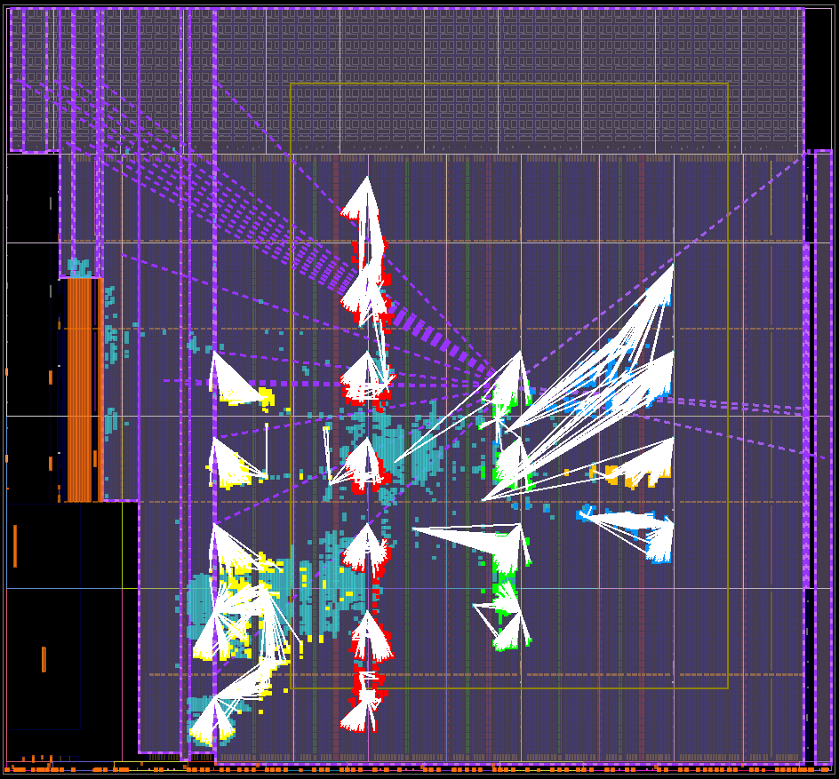
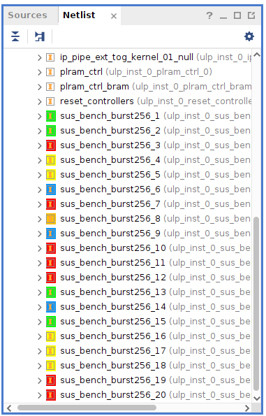
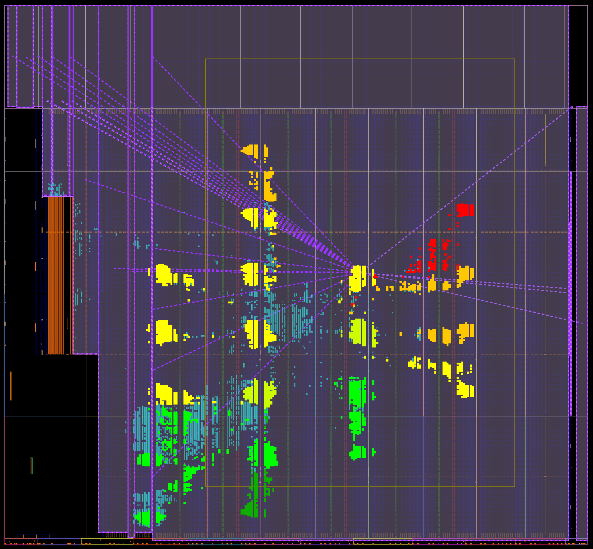
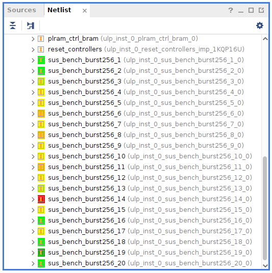
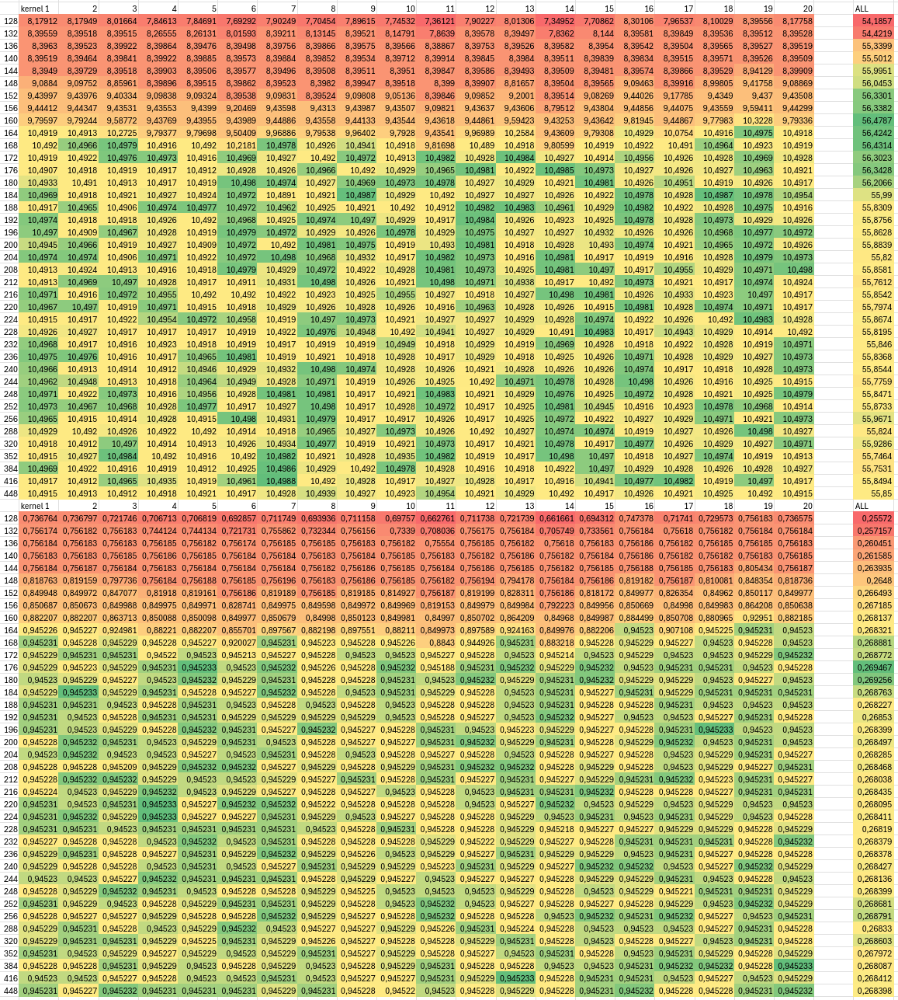

# 20x256bit Memory reader benchmark 348MHz

This case isn't so clear-cut as the 512-bit case. Certainly because the Bandwidth doesn't seem to conflict as much as the cycle counter. This indicates that the kernels probably ran serially in some of the tests. The question remains: why? Could it be that the control signals also conflict with the memory transfers? 


(Upper matrix is Bandwidths in GB/s, lower matrix is cycle usage efficiency)





| #parallel | Total Bandwidth (GB/s) |
| --- | --- |
| 1   | 10.4925 |
| 2   | 20.9844 |
| 3   | 27.6769 |
| 4   | 33.6021 |
| 5   | 31.8993 |
| 6   | 37.9892 |
| 7   | 44.2615 |
| 8   | 48.7837 |
| 9   | 44.8638 |
| 10  | 49.1469 |
| 11  | 29.0227 |
| 12  | 46.3362 |
| 13  | 48.4111 |
| 14  | 50.2339 |
| 15  | 53.9341 |
| 16  | 53.3576 |
| 17  | 56.3916 |
| 18  | 57.1011 |
| 19  | 54.6633 |
| 20  | 56.767  |

(we're simply starting from kernel #1, and adding kernels sequentially)

## Max In Flight Measurements
Figuring out the `MAX_IN_FLIGHT` parameter for DDR memory. 





## Raw Log
```
[lennartv@n2hacc03 sw]$ make main.x && ./main.x e bigBench20x256_FIX.xclbin
g++ -g -std=c++17 -I/opt/software/FPGA/Xilinx/xrt/xrt_2.16/include -L/opt/software/FPGA/Xilinx/xrt/xrt_2.16/lib -lxrt_coreutil -pthread main.cpp -o main.x
main.cpp: In function ‘int main(int, const char**)’:
main.cpp:402:54: warning: narrowing conversion of ‘kernel_id_a’ from ‘int’ to ‘long unsigned int’ [-Wnarrowing]
  402 |             run_parallel_kernels(std::vector<size_t>{kernel_id_a, kernel_id_b}, config);
      |                                                      ^~~~~~~~~~~
main.cpp:402:54: warning: narrowing conversion of ‘kernel_id_a’ from ‘int’ to ‘long unsigned int’ [-Wnarrowing]
main.cpp:402:67: warning: narrowing conversion of ‘kernel_id_b’ from ‘int’ to ‘long unsigned int’ [-Wnarrowing]
  402 |             run_parallel_kernels(std::vector<size_t>{kernel_id_a, kernel_id_b}, config);
      |                                                                   ^~~~~~~~~~~
main.cpp:402:67: warning: narrowing conversion of ‘kernel_id_b’ from ‘int’ to ‘long unsigned int’ [-Wnarrowing]
Got VCK5000 in 0000:e1:00.1
device name:     xilinx_vck5000_gen4x8_qdma_base_2
device bdf:      0000:e1:00.1
Got XCLBIN
Making Buffer of 800000000 elements
Expected hash is 1078751232
Current AXIConfig:
  arsize        = 0
  arburst       = 0
  arprot        = 0
  arcache       = 2
  arqos         = 0
  arlock        = 0
  arregion      = 0
  max_in_flight = 2000
Starting Kernels
1 Parallel Kernels
    Time taken: 0.304902s, BW: 10.4952GB/s. Cycles used ratio: 0.942456
    sus_bench_burst256:{sus_bench_burst256_1} took 105794482 cycles for 100000000 transfers. 0.945229 effective.
1 Parallel Kernels
    Time taken: 0.304872s, BW: 10.4962GB/s. Cycles used ratio: 0.942547
    sus_bench_burst256:{sus_bench_burst256_2} took 105794398 cycles for 100000000 transfers. 0.94523 effective.
1 Parallel Kernels
    Time taken: 0.304851s, BW: 10.4969GB/s. Cycles used ratio: 0.942613
    sus_bench_burst256:{sus_bench_burst256_3} took 105794254 cycles for 100000000 transfers. 0.945231 effective.
1 Parallel Kernels
    Time taken: 0.304845s, BW: 10.4972GB/s. Cycles used ratio: 0.942632
    sus_bench_burst256:{sus_bench_burst256_4} took 105794476 cycles for 100000000 transfers. 0.945229 effective.
1 Parallel Kernels
    Time taken: 0.304999s, BW: 10.4918GB/s. Cycles used ratio: 0.942155
    sus_bench_burst256:{sus_bench_burst256_5} took 105794403 cycles for 100000000 transfers. 0.94523 effective.
1 Parallel Kernels
    Time taken: 0.305164s, BW: 10.4862GB/s. Cycles used ratio: 0.941645
    sus_bench_burst256:{sus_bench_burst256_6} took 105850087 cycles for 100000000 transfers. 0.944732 effective.
1 Parallel Kernels
    Time taken: 0.305011s, BW: 10.4914GB/s. Cycles used ratio: 0.942118
    sus_bench_burst256:{sus_bench_burst256_7} took 105794996 cycles for 100000000 transfers. 0.945224 effective.
1 Parallel Kernels
    Time taken: 0.306856s, BW: 10.4283GB/s. Cycles used ratio: 0.936453
    sus_bench_burst256:{sus_bench_burst256_8} took 106434987 cycles for 100000000 transfers. 0.939541 effective.
1 Parallel Kernels
    Time taken: 0.304911s, BW: 10.4949GB/s. Cycles used ratio: 0.942427
    sus_bench_burst256:{sus_bench_burst256_9} took 105812895 cycles for 100000000 transfers. 0.945064 effective.
1 Parallel Kernels
    Time taken: 0.304998s, BW: 10.4919GB/s. Cycles used ratio: 0.942158
    sus_bench_burst256:{sus_bench_burst256_10} took 105794067 cycles for 100000000 transfers. 0.945233 effective.
1 Parallel Kernels
    Time taken: 0.305s, BW: 10.4918GB/s. Cycles used ratio: 0.942151
    sus_bench_burst256:{sus_bench_burst256_11} took 105794272 cycles for 100000000 transfers. 0.945231 effective.
1 Parallel Kernels
    Time taken: 0.304994s, BW: 10.492GB/s. Cycles used ratio: 0.942172
    sus_bench_burst256:{sus_bench_burst256_12} took 105794187 cycles for 100000000 transfers. 0.945232 effective.
1 Parallel Kernels
    Time taken: 0.305s, BW: 10.4918GB/s. Cycles used ratio: 0.942153
    sus_bench_burst256:{sus_bench_burst256_13} took 105794138 cycles for 100000000 transfers. 0.945232 effective.
1 Parallel Kernels
    Time taken: 0.305123s, BW: 10.4876GB/s. Cycles used ratio: 0.941771
    sus_bench_burst256:{sus_bench_burst256_14} took 105837339 cycles for 100000000 transfers. 0.944846 effective.
1 Parallel Kernels
    Time taken: 0.304994s, BW: 10.492GB/s. Cycles used ratio: 0.942171
    sus_bench_burst256:{sus_bench_burst256_15} took 105794395 cycles for 100000000 transfers. 0.94523 effective.
1 Parallel Kernels
    Time taken: 0.304849s, BW: 10.497GB/s. Cycles used ratio: 0.942619
    sus_bench_burst256:{sus_bench_burst256_16} took 105794035 cycles for 100000000 transfers. 0.945233 effective.
1 Parallel Kernels
    Time taken: 0.304985s, BW: 10.4923GB/s. Cycles used ratio: 0.942198
    sus_bench_burst256:{sus_bench_burst256_17} took 105794131 cycles for 100000000 transfers. 0.945232 effective.
1 Parallel Kernels
    Time taken: 0.305s, BW: 10.4918GB/s. Cycles used ratio: 0.942151
    sus_bench_burst256:{sus_bench_burst256_18} took 105794129 cycles for 100000000 transfers. 0.945232 effective.
1 Parallel Kernels
    Time taken: 0.304999s, BW: 10.4919GB/s. Cycles used ratio: 0.942156
    sus_bench_burst256:{sus_bench_burst256_19} took 105794237 cycles for 100000000 transfers. 0.945231 effective.
1 Parallel Kernels
    Time taken: 0.304996s, BW: 10.4919GB/s. Cycles used ratio: 0.942165
    sus_bench_burst256:{sus_bench_burst256_20} took 105794266 cycles for 100000000 transfers. 0.945231 effective.
Starting 4x Parallel Kernels
4 Parallel Kernels
    Time taken: 0.380758s, BW: 33.6172GB/s. Cycles used ratio: 0.754696
    sus_bench_burst256:{sus_bench_burst256_1} took 131968061 cycles for 100000000 transfers. 0.757759 effective.
    sus_bench_burst256:{sus_bench_burst256_2} took 131828891 cycles for 100000000 transfers. 0.758559 effective.
    sus_bench_burst256:{sus_bench_burst256_3} took 131890304 cycles for 100000000 transfers. 0.758206 effective.
    sus_bench_burst256:{sus_bench_burst256_4} took 131979211 cycles for 100000000 transfers. 0.757695 effective.
4 Parallel Kernels
    Time taken: 0.453582s, BW: 28.2198GB/s. Cycles used ratio: 0.633527
    sus_bench_burst256:{sus_bench_burst256_5} took 145196433 cycles for 100000000 transfers. 0.688722 effective.
    sus_bench_burst256:{sus_bench_burst256_6} took 149515744 cycles for 100000000 transfers. 0.668826 effective.
    sus_bench_burst256:{sus_bench_burst256_7} took 129289656 cycles for 100000000 transfers. 0.773457 effective.
    sus_bench_burst256:{sus_bench_burst256_8} took 157424504 cycles for 100000000 transfers. 0.635225 effective.
4 Parallel Kernels
    Time taken: 0.625571s, BW: 20.4613GB/s. Cycles used ratio: 0.459351
    sus_bench_burst256:{sus_bench_burst256_9} took 157867247 cycles for 100000000 transfers. 0.633444 effective.
    sus_bench_burst256:{sus_bench_burst256_10} took 192599244 cycles for 100000000 transfers. 0.519213 effective.
    sus_bench_burst256:{sus_bench_burst256_11} took 217096932 cycles for 100000000 transfers. 0.460624 effective.
    sus_bench_burst256:{sus_bench_burst256_12} took 202969708 cycles for 100000000 transfers. 0.492684 effective.
4 Parallel Kernels
    Time taken: 0.443059s, BW: 28.8901GB/s. Cycles used ratio: 0.648574
    sus_bench_burst256:{sus_bench_burst256_13} took 149850732 cycles for 100000000 transfers. 0.667331 effective.
    sus_bench_burst256:{sus_bench_burst256_14} took 138087074 cycles for 100000000 transfers. 0.724181 effective.
    sus_bench_burst256:{sus_bench_burst256_15} took 153668731 cycles for 100000000 transfers. 0.65075 effective.
    sus_bench_burst256:{sus_bench_burst256_16} took 140451120 cycles for 100000000 transfers. 0.711991 effective.
4 Parallel Kernels
    Time taken: 0.45622s, BW: 28.0566GB/s. Cycles used ratio: 0.629863
    sus_bench_burst256:{sus_bench_burst256_17} took 142394687 cycles for 100000000 transfers. 0.702273 effective.
    sus_bench_burst256:{sus_bench_burst256_18} took 158295335 cycles for 100000000 transfers. 0.631731 effective.
    sus_bench_burst256:{sus_bench_burst256_19} took 123969773 cycles for 100000000 transfers. 0.806648 effective.
    sus_bench_burst256:{sus_bench_burst256_20} took 140652774 cycles for 100000000 transfers. 0.710971 effective.
Starting 1x-20x Parallel Kernels 512-bit
1 Parallel Kernels
    Time taken: 0.30498s, BW: 10.4925GB/s. Cycles used ratio: 0.942214
    sus_bench_burst256:{sus_bench_burst256_1} took 105794312 cycles for 100000000 transfers. 0.94523 effective.
2 Parallel Kernels
    Time taken: 0.304989s, BW: 20.9844GB/s. Cycles used ratio: 0.942186
    sus_bench_burst256:{sus_bench_burst256_1} took 105794222 cycles for 100000000 transfers. 0.945231 effective.
    sus_bench_burst256:{sus_bench_burst256_2} took 105794570 cycles for 100000000 transfers. 0.945228 effective.
3 Parallel Kernels
    Time taken: 0.346859s, BW: 27.6769GB/s. Cycles used ratio: 0.828453
    sus_bench_burst256:{sus_bench_burst256_1} took 118263907 cycles for 100000000 transfers. 0.845567 effective.
    sus_bench_burst256:{sus_bench_burst256_2} took 118191636 cycles for 100000000 transfers. 0.846084 effective.
    sus_bench_burst256:{sus_bench_burst256_3} took 120325127 cycles for 100000000 transfers. 0.831082 effective.
4 Parallel Kernels
    Time taken: 0.380928s, BW: 33.6021GB/s. Cycles used ratio: 0.754358
    sus_bench_burst256:{sus_bench_burst256_1} took 132133493 cycles for 100000000 transfers. 0.75681 effective.
    sus_bench_burst256:{sus_bench_burst256_2} took 132094308 cycles for 100000000 transfers. 0.757035 effective.
    sus_bench_burst256:{sus_bench_burst256_3} took 132113820 cycles for 100000000 transfers. 0.756923 effective.
    sus_bench_burst256:{sus_bench_burst256_4} took 132142080 cycles for 100000000 transfers. 0.756761 effective.
5 Parallel Kernels
    Time taken: 0.501578s, BW: 31.8993GB/s. Cycles used ratio: 0.572905
    sus_bench_burst256:{sus_bench_burst256_1} took 150385343 cycles for 100000000 transfers. 0.664958 effective.
    sus_bench_burst256:{sus_bench_burst256_2} took 157488906 cycles for 100000000 transfers. 0.634965 effective.
    sus_bench_burst256:{sus_bench_burst256_3} took 137447458 cycles for 100000000 transfers. 0.727551 effective.
    sus_bench_burst256:{sus_bench_burst256_4} took 157047990 cycles for 100000000 transfers. 0.636748 effective.
    sus_bench_burst256:{sus_bench_burst256_5} took 173765658 cycles for 100000000 transfers. 0.575488 effective.
6 Parallel Kernels
    Time taken: 0.505407s, BW: 37.9892GB/s. Cycles used ratio: 0.568565
    sus_bench_burst256:{sus_bench_burst256_1} took 152804125 cycles for 100000000 transfers. 0.654433 effective.
    sus_bench_burst256:{sus_bench_burst256_2} took 157983173 cycles for 100000000 transfers. 0.632979 effective.
    sus_bench_burst256:{sus_bench_burst256_3} took 155249796 cycles for 100000000 transfers. 0.644123 effective.
    sus_bench_burst256:{sus_bench_burst256_4} took 159497636 cycles for 100000000 transfers. 0.626969 effective.
    sus_bench_burst256:{sus_bench_burst256_5} took 175173202 cycles for 100000000 transfers. 0.570864 effective.
    sus_bench_burst256:{sus_bench_burst256_6} took 159449493 cycles for 100000000 transfers. 0.627158 effective.
7 Parallel Kernels
    Time taken: 0.506083s, BW: 44.2615GB/s. Cycles used ratio: 0.567805
    sus_bench_burst256:{sus_bench_burst256_1} took 162861690 cycles for 100000000 transfers. 0.614018 effective.
    sus_bench_burst256:{sus_bench_burst256_2} took 158777813 cycles for 100000000 transfers. 0.629811 effective.
    sus_bench_burst256:{sus_bench_burst256_3} took 155937570 cycles for 100000000 transfers. 0.641282 effective.
    sus_bench_burst256:{sus_bench_burst256_4} took 163868814 cycles for 100000000 transfers. 0.610244 effective.
    sus_bench_burst256:{sus_bench_burst256_5} took 175422833 cycles for 100000000 transfers. 0.570051 effective.
    sus_bench_burst256:{sus_bench_burst256_6} took 159531315 cycles for 100000000 transfers. 0.626836 effective.
    sus_bench_burst256:{sus_bench_burst256_7} took 163686501 cycles for 100000000 transfers. 0.610924 effective.
8 Parallel Kernels
    Time taken: 0.524766s, BW: 48.7837GB/s. Cycles used ratio: 0.547589
    sus_bench_burst256:{sus_bench_burst256_1} took 174042596 cycles for 100000000 transfers. 0.574572 effective.
    sus_bench_burst256:{sus_bench_burst256_2} took 176731451 cycles for 100000000 transfers. 0.56583 effective.
    sus_bench_burst256:{sus_bench_burst256_3} took 166335079 cycles for 100000000 transfers. 0.601196 effective.
    sus_bench_burst256:{sus_bench_burst256_4} took 175203582 cycles for 100000000 transfers. 0.570765 effective.
    sus_bench_burst256:{sus_bench_burst256_5} took 182097506 cycles for 100000000 transfers. 0.549156 effective.
    sus_bench_burst256:{sus_bench_burst256_6} took 175811234 cycles for 100000000 transfers. 0.568792 effective.
    sus_bench_burst256:{sus_bench_burst256_7} took 175221671 cycles for 100000000 transfers. 0.570706 effective.
    sus_bench_burst256:{sus_bench_burst256_8} took 181555319 cycles for 100000000 transfers. 0.550796 effective.
9 Parallel Kernels
    Time taken: 0.641943s, BW: 44.8638GB/s. Cycles used ratio: 0.447635
    sus_bench_burst256:{sus_bench_burst256_1} took 201605447 cycles for 100000000 transfers. 0.496018 effective.
    sus_bench_burst256:{sus_bench_burst256_2} took 204325159 cycles for 100000000 transfers. 0.489416 effective.
    sus_bench_burst256:{sus_bench_burst256_3} took 218455763 cycles for 100000000 transfers. 0.457759 effective.
    sus_bench_burst256:{sus_bench_burst256_4} took 202001309 cycles for 100000000 transfers. 0.495046 effective.
    sus_bench_burst256:{sus_bench_burst256_5} took 210032402 cycles for 100000000 transfers. 0.476117 effective.
    sus_bench_burst256:{sus_bench_burst256_6} took 222628627 cycles for 100000000 transfers. 0.449179 effective.
    sus_bench_burst256:{sus_bench_burst256_7} took 202258426 cycles for 100000000 transfers. 0.494417 effective.
    sus_bench_burst256:{sus_bench_burst256_8} took 211009225 cycles for 100000000 transfers. 0.473913 effective.
    sus_bench_burst256:{sus_bench_burst256_9} took 222538893 cycles for 100000000 transfers. 0.44936 effective.
10 Parallel Kernels
    Time taken: 0.651109s, BW: 49.1469GB/s. Cycles used ratio: 0.441334
    sus_bench_burst256:{sus_bench_burst256_1} took 223780284 cycles for 100000000 transfers. 0.446867 effective.
    sus_bench_burst256:{sus_bench_burst256_2} took 206267460 cycles for 100000000 transfers. 0.484807 effective.
    sus_bench_burst256:{sus_bench_burst256_3} took 221331598 cycles for 100000000 transfers. 0.451811 effective.
    sus_bench_burst256:{sus_bench_burst256_4} took 221252974 cycles for 100000000 transfers. 0.451971 effective.
    sus_bench_burst256:{sus_bench_burst256_5} took 210730202 cycles for 100000000 transfers. 0.47454 effective.
    sus_bench_burst256:{sus_bench_burst256_6} took 225802731 cycles for 100000000 transfers. 0.442864 effective.
    sus_bench_burst256:{sus_bench_burst256_7} took 223774369 cycles for 100000000 transfers. 0.446879 effective.
    sus_bench_burst256:{sus_bench_burst256_8} took 211363837 cycles for 100000000 transfers. 0.473118 effective.
    sus_bench_burst256:{sus_bench_burst256_9} took 225708781 cycles for 100000000 transfers. 0.443049 effective.
    sus_bench_burst256:{sus_bench_burst256_10} took 223809806 cycles for 100000000 transfers. 0.446808 effective.
11 Parallel Kernels
    Time taken: 1.21284s, BW: 29.0227GB/s. Cycles used ratio: 0.236928
    sus_bench_burst256:{sus_bench_burst256_1} took 244761507 cycles for 100000000 transfers. 0.408561 effective.
    sus_bench_burst256:{sus_bench_burst256_2} took 241009051 cycles for 100000000 transfers. 0.414922 effective.
    sus_bench_burst256:{sus_bench_burst256_3} took 227845724 cycles for 100000000 transfers. 0.438893 effective.
    sus_bench_burst256:{sus_bench_burst256_4} took 243419144 cycles for 100000000 transfers. 0.410814 effective.
    sus_bench_burst256:{sus_bench_burst256_5} took 240246537 cycles for 100000000 transfers. 0.416239 effective.
    sus_bench_burst256:{sus_bench_burst256_6} took 229535474 cycles for 100000000 transfers. 0.435663 effective.
    sus_bench_burst256:{sus_bench_burst256_7} took 245609408 cycles for 100000000 transfers. 0.407151 effective.
    sus_bench_burst256:{sus_bench_burst256_8} took 242944930 cycles for 100000000 transfers. 0.411616 effective.
    sus_bench_burst256:{sus_bench_burst256_9} took 229523687 cycles for 100000000 transfers. 0.435685 effective.
    sus_bench_burst256:{sus_bench_burst256_10} took 245610182 cycles for 100000000 transfers. 0.407149 effective.
    sus_bench_burst256:{sus_bench_burst256_11} took 244085567 cycles for 100000000 transfers. 0.409692 effective.
12 Parallel Kernels
    Time taken: 0.828726s, BW: 46.3362GB/s. Cycles used ratio: 0.346745
    sus_bench_burst256:{sus_bench_burst256_1} took 286155946 cycles for 100000000 transfers. 0.34946 effective.
    sus_bench_burst256:{sus_bench_burst256_2} took 279870288 cycles for 100000000 transfers. 0.357308 effective.
    sus_bench_burst256:{sus_bench_burst256_3} took 274831247 cycles for 100000000 transfers. 0.36386 effective.
    sus_bench_burst256:{sus_bench_burst256_4} took 286297863 cycles for 100000000 transfers. 0.349287 effective.
    sus_bench_burst256:{sus_bench_burst256_5} took 275252902 cycles for 100000000 transfers. 0.363302 effective.
    sus_bench_burst256:{sus_bench_burst256_6} took 276811934 cycles for 100000000 transfers. 0.361256 effective.
    sus_bench_burst256:{sus_bench_burst256_7} took 287491750 cycles for 100000000 transfers. 0.347836 effective.
    sus_bench_burst256:{sus_bench_burst256_8} took 280426482 cycles for 100000000 transfers. 0.3566 effective.
    sus_bench_burst256:{sus_bench_burst256_9} took 276797312 cycles for 100000000 transfers. 0.361275 effective.
    sus_bench_burst256:{sus_bench_burst256_10} took 287380678 cycles for 100000000 transfers. 0.347971 effective.
    sus_bench_burst256:{sus_bench_burst256_11} took 284362507 cycles for 100000000 transfers. 0.351664 effective.
    sus_bench_burst256:{sus_bench_burst256_12} took 275229857 cycles for 100000000 transfers. 0.363333 effective.
13 Parallel Kernels
    Time taken: 0.859307s, BW: 48.4111GB/s. Cycles used ratio: 0.334405
    sus_bench_burst256:{sus_bench_burst256_1} took 298038021 cycles for 100000000 transfers. 0.335528 effective.
    sus_bench_burst256:{sus_bench_burst256_2} took 269770618 cycles for 100000000 transfers. 0.370685 effective.
    sus_bench_burst256:{sus_bench_burst256_3} took 265991162 cycles for 100000000 transfers. 0.375952 effective.
    sus_bench_burst256:{sus_bench_burst256_4} took 291387218 cycles for 100000000 transfers. 0.343186 effective.
    sus_bench_burst256:{sus_bench_burst256_5} took 267428761 cycles for 100000000 transfers. 0.373931 effective.
    sus_bench_burst256:{sus_bench_burst256_6} took 266647611 cycles for 100000000 transfers. 0.375027 effective.
    sus_bench_burst256:{sus_bench_burst256_7} took 296570976 cycles for 100000000 transfers. 0.337187 effective.
    sus_bench_burst256:{sus_bench_burst256_8} took 271069956 cycles for 100000000 transfers. 0.368908 effective.
    sus_bench_burst256:{sus_bench_burst256_9} took 266627891 cycles for 100000000 transfers. 0.375055 effective.
    sus_bench_burst256:{sus_bench_burst256_10} took 296510872 cycles for 100000000 transfers. 0.337256 effective.
    sus_bench_burst256:{sus_bench_burst256_11} took 274743343 cycles for 100000000 transfers. 0.363976 effective.
    sus_bench_burst256:{sus_bench_burst256_12} took 266344187 cycles for 100000000 transfers. 0.375454 effective.
    sus_bench_burst256:{sus_bench_burst256_13} took 297873735 cycles for 100000000 transfers. 0.335713 effective.
14 Parallel Kernels
    Time taken: 0.891829s, BW: 50.2339GB/s. Cycles used ratio: 0.32221
    sus_bench_burst256:{sus_bench_burst256_1} took 309174037 cycles for 100000000 transfers. 0.323442 effective.
    sus_bench_burst256:{sus_bench_burst256_2} took 303375808 cycles for 100000000 transfers. 0.329624 effective.
    sus_bench_burst256:{sus_bench_burst256_3} took 275469828 cycles for 100000000 transfers. 0.363016 effective.
    sus_bench_burst256:{sus_bench_burst256_4} took 300066342 cycles for 100000000 transfers. 0.33326 effective.
    sus_bench_burst256:{sus_bench_burst256_5} took 295108519 cycles for 100000000 transfers. 0.338858 effective.
    sus_bench_burst256:{sus_bench_burst256_6} took 276676941 cycles for 100000000 transfers. 0.361432 effective.
    sus_bench_burst256:{sus_bench_burst256_7} took 306707889 cycles for 100000000 transfers. 0.326043 effective.
    sus_bench_burst256:{sus_bench_burst256_8} took 308709384 cycles for 100000000 transfers. 0.323929 effective.
    sus_bench_burst256:{sus_bench_burst256_9} took 276674222 cycles for 100000000 transfers. 0.361436 effective.
    sus_bench_burst256:{sus_bench_burst256_10} took 306706997 cycles for 100000000 transfers. 0.326044 effective.
    sus_bench_burst256:{sus_bench_burst256_11} took 305928420 cycles for 100000000 transfers. 0.326874 effective.
    sus_bench_burst256:{sus_bench_burst256_12} took 276322161 cycles for 100000000 transfers. 0.361896 effective.
    sus_bench_burst256:{sus_bench_burst256_13} took 308876797 cycles for 100000000 transfers. 0.323754 effective.
    sus_bench_burst256:{sus_bench_burst256_14} took 308712834 cycles for 100000000 transfers. 0.323926 effective.
15 Parallel Kernels
    Time taken: 0.889976s, BW: 53.9341GB/s. Cycles used ratio: 0.322881
    sus_bench_burst256:{sus_bench_burst256_1} took 308601706 cycles for 100000000 transfers. 0.324042 effective.
    sus_bench_burst256:{sus_bench_burst256_2} took 305495052 cycles for 100000000 transfers. 0.327338 effective.
    sus_bench_burst256:{sus_bench_burst256_3} took 301160736 cycles for 100000000 transfers. 0.332049 effective.
    sus_bench_burst256:{sus_bench_burst256_4} took 302046239 cycles for 100000000 transfers. 0.331075 effective.
    sus_bench_burst256:{sus_bench_burst256_5} took 298843907 cycles for 100000000 transfers. 0.334623 effective.
    sus_bench_burst256:{sus_bench_burst256_6} took 304691024 cycles for 100000000 transfers. 0.328201 effective.
    sus_bench_burst256:{sus_bench_burst256_7} took 307566427 cycles for 100000000 transfers. 0.325133 effective.
    sus_bench_burst256:{sus_bench_burst256_8} took 308762336 cycles for 100000000 transfers. 0.323874 effective.
    sus_bench_burst256:{sus_bench_burst256_9} took 304594889 cycles for 100000000 transfers. 0.328305 effective.
    sus_bench_burst256:{sus_bench_burst256_10} took 307573646 cycles for 100000000 transfers. 0.325125 effective.
    sus_bench_burst256:{sus_bench_burst256_11} took 307575509 cycles for 100000000 transfers. 0.325123 effective.
    sus_bench_burst256:{sus_bench_burst256_12} took 301589754 cycles for 100000000 transfers. 0.331576 effective.
    sus_bench_burst256:{sus_bench_burst256_13} took 308552182 cycles for 100000000 transfers. 0.324094 effective.
    sus_bench_burst256:{sus_bench_burst256_14} took 308708420 cycles for 100000000 transfers. 0.32393 effective.
    sus_bench_burst256:{sus_bench_burst256_15} took 303665579 cycles for 100000000 transfers. 0.32931 effective.
16 Parallel Kernels
    Time taken: 0.959563s, BW: 53.3576GB/s. Cycles used ratio: 0.299466
    sus_bench_burst256:{sus_bench_burst256_1} took 332956367 cycles for 100000000 transfers. 0.30034 effective.
    sus_bench_burst256:{sus_bench_burst256_2} took 303036513 cycles for 100000000 transfers. 0.329993 effective.
    sus_bench_burst256:{sus_bench_burst256_3} took 298796195 cycles for 100000000 transfers. 0.334676 effective.
    sus_bench_burst256:{sus_bench_burst256_4} took 322794258 cycles for 100000000 transfers. 0.309795 effective.
    sus_bench_burst256:{sus_bench_burst256_5} took 297250850 cycles for 100000000 transfers. 0.336416 effective.
    sus_bench_burst256:{sus_bench_burst256_6} took 302326550 cycles for 100000000 transfers. 0.330768 effective.
    sus_bench_burst256:{sus_bench_burst256_7} took 327632740 cycles for 100000000 transfers. 0.30522 effective.
    sus_bench_burst256:{sus_bench_burst256_8} took 306554877 cycles for 100000000 transfers. 0.326206 effective.
    sus_bench_burst256:{sus_bench_burst256_9} took 302319211 cycles for 100000000 transfers. 0.330776 effective.
    sus_bench_burst256:{sus_bench_burst256_10} took 327613318 cycles for 100000000 transfers. 0.305238 effective.
    sus_bench_burst256:{sus_bench_burst256_11} took 305203676 cycles for 100000000 transfers. 0.32765 effective.
    sus_bench_burst256:{sus_bench_burst256_12} took 299302618 cycles for 100000000 transfers. 0.33411 effective.
    sus_bench_burst256:{sus_bench_burst256_13} took 332902019 cycles for 100000000 transfers. 0.300389 effective.
    sus_bench_burst256:{sus_bench_burst256_14} took 306569404 cycles for 100000000 transfers. 0.32619 effective.
    sus_bench_burst256:{sus_bench_burst256_15} took 301321106 cycles for 100000000 transfers. 0.331872 effective.
    sus_bench_burst256:{sus_bench_burst256_16} took 321443483 cycles for 100000000 transfers. 0.311097 effective.
17 Parallel Kernels
    Time taken: 0.964683s, BW: 56.3916GB/s. Cycles used ratio: 0.297876
    sus_bench_burst256:{sus_bench_burst256_1} took 334738260 cycles for 100000000 transfers. 0.298741 effective.
    sus_bench_burst256:{sus_bench_burst256_2} took 329545748 cycles for 100000000 transfers. 0.303448 effective.
    sus_bench_burst256:{sus_bench_burst256_3} took 296474621 cycles for 100000000 transfers. 0.337297 effective.
    sus_bench_burst256:{sus_bench_burst256_4} took 326506174 cycles for 100000000 transfers. 0.306273 effective.
    sus_bench_burst256:{sus_bench_burst256_5} took 322850296 cycles for 100000000 transfers. 0.309741 effective.
    sus_bench_burst256:{sus_bench_burst256_6} took 299582059 cycles for 100000000 transfers. 0.333798 effective.
    sus_bench_burst256:{sus_bench_burst256_7} took 330344251 cycles for 100000000 transfers. 0.302715 effective.
    sus_bench_burst256:{sus_bench_burst256_8} took 334046815 cycles for 100000000 transfers. 0.299359 effective.
    sus_bench_burst256:{sus_bench_burst256_9} took 299563848 cycles for 100000000 transfers. 0.333819 effective.
    sus_bench_burst256:{sus_bench_burst256_10} took 330316422 cycles for 100000000 transfers. 0.30274 effective.
    sus_bench_burst256:{sus_bench_burst256_11} took 327771520 cycles for 100000000 transfers. 0.305091 effective.
    sus_bench_burst256:{sus_bench_burst256_12} took 296736275 cycles for 100000000 transfers. 0.337 effective.
    sus_bench_burst256:{sus_bench_burst256_13} took 334668771 cycles for 100000000 transfers. 0.298803 effective.
    sus_bench_burst256:{sus_bench_burst256_14} took 333991904 cycles for 100000000 transfers. 0.299408 effective.
    sus_bench_burst256:{sus_bench_burst256_15} took 298745532 cycles for 100000000 transfers. 0.334733 effective.
    sus_bench_burst256:{sus_bench_burst256_16} took 325428327 cycles for 100000000 transfers. 0.307287 effective.
    sus_bench_burst256:{sus_bench_burst256_17} took 322665934 cycles for 100000000 transfers. 0.309918 effective.
18 Parallel Kernels
    Time taken: 1.00874s, BW: 57.1011GB/s. Cycles used ratio: 0.284868
    sus_bench_burst256:{sus_bench_burst256_1} took 348992419 cycles for 100000000 transfers. 0.286539 effective.
    sus_bench_burst256:{sus_bench_burst256_2} took 344670811 cycles for 100000000 transfers. 0.290132 effective.
    sus_bench_burst256:{sus_bench_burst256_3} took 339882594 cycles for 100000000 transfers. 0.294219 effective.
    sus_bench_burst256:{sus_bench_burst256_4} took 341464711 cycles for 100000000 transfers. 0.292856 effective.
    sus_bench_burst256:{sus_bench_burst256_5} took 337714785 cycles for 100000000 transfers. 0.296108 effective.
    sus_bench_burst256:{sus_bench_burst256_6} took 349255140 cycles for 100000000 transfers. 0.286324 effective.
    sus_bench_burst256:{sus_bench_burst256_7} took 344635173 cycles for 100000000 transfers. 0.290162 effective.
    sus_bench_burst256:{sus_bench_burst256_8} took 350005140 cycles for 100000000 transfers. 0.28571 effective.
    sus_bench_burst256:{sus_bench_burst256_9} took 349210019 cycles for 100000000 transfers. 0.286361 effective.
    sus_bench_burst256:{sus_bench_burst256_10} took 344728326 cycles for 100000000 transfers. 0.290084 effective.
    sus_bench_burst256:{sus_bench_burst256_11} took 342034134 cycles for 100000000 transfers. 0.292368 effective.
    sus_bench_burst256:{sus_bench_burst256_12} took 340060535 cycles for 100000000 transfers. 0.294065 effective.
    sus_bench_burst256:{sus_bench_burst256_13} took 348950469 cycles for 100000000 transfers. 0.286574 effective.
    sus_bench_burst256:{sus_bench_burst256_14} took 349943871 cycles for 100000000 transfers. 0.28576 effective.
    sus_bench_burst256:{sus_bench_burst256_15} took 346347502 cycles for 100000000 transfers. 0.288727 effective.
    sus_bench_burst256:{sus_bench_burst256_16} took 340793469 cycles for 100000000 transfers. 0.293433 effective.
    sus_bench_burst256:{sus_bench_burst256_17} took 337789839 cycles for 100000000 transfers. 0.296042 effective.
    sus_bench_burst256:{sus_bench_burst256_18} took 331834266 cycles for 100000000 transfers. 0.301355 effective.
19 Parallel Kernels
    Time taken: 1.11226s, BW: 54.6633GB/s. Cycles used ratio: 0.258353
    sus_bench_burst256:{sus_bench_burst256_1} took 385958139 cycles for 100000000 transfers. 0.259095 effective.
    sus_bench_burst256:{sus_bench_burst256_2} took 350841162 cycles for 100000000 transfers. 0.285029 effective.
    sus_bench_burst256:{sus_bench_burst256_3} took 343688578 cycles for 100000000 transfers. 0.290961 effective.
    sus_bench_burst256:{sus_bench_burst256_4} took 370974494 cycles for 100000000 transfers. 0.26956 effective.
    sus_bench_burst256:{sus_bench_burst256_5} took 341342466 cycles for 100000000 transfers. 0.292961 effective.
    sus_bench_burst256:{sus_bench_burst256_6} took 355529401 cycles for 100000000 transfers. 0.281271 effective.
    sus_bench_burst256:{sus_bench_burst256_7} took 379939729 cycles for 100000000 transfers. 0.2632 effective.
    sus_bench_burst256:{sus_bench_burst256_8} took 357354833 cycles for 100000000 transfers. 0.279834 effective.
    sus_bench_burst256:{sus_bench_burst256_9} took 355517918 cycles for 100000000 transfers. 0.28128 effective.
    sus_bench_burst256:{sus_bench_burst256_10} took 379938520 cycles for 100000000 transfers. 0.2632 effective.
    sus_bench_burst256:{sus_bench_burst256_11} took 345546096 cycles for 100000000 transfers. 0.289397 effective.
    sus_bench_burst256:{sus_bench_burst256_12} took 343874365 cycles for 100000000 transfers. 0.290804 effective.
    sus_bench_burst256:{sus_bench_burst256_13} took 385882329 cycles for 100000000 transfers. 0.259146 effective.
    sus_bench_burst256:{sus_bench_burst256_14} took 357387095 cycles for 100000000 transfers. 0.279809 effective.
    sus_bench_burst256:{sus_bench_burst256_15} took 352133506 cycles for 100000000 transfers. 0.283983 effective.
    sus_bench_burst256:{sus_bench_burst256_16} took 370460844 cycles for 100000000 transfers. 0.269934 effective.
    sus_bench_burst256:{sus_bench_burst256_17} took 341464245 cycles for 100000000 transfers. 0.292856 effective.
    sus_bench_burst256:{sus_bench_burst256_18} took 334831933 cycles for 100000000 transfers. 0.298657 effective.
    sus_bench_burst256:{sus_bench_burst256_19} took 379814586 cycles for 100000000 transfers. 0.263286 effective.
20 Parallel Kernels
    Time taken: 1.12742s, BW: 56.767GB/s. Cycles used ratio: 0.254881
    sus_bench_burst256:{sus_bench_burst256_1} took 389953196 cycles for 100000000 transfers. 0.256441 effective.
    sus_bench_burst256:{sus_bench_burst256_2} took 385073012 cycles for 100000000 transfers. 0.259691 effective.
    sus_bench_burst256:{sus_bench_burst256_3} took 341407706 cycles for 100000000 transfers. 0.292905 effective.
    sus_bench_burst256:{sus_bench_burst256_4} took 372201574 cycles for 100000000 transfers. 0.268672 effective.
    sus_bench_burst256:{sus_bench_burst256_5} took 367946060 cycles for 100000000 transfers. 0.271779 effective.
    sus_bench_burst256:{sus_bench_burst256_6} took 352688673 cycles for 100000000 transfers. 0.283536 effective.
    sus_bench_burst256:{sus_bench_burst256_7} took 382651366 cycles for 100000000 transfers. 0.261334 effective.
    sus_bench_burst256:{sus_bench_burst256_8} took 391210879 cycles for 100000000 transfers. 0.255617 effective.
    sus_bench_burst256:{sus_bench_burst256_9} took 352683316 cycles for 100000000 transfers. 0.28354 effective.
    sus_bench_burst256:{sus_bench_burst256_10} took 382639138 cycles for 100000000 transfers. 0.261343 effective.
    sus_bench_burst256:{sus_bench_burst256_11} took 379479594 cycles for 100000000 transfers. 0.263519 effective.
    sus_bench_burst256:{sus_bench_burst256_12} took 341507056 cycles for 100000000 transfers. 0.29282 effective.
    sus_bench_burst256:{sus_bench_burst256_13} took 389871644 cycles for 100000000 transfers. 0.256495 effective.
    sus_bench_burst256:{sus_bench_burst256_14} took 391137411 cycles for 100000000 transfers. 0.255665 effective.
    sus_bench_burst256:{sus_bench_burst256_15} took 349636533 cycles for 100000000 transfers. 0.286011 effective.
    sus_bench_burst256:{sus_bench_burst256_16} took 371537108 cycles for 100000000 transfers. 0.269152 effective.
    sus_bench_burst256:{sus_bench_burst256_17} took 368013857 cycles for 100000000 transfers. 0.271729 effective.
    sus_bench_burst256:{sus_bench_burst256_18} took 332217983 cycles for 100000000 transfers. 0.301007 effective.
    sus_bench_burst256:{sus_bench_burst256_19} took 382200297 cycles for 100000000 transfers. 0.261643 effective.
    sus_bench_burst256:{sus_bench_burst256_20} took 380498964 cycles for 100000000 transfers. 0.262813 effective.
0 Parallel Kernels
    Time taken: 1.3e-07s, BW: 0GB/s. Cycles used ratio: 0
ALL KERNELS
20 Parallel Kernels
    Time taken: 1.12559s, BW: 56.8589GB/s. Cycles used ratio: 0.255293
    sus_bench_burst256:{sus_bench_burst256_1} took 389320175 cycles for 100000000 transfers. 0.256858 effective.
    sus_bench_burst256:{sus_bench_burst256_2} took 384440748 cycles for 100000000 transfers. 0.260118 effective.
    sus_bench_burst256:{sus_bench_burst256_3} took 341159542 cycles for 100000000 transfers. 0.293118 effective.
    sus_bench_burst256:{sus_bench_burst256_4} took 371805509 cycles for 100000000 transfers. 0.268958 effective.
    sus_bench_burst256:{sus_bench_burst256_5} took 367500006 cycles for 100000000 transfers. 0.272109 effective.
    sus_bench_burst256:{sus_bench_burst256_6} took 352420795 cycles for 100000000 transfers. 0.283752 effective.
    sus_bench_burst256:{sus_bench_burst256_7} took 382074023 cycles for 100000000 transfers. 0.261729 effective.
    sus_bench_burst256:{sus_bench_burst256_8} took 390520281 cycles for 100000000 transfers. 0.256069 effective.
    sus_bench_burst256:{sus_bench_burst256_9} took 352402493 cycles for 100000000 transfers. 0.283766 effective.
    sus_bench_burst256:{sus_bench_burst256_10} took 382078614 cycles for 100000000 transfers. 0.261726 effective.
    sus_bench_burst256:{sus_bench_burst256_11} took 378873321 cycles for 100000000 transfers. 0.26394 effective.
    sus_bench_burst256:{sus_bench_burst256_12} took 341286670 cycles for 100000000 transfers. 0.293009 effective.
    sus_bench_burst256:{sus_bench_burst256_13} took 389262387 cycles for 100000000 transfers. 0.256896 effective.
    sus_bench_burst256:{sus_bench_burst256_14} took 390540211 cycles for 100000000 transfers. 0.256056 effective.
    sus_bench_burst256:{sus_bench_burst256_15} took 349389012 cycles for 100000000 transfers. 0.286214 effective.
    sus_bench_burst256:{sus_bench_burst256_16} took 371080508 cycles for 100000000 transfers. 0.269483 effective.
    sus_bench_burst256:{sus_bench_burst256_17} took 367503217 cycles for 100000000 transfers. 0.272106 effective.
    sus_bench_burst256:{sus_bench_burst256_18} took 332045118 cycles for 100000000 transfers. 0.301164 effective.
    sus_bench_burst256:{sus_bench_burst256_19} took 381681975 cycles for 100000000 transfers. 0.261998 effective.
    sus_bench_burst256:{sus_bench_burst256_20} took 379821731 cycles for 100000000 transfers. 0.263281 effective.
ALL 512-bit PAIRS
2 Parallel Kernels
    Time taken: 0.609725s, BW: 10.4965GB/s. Cycles used ratio: 0.471288
    sus_bench_burst256:{sus_bench_burst256_1} took 105794456 cycles for 100000000 transfers. 0.945229 effective.
    sus_bench_burst256:{sus_bench_burst256_1} took 105794456 cycles for 100000000 transfers. 0.945229 effective.
2 Parallel Kernels
    Time taken: 0.305047s, BW: 20.9804GB/s. Cycles used ratio: 0.942007
    sus_bench_burst256:{sus_bench_burst256_1} took 105804085 cycles for 100000000 transfers. 0.945143 effective.
    sus_bench_burst256:{sus_bench_burst256_2} took 105799116 cycles for 100000000 transfers. 0.945187 effective.
2 Parallel Kernels
    Time taken: 0.305034s, BW: 20.9813GB/s. Cycles used ratio: 0.942046
    sus_bench_burst256:{sus_bench_burst256_1} took 105794450 cycles for 100000000 transfers. 0.945229 effective.
    sus_bench_burst256:{sus_bench_burst256_3} took 105794348 cycles for 100000000 transfers. 0.94523 effective.
2 Parallel Kernels
    Time taken: 0.36077s, BW: 17.7398GB/s. Cycles used ratio: 0.796508
    sus_bench_burst256:{sus_bench_burst256_1} took 125211380 cycles for 100000000 transfers. 0.798649 effective.
    sus_bench_burst256:{sus_bench_burst256_4} took 125210976 cycles for 100000000 transfers. 0.798652 effective.
2 Parallel Kernels
    Time taken: 0.304854s, BW: 20.9937GB/s. Cycles used ratio: 0.942603
    sus_bench_burst256:{sus_bench_burst256_1} took 105795020 cycles for 100000000 transfers. 0.945224 effective.
    sus_bench_burst256:{sus_bench_burst256_5} took 105794873 cycles for 100000000 transfers. 0.945225 effective.
2 Parallel Kernels
    Time taken: 0.304853s, BW: 20.9937GB/s. Cycles used ratio: 0.942605
    sus_bench_burst256:{sus_bench_burst256_1} took 105794344 cycles for 100000000 transfers. 0.94523 effective.
    sus_bench_burst256:{sus_bench_burst256_6} took 105794884 cycles for 100000000 transfers. 0.945225 effective.
2 Parallel Kernels
    Time taken: 0.319471s, BW: 20.0331GB/s. Cycles used ratio: 0.899475
    sus_bench_burst256:{sus_bench_burst256_1} took 110870020 cycles for 100000000 transfers. 0.901957 effective.
    sus_bench_burst256:{sus_bench_burst256_7} took 110870126 cycles for 100000000 transfers. 0.901956 effective.
2 Parallel Kernels
    Time taken: 0.380093s, BW: 16.838GB/s. Cycles used ratio: 0.756016
    sus_bench_burst256:{sus_bench_burst256_1} took 131863747 cycles for 100000000 transfers. 0.758359 effective.
    sus_bench_burst256:{sus_bench_burst256_8} took 131874086 cycles for 100000000 transfers. 0.758299 effective.
2 Parallel Kernels
    Time taken: 0.364253s, BW: 17.5702GB/s. Cycles used ratio: 0.788893
    sus_bench_burst256:{sus_bench_burst256_1} took 126368230 cycles for 100000000 transfers. 0.791338 effective.
    sus_bench_burst256:{sus_bench_burst256_9} took 126376173 cycles for 100000000 transfers. 0.791288 effective.
2 Parallel Kernels
    Time taken: 0.329237s, BW: 19.4389GB/s. Cycles used ratio: 0.872796
    sus_bench_burst256:{sus_bench_burst256_1} took 114257055 cycles for 100000000 transfers. 0.875219 effective.
    sus_bench_burst256:{sus_bench_burst256_10} took 114256885 cycles for 100000000 transfers. 0.875221 effective.
2 Parallel Kernels
    Time taken: 0.304853s, BW: 20.9938GB/s. Cycles used ratio: 0.942608
    sus_bench_burst256:{sus_bench_burst256_1} took 105794591 cycles for 100000000 transfers. 0.945228 effective.
    sus_bench_burst256:{sus_bench_burst256_11} took 105794335 cycles for 100000000 transfers. 0.94523 effective.
2 Parallel Kernels
    Time taken: 0.304843s, BW: 20.9944GB/s. Cycles used ratio: 0.942637
    sus_bench_burst256:{sus_bench_burst256_1} took 105794245 cycles for 100000000 transfers. 0.945231 effective.
    sus_bench_burst256:{sus_bench_burst256_12} took 105794213 cycles for 100000000 transfers. 0.945231 effective.
2 Parallel Kernels
    Time taken: 0.422275s, BW: 15.156GB/s. Cycles used ratio: 0.680496
    sus_bench_burst256:{sus_bench_burst256_1} took 146564638 cycles for 100000000 transfers. 0.682293 effective.
    sus_bench_burst256:{sus_bench_burst256_13} took 146564496 cycles for 100000000 transfers. 0.682293 effective.
2 Parallel Kernels
    Time taken: 0.304863s, BW: 20.993GB/s. Cycles used ratio: 0.942575
    sus_bench_burst256:{sus_bench_burst256_1} took 105794656 cycles for 100000000 transfers. 0.945227 effective.
    sus_bench_burst256:{sus_bench_burst256_14} took 105794796 cycles for 100000000 transfers. 0.945226 effective.
2 Parallel Kernels
    Time taken: 0.434172s, BW: 14.7407GB/s. Cycles used ratio: 0.661849
    sus_bench_burst256:{sus_bench_burst256_1} took 135058117 cycles for 100000000 transfers. 0.740422 effective.
    sus_bench_burst256:{sus_bench_burst256_15} took 150692696 cycles for 100000000 transfers. 0.663602 effective.
2 Parallel Kernels
    Time taken: 0.307849s, BW: 20.7894GB/s. Cycles used ratio: 0.933433
    sus_bench_burst256:{sus_bench_burst256_1} took 106781315 cycles for 100000000 transfers. 0.936493 effective.
    sus_bench_burst256:{sus_bench_burst256_16} took 106781418 cycles for 100000000 transfers. 0.936493 effective.
2 Parallel Kernels
    Time taken: 0.375447s, BW: 17.0464GB/s. Cycles used ratio: 0.765372
    sus_bench_burst256:{sus_bench_burst256_1} took 130247925 cycles for 100000000 transfers. 0.767767 effective.
    sus_bench_burst256:{sus_bench_burst256_17} took 130253141 cycles for 100000000 transfers. 0.767736 effective.
2 Parallel Kernels
    Time taken: 0.30503s, BW: 20.9816GB/s. Cycles used ratio: 0.94206
    sus_bench_burst256:{sus_bench_burst256_1} took 105795304 cycles for 100000000 transfers. 0.945222 effective.
    sus_bench_burst256:{sus_bench_burst256_18} took 105795801 cycles for 100000000 transfers. 0.945217 effective.
2 Parallel Kernels
    Time taken: 0.323498s, BW: 19.7837GB/s. Cycles used ratio: 0.888278
    sus_bench_burst256:{sus_bench_burst256_1} took 112237876 cycles for 100000000 transfers. 0.890965 effective.
    sus_bench_burst256:{sus_bench_burst256_19} took 112237756 cycles for 100000000 transfers. 0.890966 effective.
2 Parallel Kernels
    Time taken: 0.30501s, BW: 20.9829GB/s. Cycles used ratio: 0.942121
    sus_bench_burst256:{sus_bench_burst256_1} took 105794414 cycles for 100000000 transfers. 0.945229 effective.
    sus_bench_burst256:{sus_bench_burst256_20} took 105794504 cycles for 100000000 transfers. 0.945229 effective.
2 Parallel Kernels
    Time taken: 0.304995s, BW: 20.984GB/s. Cycles used ratio: 0.942168
    sus_bench_burst256:{sus_bench_burst256_2} took 105794271 cycles for 100000000 transfers. 0.945231 effective.
    sus_bench_burst256:{sus_bench_burst256_1} took 105794403 cycles for 100000000 transfers. 0.94523 effective.
2 Parallel Kernels
    Time taken: 0.609689s, BW: 10.4972GB/s. Cycles used ratio: 0.471316
    sus_bench_burst256:{sus_bench_burst256_2} took 105794253 cycles for 100000000 transfers. 0.945231 effective.
    sus_bench_burst256:{sus_bench_burst256_2} took 105794253 cycles for 100000000 transfers. 0.945231 effective.
2 Parallel Kernels
    Time taken: 0.304859s, BW: 20.9933GB/s. Cycles used ratio: 0.942589
    sus_bench_burst256:{sus_bench_burst256_2} took 105794431 cycles for 100000000 transfers. 0.945229 effective.
    sus_bench_burst256:{sus_bench_burst256_3} took 105794832 cycles for 100000000 transfers. 0.945226 effective.
2 Parallel Kernels
    Time taken: 0.304858s, BW: 20.9934GB/s. Cycles used ratio: 0.942591
    sus_bench_burst256:{sus_bench_burst256_2} took 105794479 cycles for 100000000 transfers. 0.945229 effective.
    sus_bench_burst256:{sus_bench_burst256_4} took 105794628 cycles for 100000000 transfers. 0.945228 effective.
2 Parallel Kernels
    Time taken: 0.335545s, BW: 19.0735GB/s. Cycles used ratio: 0.856388
    sus_bench_burst256:{sus_bench_burst256_2} took 116397733 cycles for 100000000 transfers. 0.859123 effective.
    sus_bench_burst256:{sus_bench_burst256_5} took 116397459 cycles for 100000000 transfers. 0.859125 effective.
2 Parallel Kernels
    Time taken: 0.305001s, BW: 20.9836GB/s. Cycles used ratio: 0.94215
    sus_bench_burst256:{sus_bench_burst256_2} took 105794321 cycles for 100000000 transfers. 0.94523 effective.
    sus_bench_burst256:{sus_bench_burst256_6} took 105794495 cycles for 100000000 transfers. 0.945229 effective.
2 Parallel Kernels
    Time taken: 0.305006s, BW: 20.9832GB/s. Cycles used ratio: 0.942134
    sus_bench_burst256:{sus_bench_burst256_2} took 105794304 cycles for 100000000 transfers. 0.94523 effective.
    sus_bench_burst256:{sus_bench_burst256_7} took 105794399 cycles for 100000000 transfers. 0.94523 effective.
2 Parallel Kernels
    Time taken: 0.358006s, BW: 17.8768GB/s. Cycles used ratio: 0.802659
    sus_bench_burst256:{sus_bench_burst256_2} took 124199776 cycles for 100000000 transfers. 0.805154 effective.
    sus_bench_burst256:{sus_bench_burst256_8} took 124199384 cycles for 100000000 transfers. 0.805157 effective.
2 Parallel Kernels
    Time taken: 0.365045s, BW: 17.5321GB/s. Cycles used ratio: 0.787181
    sus_bench_burst256:{sus_bench_burst256_2} took 126640287 cycles for 100000000 transfers. 0.789638 effective.
    sus_bench_burst256:{sus_bench_burst256_9} took 126657132 cycles for 100000000 transfers. 0.789533 effective.
2 Parallel Kernels
    Time taken: 0.304855s, BW: 20.9936GB/s. Cycles used ratio: 0.942601
    sus_bench_burst256:{sus_bench_burst256_2} took 105794471 cycles for 100000000 transfers. 0.945229 effective.
    sus_bench_burst256:{sus_bench_burst256_10} took 105794746 cycles for 100000000 transfers. 0.945227 effective.
2 Parallel Kernels
    Time taken: 0.324102s, BW: 19.7468GB/s. Cycles used ratio: 0.886622
    sus_bench_burst256:{sus_bench_burst256_2} took 112421476 cycles for 100000000 transfers. 0.88951 effective.
    sus_bench_burst256:{sus_bench_burst256_11} took 112426223 cycles for 100000000 transfers. 0.889472 effective.
2 Parallel Kernels
    Time taken: 0.305023s, BW: 20.982GB/s. Cycles used ratio: 0.94208
    sus_bench_burst256:{sus_bench_burst256_2} took 105794615 cycles for 100000000 transfers. 0.945228 effective.
    sus_bench_burst256:{sus_bench_burst256_12} took 105795402 cycles for 100000000 transfers. 0.945221 effective.
2 Parallel Kernels
    Time taken: 0.30501s, BW: 20.9829GB/s. Cycles used ratio: 0.942121
    sus_bench_burst256:{sus_bench_burst256_2} took 105794628 cycles for 100000000 transfers. 0.945228 effective.
    sus_bench_burst256:{sus_bench_burst256_13} took 105794340 cycles for 100000000 transfers. 0.94523 effective.
2 Parallel Kernels
    Time taken: 0.343963s, BW: 18.6067GB/s. Cycles used ratio: 0.835428
    sus_bench_burst256:{sus_bench_burst256_2} took 119360609 cycles for 100000000 transfers. 0.837797 effective.
    sus_bench_burst256:{sus_bench_burst256_14} took 119377541 cycles for 100000000 transfers. 0.837679 effective.
2 Parallel Kernels
    Time taken: 0.431154s, BW: 14.8439GB/s. Cycles used ratio: 0.666481
    sus_bench_burst256:{sus_bench_burst256_2} took 149644047 cycles for 100000000 transfers. 0.668252 effective.
    sus_bench_burst256:{sus_bench_burst256_15} took 146087772 cycles for 100000000 transfers. 0.68452 effective.
2 Parallel Kernels
    Time taken: 0.809823s, BW: 7.90296GB/s. Cycles used ratio: 0.354839
    sus_bench_burst256:{sus_bench_burst256_2} took 105794443 cycles for 100000000 transfers. 0.945229 effective.
    sus_bench_burst256:{sus_bench_burst256_16} took 105794255 cycles for 100000000 transfers. 0.945231 effective.
2 Parallel Kernels
    Time taken: 0.306755s, BW: 20.8636GB/s. Cycles used ratio: 0.936762
    sus_bench_burst256:{sus_bench_burst256_2} took 106452362 cycles for 100000000 transfers. 0.939387 effective.
    sus_bench_burst256:{sus_bench_burst256_17} took 106452216 cycles for 100000000 transfers. 0.939389 effective.
2 Parallel Kernels
    Time taken: 0.30486s, BW: 20.9933GB/s. Cycles used ratio: 0.942586
    sus_bench_burst256:{sus_bench_burst256_2} took 105796480 cycles for 100000000 transfers. 0.945211 effective.
    sus_bench_burst256:{sus_bench_burst256_18} took 105799017 cycles for 100000000 transfers. 0.945188 effective.
2 Parallel Kernels
    Time taken: 0.305013s, BW: 20.9827GB/s. Cycles used ratio: 0.942112
    sus_bench_burst256:{sus_bench_burst256_2} took 105794723 cycles for 100000000 transfers. 0.945227 effective.
    sus_bench_burst256:{sus_bench_burst256_19} took 105795059 cycles for 100000000 transfers. 0.945224 effective.
2 Parallel Kernels
    Time taken: 0.320934s, BW: 19.9418GB/s. Cycles used ratio: 0.895376
    sus_bench_burst256:{sus_bench_burst256_2} took 111329858 cycles for 100000000 transfers. 0.898232 effective.
    sus_bench_burst256:{sus_bench_burst256_20} took 111329454 cycles for 100000000 transfers. 0.898235 effective.
2 Parallel Kernels
    Time taken: 0.305028s, BW: 20.9817GB/s. Cycles used ratio: 0.942065
    sus_bench_burst256:{sus_bench_burst256_3} took 105794597 cycles for 100000000 transfers. 0.945228 effective.
    sus_bench_burst256:{sus_bench_burst256_1} took 105794410 cycles for 100000000 transfers. 0.94523 effective.
2 Parallel Kernels
    Time taken: 0.305014s, BW: 20.9827GB/s. Cycles used ratio: 0.942109
    sus_bench_burst256:{sus_bench_burst256_3} took 105794817 cycles for 100000000 transfers. 0.945226 effective.
    sus_bench_burst256:{sus_bench_burst256_2} took 105794420 cycles for 100000000 transfers. 0.945229 effective.
2 Parallel Kernels
    Time taken: 0.609725s, BW: 10.4965GB/s. Cycles used ratio: 0.471288
    sus_bench_burst256:{sus_bench_burst256_3} took 105803650 cycles for 100000000 transfers. 0.945147 effective.
    sus_bench_burst256:{sus_bench_burst256_3} took 105803650 cycles for 100000000 transfers. 0.945147 effective.
2 Parallel Kernels
    Time taken: 0.305018s, BW: 20.9824GB/s. Cycles used ratio: 0.942096
    sus_bench_burst256:{sus_bench_burst256_3} took 105795072 cycles for 100000000 transfers. 0.945224 effective.
    sus_bench_burst256:{sus_bench_burst256_4} took 105794906 cycles for 100000000 transfers. 0.945225 effective.
2 Parallel Kernels
    Time taken: 0.305018s, BW: 20.9823GB/s. Cycles used ratio: 0.942095
    sus_bench_burst256:{sus_bench_burst256_3} took 105795343 cycles for 100000000 transfers. 0.945221 effective.
    sus_bench_burst256:{sus_bench_burst256_5} took 105795789 cycles for 100000000 transfers. 0.945217 effective.
2 Parallel Kernels
    Time taken: 0.329174s, BW: 19.4426GB/s. Cycles used ratio: 0.872961
    sus_bench_burst256:{sus_bench_burst256_3} took 114207131 cycles for 100000000 transfers. 0.875602 effective.
    sus_bench_burst256:{sus_bench_burst256_6} took 114206824 cycles for 100000000 transfers. 0.875604 effective.
2 Parallel Kernels
    Time taken: 0.304874s, BW: 20.9923GB/s. Cycles used ratio: 0.942542
    sus_bench_burst256:{sus_bench_burst256_3} took 105794437 cycles for 100000000 transfers. 0.945229 effective.
    sus_bench_burst256:{sus_bench_burst256_7} took 105794280 cycles for 100000000 transfers. 0.945231 effective.
2 Parallel Kernels
    Time taken: 0.378712s, BW: 16.8994GB/s. Cycles used ratio: 0.758773
    sus_bench_burst256:{sus_bench_burst256_3} took 131436248 cycles for 100000000 transfers. 0.760825 effective.
    sus_bench_burst256:{sus_bench_burst256_8} took 131443209 cycles for 100000000 transfers. 0.760785 effective.
2 Parallel Kernels
    Time taken: 0.326936s, BW: 19.5757GB/s. Cycles used ratio: 0.878937
    sus_bench_burst256:{sus_bench_burst256_3} took 113406536 cycles for 100000000 transfers. 0.881783 effective.
    sus_bench_burst256:{sus_bench_burst256_9} took 113406557 cycles for 100000000 transfers. 0.881783 effective.
2 Parallel Kernels
    Time taken: 0.812669s, BW: 7.87529GB/s. Cycles used ratio: 0.353596
    sus_bench_burst256:{sus_bench_burst256_3} took 105794378 cycles for 100000000 transfers. 0.94523 effective.
    sus_bench_burst256:{sus_bench_burst256_10} took 105794273 cycles for 100000000 transfers. 0.945231 effective.
2 Parallel Kernels
    Time taken: 0.446733s, BW: 14.3262GB/s. Cycles used ratio: 0.64324
    sus_bench_burst256:{sus_bench_burst256_3} took 155005534 cycles for 100000000 transfers. 0.645138 effective.
    sus_bench_burst256:{sus_bench_burst256_11} took 132567493 cycles for 100000000 transfers. 0.754333 effective.
2 Parallel Kernels
    Time taken: 0.417029s, BW: 15.3467GB/s. Cycles used ratio: 0.689056
    sus_bench_burst256:{sus_bench_burst256_3} took 144684074 cycles for 100000000 transfers. 0.691161 effective.
    sus_bench_burst256:{sus_bench_burst256_12} took 144684382 cycles for 100000000 transfers. 0.69116 effective.
2 Parallel Kernels
    Time taken: 0.30487s, BW: 20.9926GB/s. Cycles used ratio: 0.942554
    sus_bench_burst256:{sus_bench_burst256_3} took 105794476 cycles for 100000000 transfers. 0.945229 effective.
    sus_bench_burst256:{sus_bench_burst256_13} took 105794262 cycles for 100000000 transfers. 0.945231 effective.
2 Parallel Kernels
    Time taken: 0.806552s, BW: 7.93501GB/s. Cycles used ratio: 0.356277
    sus_bench_burst256:{sus_bench_burst256_3} took 105794554 cycles for 100000000 transfers. 0.945228 effective.
    sus_bench_burst256:{sus_bench_burst256_14} took 105796851 cycles for 100000000 transfers. 0.945208 effective.
2 Parallel Kernels
    Time taken: 0.321403s, BW: 19.9127GB/s. Cycles used ratio: 0.894067
    sus_bench_burst256:{sus_bench_burst256_3} took 111539585 cycles for 100000000 transfers. 0.896543 effective.
    sus_bench_burst256:{sus_bench_burst256_15} took 111539469 cycles for 100000000 transfers. 0.896544 effective.
2 Parallel Kernels
    Time taken: 0.30487s, BW: 20.9926GB/s. Cycles used ratio: 0.942553
    sus_bench_burst256:{sus_bench_burst256_3} took 105794495 cycles for 100000000 transfers. 0.945229 effective.
    sus_bench_burst256:{sus_bench_burst256_16} took 105794571 cycles for 100000000 transfers. 0.945228 effective.
2 Parallel Kernels
    Time taken: 0.304867s, BW: 20.9928GB/s. Cycles used ratio: 0.942564
    sus_bench_burst256:{sus_bench_burst256_3} took 105794198 cycles for 100000000 transfers. 0.945231 effective.
    sus_bench_burst256:{sus_bench_burst256_17} took 105794375 cycles for 100000000 transfers. 0.94523 effective.
2 Parallel Kernels
    Time taken: 0.316498s, BW: 20.2213GB/s. Cycles used ratio: 0.907925
    sus_bench_burst256:{sus_bench_burst256_3} took 109783112 cycles for 100000000 transfers. 0.910887 effective.
    sus_bench_burst256:{sus_bench_burst256_18} took 109782949 cycles for 100000000 transfers. 0.910888 effective.
2 Parallel Kernels
    Time taken: 0.304866s, BW: 20.9928GB/s. Cycles used ratio: 0.942566
    sus_bench_burst256:{sus_bench_burst256_3} took 105795263 cycles for 100000000 transfers. 0.945222 effective.
    sus_bench_burst256:{sus_bench_burst256_19} took 105795289 cycles for 100000000 transfers. 0.945222 effective.
2 Parallel Kernels
    Time taken: 0.445123s, BW: 14.3781GB/s. Cycles used ratio: 0.645566
    sus_bench_burst256:{sus_bench_burst256_3} took 154441585 cycles for 100000000 transfers. 0.647494 effective.
    sus_bench_burst256:{sus_bench_burst256_20} took 132200436 cycles for 100000000 transfers. 0.756427 effective.
2 Parallel Kernels
    Time taken: 0.354025s, BW: 18.0778GB/s. Cycles used ratio: 0.811685
    sus_bench_burst256:{sus_bench_burst256_4} took 122873205 cycles for 100000000 transfers. 0.813847 effective.
    sus_bench_burst256:{sus_bench_burst256_1} took 122873111 cycles for 100000000 transfers. 0.813848 effective.
2 Parallel Kernels
    Time taken: 0.304842s, BW: 20.9945GB/s. Cycles used ratio: 0.942639
    sus_bench_burst256:{sus_bench_burst256_4} took 105794242 cycles for 100000000 transfers. 0.945231 effective.
    sus_bench_burst256:{sus_bench_burst256_2} took 105794403 cycles for 100000000 transfers. 0.94523 effective.
2 Parallel Kernels
    Time taken: 0.305022s, BW: 20.9821GB/s. Cycles used ratio: 0.942085
    sus_bench_burst256:{sus_bench_burst256_4} took 105794512 cycles for 100000000 transfers. 0.945229 effective.
    sus_bench_burst256:{sus_bench_burst256_3} took 105794737 cycles for 100000000 transfers. 0.945227 effective.
2 Parallel Kernels
    Time taken: 0.609627s, BW: 10.4982GB/s. Cycles used ratio: 0.471364
    sus_bench_burst256:{sus_bench_burst256_4} took 105794244 cycles for 100000000 transfers. 0.945231 effective.
    sus_bench_burst256:{sus_bench_burst256_4} took 105794244 cycles for 100000000 transfers. 0.945231 effective.
2 Parallel Kernels
    Time taken: 0.556623s, BW: 11.4979GB/s. Cycles used ratio: 0.516249
    sus_bench_burst256:{sus_bench_burst256_4} took 109330116 cycles for 100000000 transfers. 0.914661 effective.
    sus_bench_burst256:{sus_bench_burst256_5} took 193158433 cycles for 100000000 transfers. 0.51771 effective.
2 Parallel Kernels
    Time taken: 0.304833s, BW: 20.9951GB/s. Cycles used ratio: 0.942669
    sus_bench_burst256:{sus_bench_burst256_4} took 105794200 cycles for 100000000 transfers. 0.945231 effective.
    sus_bench_burst256:{sus_bench_burst256_6} took 105794465 cycles for 100000000 transfers. 0.945229 effective.
2 Parallel Kernels
    Time taken: 0.318167s, BW: 20.1152GB/s. Cycles used ratio: 0.903162
    sus_bench_burst256:{sus_bench_burst256_4} took 110412285 cycles for 100000000 transfers. 0.905696 effective.
    sus_bench_burst256:{sus_bench_burst256_7} took 110411840 cycles for 100000000 transfers. 0.9057 effective.
2 Parallel Kernels
    Time taken: 0.37939s, BW: 16.8692GB/s. Cycles used ratio: 0.757417
    sus_bench_burst256:{sus_bench_burst256_4} took 131674300 cycles for 100000000 transfers. 0.75945 effective.
    sus_bench_burst256:{sus_bench_burst256_8} took 131681539 cycles for 100000000 transfers. 0.759408 effective.
2 Parallel Kernels
    Time taken: 0.366711s, BW: 17.4524GB/s. Cycles used ratio: 0.783604
    sus_bench_burst256:{sus_bench_burst256_4} took 127242837 cycles for 100000000 transfers. 0.785899 effective.
    sus_bench_burst256:{sus_bench_burst256_9} took 127249536 cycles for 100000000 transfers. 0.785857 effective.
2 Parallel Kernels
    Time taken: 0.320317s, BW: 19.9802GB/s. Cycles used ratio: 0.8971
    sus_bench_burst256:{sus_bench_burst256_4} took 111110083 cycles for 100000000 transfers. 0.900008 effective.
    sus_bench_burst256:{sus_bench_burst256_10} took 111110151 cycles for 100000000 transfers. 0.900008 effective.
2 Parallel Kernels
    Time taken: 0.811879s, BW: 7.88295GB/s. Cycles used ratio: 0.35394
    sus_bench_burst256:{sus_bench_burst256_4} took 105794670 cycles for 100000000 transfers. 0.945227 effective.
    sus_bench_burst256:{sus_bench_burst256_11} took 105794516 cycles for 100000000 transfers. 0.945229 effective.
2 Parallel Kernels
    Time taken: 0.304837s, BW: 20.9948GB/s. Cycles used ratio: 0.942656
    sus_bench_burst256:{sus_bench_burst256_4} took 105794474 cycles for 100000000 transfers. 0.945229 effective.
    sus_bench_burst256:{sus_bench_burst256_12} took 105794471 cycles for 100000000 transfers. 0.945229 effective.
2 Parallel Kernels
    Time taken: 0.308725s, BW: 20.7304GB/s. Cycles used ratio: 0.930785
    sus_bench_burst256:{sus_bench_burst256_4} took 107084341 cycles for 100000000 transfers. 0.933843 effective.
    sus_bench_burst256:{sus_bench_burst256_13} took 107083801 cycles for 100000000 transfers. 0.933848 effective.
2 Parallel Kernels
    Time taken: 0.380588s, BW: 16.8161GB/s. Cycles used ratio: 0.755033
    sus_bench_burst256:{sus_bench_burst256_4} took 132040453 cycles for 100000000 transfers. 0.757344 effective.
    sus_bench_burst256:{sus_bench_burst256_14} took 132044615 cycles for 100000000 transfers. 0.75732 effective.
2 Parallel Kernels
    Time taken: 0.811923s, BW: 7.88253GB/s. Cycles used ratio: 0.353921
    sus_bench_burst256:{sus_bench_burst256_4} took 105794257 cycles for 100000000 transfers. 0.945231 effective.
    sus_bench_burst256:{sus_bench_burst256_15} took 105794476 cycles for 100000000 transfers. 0.945229 effective.
2 Parallel Kernels
    Time taken: 0.439565s, BW: 14.5598GB/s. Cycles used ratio: 0.653729
    sus_bench_burst256:{sus_bench_burst256_4} took 152520260 cycles for 100000000 transfers. 0.655651 effective.
    sus_bench_burst256:{sus_bench_burst256_16} took 149836393 cycles for 100000000 transfers. 0.667395 effective.
2 Parallel Kernels
    Time taken: 0.517565s, BW: 12.3656GB/s. Cycles used ratio: 0.555208
    sus_bench_burst256:{sus_bench_burst256_4} took 108405218 cycles for 100000000 transfers. 0.922465 effective.
    sus_bench_burst256:{sus_bench_burst256_17} took 179599311 cycles for 100000000 transfers. 0.556795 effective.
2 Parallel Kernels
    Time taken: 0.473732s, BW: 13.5097GB/s. Cycles used ratio: 0.60658
    sus_bench_burst256:{sus_bench_burst256_4} took 109619620 cycles for 100000000 transfers. 0.912245 effective.
    sus_bench_burst256:{sus_bench_burst256_18} took 164433607 cycles for 100000000 transfers. 0.608148 effective.
2 Parallel Kernels
    Time taken: 0.332946s, BW: 19.2223GB/s. Cycles used ratio: 0.863071
    sus_bench_burst256:{sus_bench_burst256_4} took 115546268 cycles for 100000000 transfers. 0.865454 effective.
    sus_bench_burst256:{sus_bench_burst256_19} took 115546471 cycles for 100000000 transfers. 0.865453 effective.
2 Parallel Kernels
    Time taken: 0.305013s, BW: 20.9827GB/s. Cycles used ratio: 0.942112
    sus_bench_burst256:{sus_bench_burst256_4} took 105794362 cycles for 100000000 transfers. 0.94523 effective.
    sus_bench_burst256:{sus_bench_burst256_20} took 105794366 cycles for 100000000 transfers. 0.94523 effective.
2 Parallel Kernels
    Time taken: 0.305004s, BW: 20.9833GB/s. Cycles used ratio: 0.942139
    sus_bench_burst256:{sus_bench_burst256_5} took 105794262 cycles for 100000000 transfers. 0.945231 effective.
    sus_bench_burst256:{sus_bench_burst256_1} took 105794475 cycles for 100000000 transfers. 0.945229 effective.
2 Parallel Kernels
    Time taken: 0.834767s, BW: 7.66681GB/s. Cycles used ratio: 0.344235
    sus_bench_burst256:{sus_bench_burst256_5} took 115985807 cycles for 100000000 transfers. 0.862174 effective.
    sus_bench_burst256:{sus_bench_burst256_2} took 115986044 cycles for 100000000 transfers. 0.862173 effective.
2 Parallel Kernels
    Time taken: 0.304859s, BW: 20.9933GB/s. Cycles used ratio: 0.942589
    sus_bench_burst256:{sus_bench_burst256_5} took 105794413 cycles for 100000000 transfers. 0.945229 effective.
    sus_bench_burst256:{sus_bench_burst256_3} took 105794402 cycles for 100000000 transfers. 0.94523 effective.
2 Parallel Kernels
    Time taken: 0.556466s, BW: 11.5011GB/s. Cycles used ratio: 0.516395
    sus_bench_burst256:{sus_bench_burst256_5} took 193160887 cycles for 100000000 transfers. 0.517703 effective.
    sus_bench_burst256:{sus_bench_burst256_4} took 109344365 cycles for 100000000 transfers. 0.914542 effective.
2 Parallel Kernels
    Time taken: 0.609545s, BW: 10.4996GB/s. Cycles used ratio: 0.471428
    sus_bench_burst256:{sus_bench_burst256_5} took 105794307 cycles for 100000000 transfers. 0.94523 effective.
    sus_bench_burst256:{sus_bench_burst256_5} took 105794307 cycles for 100000000 transfers. 0.94523 effective.
2 Parallel Kernels
    Time taken: 0.304846s, BW: 20.9942GB/s. Cycles used ratio: 0.942628
    sus_bench_burst256:{sus_bench_burst256_5} took 105794519 cycles for 100000000 transfers. 0.945229 effective.
    sus_bench_burst256:{sus_bench_burst256_6} took 105794696 cycles for 100000000 transfers. 0.945227 effective.
2 Parallel Kernels
    Time taken: 0.30485s, BW: 20.9939GB/s. Cycles used ratio: 0.942616
    sus_bench_burst256:{sus_bench_burst256_5} took 105794248 cycles for 100000000 transfers. 0.945231 effective.
    sus_bench_burst256:{sus_bench_burst256_7} took 105794217 cycles for 100000000 transfers. 0.945231 effective.
2 Parallel Kernels
    Time taken: 0.341986s, BW: 18.7142GB/s. Cycles used ratio: 0.840257
    sus_bench_burst256:{sus_bench_burst256_5} took 118685875 cycles for 100000000 transfers. 0.84256 effective.
    sus_bench_burst256:{sus_bench_burst256_8} took 118685842 cycles for 100000000 transfers. 0.84256 effective.
2 Parallel Kernels
    Time taken: 0.335192s, BW: 19.0935GB/s. Cycles used ratio: 0.857288
    sus_bench_burst256:{sus_bench_burst256_5} took 116265355 cycles for 100000000 transfers. 0.860101 effective.
    sus_bench_burst256:{sus_bench_burst256_9} took 116268616 cycles for 100000000 transfers. 0.860077 effective.
2 Parallel Kernels
    Time taken: 0.327545s, BW: 19.5393GB/s. Cycles used ratio: 0.877303
    sus_bench_burst256:{sus_bench_burst256_5} took 113674159 cycles for 100000000 transfers. 0.879707 effective.
    sus_bench_burst256:{sus_bench_burst256_10} took 113677415 cycles for 100000000 transfers. 0.879682 effective.
2 Parallel Kernels
    Time taken: 0.308147s, BW: 20.7693GB/s. Cycles used ratio: 0.932529
    sus_bench_burst256:{sus_bench_burst256_5} took 106884072 cycles for 100000000 transfers. 0.935593 effective.
    sus_bench_burst256:{sus_bench_burst256_11} took 106883901 cycles for 100000000 transfers. 0.935595 effective.
2 Parallel Kernels
    Time taken: 0.81238s, BW: 7.87808GB/s. Cycles used ratio: 0.353721
    sus_bench_burst256:{sus_bench_burst256_5} took 105794315 cycles for 100000000 transfers. 0.94523 effective.
    sus_bench_burst256:{sus_bench_burst256_12} took 105794753 cycles for 100000000 transfers. 0.945226 effective.
2 Parallel Kernels
    Time taken: 0.304985s, BW: 20.9846GB/s. Cycles used ratio: 0.942198
    sus_bench_burst256:{sus_bench_burst256_5} took 105794499 cycles for 100000000 transfers. 0.945229 effective.
    sus_bench_burst256:{sus_bench_burst256_13} took 105794596 cycles for 100000000 transfers. 0.945228 effective.
2 Parallel Kernels
    Time taken: 0.377566s, BW: 16.9507GB/s. Cycles used ratio: 0.761077
    sus_bench_burst256:{sus_bench_burst256_5} took 130988734 cycles for 100000000 transfers. 0.763424 effective.
    sus_bench_burst256:{sus_bench_burst256_14} took 130998213 cycles for 100000000 transfers. 0.763369 effective.
2 Parallel Kernels
    Time taken: 0.304991s, BW: 20.9843GB/s. Cycles used ratio: 0.942181
    sus_bench_burst256:{sus_bench_burst256_5} took 105794482 cycles for 100000000 transfers. 0.945229 effective.
    sus_bench_burst256:{sus_bench_burst256_15} took 105794206 cycles for 100000000 transfers. 0.945231 effective.
2 Parallel Kernels
    Time taken: 0.451546s, BW: 14.1735GB/s. Cycles used ratio: 0.636383
    sus_bench_burst256:{sus_bench_burst256_5} took 113494700 cycles for 100000000 transfers. 0.881098 effective.
    sus_bench_burst256:{sus_bench_burst256_16} took 156679138 cycles for 100000000 transfers. 0.638247 effective.
2 Parallel Kernels
    Time taken: 0.445326s, BW: 14.3715GB/s. Cycles used ratio: 0.645272
    sus_bench_burst256:{sus_bench_burst256_5} took 154513756 cycles for 100000000 transfers. 0.647192 effective.
    sus_bench_burst256:{sus_bench_burst256_17} took 154512674 cycles for 100000000 transfers. 0.647196 effective.
2 Parallel Kernels
    Time taken: 0.447293s, BW: 14.3083GB/s. Cycles used ratio: 0.642434
    sus_bench_burst256:{sus_bench_burst256_5} took 125655430 cycles for 100000000 transfers. 0.795827 effective.
    sus_bench_burst256:{sus_bench_burst256_18} took 155250742 cycles for 100000000 transfers. 0.644119 effective.
2 Parallel Kernels
    Time taken: 0.304996s, BW: 20.9839GB/s. Cycles used ratio: 0.942163
    sus_bench_burst256:{sus_bench_burst256_5} took 105794154 cycles for 100000000 transfers. 0.945232 effective.
    sus_bench_burst256:{sus_bench_burst256_19} took 105794579 cycles for 100000000 transfers. 0.945228 effective.
2 Parallel Kernels
    Time taken: 0.305467s, BW: 20.9515GB/s. Cycles used ratio: 0.94071
    sus_bench_burst256:{sus_bench_burst256_5} took 105959329 cycles for 100000000 transfers. 0.943758 effective.
    sus_bench_burst256:{sus_bench_burst256_20} took 105959314 cycles for 100000000 transfers. 0.943758 effective.
2 Parallel Kernels
    Time taken: 0.810831s, BW: 7.89313GB/s. Cycles used ratio: 0.354397
    sus_bench_burst256:{sus_bench_burst256_6} took 105798505 cycles for 100000000 transfers. 0.945193 effective.
    sus_bench_burst256:{sus_bench_burst256_1} took 105794535 cycles for 100000000 transfers. 0.945228 effective.
2 Parallel Kernels
    Time taken: 0.305039s, BW: 20.9809GB/s. Cycles used ratio: 0.942031
    sus_bench_burst256:{sus_bench_burst256_6} took 105796099 cycles for 100000000 transfers. 0.945214 effective.
    sus_bench_burst256:{sus_bench_burst256_2} took 105794518 cycles for 100000000 transfers. 0.945229 effective.
2 Parallel Kernels
    Time taken: 0.33688s, BW: 18.9978GB/s. Cycles used ratio: 0.852992
    sus_bench_burst256:{sus_bench_burst256_6} took 116862614 cycles for 100000000 transfers. 0.855706 effective.
    sus_bench_burst256:{sus_bench_burst256_3} took 116862314 cycles for 100000000 transfers. 0.855708 effective.
2 Parallel Kernels
    Time taken: 0.304857s, BW: 20.9935GB/s. Cycles used ratio: 0.942595
    sus_bench_burst256:{sus_bench_burst256_6} took 105796411 cycles for 100000000 transfers. 0.945212 effective.
    sus_bench_burst256:{sus_bench_burst256_4} took 105794439 cycles for 100000000 transfers. 0.945229 effective.
2 Parallel Kernels
    Time taken: 0.304995s, BW: 20.984GB/s. Cycles used ratio: 0.942168
    sus_bench_burst256:{sus_bench_burst256_6} took 105795406 cycles for 100000000 transfers. 0.945221 effective.
    sus_bench_burst256:{sus_bench_burst256_5} took 105794458 cycles for 100000000 transfers. 0.945229 effective.
2 Parallel Kernels
    Time taken: 0.609861s, BW: 10.4942GB/s. Cycles used ratio: 0.471183
    sus_bench_burst256:{sus_bench_burst256_6} took 105835616 cycles for 100000000 transfers. 0.944862 effective.
    sus_bench_burst256:{sus_bench_burst256_6} took 105835616 cycles for 100000000 transfers. 0.944862 effective.
2 Parallel Kernels
    Time taken: 0.304837s, BW: 20.9948GB/s. Cycles used ratio: 0.942657
    sus_bench_burst256:{sus_bench_burst256_6} took 105795134 cycles for 100000000 transfers. 0.945223 effective.
    sus_bench_burst256:{sus_bench_burst256_7} took 105794576 cycles for 100000000 transfers. 0.945228 effective.
2 Parallel Kernels
    Time taken: 0.429682s, BW: 14.8947GB/s. Cycles used ratio: 0.668765
    sus_bench_burst256:{sus_bench_burst256_6} took 145922344 cycles for 100000000 transfers. 0.685296 effective.
    sus_bench_burst256:{sus_bench_burst256_8} took 149085312 cycles for 100000000 transfers. 0.670757 effective.
2 Parallel Kernels
    Time taken: 0.42379s, BW: 15.1018GB/s. Cycles used ratio: 0.678062
    sus_bench_burst256:{sus_bench_burst256_6} took 147044724 cycles for 100000000 transfers. 0.680065 effective.
    sus_bench_burst256:{sus_bench_burst256_9} took 147044533 cycles for 100000000 transfers. 0.680066 effective.
2 Parallel Kernels
    Time taken: 0.30502s, BW: 20.9822GB/s. Cycles used ratio: 0.942089
    sus_bench_burst256:{sus_bench_burst256_6} took 105797960 cycles for 100000000 transfers. 0.945198 effective.
    sus_bench_burst256:{sus_bench_burst256_10} took 105794424 cycles for 100000000 transfers. 0.945229 effective.
2 Parallel Kernels
    Time taken: 0.305007s, BW: 20.9831GB/s. Cycles used ratio: 0.942129
    sus_bench_burst256:{sus_bench_burst256_6} took 105799041 cycles for 100000000 transfers. 0.945188 effective.
    sus_bench_burst256:{sus_bench_burst256_11} took 105794454 cycles for 100000000 transfers. 0.945229 effective.
2 Parallel Kernels
    Time taken: 0.336919s, BW: 18.9956GB/s. Cycles used ratio: 0.852893
    sus_bench_burst256:{sus_bench_burst256_6} took 116879284 cycles for 100000000 transfers. 0.855584 effective.
    sus_bench_burst256:{sus_bench_burst256_12} took 116879366 cycles for 100000000 transfers. 0.855583 effective.
2 Parallel Kernels
    Time taken: 0.806407s, BW: 7.93644GB/s. Cycles used ratio: 0.356342
    sus_bench_burst256:{sus_bench_burst256_6} took 105799225 cycles for 100000000 transfers. 0.945187 effective.
    sus_bench_burst256:{sus_bench_burst256_13} took 105794334 cycles for 100000000 transfers. 0.94523 effective.
2 Parallel Kernels
    Time taken: 0.429864s, BW: 14.8884GB/s. Cycles used ratio: 0.668482
    sus_bench_burst256:{sus_bench_burst256_6} took 145405141 cycles for 100000000 transfers. 0.687734 effective.
    sus_bench_burst256:{sus_bench_burst256_14} took 149171119 cycles for 100000000 transfers. 0.670371 effective.
2 Parallel Kernels
    Time taken: 0.340131s, BW: 18.8163GB/s. Cycles used ratio: 0.844841
    sus_bench_burst256:{sus_bench_burst256_6} took 117986999 cycles for 100000000 transfers. 0.847551 effective.
    sus_bench_burst256:{sus_bench_burst256_15} took 117986968 cycles for 100000000 transfers. 0.847551 effective.
2 Parallel Kernels
    Time taken: 0.304995s, BW: 20.984GB/s. Cycles used ratio: 0.942167
    sus_bench_burst256:{sus_bench_burst256_6} took 105795445 cycles for 100000000 transfers. 0.94522 effective.
    sus_bench_burst256:{sus_bench_burst256_16} took 105794106 cycles for 100000000 transfers. 0.945232 effective.
2 Parallel Kernels
    Time taken: 0.810589s, BW: 7.89549GB/s. Cycles used ratio: 0.354503
    sus_bench_burst256:{sus_bench_burst256_6} took 105797581 cycles for 100000000 transfers. 0.945201 effective.
    sus_bench_burst256:{sus_bench_burst256_17} took 105794954 cycles for 100000000 transfers. 0.945225 effective.
2 Parallel Kernels
    Time taken: 0.363975s, BW: 17.5836GB/s. Cycles used ratio: 0.789495
    sus_bench_burst256:{sus_bench_burst256_6} took 126331141 cycles for 100000000 transfers. 0.79157 effective.
    sus_bench_burst256:{sus_bench_burst256_18} took 125754296 cycles for 100000000 transfers. 0.795201 effective.
2 Parallel Kernels
    Time taken: 0.304998s, BW: 20.9837GB/s. Cycles used ratio: 0.942158
    sus_bench_burst256:{sus_bench_burst256_6} took 105796494 cycles for 100000000 transfers. 0.945211 effective.
    sus_bench_burst256:{sus_bench_burst256_19} took 105794477 cycles for 100000000 transfers. 0.945229 effective.
2 Parallel Kernels
    Time taken: 0.305025s, BW: 20.9819GB/s. Cycles used ratio: 0.942075
    sus_bench_burst256:{sus_bench_burst256_6} took 105794223 cycles for 100000000 transfers. 0.945231 effective.
    sus_bench_burst256:{sus_bench_burst256_20} took 105794227 cycles for 100000000 transfers. 0.945231 effective.
2 Parallel Kernels
    Time taken: 0.319902s, BW: 20.0061GB/s. Cycles used ratio: 0.898263
    sus_bench_burst256:{sus_bench_burst256_7} took 111010732 cycles for 100000000 transfers. 0.900814 effective.
    sus_bench_burst256:{sus_bench_burst256_1} took 111010562 cycles for 100000000 transfers. 0.900815 effective.
2 Parallel Kernels
    Time taken: 0.304824s, BW: 20.9957GB/s. Cycles used ratio: 0.942695
    sus_bench_burst256:{sus_bench_burst256_7} took 105794361 cycles for 100000000 transfers. 0.94523 effective.
    sus_bench_burst256:{sus_bench_burst256_2} took 105794543 cycles for 100000000 transfers. 0.945228 effective.
2 Parallel Kernels
    Time taken: 0.808325s, BW: 7.91761GB/s. Cycles used ratio: 0.355496
    sus_bench_burst256:{sus_bench_burst256_7} took 105794738 cycles for 100000000 transfers. 0.945227 effective.
    sus_bench_burst256:{sus_bench_burst256_3} took 105794797 cycles for 100000000 transfers. 0.945226 effective.
2 Parallel Kernels
    Time taken: 0.318513s, BW: 20.0934GB/s. Cycles used ratio: 0.902182
    sus_bench_burst256:{sus_bench_burst256_7} took 110479856 cycles for 100000000 transfers. 0.905142 effective.
    sus_bench_burst256:{sus_bench_burst256_4} took 110479640 cycles for 100000000 transfers. 0.905144 effective.
2 Parallel Kernels
    Time taken: 0.304896s, BW: 20.9908GB/s. Cycles used ratio: 0.942474
    sus_bench_burst256:{sus_bench_burst256_7} took 105809903 cycles for 100000000 transfers. 0.945091 effective.
    sus_bench_burst256:{sus_bench_burst256_5} took 105811455 cycles for 100000000 transfers. 0.945077 effective.
2 Parallel Kernels
    Time taken: 0.330993s, BW: 19.3358GB/s. Cycles used ratio: 0.868166
    sus_bench_burst256:{sus_bench_burst256_7} took 114868829 cycles for 100000000 transfers. 0.870558 effective.
    sus_bench_burst256:{sus_bench_burst256_6} took 114875767 cycles for 100000000 transfers. 0.870506 effective.
2 Parallel Kernels
    Time taken: 0.609719s, BW: 10.4966GB/s. Cycles used ratio: 0.471293
    sus_bench_burst256:{sus_bench_burst256_7} took 105794276 cycles for 100000000 transfers. 0.945231 effective.
    sus_bench_burst256:{sus_bench_burst256_7} took 105794276 cycles for 100000000 transfers. 0.945231 effective.
2 Parallel Kernels
    Time taken: 0.380201s, BW: 16.8332GB/s. Cycles used ratio: 0.755801
    sus_bench_burst256:{sus_bench_burst256_7} took 131902171 cycles for 100000000 transfers. 0.758138 effective.
    sus_bench_burst256:{sus_bench_burst256_8} took 131909355 cycles for 100000000 transfers. 0.758096 effective.
2 Parallel Kernels
    Time taken: 0.367034s, BW: 17.4371GB/s. Cycles used ratio: 0.782915
    sus_bench_burst256:{sus_bench_burst256_7} took 127384795 cycles for 100000000 transfers. 0.785023 effective.
    sus_bench_burst256:{sus_bench_burst256_9} took 127391862 cycles for 100000000 transfers. 0.784979 effective.
2 Parallel Kernels
    Time taken: 0.921122s, BW: 6.94805GB/s. Cycles used ratio: 0.311963
    sus_bench_burst256:{sus_bench_burst256_7} took 145894698 cycles for 100000000 transfers. 0.685426 effective.
    sus_bench_burst256:{sus_bench_burst256_10} took 145894501 cycles for 100000000 transfers. 0.685427 effective.
2 Parallel Kernels
    Time taken: 0.453046s, BW: 14.1266GB/s. Cycles used ratio: 0.634276
    sus_bench_burst256:{sus_bench_burst256_7} took 134064705 cycles for 100000000 transfers. 0.745908 effective.
    sus_bench_burst256:{sus_bench_burst256_11} took 157197084 cycles for 100000000 transfers. 0.636144 effective.
2 Parallel Kernels
    Time taken: 0.44287s, BW: 14.4512GB/s. Cycles used ratio: 0.648851
    sus_bench_burst256:{sus_bench_burst256_7} took 138087049 cycles for 100000000 transfers. 0.724181 effective.
    sus_bench_burst256:{sus_bench_burst256_12} took 153668825 cycles for 100000000 transfers. 0.65075 effective.
2 Parallel Kernels
    Time taken: 0.318745s, BW: 20.0787GB/s. Cycles used ratio: 0.901523
    sus_bench_burst256:{sus_bench_burst256_7} took 110568166 cycles for 100000000 transfers. 0.904419 effective.
    sus_bench_burst256:{sus_bench_burst256_13} took 110568166 cycles for 100000000 transfers. 0.904419 effective.
2 Parallel Kernels
    Time taken: 0.887606s, BW: 7.21041GB/s. Cycles used ratio: 0.323743
    sus_bench_burst256:{sus_bench_burst256_7} took 132164906 cycles for 100000000 transfers. 0.756631 effective.
    sus_bench_burst256:{sus_bench_burst256_14} took 132168306 cycles for 100000000 transfers. 0.756611 effective.
2 Parallel Kernels
    Time taken: 0.360929s, BW: 17.732GB/s. Cycles used ratio: 0.796157
    sus_bench_burst256:{sus_bench_burst256_7} took 125223826 cycles for 100000000 transfers. 0.79857 effective.
    sus_bench_burst256:{sus_bench_burst256_15} took 125213988 cycles for 100000000 transfers. 0.798633 effective.
2 Parallel Kernels
    Time taken: 0.307201s, BW: 20.8333GB/s. Cycles used ratio: 0.935402
    sus_bench_burst256:{sus_bench_burst256_7} took 106554488 cycles for 100000000 transfers. 0.938487 effective.
    sus_bench_burst256:{sus_bench_burst256_16} took 106554682 cycles for 100000000 transfers. 0.938485 effective.
2 Parallel Kernels
    Time taken: 0.304991s, BW: 20.9842GB/s. Cycles used ratio: 0.942181
    sus_bench_burst256:{sus_bench_burst256_7} took 105794650 cycles for 100000000 transfers. 0.945227 effective.
    sus_bench_burst256:{sus_bench_burst256_17} took 105794282 cycles for 100000000 transfers. 0.945231 effective.
2 Parallel Kernels
    Time taken: 0.809432s, BW: 7.90678GB/s. Cycles used ratio: 0.35501
    sus_bench_burst256:{sus_bench_burst256_7} took 105794568 cycles for 100000000 transfers. 0.945228 effective.
    sus_bench_burst256:{sus_bench_burst256_18} took 105794400 cycles for 100000000 transfers. 0.94523 effective.
2 Parallel Kernels
    Time taken: 0.418632s, BW: 15.2879GB/s. Cycles used ratio: 0.686418
    sus_bench_burst256:{sus_bench_burst256_7} took 145303780 cycles for 100000000 transfers. 0.688213 effective.
    sus_bench_burst256:{sus_bench_burst256_19} took 145303667 cycles for 100000000 transfers. 0.688214 effective.
2 Parallel Kernels
    Time taken: 0.304993s, BW: 20.9841GB/s. Cycles used ratio: 0.942174
    sus_bench_burst256:{sus_bench_burst256_7} took 105795722 cycles for 100000000 transfers. 0.945218 effective.
    sus_bench_burst256:{sus_bench_burst256_20} took 105794177 cycles for 100000000 transfers. 0.945232 effective.
2 Parallel Kernels
    Time taken: 0.379755s, BW: 16.853GB/s. Cycles used ratio: 0.756689
    sus_bench_burst256:{sus_bench_burst256_8} took 131761221 cycles for 100000000 transfers. 0.758949 effective.
    sus_bench_burst256:{sus_bench_burst256_1} took 131746960 cycles for 100000000 transfers. 0.759031 effective.
2 Parallel Kernels
    Time taken: 0.359081s, BW: 17.8233GB/s. Cycles used ratio: 0.800255
    sus_bench_burst256:{sus_bench_burst256_8} took 124572761 cycles for 100000000 transfers. 0.802744 effective.
    sus_bench_burst256:{sus_bench_burst256_2} took 124572318 cycles for 100000000 transfers. 0.802747 effective.
2 Parallel Kernels
    Time taken: 0.379544s, BW: 16.8623GB/s. Cycles used ratio: 0.757109
    sus_bench_burst256:{sus_bench_burst256_8} took 131688084 cycles for 100000000 transfers. 0.75937 effective.
    sus_bench_burst256:{sus_bench_burst256_3} took 131673759 cycles for 100000000 transfers. 0.759453 effective.
2 Parallel Kernels
    Time taken: 0.380143s, BW: 16.8357GB/s. Cycles used ratio: 0.755915
    sus_bench_burst256:{sus_bench_burst256_8} took 131943293 cycles for 100000000 transfers. 0.757901 effective.
    sus_bench_burst256:{sus_bench_burst256_4} took 131933878 cycles for 100000000 transfers. 0.757955 effective.
2 Parallel Kernels
    Time taken: 0.327395s, BW: 19.5483GB/s. Cycles used ratio: 0.877706
    sus_bench_burst256:{sus_bench_burst256_8} took 113619660 cycles for 100000000 transfers. 0.880129 effective.
    sus_bench_burst256:{sus_bench_burst256_5} took 113619579 cycles for 100000000 transfers. 0.88013 effective.
2 Parallel Kernels
    Time taken: 0.429469s, BW: 14.9021GB/s. Cycles used ratio: 0.669096
    sus_bench_burst256:{sus_bench_burst256_8} took 149055968 cycles for 100000000 transfers. 0.670889 effective.
    sus_bench_burst256:{sus_bench_burst256_6} took 145887439 cycles for 100000000 transfers. 0.68546 effective.
2 Parallel Kernels
    Time taken: 0.379686s, BW: 16.856GB/s. Cycles used ratio: 0.756826
    sus_bench_burst256:{sus_bench_burst256_8} took 131737775 cycles for 100000000 transfers. 0.759084 effective.
    sus_bench_burst256:{sus_bench_burst256_7} took 131727170 cycles for 100000000 transfers. 0.759145 effective.
2 Parallel Kernels
    Time taken: 0.613386s, BW: 10.4339GB/s. Cycles used ratio: 0.468475
    sus_bench_burst256:{sus_bench_burst256_8} took 106436128 cycles for 100000000 transfers. 0.939531 effective.
    sus_bench_burst256:{sus_bench_burst256_8} took 106436128 cycles for 100000000 transfers. 0.939531 effective.
2 Parallel Kernels
    Time taken: 0.428921s, BW: 14.9212GB/s. Cycles used ratio: 0.669951
    sus_bench_burst256:{sus_bench_burst256_8} took 148875685 cycles for 100000000 transfers. 0.671701 effective.
    sus_bench_burst256:{sus_bench_burst256_9} took 144895334 cycles for 100000000 transfers. 0.690153 effective.
2 Parallel Kernels
    Time taken: 0.379302s, BW: 16.8731GB/s. Cycles used ratio: 0.757592
    sus_bench_burst256:{sus_bench_burst256_8} took 131654103 cycles for 100000000 transfers. 0.759566 effective.
    sus_bench_burst256:{sus_bench_burst256_10} took 131639350 cycles for 100000000 transfers. 0.759651 effective.
2 Parallel Kernels
    Time taken: 0.319142s, BW: 20.0538GB/s. Cycles used ratio: 0.900403
    sus_bench_burst256:{sus_bench_burst256_8} took 110759724 cycles for 100000000 transfers. 0.902855 effective.
    sus_bench_burst256:{sus_bench_burst256_11} took 110759675 cycles for 100000000 transfers. 0.902856 effective.
2 Parallel Kernels
    Time taken: 0.379817s, BW: 16.8502GB/s. Cycles used ratio: 0.756565
    sus_bench_burst256:{sus_bench_burst256_8} took 131779306 cycles for 100000000 transfers. 0.758844 effective.
    sus_bench_burst256:{sus_bench_burst256_12} took 131768422 cycles for 100000000 transfers. 0.758907 effective.
2 Parallel Kernels
    Time taken: 0.378909s, BW: 16.8906GB/s. Cycles used ratio: 0.758378
    sus_bench_burst256:{sus_bench_burst256_8} took 131514485 cycles for 100000000 transfers. 0.760373 effective.
    sus_bench_burst256:{sus_bench_burst256_13} took 131491126 cycles for 100000000 transfers. 0.760508 effective.
2 Parallel Kernels
    Time taken: 0.424055s, BW: 15.0924GB/s. Cycles used ratio: 0.677639
    sus_bench_burst256:{sus_bench_burst256_8} took 147182300 cycles for 100000000 transfers. 0.67943 effective.
    sus_bench_burst256:{sus_bench_burst256_14} took 147182080 cycles for 100000000 transfers. 0.679431 effective.
2 Parallel Kernels
    Time taken: 0.379911s, BW: 16.846GB/s. Cycles used ratio: 0.756378
    sus_bench_burst256:{sus_bench_burst256_8} took 131863068 cycles for 100000000 transfers. 0.758362 effective.
    sus_bench_burst256:{sus_bench_burst256_15} took 131852901 cycles for 100000000 transfers. 0.758421 effective.
2 Parallel Kernels
    Time taken: 0.379212s, BW: 16.8771GB/s. Cycles used ratio: 0.757772
    sus_bench_burst256:{sus_bench_burst256_8} took 131627895 cycles for 100000000 transfers. 0.759717 effective.
    sus_bench_burst256:{sus_bench_burst256_16} took 131608585 cycles for 100000000 transfers. 0.759829 effective.
2 Parallel Kernels
    Time taken: 0.33387s, BW: 19.1691GB/s. Cycles used ratio: 0.860682
    sus_bench_burst256:{sus_bench_burst256_8} took 115874777 cycles for 100000000 transfers. 0.863001 effective.
    sus_bench_burst256:{sus_bench_burst256_17} took 115874674 cycles for 100000000 transfers. 0.863001 effective.
2 Parallel Kernels
    Time taken: 0.37855s, BW: 16.9066GB/s. Cycles used ratio: 0.759097
    sus_bench_burst256:{sus_bench_burst256_8} took 131336111 cycles for 100000000 transfers. 0.761405 effective.
    sus_bench_burst256:{sus_bench_burst256_18} took 131326146 cycles for 100000000 transfers. 0.761463 effective.
2 Parallel Kernels
    Time taken: 0.323359s, BW: 19.7922GB/s. Cycles used ratio: 0.88866
    sus_bench_burst256:{sus_bench_burst256_8} took 112236314 cycles for 100000000 transfers. 0.890977 effective.
    sus_bench_burst256:{sus_bench_burst256_19} took 111613899 cycles for 100000000 transfers. 0.895946 effective.
2 Parallel Kernels
    Time taken: 0.341745s, BW: 18.7274GB/s. Cycles used ratio: 0.84085
    sus_bench_burst256:{sus_bench_burst256_8} took 118546031 cycles for 100000000 transfers. 0.843554 effective.
    sus_bench_burst256:{sus_bench_burst256_20} took 118545760 cycles for 100000000 transfers. 0.843556 effective.
2 Parallel Kernels
    Time taken: 0.304866s, BW: 20.9929GB/s. Cycles used ratio: 0.942568
    sus_bench_burst256:{sus_bench_burst256_9} took 105794887 cycles for 100000000 transfers. 0.945225 effective.
    sus_bench_burst256:{sus_bench_burst256_1} took 105794254 cycles for 100000000 transfers. 0.945231 effective.
2 Parallel Kernels
    Time taken: 0.811912s, BW: 7.88263GB/s. Cycles used ratio: 0.353925
    sus_bench_burst256:{sus_bench_burst256_9} took 105794472 cycles for 100000000 transfers. 0.945229 effective.
    sus_bench_burst256:{sus_bench_burst256_2} took 105794175 cycles for 100000000 transfers. 0.945232 effective.
2 Parallel Kernels
    Time taken: 0.321853s, BW: 19.8848GB/s. Cycles used ratio: 0.892818
    sus_bench_burst256:{sus_bench_burst256_9} took 111643248 cycles for 100000000 transfers. 0.89571 effective.
    sus_bench_burst256:{sus_bench_burst256_3} took 111642957 cycles for 100000000 transfers. 0.895713 effective.
2 Parallel Kernels
    Time taken: 0.304996s, BW: 20.9839GB/s. Cycles used ratio: 0.942164
    sus_bench_burst256:{sus_bench_burst256_9} took 105794474 cycles for 100000000 transfers. 0.945229 effective.
    sus_bench_burst256:{sus_bench_burst256_4} took 105794632 cycles for 100000000 transfers. 0.945228 effective.
2 Parallel Kernels
    Time taken: 0.309246s, BW: 20.6955GB/s. Cycles used ratio: 0.929217
    sus_bench_burst256:{sus_bench_burst256_9} took 107293007 cycles for 100000000 transfers. 0.932027 effective.
    sus_bench_burst256:{sus_bench_burst256_5} took 107284181 cycles for 100000000 transfers. 0.932104 effective.
2 Parallel Kernels
    Time taken: 0.42369s, BW: 15.1054GB/s. Cycles used ratio: 0.678223
    sus_bench_burst256:{sus_bench_burst256_9} took 147003130 cycles for 100000000 transfers. 0.680258 effective.
    sus_bench_burst256:{sus_bench_burst256_6} took 147003076 cycles for 100000000 transfers. 0.680258 effective.
2 Parallel Kernels
    Time taken: 0.305008s, BW: 20.983GB/s. Cycles used ratio: 0.942126
    sus_bench_burst256:{sus_bench_burst256_9} took 105794700 cycles for 100000000 transfers. 0.945227 effective.
    sus_bench_burst256:{sus_bench_burst256_7} took 105794311 cycles for 100000000 transfers. 0.94523 effective.
2 Parallel Kernels
    Time taken: 0.429092s, BW: 14.9152GB/s. Cycles used ratio: 0.669685
    sus_bench_burst256:{sus_bench_burst256_9} took 144830274 cycles for 100000000 transfers. 0.690463 effective.
    sus_bench_burst256:{sus_bench_burst256_8} took 148884632 cycles for 100000000 transfers. 0.671661 effective.
2 Parallel Kernels
    Time taken: 0.609662s, BW: 10.4976GB/s. Cycles used ratio: 0.471337
    sus_bench_burst256:{sus_bench_burst256_9} took 105812282 cycles for 100000000 transfers. 0.94507 effective.
    sus_bench_burst256:{sus_bench_burst256_9} took 105812282 cycles for 100000000 transfers. 0.94507 effective.
2 Parallel Kernels
    Time taken: 0.304868s, BW: 20.9927GB/s. Cycles used ratio: 0.942558
    sus_bench_burst256:{sus_bench_burst256_9} took 105796556 cycles for 100000000 transfers. 0.94521 effective.
    sus_bench_burst256:{sus_bench_burst256_10} took 105795268 cycles for 100000000 transfers. 0.945222 effective.
2 Parallel Kernels
    Time taken: 0.305037s, BW: 20.9811GB/s. Cycles used ratio: 0.942038
    sus_bench_burst256:{sus_bench_burst256_9} took 105806251 cycles for 100000000 transfers. 0.945124 effective.
    sus_bench_burst256:{sus_bench_burst256_11} took 105796573 cycles for 100000000 transfers. 0.94521 effective.
2 Parallel Kernels
    Time taken: 0.318853s, BW: 20.0719GB/s. Cycles used ratio: 0.901219
    sus_bench_burst256:{sus_bench_burst256_9} took 110652278 cycles for 100000000 transfers. 0.903732 effective.
    sus_bench_burst256:{sus_bench_burst256_12} took 110652208 cycles for 100000000 transfers. 0.903733 effective.
2 Parallel Kernels
    Time taken: 0.304856s, BW: 20.9935GB/s. Cycles used ratio: 0.942598
    sus_bench_burst256:{sus_bench_burst256_9} took 105798733 cycles for 100000000 transfers. 0.945191 effective.
    sus_bench_burst256:{sus_bench_burst256_13} took 105794512 cycles for 100000000 transfers. 0.945229 effective.
2 Parallel Kernels
    Time taken: 0.428536s, BW: 14.9346GB/s. Cycles used ratio: 0.670553
    sus_bench_burst256:{sus_bench_burst256_9} took 143299673 cycles for 100000000 transfers. 0.697838 effective.
    sus_bench_burst256:{sus_bench_burst256_14} took 148734463 cycles for 100000000 transfers. 0.672339 effective.
2 Parallel Kernels
    Time taken: 0.31911s, BW: 20.0558GB/s. Cycles used ratio: 0.900492
    sus_bench_burst256:{sus_bench_burst256_9} took 110744530 cycles for 100000000 transfers. 0.902979 effective.
    sus_bench_burst256:{sus_bench_burst256_15} took 110744379 cycles for 100000000 transfers. 0.90298 effective.
2 Parallel Kernels
    Time taken: 0.30575s, BW: 20.9321GB/s. Cycles used ratio: 0.93984
    sus_bench_burst256:{sus_bench_burst256_9} took 106063613 cycles for 100000000 transfers. 0.94283 effective.
    sus_bench_burst256:{sus_bench_burst256_16} took 106053778 cycles for 100000000 transfers. 0.942918 effective.
2 Parallel Kernels
    Time taken: 0.305009s, BW: 20.983GB/s. Cycles used ratio: 0.942125
    sus_bench_burst256:{sus_bench_burst256_9} took 105794327 cycles for 100000000 transfers. 0.94523 effective.
    sus_bench_burst256:{sus_bench_burst256_17} took 105794522 cycles for 100000000 transfers. 0.945229 effective.
2 Parallel Kernels
    Time taken: 0.318499s, BW: 20.0943GB/s. Cycles used ratio: 0.902221
    sus_bench_burst256:{sus_bench_burst256_9} took 110477478 cycles for 100000000 transfers. 0.905162 effective.
    sus_bench_burst256:{sus_bench_burst256_18} took 110477323 cycles for 100000000 transfers. 0.905163 effective.
2 Parallel Kernels
    Time taken: 0.30501s, BW: 20.9829GB/s. Cycles used ratio: 0.942121
    sus_bench_burst256:{sus_bench_burst256_9} took 105799783 cycles for 100000000 transfers. 0.945182 effective.
    sus_bench_burst256:{sus_bench_burst256_19} took 105794427 cycles for 100000000 transfers. 0.945229 effective.
2 Parallel Kernels
    Time taken: 0.304994s, BW: 20.984GB/s. Cycles used ratio: 0.94217
    sus_bench_burst256:{sus_bench_burst256_9} took 105794876 cycles for 100000000 transfers. 0.945225 effective.
    sus_bench_burst256:{sus_bench_burst256_20} took 105794465 cycles for 100000000 transfers. 0.945229 effective.
2 Parallel Kernels
    Time taken: 0.327545s, BW: 19.5393GB/s. Cycles used ratio: 0.877302
    sus_bench_burst256:{sus_bench_burst256_10} took 113617301 cycles for 100000000 transfers. 0.880148 effective.
    sus_bench_burst256:{sus_bench_burst256_1} took 113617036 cycles for 100000000 transfers. 0.88015 effective.
2 Parallel Kernels
    Time taken: 0.305025s, BW: 20.9819GB/s. Cycles used ratio: 0.942073
    sus_bench_burst256:{sus_bench_burst256_10} took 105795482 cycles for 100000000 transfers. 0.94522 effective.
    sus_bench_burst256:{sus_bench_burst256_2} took 105794727 cycles for 100000000 transfers. 0.945227 effective.
2 Parallel Kernels
    Time taken: 0.304871s, BW: 20.9925GB/s. Cycles used ratio: 0.942549
    sus_bench_burst256:{sus_bench_burst256_10} took 105794401 cycles for 100000000 transfers. 0.94523 effective.
    sus_bench_burst256:{sus_bench_burst256_3} took 105794608 cycles for 100000000 transfers. 0.945228 effective.
2 Parallel Kernels
    Time taken: 0.318731s, BW: 20.0796GB/s. Cycles used ratio: 0.901564
    sus_bench_burst256:{sus_bench_burst256_10} took 110610535 cycles for 100000000 transfers. 0.904073 effective.
    sus_bench_burst256:{sus_bench_burst256_4} took 110610733 cycles for 100000000 transfers. 0.904071 effective.
2 Parallel Kernels
    Time taken: 0.305013s, BW: 20.9827GB/s. Cycles used ratio: 0.942112
    sus_bench_burst256:{sus_bench_burst256_10} took 105794649 cycles for 100000000 transfers. 0.945227 effective.
    sus_bench_burst256:{sus_bench_burst256_5} took 105794796 cycles for 100000000 transfers. 0.945226 effective.
2 Parallel Kernels
    Time taken: 0.38226s, BW: 16.7425GB/s. Cycles used ratio: 0.75173
    sus_bench_burst256:{sus_bench_burst256_10} took 132110361 cycles for 100000000 transfers. 0.756943 effective.
    sus_bench_burst256:{sus_bench_burst256_6} took 132110621 cycles for 100000000 transfers. 0.756941 effective.
2 Parallel Kernels
    Time taken: 0.42064s, BW: 15.2149GB/s. Cycles used ratio: 0.68314
    sus_bench_burst256:{sus_bench_burst256_10} took 145951103 cycles for 100000000 transfers. 0.685161 effective.
    sus_bench_burst256:{sus_bench_burst256_7} took 145951226 cycles for 100000000 transfers. 0.68516 effective.
2 Parallel Kernels
    Time taken: 0.380371s, BW: 16.8257GB/s. Cycles used ratio: 0.755463
    sus_bench_burst256:{sus_bench_burst256_10} took 131962540 cycles for 100000000 transfers. 0.757791 effective.
    sus_bench_burst256:{sus_bench_burst256_8} took 131969520 cycles for 100000000 transfers. 0.757751 effective.
2 Parallel Kernels
    Time taken: 0.30502s, BW: 20.9822GB/s. Cycles used ratio: 0.942091
    sus_bench_burst256:{sus_bench_burst256_10} took 105794488 cycles for 100000000 transfers. 0.945229 effective.
    sus_bench_burst256:{sus_bench_burst256_9} took 105795216 cycles for 100000000 transfers. 0.945222 effective.
2 Parallel Kernels
    Time taken: 0.6097s, BW: 10.497GB/s. Cycles used ratio: 0.471308
    sus_bench_burst256:{sus_bench_burst256_10} took 105794236 cycles for 100000000 transfers. 0.945231 effective.
    sus_bench_burst256:{sus_bench_burst256_10} took 105794236 cycles for 100000000 transfers. 0.945231 effective.
2 Parallel Kernels
    Time taken: 0.449391s, BW: 14.2415GB/s. Cycles used ratio: 0.639435
    sus_bench_burst256:{sus_bench_burst256_10} took 135046423 cycles for 100000000 transfers. 0.740486 effective.
    sus_bench_burst256:{sus_bench_burst256_11} took 155922251 cycles for 100000000 transfers. 0.641345 effective.
2 Parallel Kernels
    Time taken: 0.444292s, BW: 14.4049GB/s. Cycles used ratio: 0.646773
    sus_bench_burst256:{sus_bench_burst256_10} took 135684364 cycles for 100000000 transfers. 0.737005 effective.
    sus_bench_burst256:{sus_bench_burst256_12} took 154208502 cycles for 100000000 transfers. 0.648473 effective.
2 Parallel Kernels
    Time taken: 0.321746s, BW: 19.8915GB/s. Cycles used ratio: 0.893117
    sus_bench_burst256:{sus_bench_burst256_10} took 111606031 cycles for 100000000 transfers. 0.896009 effective.
    sus_bench_burst256:{sus_bench_burst256_13} took 111606010 cycles for 100000000 transfers. 0.896009 effective.
2 Parallel Kernels
    Time taken: 0.304967s, BW: 20.9859GB/s. Cycles used ratio: 0.942255
    sus_bench_burst256:{sus_bench_burst256_10} took 105794374 cycles for 100000000 transfers. 0.94523 effective.
    sus_bench_burst256:{sus_bench_burst256_14} took 105794568 cycles for 100000000 transfers. 0.945228 effective.
2 Parallel Kernels
    Time taken: 0.305007s, BW: 20.9831GB/s. Cycles used ratio: 0.94213
    sus_bench_burst256:{sus_bench_burst256_10} took 105794571 cycles for 100000000 transfers. 0.945228 effective.
    sus_bench_burst256:{sus_bench_burst256_15} took 105794627 cycles for 100000000 transfers. 0.945228 effective.
2 Parallel Kernels
    Time taken: 0.311327s, BW: 20.5571GB/s. Cycles used ratio: 0.923004
    sus_bench_burst256:{sus_bench_burst256_10} took 107980880 cycles for 100000000 transfers. 0.92609 effective.
    sus_bench_burst256:{sus_bench_burst256_16} took 107980927 cycles for 100000000 transfers. 0.926089 effective.
2 Parallel Kernels
    Time taken: 0.30482s, BW: 20.996GB/s. Cycles used ratio: 0.942709
    sus_bench_burst256:{sus_bench_burst256_10} took 105794253 cycles for 100000000 transfers. 0.945231 effective.
    sus_bench_burst256:{sus_bench_burst256_17} took 105794756 cycles for 100000000 transfers. 0.945226 effective.
2 Parallel Kernels
    Time taken: 0.304863s, BW: 20.993GB/s. Cycles used ratio: 0.942576
    sus_bench_burst256:{sus_bench_burst256_10} took 105794266 cycles for 100000000 transfers. 0.945231 effective.
    sus_bench_burst256:{sus_bench_burst256_18} took 105794678 cycles for 100000000 transfers. 0.945227 effective.
2 Parallel Kernels
    Time taken: 0.422406s, BW: 15.1513GB/s. Cycles used ratio: 0.680285
    sus_bench_burst256:{sus_bench_burst256_10} took 146607322 cycles for 100000000 transfers. 0.682094 effective.
    sus_bench_burst256:{sus_bench_burst256_19} took 146607019 cycles for 100000000 transfers. 0.682096 effective.
2 Parallel Kernels
    Time taken: 0.305018s, BW: 20.9824GB/s. Cycles used ratio: 0.942097
    sus_bench_burst256:{sus_bench_burst256_10} took 105794329 cycles for 100000000 transfers. 0.94523 effective.
    sus_bench_burst256:{sus_bench_burst256_20} took 105794541 cycles for 100000000 transfers. 0.945228 effective.
2 Parallel Kernels
    Time taken: 0.30501s, BW: 20.9829GB/s. Cycles used ratio: 0.94212
    sus_bench_burst256:{sus_bench_burst256_11} took 105794298 cycles for 100000000 transfers. 0.945231 effective.
    sus_bench_burst256:{sus_bench_burst256_1} took 105794440 cycles for 100000000 transfers. 0.945229 effective.
2 Parallel Kernels
    Time taken: 0.32338s, BW: 19.791GB/s. Cycles used ratio: 0.888604
    sus_bench_burst256:{sus_bench_burst256_11} took 112173834 cycles for 100000000 transfers. 0.891473 effective.
    sus_bench_burst256:{sus_bench_burst256_2} took 112173883 cycles for 100000000 transfers. 0.891473 effective.
2 Parallel Kernels
    Time taken: 0.446552s, BW: 14.332GB/s. Cycles used ratio: 0.6435
    sus_bench_burst256:{sus_bench_burst256_11} took 132554500 cycles for 100000000 transfers. 0.754407 effective.
    sus_bench_burst256:{sus_bench_burst256_3} took 154990361 cycles for 100000000 transfers. 0.645201 effective.
2 Parallel Kernels
    Time taken: 0.304864s, BW: 20.9929GB/s. Cycles used ratio: 0.942571
    sus_bench_burst256:{sus_bench_burst256_11} took 105794352 cycles for 100000000 transfers. 0.94523 effective.
    sus_bench_burst256:{sus_bench_burst256_4} took 105794818 cycles for 100000000 transfers. 0.945226 effective.
2 Parallel Kernels
    Time taken: 0.306866s, BW: 20.856GB/s. Cycles used ratio: 0.936421
    sus_bench_burst256:{sus_bench_burst256_11} took 106441592 cycles for 100000000 transfers. 0.939482 effective.
    sus_bench_burst256:{sus_bench_burst256_5} took 106441934 cycles for 100000000 transfers. 0.939479 effective.
2 Parallel Kernels
    Time taken: 0.304987s, BW: 20.9845GB/s. Cycles used ratio: 0.942191
    sus_bench_burst256:{sus_bench_burst256_11} took 105794502 cycles for 100000000 transfers. 0.945229 effective.
    sus_bench_burst256:{sus_bench_burst256_6} took 105794680 cycles for 100000000 transfers. 0.945227 effective.
2 Parallel Kernels
    Time taken: 0.45301s, BW: 14.1277GB/s. Cycles used ratio: 0.634327
    sus_bench_burst256:{sus_bench_burst256_11} took 157232047 cycles for 100000000 transfers. 0.636003 effective.
    sus_bench_burst256:{sus_bench_burst256_7} took 134072701 cycles for 100000000 transfers. 0.745864 effective.
2 Parallel Kernels
    Time taken: 0.31973s, BW: 20.0169GB/s. Cycles used ratio: 0.898747
    sus_bench_burst256:{sus_bench_burst256_11} took 110905990 cycles for 100000000 transfers. 0.901665 effective.
    sus_bench_burst256:{sus_bench_burst256_8} took 110906191 cycles for 100000000 transfers. 0.901663 effective.
2 Parallel Kernels
    Time taken: 0.326722s, BW: 19.5885GB/s. Cycles used ratio: 0.879512
    sus_bench_burst256:{sus_bench_burst256_11} took 113332900 cycles for 100000000 transfers. 0.882356 effective.
    sus_bench_burst256:{sus_bench_burst256_9} took 113342088 cycles for 100000000 transfers. 0.882285 effective.
2 Parallel Kernels
    Time taken: 0.449239s, BW: 14.2463GB/s. Cycles used ratio: 0.639652
    sus_bench_burst256:{sus_bench_burst256_11} took 155925122 cycles for 100000000 transfers. 0.641333 effective.
    sus_bench_burst256:{sus_bench_burst256_10} took 135079721 cycles for 100000000 transfers. 0.740304 effective.
2 Parallel Kernels
    Time taken: 0.609539s, BW: 10.4997GB/s. Cycles used ratio: 0.471432
    sus_bench_burst256:{sus_bench_burst256_11} took 105794349 cycles for 100000000 transfers. 0.94523 effective.
    sus_bench_burst256:{sus_bench_burst256_11} took 105794349 cycles for 100000000 transfers. 0.94523 effective.
2 Parallel Kernels
    Time taken: 0.434672s, BW: 14.7237GB/s. Cycles used ratio: 0.661087
    sus_bench_burst256:{sus_bench_burst256_11} took 150149070 cycles for 100000000 transfers. 0.666005 effective.
    sus_bench_burst256:{sus_bench_burst256_12} took 150871031 cycles for 100000000 transfers. 0.662818 effective.
2 Parallel Kernels
    Time taken: 0.304902s, BW: 20.9903GB/s. Cycles used ratio: 0.942454
    sus_bench_burst256:{sus_bench_burst256_11} took 105794904 cycles for 100000000 transfers. 0.945225 effective.
    sus_bench_burst256:{sus_bench_burst256_13} took 105795178 cycles for 100000000 transfers. 0.945223 effective.
2 Parallel Kernels
    Time taken: 0.33677s, BW: 19.004GB/s. Cycles used ratio: 0.853271
    sus_bench_burst256:{sus_bench_burst256_11} took 116824166 cycles for 100000000 transfers. 0.855987 effective.
    sus_bench_burst256:{sus_bench_burst256_14} took 116824273 cycles for 100000000 transfers. 0.855986 effective.
2 Parallel Kernels
    Time taken: 0.305009s, BW: 20.983GB/s. Cycles used ratio: 0.942123
    sus_bench_burst256:{sus_bench_burst256_11} took 105794283 cycles for 100000000 transfers. 0.945231 effective.
    sus_bench_burst256:{sus_bench_burst256_15} took 105794194 cycles for 100000000 transfers. 0.945231 effective.
2 Parallel Kernels
    Time taken: 0.305012s, BW: 20.9828GB/s. Cycles used ratio: 0.942115
    sus_bench_burst256:{sus_bench_burst256_11} took 105794256 cycles for 100000000 transfers. 0.945231 effective.
    sus_bench_burst256:{sus_bench_burst256_16} took 105794502 cycles for 100000000 transfers. 0.945229 effective.
2 Parallel Kernels
    Time taken: 0.307095s, BW: 20.8405GB/s. Cycles used ratio: 0.935725
    sus_bench_burst256:{sus_bench_burst256_11} took 106519224 cycles for 100000000 transfers. 0.938798 effective.
    sus_bench_burst256:{sus_bench_burst256_17} took 106519214 cycles for 100000000 transfers. 0.938798 effective.
2 Parallel Kernels
    Time taken: 0.304846s, BW: 20.9942GB/s. Cycles used ratio: 0.942628
    sus_bench_burst256:{sus_bench_burst256_11} took 105794626 cycles for 100000000 transfers. 0.945228 effective.
    sus_bench_burst256:{sus_bench_burst256_18} took 105794390 cycles for 100000000 transfers. 0.94523 effective.
2 Parallel Kernels
    Time taken: 0.305002s, BW: 20.9834GB/s. Cycles used ratio: 0.942145
    sus_bench_burst256:{sus_bench_burst256_11} took 105794393 cycles for 100000000 transfers. 0.94523 effective.
    sus_bench_burst256:{sus_bench_burst256_19} took 105794868 cycles for 100000000 transfers. 0.945225 effective.
2 Parallel Kernels
    Time taken: 0.418261s, BW: 15.3014GB/s. Cycles used ratio: 0.687026
    sus_bench_burst256:{sus_bench_burst256_11} took 145113966 cycles for 100000000 transfers. 0.689114 effective.
    sus_bench_burst256:{sus_bench_burst256_20} took 145113762 cycles for 100000000 transfers. 0.689115 effective.
2 Parallel Kernels
    Time taken: 0.304995s, BW: 20.9839GB/s. Cycles used ratio: 0.942167
    sus_bench_burst256:{sus_bench_burst256_12} took 105794674 cycles for 100000000 transfers. 0.945227 effective.
    sus_bench_burst256:{sus_bench_burst256_1} took 105794413 cycles for 100000000 transfers. 0.945229 effective.
2 Parallel Kernels
    Time taken: 0.305014s, BW: 20.9826GB/s. Cycles used ratio: 0.942108
    sus_bench_burst256:{sus_bench_burst256_12} took 105794395 cycles for 100000000 transfers. 0.94523 effective.
    sus_bench_burst256:{sus_bench_burst256_2} took 105794214 cycles for 100000000 transfers. 0.945231 effective.
2 Parallel Kernels
    Time taken: 0.417163s, BW: 15.3417GB/s. Cycles used ratio: 0.688834
    sus_bench_burst256:{sus_bench_burst256_12} took 144737874 cycles for 100000000 transfers. 0.690904 effective.
    sus_bench_burst256:{sus_bench_burst256_3} took 144737665 cycles for 100000000 transfers. 0.690905 effective.
2 Parallel Kernels
    Time taken: 0.304909s, BW: 20.9899GB/s. Cycles used ratio: 0.942433
    sus_bench_burst256:{sus_bench_burst256_12} took 105794559 cycles for 100000000 transfers. 0.945228 effective.
    sus_bench_burst256:{sus_bench_burst256_4} took 105794332 cycles for 100000000 transfers. 0.94523 effective.
2 Parallel Kernels
    Time taken: 0.305001s, BW: 20.9835GB/s. Cycles used ratio: 0.942149
    sus_bench_burst256:{sus_bench_burst256_12} took 105795000 cycles for 100000000 transfers. 0.945224 effective.
    sus_bench_burst256:{sus_bench_burst256_5} took 105794327 cycles for 100000000 transfers. 0.94523 effective.
2 Parallel Kernels
    Time taken: 0.335886s, BW: 19.0541GB/s. Cycles used ratio: 0.855517
    sus_bench_burst256:{sus_bench_burst256_12} took 116570646 cycles for 100000000 transfers. 0.857849 effective.
    sus_bench_burst256:{sus_bench_burst256_6} took 116570345 cycles for 100000000 transfers. 0.857851 effective.
2 Parallel Kernels
    Time taken: 0.442726s, BW: 14.4559GB/s. Cycles used ratio: 0.649061
    sus_bench_burst256:{sus_bench_burst256_12} took 153679829 cycles for 100000000 transfers. 0.650703 effective.
    sus_bench_burst256:{sus_bench_burst256_7} took 138114284 cycles for 100000000 transfers. 0.724038 effective.
2 Parallel Kernels
    Time taken: 0.378709s, BW: 16.8995GB/s. Cycles used ratio: 0.758779
    sus_bench_burst256:{sus_bench_burst256_12} took 131377995 cycles for 100000000 transfers. 0.761162 effective.
    sus_bench_burst256:{sus_bench_burst256_8} took 131394457 cycles for 100000000 transfers. 0.761067 effective.
2 Parallel Kernels
    Time taken: 0.320739s, BW: 19.9539GB/s. Cycles used ratio: 0.895919
    sus_bench_burst256:{sus_bench_burst256_12} took 111252817 cycles for 100000000 transfers. 0.898854 effective.
    sus_bench_burst256:{sus_bench_burst256_9} took 111252940 cycles for 100000000 transfers. 0.898853 effective.
2 Parallel Kernels
    Time taken: 0.444216s, BW: 14.4074GB/s. Cycles used ratio: 0.646884
    sus_bench_burst256:{sus_bench_burst256_12} took 154187629 cycles for 100000000 transfers. 0.64856 effective.
    sus_bench_burst256:{sus_bench_burst256_10} took 135719871 cycles for 100000000 transfers. 0.736812 effective.
2 Parallel Kernels
    Time taken: 0.434877s, BW: 14.7168GB/s. Cycles used ratio: 0.660776
    sus_bench_burst256:{sus_bench_burst256_12} took 150893007 cycles for 100000000 transfers. 0.662721 effective.
    sus_bench_burst256:{sus_bench_burst256_11} took 150187084 cycles for 100000000 transfers. 0.665836 effective.
2 Parallel Kernels
    Time taken: 0.609534s, BW: 10.4998GB/s. Cycles used ratio: 0.471436
    sus_bench_burst256:{sus_bench_burst256_12} took 105794468 cycles for 100000000 transfers. 0.945229 effective.
    sus_bench_burst256:{sus_bench_burst256_12} took 105794468 cycles for 100000000 transfers. 0.945229 effective.
2 Parallel Kernels
    Time taken: 0.304858s, BW: 20.9934GB/s. Cycles used ratio: 0.942592
    sus_bench_burst256:{sus_bench_burst256_12} took 105794728 cycles for 100000000 transfers. 0.945227 effective.
    sus_bench_burst256:{sus_bench_burst256_13} took 105794484 cycles for 100000000 transfers. 0.945229 effective.
2 Parallel Kernels
    Time taken: 0.380338s, BW: 16.8272GB/s. Cycles used ratio: 0.75553
    sus_bench_burst256:{sus_bench_burst256_12} took 132003648 cycles for 100000000 transfers. 0.757555 effective.
    sus_bench_burst256:{sus_bench_burst256_14} took 132007342 cycles for 100000000 transfers. 0.757534 effective.
2 Parallel Kernels
    Time taken: 0.318473s, BW: 20.0959GB/s. Cycles used ratio: 0.902293
    sus_bench_burst256:{sus_bench_burst256_12} took 110527354 cycles for 100000000 transfers. 0.904753 effective.
    sus_bench_burst256:{sus_bench_burst256_15} took 110527026 cycles for 100000000 transfers. 0.904756 effective.
2 Parallel Kernels
    Time taken: 0.304856s, BW: 20.9935GB/s. Cycles used ratio: 0.942596
    sus_bench_burst256:{sus_bench_burst256_12} took 105794507 cycles for 100000000 transfers. 0.945229 effective.
    sus_bench_burst256:{sus_bench_burst256_16} took 105794229 cycles for 100000000 transfers. 0.945231 effective.
2 Parallel Kernels
    Time taken: 0.304849s, BW: 20.994GB/s. Cycles used ratio: 0.942619
    sus_bench_burst256:{sus_bench_burst256_12} took 105795113 cycles for 100000000 transfers. 0.945223 effective.
    sus_bench_burst256:{sus_bench_burst256_17} took 105795031 cycles for 100000000 transfers. 0.945224 effective.
2 Parallel Kernels
    Time taken: 0.316616s, BW: 20.2138GB/s. Cycles used ratio: 0.907586
    sus_bench_burst256:{sus_bench_burst256_12} took 109708936 cycles for 100000000 transfers. 0.911503 effective.
    sus_bench_burst256:{sus_bench_burst256_18} took 109709249 cycles for 100000000 transfers. 0.9115 effective.
2 Parallel Kernels
    Time taken: 0.449866s, BW: 14.2265GB/s. Cycles used ratio: 0.63876
    sus_bench_burst256:{sus_bench_burst256_12} took 156092735 cycles for 100000000 transfers. 0.640645 effective.
    sus_bench_burst256:{sus_bench_burst256_19} took 131501007 cycles for 100000000 transfers. 0.76045 effective.
2 Parallel Kernels
    Time taken: 0.304976s, BW: 20.9852GB/s. Cycles used ratio: 0.942225
    sus_bench_burst256:{sus_bench_burst256_12} took 105794712 cycles for 100000000 transfers. 0.945227 effective.
    sus_bench_burst256:{sus_bench_burst256_20} took 105794235 cycles for 100000000 transfers. 0.945231 effective.
2 Parallel Kernels
    Time taken: 0.930306s, BW: 6.87946GB/s. Cycles used ratio: 0.308884
    sus_bench_burst256:{sus_bench_burst256_13} took 146589732 cycles for 100000000 transfers. 0.682176 effective.
    sus_bench_burst256:{sus_bench_burst256_1} took 146589936 cycles for 100000000 transfers. 0.682175 effective.
2 Parallel Kernels
    Time taken: 0.305022s, BW: 20.9821GB/s. Cycles used ratio: 0.942085
    sus_bench_burst256:{sus_bench_burst256_13} took 105794711 cycles for 100000000 transfers. 0.945227 effective.
    sus_bench_burst256:{sus_bench_burst256_2} took 105794423 cycles for 100000000 transfers. 0.945229 effective.
2 Parallel Kernels
    Time taken: 0.305015s, BW: 20.9826GB/s. Cycles used ratio: 0.942106
    sus_bench_burst256:{sus_bench_burst256_13} took 105794466 cycles for 100000000 transfers. 0.945229 effective.
    sus_bench_burst256:{sus_bench_burst256_3} took 105794610 cycles for 100000000 transfers. 0.945228 effective.
2 Parallel Kernels
    Time taken: 0.30822s, BW: 20.7644GB/s. Cycles used ratio: 0.932308
    sus_bench_burst256:{sus_bench_burst256_13} took 106905923 cycles for 100000000 transfers. 0.935402 effective.
    sus_bench_burst256:{sus_bench_burst256_4} took 106905815 cycles for 100000000 transfers. 0.935403 effective.
2 Parallel Kernels
    Time taken: 0.304843s, BW: 20.9944GB/s. Cycles used ratio: 0.942637
    sus_bench_burst256:{sus_bench_burst256_13} took 105794215 cycles for 100000000 transfers. 0.945231 effective.
    sus_bench_burst256:{sus_bench_burst256_5} took 105794796 cycles for 100000000 transfers. 0.945226 effective.
2 Parallel Kernels
    Time taken: 0.305015s, BW: 20.9826GB/s. Cycles used ratio: 0.942105
    sus_bench_burst256:{sus_bench_burst256_13} took 105794275 cycles for 100000000 transfers. 0.945231 effective.
    sus_bench_burst256:{sus_bench_burst256_6} took 105794343 cycles for 100000000 transfers. 0.94523 effective.
2 Parallel Kernels
    Time taken: 0.319484s, BW: 20.0323GB/s. Cycles used ratio: 0.89944
    sus_bench_burst256:{sus_bench_burst256_13} took 110823080 cycles for 100000000 transfers. 0.902339 effective.
    sus_bench_burst256:{sus_bench_burst256_7} took 110823397 cycles for 100000000 transfers. 0.902337 effective.
2 Parallel Kernels
    Time taken: 0.378523s, BW: 16.9078GB/s. Cycles used ratio: 0.759151
    sus_bench_burst256:{sus_bench_burst256_13} took 131338686 cycles for 100000000 transfers. 0.76139 effective.
    sus_bench_burst256:{sus_bench_burst256_8} took 131372771 cycles for 100000000 transfers. 0.761193 effective.
2 Parallel Kernels
    Time taken: 0.305829s, BW: 20.9267GB/s. Cycles used ratio: 0.939598
    sus_bench_burst256:{sus_bench_burst256_13} took 106083782 cycles for 100000000 transfers. 0.942651 effective.
    sus_bench_burst256:{sus_bench_burst256_9} took 106093448 cycles for 100000000 transfers. 0.942565 effective.
2 Parallel Kernels
    Time taken: 0.320922s, BW: 19.9425GB/s. Cycles used ratio: 0.895408
    sus_bench_burst256:{sus_bench_burst256_13} took 111321736 cycles for 100000000 transfers. 0.898297 effective.
    sus_bench_burst256:{sus_bench_burst256_10} took 111321819 cycles for 100000000 transfers. 0.898296 effective.
2 Parallel Kernels
    Time taken: 0.305143s, BW: 20.9738GB/s. Cycles used ratio: 0.941711
    sus_bench_burst256:{sus_bench_burst256_13} took 105794293 cycles for 100000000 transfers. 0.945231 effective.
    sus_bench_burst256:{sus_bench_burst256_11} took 105794812 cycles for 100000000 transfers. 0.945226 effective.
2 Parallel Kernels
    Time taken: 0.304824s, BW: 20.9957GB/s. Cycles used ratio: 0.942697
    sus_bench_burst256:{sus_bench_burst256_13} took 105794488 cycles for 100000000 transfers. 0.945229 effective.
    sus_bench_burst256:{sus_bench_burst256_12} took 105795059 cycles for 100000000 transfers. 0.945224 effective.
2 Parallel Kernels
    Time taken: 0.609691s, BW: 10.4971GB/s. Cycles used ratio: 0.471315
    sus_bench_burst256:{sus_bench_burst256_13} took 105794424 cycles for 100000000 transfers. 0.945229 effective.
    sus_bench_burst256:{sus_bench_burst256_13} took 105794424 cycles for 100000000 transfers. 0.945229 effective.
2 Parallel Kernels
    Time taken: 0.381129s, BW: 16.7922GB/s. Cycles used ratio: 0.753961
    sus_bench_burst256:{sus_bench_burst256_13} took 132222017 cycles for 100000000 transfers. 0.756304 effective.
    sus_bench_burst256:{sus_bench_burst256_14} took 132223127 cycles for 100000000 transfers. 0.756297 effective.
2 Parallel Kernels
    Time taken: 0.430085s, BW: 14.8808GB/s. Cycles used ratio: 0.668138
    sus_bench_burst256:{sus_bench_burst256_13} took 142671373 cycles for 100000000 transfers. 0.700911 effective.
    sus_bench_burst256:{sus_bench_burst256_15} took 149277454 cycles for 100000000 transfers. 0.669894 effective.
2 Parallel Kernels
    Time taken: 0.306729s, BW: 20.8653GB/s. Cycles used ratio: 0.936841
    sus_bench_burst256:{sus_bench_burst256_13} took 106396262 cycles for 100000000 transfers. 0.939883 effective.
    sus_bench_burst256:{sus_bench_burst256_16} took 106396457 cycles for 100000000 transfers. 0.939881 effective.
2 Parallel Kernels
    Time taken: 0.305007s, BW: 20.9832GB/s. Cycles used ratio: 0.942132
    sus_bench_burst256:{sus_bench_burst256_13} took 105794335 cycles for 100000000 transfers. 0.94523 effective.
    sus_bench_burst256:{sus_bench_burst256_17} took 105794329 cycles for 100000000 transfers. 0.94523 effective.
2 Parallel Kernels
    Time taken: 0.304987s, BW: 20.9845GB/s. Cycles used ratio: 0.942191
    sus_bench_burst256:{sus_bench_burst256_13} took 105794233 cycles for 100000000 transfers. 0.945231 effective.
    sus_bench_burst256:{sus_bench_burst256_18} took 105794257 cycles for 100000000 transfers. 0.945231 effective.
2 Parallel Kernels
    Time taken: 0.324317s, BW: 19.7338GB/s. Cycles used ratio: 0.886036
    sus_bench_burst256:{sus_bench_burst256_13} took 112495970 cycles for 100000000 transfers. 0.888921 effective.
    sus_bench_burst256:{sus_bench_burst256_19} took 112496121 cycles for 100000000 transfers. 0.88892 effective.
2 Parallel Kernels
    Time taken: 0.305022s, BW: 20.9821GB/s. Cycles used ratio: 0.942083
    sus_bench_burst256:{sus_bench_burst256_13} took 105794371 cycles for 100000000 transfers. 0.94523 effective.
    sus_bench_burst256:{sus_bench_burst256_20} took 105794615 cycles for 100000000 transfers. 0.945228 effective.
2 Parallel Kernels
    Time taken: 0.305015s, BW: 20.9826GB/s. Cycles used ratio: 0.942105
    sus_bench_burst256:{sus_bench_burst256_14} took 105794379 cycles for 100000000 transfers. 0.94523 effective.
    sus_bench_burst256:{sus_bench_burst256_1} took 105794283 cycles for 100000000 transfers. 0.945231 effective.
2 Parallel Kernels
    Time taken: 0.339007s, BW: 18.8786GB/s. Cycles used ratio: 0.84764
    sus_bench_burst256:{sus_bench_burst256_14} took 117597617 cycles for 100000000 transfers. 0.850357 effective.
    sus_bench_burst256:{sus_bench_burst256_2} took 117594395 cycles for 100000000 transfers. 0.850381 effective.
2 Parallel Kernels
    Time taken: 0.30488s, BW: 20.9919GB/s. Cycles used ratio: 0.942523
    sus_bench_burst256:{sus_bench_burst256_14} took 105796221 cycles for 100000000 transfers. 0.945213 effective.
    sus_bench_burst256:{sus_bench_burst256_3} took 105794412 cycles for 100000000 transfers. 0.94523 effective.
2 Parallel Kernels
    Time taken: 0.304925s, BW: 20.9888GB/s. Cycles used ratio: 0.942385
    sus_bench_burst256:{sus_bench_burst256_14} took 105795202 cycles for 100000000 transfers. 0.945222 effective.
    sus_bench_burst256:{sus_bench_burst256_4} took 105794500 cycles for 100000000 transfers. 0.945229 effective.
2 Parallel Kernels
    Time taken: 0.342048s, BW: 18.7108GB/s. Cycles used ratio: 0.840105
    sus_bench_burst256:{sus_bench_burst256_14} took 118652997 cycles for 100000000 transfers. 0.842794 effective.
    sus_bench_burst256:{sus_bench_burst256_5} took 118652904 cycles for 100000000 transfers. 0.842794 effective.
2 Parallel Kernels
    Time taken: 0.429986s, BW: 14.8842GB/s. Cycles used ratio: 0.668292
    sus_bench_burst256:{sus_bench_burst256_14} took 149188830 cycles for 100000000 transfers. 0.670291 effective.
    sus_bench_burst256:{sus_bench_burst256_6} took 145450256 cycles for 100000000 transfers. 0.68752 effective.
2 Parallel Kernels
    Time taken: 0.805706s, BW: 7.94334GB/s. Cycles used ratio: 0.356651
    sus_bench_burst256:{sus_bench_burst256_14} took 105795717 cycles for 100000000 transfers. 0.945218 effective.
    sus_bench_burst256:{sus_bench_burst256_7} took 105794250 cycles for 100000000 transfers. 0.945231 effective.
2 Parallel Kernels
    Time taken: 0.424472s, BW: 15.0776GB/s. Cycles used ratio: 0.676974
    sus_bench_burst256:{sus_bench_burst256_14} took 147331024 cycles for 100000000 transfers. 0.678744 effective.
    sus_bench_burst256:{sus_bench_burst256_8} took 147330963 cycles for 100000000 transfers. 0.678744 effective.
2 Parallel Kernels
    Time taken: 0.428665s, BW: 14.9301GB/s. Cycles used ratio: 0.670351
    sus_bench_burst256:{sus_bench_burst256_14} took 148738933 cycles for 100000000 transfers. 0.672319 effective.
    sus_bench_burst256:{sus_bench_burst256_9} took 143306642 cycles for 100000000 transfers. 0.697804 effective.
2 Parallel Kernels
    Time taken: 0.80593s, BW: 7.94114GB/s. Cycles used ratio: 0.356553
    sus_bench_burst256:{sus_bench_burst256_14} took 105795757 cycles for 100000000 transfers. 0.945217 effective.
    sus_bench_burst256:{sus_bench_burst256_10} took 105794485 cycles for 100000000 transfers. 0.945229 effective.
2 Parallel Kernels
    Time taken: 0.336649s, BW: 19.0109GB/s. Cycles used ratio: 0.85358
    sus_bench_burst256:{sus_bench_burst256_14} took 116784671 cycles for 100000000 transfers. 0.856277 effective.
    sus_bench_burst256:{sus_bench_burst256_11} took 116784282 cycles for 100000000 transfers. 0.85628 effective.
2 Parallel Kernels
    Time taken: 0.305011s, BW: 20.9828GB/s. Cycles used ratio: 0.942117
    sus_bench_burst256:{sus_bench_burst256_14} took 105795704 cycles for 100000000 transfers. 0.945218 effective.
    sus_bench_burst256:{sus_bench_burst256_12} took 105794359 cycles for 100000000 transfers. 0.94523 effective.
2 Parallel Kernels
    Time taken: 0.305016s, BW: 20.9825GB/s. Cycles used ratio: 0.942103
    sus_bench_burst256:{sus_bench_burst256_14} took 105794704 cycles for 100000000 transfers. 0.945227 effective.
    sus_bench_burst256:{sus_bench_burst256_13} took 105794641 cycles for 100000000 transfers. 0.945227 effective.
2 Parallel Kernels
    Time taken: 0.60997s, BW: 10.4923GB/s. Cycles used ratio: 0.471099
    sus_bench_burst256:{sus_bench_burst256_14} took 105843404 cycles for 100000000 transfers. 0.944792 effective.
    sus_bench_burst256:{sus_bench_burst256_14} took 105843404 cycles for 100000000 transfers. 0.944792 effective.
2 Parallel Kernels
    Time taken: 0.305017s, BW: 20.9824GB/s. Cycles used ratio: 0.942099
    sus_bench_burst256:{sus_bench_burst256_14} took 105795836 cycles for 100000000 transfers. 0.945217 effective.
    sus_bench_burst256:{sus_bench_burst256_15} took 105794515 cycles for 100000000 transfers. 0.945229 effective.
2 Parallel Kernels
    Time taken: 0.304846s, BW: 20.9942GB/s. Cycles used ratio: 0.942629
    sus_bench_burst256:{sus_bench_burst256_14} took 105795196 cycles for 100000000 transfers. 0.945223 effective.
    sus_bench_burst256:{sus_bench_burst256_16} took 105794305 cycles for 100000000 transfers. 0.94523 effective.
2 Parallel Kernels
    Time taken: 0.362736s, BW: 17.6437GB/s. Cycles used ratio: 0.792192
    sus_bench_burst256:{sus_bench_burst256_14} took 125891434 cycles for 100000000 transfers. 0.794335 effective.
    sus_bench_burst256:{sus_bench_burst256_17} took 125563658 cycles for 100000000 transfers. 0.796409 effective.
2 Parallel Kernels
    Time taken: 0.812115s, BW: 7.88066GB/s. Cycles used ratio: 0.353837
    sus_bench_burst256:{sus_bench_burst256_14} took 105795657 cycles for 100000000 transfers. 0.945218 effective.
    sus_bench_burst256:{sus_bench_burst256_18} took 105794247 cycles for 100000000 transfers. 0.945231 effective.
2 Parallel Kernels
    Time taken: 0.304874s, BW: 20.9922GB/s. Cycles used ratio: 0.94254
    sus_bench_burst256:{sus_bench_burst256_14} took 105796307 cycles for 100000000 transfers. 0.945213 effective.
    sus_bench_burst256:{sus_bench_burst256_19} took 105794383 cycles for 100000000 transfers. 0.94523 effective.
2 Parallel Kernels
    Time taken: 0.341614s, BW: 18.7346GB/s. Cycles used ratio: 0.841174
    sus_bench_burst256:{sus_bench_burst256_14} took 118556836 cycles for 100000000 transfers. 0.843477 effective.
    sus_bench_burst256:{sus_bench_burst256_20} took 118318959 cycles for 100000000 transfers. 0.845173 effective.
2 Parallel Kernels
    Time taken: 0.434121s, BW: 14.7424GB/s. Cycles used ratio: 0.661928
    sus_bench_burst256:{sus_bench_burst256_15} took 150684879 cycles for 100000000 transfers. 0.663637 effective.
    sus_bench_burst256:{sus_bench_burst256_1} took 135023921 cycles for 100000000 transfers. 0.74061 effective.
2 Parallel Kernels
    Time taken: 0.431046s, BW: 14.8476GB/s. Cycles used ratio: 0.666649
    sus_bench_burst256:{sus_bench_burst256_15} took 146016133 cycles for 100000000 transfers. 0.684856 effective.
    sus_bench_burst256:{sus_bench_burst256_2} took 149611645 cycles for 100000000 transfers. 0.668397 effective.
2 Parallel Kernels
    Time taken: 0.320735s, BW: 19.9542GB/s. Cycles used ratio: 0.895932
    sus_bench_burst256:{sus_bench_burst256_15} took 111256172 cycles for 100000000 transfers. 0.898827 effective.
    sus_bench_burst256:{sus_bench_burst256_3} took 111255736 cycles for 100000000 transfers. 0.89883 effective.
2 Parallel Kernels
    Time taken: 0.304988s, BW: 20.9845GB/s. Cycles used ratio: 0.94219
    sus_bench_burst256:{sus_bench_burst256_15} took 105794403 cycles for 100000000 transfers. 0.94523 effective.
    sus_bench_burst256:{sus_bench_burst256_4} took 105794143 cycles for 100000000 transfers. 0.945232 effective.
2 Parallel Kernels
    Time taken: 0.304999s, BW: 20.9837GB/s. Cycles used ratio: 0.942155
    sus_bench_burst256:{sus_bench_burst256_15} took 105794874 cycles for 100000000 transfers. 0.945225 effective.
    sus_bench_burst256:{sus_bench_burst256_5} took 105794971 cycles for 100000000 transfers. 0.945225 effective.
2 Parallel Kernels
    Time taken: 0.341105s, BW: 18.7625GB/s. Cycles used ratio: 0.842427
    sus_bench_burst256:{sus_bench_burst256_15} took 118328394 cycles for 100000000 transfers. 0.845106 effective.
    sus_bench_burst256:{sus_bench_burst256_6} took 118328280 cycles for 100000000 transfers. 0.845107 effective.
2 Parallel Kernels
    Time taken: 0.305009s, BW: 20.983GB/s. Cycles used ratio: 0.942123
    sus_bench_burst256:{sus_bench_burst256_15} took 105794409 cycles for 100000000 transfers. 0.94523 effective.
    sus_bench_burst256:{sus_bench_burst256_7} took 105794411 cycles for 100000000 transfers. 0.94523 effective.
2 Parallel Kernels
    Time taken: 0.380563s, BW: 16.8172GB/s. Cycles used ratio: 0.755083
    sus_bench_burst256:{sus_bench_burst256_15} took 132085124 cycles for 100000000 transfers. 0.757088 effective.
    sus_bench_burst256:{sus_bench_burst256_8} took 132091330 cycles for 100000000 transfers. 0.757052 effective.
2 Parallel Kernels
    Time taken: 0.319361s, BW: 20.04GB/s. Cycles used ratio: 0.899785
    sus_bench_burst256:{sus_bench_burst256_15} took 110806678 cycles for 100000000 transfers. 0.902473 effective.
    sus_bench_burst256:{sus_bench_burst256_9} took 110806558 cycles for 100000000 transfers. 0.902474 effective.
2 Parallel Kernels
    Time taken: 0.364171s, BW: 17.5742GB/s. Cycles used ratio: 0.78907
    sus_bench_burst256:{sus_bench_burst256_15} took 126397076 cycles for 100000000 transfers. 0.791158 effective.
    sus_bench_burst256:{sus_bench_burst256_10} took 126399984 cycles for 100000000 transfers. 0.791139 effective.
2 Parallel Kernels
    Time taken: 0.30498s, BW: 20.985GB/s. Cycles used ratio: 0.942215
    sus_bench_burst256:{sus_bench_burst256_15} took 105794992 cycles for 100000000 transfers. 0.945224 effective.
    sus_bench_burst256:{sus_bench_burst256_11} took 105795092 cycles for 100000000 transfers. 0.945223 effective.
2 Parallel Kernels
    Time taken: 0.319701s, BW: 20.0187GB/s. Cycles used ratio: 0.898829
    sus_bench_burst256:{sus_bench_burst256_15} took 110902265 cycles for 100000000 transfers. 0.901695 effective.
    sus_bench_burst256:{sus_bench_burst256_12} took 110902163 cycles for 100000000 transfers. 0.901696 effective.
2 Parallel Kernels
    Time taken: 0.430259s, BW: 14.8748GB/s. Cycles used ratio: 0.667868
    sus_bench_burst256:{sus_bench_burst256_15} took 149293033 cycles for 100000000 transfers. 0.669824 effective.
    sus_bench_burst256:{sus_bench_burst256_13} took 142625995 cycles for 100000000 transfers. 0.701134 effective.
2 Parallel Kernels
    Time taken: 0.380972s, BW: 16.7992GB/s. Cycles used ratio: 0.754272
    sus_bench_burst256:{sus_bench_burst256_15} took 132178911 cycles for 100000000 transfers. 0.75655 effective.
    sus_bench_burst256:{sus_bench_burst256_14} took 132180676 cycles for 100000000 transfers. 0.75654 effective.
2 Parallel Kernels
    Time taken: 0.609686s, BW: 10.4972GB/s. Cycles used ratio: 0.471319
    sus_bench_burst256:{sus_bench_burst256_15} took 105794285 cycles for 100000000 transfers. 0.945231 effective.
    sus_bench_burst256:{sus_bench_burst256_15} took 105794285 cycles for 100000000 transfers. 0.945231 effective.
2 Parallel Kernels
    Time taken: 0.304973s, BW: 20.9855GB/s. Cycles used ratio: 0.942237
    sus_bench_burst256:{sus_bench_burst256_15} took 105794293 cycles for 100000000 transfers. 0.945231 effective.
    sus_bench_burst256:{sus_bench_burst256_16} took 105794318 cycles for 100000000 transfers. 0.94523 effective.
2 Parallel Kernels
    Time taken: 0.305001s, BW: 20.9835GB/s. Cycles used ratio: 0.942148
    sus_bench_burst256:{sus_bench_burst256_15} took 105794128 cycles for 100000000 transfers. 0.945232 effective.
    sus_bench_burst256:{sus_bench_burst256_17} took 105794633 cycles for 100000000 transfers. 0.945228 effective.
2 Parallel Kernels
    Time taken: 0.307263s, BW: 20.8291GB/s. Cycles used ratio: 0.935214
    sus_bench_burst256:{sus_bench_burst256_15} took 106580214 cycles for 100000000 transfers. 0.93826 effective.
    sus_bench_burst256:{sus_bench_burst256_18} took 106580290 cycles for 100000000 transfers. 0.93826 effective.
2 Parallel Kernels
    Time taken: 0.304956s, BW: 20.9866GB/s. Cycles used ratio: 0.942287
    sus_bench_burst256:{sus_bench_burst256_15} took 105794351 cycles for 100000000 transfers. 0.94523 effective.
    sus_bench_burst256:{sus_bench_burst256_19} took 105794876 cycles for 100000000 transfers. 0.945225 effective.
2 Parallel Kernels
    Time taken: 0.305005s, BW: 20.9833GB/s. Cycles used ratio: 0.942137
    sus_bench_burst256:{sus_bench_burst256_15} took 105794322 cycles for 100000000 transfers. 0.94523 effective.
    sus_bench_burst256:{sus_bench_burst256_20} took 105794536 cycles for 100000000 transfers. 0.945228 effective.
2 Parallel Kernels
    Time taken: 0.308251s, BW: 20.7623GB/s. Cycles used ratio: 0.932217
    sus_bench_burst256:{sus_bench_burst256_16} took 106976318 cycles for 100000000 transfers. 0.934786 effective.
    sus_bench_burst256:{sus_bench_burst256_1} took 106975888 cycles for 100000000 transfers. 0.93479 effective.
2 Parallel Kernels
    Time taken: 0.304869s, BW: 20.9926GB/s. Cycles used ratio: 0.942556
    sus_bench_burst256:{sus_bench_burst256_16} took 105795929 cycles for 100000000 transfers. 0.945216 effective.
    sus_bench_burst256:{sus_bench_burst256_2} took 105794767 cycles for 100000000 transfers. 0.945226 effective.
2 Parallel Kernels
    Time taken: 0.305127s, BW: 20.9749GB/s. Cycles used ratio: 0.94176
    sus_bench_burst256:{sus_bench_burst256_16} took 105794604 cycles for 100000000 transfers. 0.945228 effective.
    sus_bench_burst256:{sus_bench_burst256_3} took 105794240 cycles for 100000000 transfers. 0.945231 effective.
2 Parallel Kernels
    Time taken: 0.439432s, BW: 14.5643GB/s. Cycles used ratio: 0.653927
    sus_bench_burst256:{sus_bench_burst256_16} took 149847823 cycles for 100000000 transfers. 0.667344 effective.
    sus_bench_burst256:{sus_bench_burst256_4} took 152519748 cycles for 100000000 transfers. 0.655653 effective.
2 Parallel Kernels
    Time taken: 0.451448s, BW: 14.1766GB/s. Cycles used ratio: 0.636521
    sus_bench_burst256:{sus_bench_burst256_16} took 156691513 cycles for 100000000 transfers. 0.638197 effective.
    sus_bench_burst256:{sus_bench_burst256_5} took 113500889 cycles for 100000000 transfers. 0.88105 effective.
2 Parallel Kernels
    Time taken: 0.378972s, BW: 16.8878GB/s. Cycles used ratio: 0.758251
    sus_bench_burst256:{sus_bench_burst256_16} took 131437223 cycles for 100000000 transfers. 0.760819 effective.
    sus_bench_burst256:{sus_bench_burst256_6} took 131443194 cycles for 100000000 transfers. 0.760785 effective.
2 Parallel Kernels
    Time taken: 0.309226s, BW: 20.6969GB/s. Cycles used ratio: 0.929278
    sus_bench_burst256:{sus_bench_burst256_16} took 107311172 cycles for 100000000 transfers. 0.931869 effective.
    sus_bench_burst256:{sus_bench_burst256_7} took 107311215 cycles for 100000000 transfers. 0.931869 effective.
2 Parallel Kernels
    Time taken: 0.380249s, BW: 16.8311GB/s. Cycles used ratio: 0.755706
    sus_bench_burst256:{sus_bench_burst256_16} took 131963028 cycles for 100000000 transfers. 0.757788 effective.
    sus_bench_burst256:{sus_bench_burst256_8} took 131971046 cycles for 100000000 transfers. 0.757742 effective.
2 Parallel Kernels
    Time taken: 0.305411s, BW: 20.9554GB/s. Cycles used ratio: 0.940883
    sus_bench_burst256:{sus_bench_burst256_16} took 105934754 cycles for 100000000 transfers. 0.943977 effective.
    sus_bench_burst256:{sus_bench_burst256_9} took 105938814 cycles for 100000000 transfers. 0.943941 effective.
2 Parallel Kernels
    Time taken: 0.308885s, BW: 20.7197GB/s. Cycles used ratio: 0.930302
    sus_bench_burst256:{sus_bench_burst256_16} took 107190909 cycles for 100000000 transfers. 0.932915 effective.
    sus_bench_burst256:{sus_bench_burst256_10} took 107191451 cycles for 100000000 transfers. 0.93291 effective.
2 Parallel Kernels
    Time taken: 0.304945s, BW: 20.9874GB/s. Cycles used ratio: 0.942321
    sus_bench_burst256:{sus_bench_burst256_16} took 105795019 cycles for 100000000 transfers. 0.945224 effective.
    sus_bench_burst256:{sus_bench_burst256_11} took 105795235 cycles for 100000000 transfers. 0.945222 effective.
2 Parallel Kernels
    Time taken: 0.305027s, BW: 20.9817GB/s. Cycles used ratio: 0.942067
    sus_bench_burst256:{sus_bench_burst256_16} took 105794135 cycles for 100000000 transfers. 0.945232 effective.
    sus_bench_burst256:{sus_bench_burst256_12} took 105794557 cycles for 100000000 transfers. 0.945228 effective.
2 Parallel Kernels
    Time taken: 0.306088s, BW: 20.909GB/s. Cycles used ratio: 0.938802
    sus_bench_burst256:{sus_bench_burst256_16} took 106218941 cycles for 100000000 transfers. 0.941452 effective.
    sus_bench_burst256:{sus_bench_burst256_13} took 106221397 cycles for 100000000 transfers. 0.94143 effective.
2 Parallel Kernels
    Time taken: 0.37954s, BW: 16.8625GB/s. Cycles used ratio: 0.757117
    sus_bench_burst256:{sus_bench_burst256_16} took 131593991 cycles for 100000000 transfers. 0.759913 effective.
    sus_bench_burst256:{sus_bench_burst256_14} took 131602982 cycles for 100000000 transfers. 0.759861 effective.
2 Parallel Kernels
    Time taken: 0.304861s, BW: 20.9932GB/s. Cycles used ratio: 0.942582
    sus_bench_burst256:{sus_bench_burst256_16} took 105794545 cycles for 100000000 transfers. 0.945228 effective.
    sus_bench_burst256:{sus_bench_burst256_15} took 105794546 cycles for 100000000 transfers. 0.945228 effective.
2 Parallel Kernels
    Time taken: 0.6097s, BW: 10.497GB/s. Cycles used ratio: 0.471307
    sus_bench_burst256:{sus_bench_burst256_16} took 105794632 cycles for 100000000 transfers. 0.945228 effective.
    sus_bench_burst256:{sus_bench_burst256_16} took 105794632 cycles for 100000000 transfers. 0.945228 effective.
2 Parallel Kernels
    Time taken: 0.455009s, BW: 14.0656GB/s. Cycles used ratio: 0.63154
    sus_bench_burst256:{sus_bench_burst256_16} took 157876160 cycles for 100000000 transfers. 0.633408 effective.
    sus_bench_burst256:{sus_bench_burst256_17} took 113646025 cycles for 100000000 transfers. 0.879925 effective.
2 Parallel Kernels
    Time taken: 0.42235s, BW: 15.1533GB/s. Cycles used ratio: 0.680375
    sus_bench_burst256:{sus_bench_burst256_16} took 146595222 cycles for 100000000 transfers. 0.68215 effective.
    sus_bench_burst256:{sus_bench_burst256_18} took 123325832 cycles for 100000000 transfers. 0.81086 effective.
2 Parallel Kernels
    Time taken: 0.32043s, BW: 19.9732GB/s. Cycles used ratio: 0.896784
    sus_bench_burst256:{sus_bench_burst256_16} took 111149163 cycles for 100000000 transfers. 0.899692 effective.
    sus_bench_burst256:{sus_bench_burst256_19} took 111149369 cycles for 100000000 transfers. 0.89969 effective.
2 Parallel Kernels
    Time taken: 0.305012s, BW: 20.9828GB/s. Cycles used ratio: 0.942115
    sus_bench_burst256:{sus_bench_burst256_16} took 105795250 cycles for 100000000 transfers. 0.945222 effective.
    sus_bench_burst256:{sus_bench_burst256_20} took 105794380 cycles for 100000000 transfers. 0.94523 effective.
2 Parallel Kernels
    Time taken: 0.305324s, BW: 20.9614GB/s. Cycles used ratio: 0.941153
    sus_bench_burst256:{sus_bench_burst256_17} took 105794256 cycles for 100000000 transfers. 0.945231 effective.
    sus_bench_burst256:{sus_bench_burst256_1} took 105794297 cycles for 100000000 transfers. 0.945231 effective.
2 Parallel Kernels
    Time taken: 0.30692s, BW: 20.8524GB/s. Cycles used ratio: 0.936259
    sus_bench_burst256:{sus_bench_burst256_17} took 106363082 cycles for 100000000 transfers. 0.940176 effective.
    sus_bench_burst256:{sus_bench_burst256_2} took 106363328 cycles for 100000000 transfers. 0.940174 effective.
2 Parallel Kernels
    Time taken: 0.381038s, BW: 16.7962GB/s. Cycles used ratio: 0.754142
    sus_bench_burst256:{sus_bench_burst256_17} took 132188831 cycles for 100000000 transfers. 0.756494 effective.
    sus_bench_burst256:{sus_bench_burst256_3} took 132188427 cycles for 100000000 transfers. 0.756496 effective.
2 Parallel Kernels
    Time taken: 0.517477s, BW: 12.3677GB/s. Cycles used ratio: 0.555303
    sus_bench_burst256:{sus_bench_burst256_17} took 179572376 cycles for 100000000 transfers. 0.556879 effective.
    sus_bench_burst256:{sus_bench_burst256_4} took 108376271 cycles for 100000000 transfers. 0.922711 effective.
2 Parallel Kernels
    Time taken: 0.444983s, BW: 14.3826GB/s. Cycles used ratio: 0.645769
    sus_bench_burst256:{sus_bench_burst256_17} took 154401573 cycles for 100000000 transfers. 0.647662 effective.
    sus_bench_burst256:{sus_bench_burst256_5} took 154401734 cycles for 100000000 transfers. 0.647661 effective.
2 Parallel Kernels
    Time taken: 0.376232s, BW: 17.0108GB/s. Cycles used ratio: 0.763775
    sus_bench_burst256:{sus_bench_burst256_17} took 130386325 cycles for 100000000 transfers. 0.766952 effective.
    sus_bench_burst256:{sus_bench_burst256_6} took 130390212 cycles for 100000000 transfers. 0.766929 effective.
2 Parallel Kernels
    Time taken: 0.304987s, BW: 20.9845GB/s. Cycles used ratio: 0.942192
    sus_bench_burst256:{sus_bench_burst256_17} took 105794606 cycles for 100000000 transfers. 0.945228 effective.
    sus_bench_burst256:{sus_bench_burst256_7} took 105794315 cycles for 100000000 transfers. 0.94523 effective.
2 Parallel Kernels
    Time taken: 0.321763s, BW: 19.8904GB/s. Cycles used ratio: 0.893067
    sus_bench_burst256:{sus_bench_burst256_17} took 111622587 cycles for 100000000 transfers. 0.895876 effective.
    sus_bench_burst256:{sus_bench_burst256_8} took 111623051 cycles for 100000000 transfers. 0.895872 effective.
2 Parallel Kernels
    Time taken: 0.336041s, BW: 19.0453GB/s. Cycles used ratio: 0.855123
    sus_bench_burst256:{sus_bench_burst256_17} took 116523621 cycles for 100000000 transfers. 0.858195 effective.
    sus_bench_burst256:{sus_bench_burst256_9} took 116528171 cycles for 100000000 transfers. 0.858162 effective.
2 Parallel Kernels
    Time taken: 0.367818s, BW: 17.3999GB/s. Cycles used ratio: 0.781246
    sus_bench_burst256:{sus_bench_burst256_17} took 127607829 cycles for 100000000 transfers. 0.783651 effective.
    sus_bench_burst256:{sus_bench_burst256_10} took 127610075 cycles for 100000000 transfers. 0.783637 effective.
2 Parallel Kernels
    Time taken: 0.306637s, BW: 20.8716GB/s. Cycles used ratio: 0.937121
    sus_bench_burst256:{sus_bench_burst256_17} took 106294446 cycles for 100000000 transfers. 0.940783 effective.
    sus_bench_burst256:{sus_bench_burst256_11} took 106294372 cycles for 100000000 transfers. 0.940784 effective.
2 Parallel Kernels
    Time taken: 0.381168s, BW: 16.7905GB/s. Cycles used ratio: 0.753884
    sus_bench_burst256:{sus_bench_burst256_17} took 132228097 cycles for 100000000 transfers. 0.756269 effective.
    sus_bench_burst256:{sus_bench_burst256_12} took 132227743 cycles for 100000000 transfers. 0.756271 effective.
2 Parallel Kernels
    Time taken: 0.381095s, BW: 16.7937GB/s. Cycles used ratio: 0.754029
    sus_bench_burst256:{sus_bench_burst256_17} took 132231910 cycles for 100000000 transfers. 0.756247 effective.
    sus_bench_burst256:{sus_bench_burst256_13} took 132231960 cycles for 100000000 transfers. 0.756247 effective.
2 Parallel Kernels
    Time taken: 0.359428s, BW: 17.8061GB/s. Cycles used ratio: 0.799482
    sus_bench_burst256:{sus_bench_burst256_17} took 124324756 cycles for 100000000 transfers. 0.804345 effective.
    sus_bench_burst256:{sus_bench_burst256_14} took 124682948 cycles for 100000000 transfers. 0.802034 effective.
2 Parallel Kernels
    Time taken: 0.305016s, BW: 20.9825GB/s. Cycles used ratio: 0.942103
    sus_bench_burst256:{sus_bench_burst256_17} took 105794598 cycles for 100000000 transfers. 0.945228 effective.
    sus_bench_burst256:{sus_bench_burst256_15} took 105794479 cycles for 100000000 transfers. 0.945229 effective.
2 Parallel Kernels
    Time taken: 0.454859s, BW: 14.0703GB/s. Cycles used ratio: 0.631747
    sus_bench_burst256:{sus_bench_burst256_17} took 113662802 cycles for 100000000 transfers. 0.879795 effective.
    sus_bench_burst256:{sus_bench_burst256_16} took 157881362 cycles for 100000000 transfers. 0.633387 effective.
2 Parallel Kernels
    Time taken: 0.609699s, BW: 10.497GB/s. Cycles used ratio: 0.471309
    sus_bench_burst256:{sus_bench_burst256_17} took 105796748 cycles for 100000000 transfers. 0.945209 effective.
    sus_bench_burst256:{sus_bench_burst256_17} took 105796748 cycles for 100000000 transfers. 0.945209 effective.
2 Parallel Kernels
    Time taken: 0.449185s, BW: 14.248GB/s. Cycles used ratio: 0.639728
    sus_bench_burst256:{sus_bench_burst256_17} took 127049987 cycles for 100000000 transfers. 0.787092 effective.
    sus_bench_burst256:{sus_bench_burst256_18} took 155850843 cycles for 100000000 transfers. 0.641639 effective.
2 Parallel Kernels
    Time taken: 0.304997s, BW: 20.9838GB/s. Cycles used ratio: 0.942162
    sus_bench_burst256:{sus_bench_burst256_17} took 105794200 cycles for 100000000 transfers. 0.945231 effective.
    sus_bench_burst256:{sus_bench_burst256_19} took 105794680 cycles for 100000000 transfers. 0.945227 effective.
2 Parallel Kernels
    Time taken: 0.305501s, BW: 20.9492GB/s. Cycles used ratio: 0.940606
    sus_bench_burst256:{sus_bench_burst256_17} took 105965654 cycles for 100000000 transfers. 0.943702 effective.
    sus_bench_burst256:{sus_bench_burst256_20} took 105965649 cycles for 100000000 transfers. 0.943702 effective.
2 Parallel Kernels
    Time taken: 0.305146s, BW: 20.9735GB/s. Cycles used ratio: 0.9417
    sus_bench_burst256:{sus_bench_burst256_18} took 105794872 cycles for 100000000 transfers. 0.945225 effective.
    sus_bench_burst256:{sus_bench_burst256_1} took 105794876 cycles for 100000000 transfers. 0.945225 effective.
2 Parallel Kernels
    Time taken: 0.305019s, BW: 20.9823GB/s. Cycles used ratio: 0.942092
    sus_bench_burst256:{sus_bench_burst256_18} took 105794550 cycles for 100000000 transfers. 0.945228 effective.
    sus_bench_burst256:{sus_bench_burst256_2} took 105794401 cycles for 100000000 transfers. 0.94523 effective.
2 Parallel Kernels
    Time taken: 0.316089s, BW: 20.2475GB/s. Cycles used ratio: 0.909099
    sus_bench_burst256:{sus_bench_burst256_18} took 109696804 cycles for 100000000 transfers. 0.911604 effective.
    sus_bench_burst256:{sus_bench_burst256_3} took 109696967 cycles for 100000000 transfers. 0.911602 effective.
2 Parallel Kernels
    Time taken: 0.473853s, BW: 13.5063GB/s. Cycles used ratio: 0.606425
    sus_bench_burst256:{sus_bench_burst256_18} took 164419336 cycles for 100000000 transfers. 0.608201 effective.
    sus_bench_burst256:{sus_bench_burst256_4} took 109622004 cycles for 100000000 transfers. 0.912226 effective.
2 Parallel Kernels
    Time taken: 0.447437s, BW: 14.3037GB/s. Cycles used ratio: 0.642227
    sus_bench_burst256:{sus_bench_burst256_18} took 155294823 cycles for 100000000 transfers. 0.643936 effective.
    sus_bench_burst256:{sus_bench_burst256_5} took 125635737 cycles for 100000000 transfers. 0.795952 effective.
2 Parallel Kernels
    Time taken: 0.365507s, BW: 17.5099GB/s. Cycles used ratio: 0.786187
    sus_bench_burst256:{sus_bench_burst256_18} took 126173593 cycles for 100000000 transfers. 0.792559 effective.
    sus_bench_burst256:{sus_bench_burst256_6} took 126795932 cycles for 100000000 transfers. 0.788669 effective.
2 Parallel Kernels
    Time taken: 0.304853s, BW: 20.9938GB/s. Cycles used ratio: 0.942608
    sus_bench_burst256:{sus_bench_burst256_18} took 105794766 cycles for 100000000 transfers. 0.945226 effective.
    sus_bench_burst256:{sus_bench_burst256_7} took 105794560 cycles for 100000000 transfers. 0.945228 effective.
2 Parallel Kernels
    Time taken: 0.380478s, BW: 16.8209GB/s. Cycles used ratio: 0.755251
    sus_bench_burst256:{sus_bench_burst256_18} took 132001708 cycles for 100000000 transfers. 0.757566 effective.
    sus_bench_burst256:{sus_bench_burst256_8} took 132009759 cycles for 100000000 transfers. 0.75752 effective.
2 Parallel Kernels
    Time taken: 0.315828s, BW: 20.2642GB/s. Cycles used ratio: 0.90985
    sus_bench_burst256:{sus_bench_burst256_18} took 109603006 cycles for 100000000 transfers. 0.912384 effective.
    sus_bench_burst256:{sus_bench_burst256_9} took 109603388 cycles for 100000000 transfers. 0.912381 effective.
2 Parallel Kernels
    Time taken: 0.806804s, BW: 7.93254GB/s. Cycles used ratio: 0.356166
    sus_bench_burst256:{sus_bench_burst256_18} took 105794696 cycles for 100000000 transfers. 0.945227 effective.
    sus_bench_burst256:{sus_bench_burst256_10} took 105794434 cycles for 100000000 transfers. 0.945229 effective.
2 Parallel Kernels
    Time taken: 0.305253s, BW: 20.9662GB/s. Cycles used ratio: 0.941372
    sus_bench_burst256:{sus_bench_burst256_18} took 105836157 cycles for 100000000 transfers. 0.944857 effective.
    sus_bench_burst256:{sus_bench_burst256_11} took 105837086 cycles for 100000000 transfers. 0.944848 effective.
2 Parallel Kernels
    Time taken: 0.316274s, BW: 20.2356GB/s. Cycles used ratio: 0.908569
    sus_bench_burst256:{sus_bench_burst256_18} took 109706875 cycles for 100000000 transfers. 0.91152 effective.
    sus_bench_burst256:{sus_bench_burst256_12} took 109706808 cycles for 100000000 transfers. 0.91152 effective.
2 Parallel Kernels
    Time taken: 0.381123s, BW: 16.7925GB/s. Cycles used ratio: 0.753973
    sus_bench_burst256:{sus_bench_burst256_18} took 132225252 cycles for 100000000 transfers. 0.756285 effective.
    sus_bench_burst256:{sus_bench_burst256_13} took 132225195 cycles for 100000000 transfers. 0.756286 effective.
2 Parallel Kernels
    Time taken: 0.884239s, BW: 7.23786GB/s. Cycles used ratio: 0.324976
    sus_bench_burst256:{sus_bench_burst256_18} took 131503771 cycles for 100000000 transfers. 0.760434 effective.
    sus_bench_burst256:{sus_bench_burst256_14} took 131509116 cycles for 100000000 transfers. 0.760404 effective.
2 Parallel Kernels
    Time taken: 0.307199s, BW: 20.8334GB/s. Cycles used ratio: 0.935409
    sus_bench_burst256:{sus_bench_burst256_18} took 106552520 cycles for 100000000 transfers. 0.938504 effective.
    sus_bench_burst256:{sus_bench_burst256_15} took 106552254 cycles for 100000000 transfers. 0.938507 effective.
2 Parallel Kernels
    Time taken: 0.422297s, BW: 15.1552GB/s. Cycles used ratio: 0.68046
    sus_bench_burst256:{sus_bench_burst256_18} took 123277960 cycles for 100000000 transfers. 0.811175 effective.
    sus_bench_burst256:{sus_bench_burst256_16} took 146577416 cycles for 100000000 transfers. 0.682233 effective.
2 Parallel Kernels
    Time taken: 0.449121s, BW: 14.25GB/s. Cycles used ratio: 0.639819
    sus_bench_burst256:{sus_bench_burst256_18} took 155835016 cycles for 100000000 transfers. 0.641704 effective.
    sus_bench_burst256:{sus_bench_burst256_17} took 127027934 cycles for 100000000 transfers. 0.787228 effective.
2 Parallel Kernels
    Time taken: 0.6097s, BW: 10.497GB/s. Cycles used ratio: 0.471308
    sus_bench_burst256:{sus_bench_burst256_18} took 105794457 cycles for 100000000 transfers. 0.945229 effective.
    sus_bench_burst256:{sus_bench_burst256_18} took 105794457 cycles for 100000000 transfers. 0.945229 effective.
2 Parallel Kernels
    Time taken: 0.304992s, BW: 20.9842GB/s. Cycles used ratio: 0.942176
    sus_bench_burst256:{sus_bench_burst256_18} took 105794585 cycles for 100000000 transfers. 0.945228 effective.
    sus_bench_burst256:{sus_bench_burst256_19} took 105795050 cycles for 100000000 transfers. 0.945224 effective.
2 Parallel Kernels
    Time taken: 0.305023s, BW: 20.982GB/s. Cycles used ratio: 0.94208
    sus_bench_burst256:{sus_bench_burst256_18} took 105794695 cycles for 100000000 transfers. 0.945227 effective.
    sus_bench_burst256:{sus_bench_burst256_20} took 105794346 cycles for 100000000 transfers. 0.94523 effective.
2 Parallel Kernels
    Time taken: 0.321786s, BW: 19.889GB/s. Cycles used ratio: 0.893005
    sus_bench_burst256:{sus_bench_burst256_19} took 111679065 cycles for 100000000 transfers. 0.895423 effective.
    sus_bench_burst256:{sus_bench_burst256_1} took 111679049 cycles for 100000000 transfers. 0.895423 effective.
2 Parallel Kernels
    Time taken: 0.304953s, BW: 20.9868GB/s. Cycles used ratio: 0.942297
    sus_bench_burst256:{sus_bench_burst256_19} took 105794268 cycles for 100000000 transfers. 0.945231 effective.
    sus_bench_burst256:{sus_bench_burst256_2} took 105794580 cycles for 100000000 transfers. 0.945228 effective.
2 Parallel Kernels
    Time taken: 0.304852s, BW: 20.9938GB/s. Cycles used ratio: 0.94261
    sus_bench_burst256:{sus_bench_burst256_19} took 105795149 cycles for 100000000 transfers. 0.945223 effective.
    sus_bench_burst256:{sus_bench_burst256_3} took 105794451 cycles for 100000000 transfers. 0.945229 effective.
2 Parallel Kernels
    Time taken: 0.334629s, BW: 19.1256GB/s. Cycles used ratio: 0.858731
    sus_bench_burst256:{sus_bench_burst256_19} took 116085176 cycles for 100000000 transfers. 0.861436 effective.
    sus_bench_burst256:{sus_bench_burst256_4} took 116084787 cycles for 100000000 transfers. 0.861439 effective.
2 Parallel Kernels
    Time taken: 0.304848s, BW: 20.9941GB/s. Cycles used ratio: 0.942621
    sus_bench_burst256:{sus_bench_burst256_19} took 105794396 cycles for 100000000 transfers. 0.94523 effective.
    sus_bench_burst256:{sus_bench_burst256_5} took 105794456 cycles for 100000000 transfers. 0.945229 effective.
2 Parallel Kernels
    Time taken: 0.304848s, BW: 20.9941GB/s. Cycles used ratio: 0.942622
    sus_bench_burst256:{sus_bench_burst256_19} took 105794457 cycles for 100000000 transfers. 0.945229 effective.
    sus_bench_burst256:{sus_bench_burst256_6} took 105794523 cycles for 100000000 transfers. 0.945229 effective.
2 Parallel Kernels
    Time taken: 0.418674s, BW: 15.2863GB/s. Cycles used ratio: 0.686348
    sus_bench_burst256:{sus_bench_burst256_19} took 145265034 cycles for 100000000 transfers. 0.688397 effective.
    sus_bench_burst256:{sus_bench_burst256_7} took 145265268 cycles for 100000000 transfers. 0.688396 effective.
2 Parallel Kernels
    Time taken: 0.323956s, BW: 19.7557GB/s. Cycles used ratio: 0.887022
    sus_bench_burst256:{sus_bench_burst256_19} took 111800987 cycles for 100000000 transfers. 0.894446 effective.
    sus_bench_burst256:{sus_bench_burst256_8} took 112436469 cycles for 100000000 transfers. 0.889391 effective.
2 Parallel Kernels
    Time taken: 0.305456s, BW: 20.9522GB/s. Cycles used ratio: 0.940744
    sus_bench_burst256:{sus_bench_burst256_19} took 106002661 cycles for 100000000 transfers. 0.943373 effective.
    sus_bench_burst256:{sus_bench_burst256_9} took 106012406 cycles for 100000000 transfers. 0.943286 effective.
2 Parallel Kernels
    Time taken: 0.421243s, BW: 15.1931GB/s. Cycles used ratio: 0.682163
    sus_bench_burst256:{sus_bench_burst256_19} took 146159613 cycles for 100000000 transfers. 0.684184 effective.
    sus_bench_burst256:{sus_bench_burst256_10} took 146159711 cycles for 100000000 transfers. 0.684183 effective.
2 Parallel Kernels
    Time taken: 0.807017s, BW: 7.93044GB/s. Cycles used ratio: 0.356072
    sus_bench_burst256:{sus_bench_burst256_19} took 105795043 cycles for 100000000 transfers. 0.945224 effective.
    sus_bench_burst256:{sus_bench_burst256_11} took 105794628 cycles for 100000000 transfers. 0.945228 effective.
2 Parallel Kernels
    Time taken: 0.449862s, BW: 14.2266GB/s. Cycles used ratio: 0.638765
    sus_bench_burst256:{sus_bench_burst256_19} took 131552854 cycles for 100000000 transfers. 0.760151 effective.
    sus_bench_burst256:{sus_bench_burst256_12} took 156086996 cycles for 100000000 transfers. 0.640668 effective.
2 Parallel Kernels
    Time taken: 0.325042s, BW: 19.6898GB/s. Cycles used ratio: 0.88406
    sus_bench_burst256:{sus_bench_burst256_19} took 112748129 cycles for 100000000 transfers. 0.886933 effective.
    sus_bench_burst256:{sus_bench_burst256_13} took 112747994 cycles for 100000000 transfers. 0.886934 effective.
2 Parallel Kernels
    Time taken: 0.319288s, BW: 20.0446GB/s. Cycles used ratio: 0.899992
    sus_bench_burst256:{sus_bench_burst256_19} took 110485639 cycles for 100000000 transfers. 0.905095 effective.
    sus_bench_burst256:{sus_bench_burst256_14} took 110748565 cycles for 100000000 transfers. 0.902946 effective.
2 Parallel Kernels
    Time taken: 0.810044s, BW: 7.9008GB/s. Cycles used ratio: 0.354741
    sus_bench_burst256:{sus_bench_burst256_19} took 105794592 cycles for 100000000 transfers. 0.945228 effective.
    sus_bench_burst256:{sus_bench_burst256_15} took 105794187 cycles for 100000000 transfers. 0.945232 effective.
2 Parallel Kernels
    Time taken: 0.316679s, BW: 20.2097GB/s. Cycles used ratio: 0.907406
    sus_bench_burst256:{sus_bench_burst256_19} took 109847854 cycles for 100000000 transfers. 0.91035 effective.
    sus_bench_burst256:{sus_bench_burst256_16} took 109847854 cycles for 100000000 transfers. 0.91035 effective.
2 Parallel Kernels
    Time taken: 0.304854s, BW: 20.9936GB/s. Cycles used ratio: 0.942603
    sus_bench_burst256:{sus_bench_burst256_19} took 105794855 cycles for 100000000 transfers. 0.945226 effective.
    sus_bench_burst256:{sus_bench_burst256_17} took 105794864 cycles for 100000000 transfers. 0.945225 effective.
2 Parallel Kernels
    Time taken: 0.304989s, BW: 20.9844GB/s. Cycles used ratio: 0.942187
    sus_bench_burst256:{sus_bench_burst256_19} took 105794522 cycles for 100000000 transfers. 0.945229 effective.
    sus_bench_burst256:{sus_bench_burst256_18} took 105794282 cycles for 100000000 transfers. 0.945231 effective.
2 Parallel Kernels
    Time taken: 0.609548s, BW: 10.4996GB/s. Cycles used ratio: 0.471425
    sus_bench_burst256:{sus_bench_burst256_19} took 105794559 cycles for 100000000 transfers. 0.945228 effective.
    sus_bench_burst256:{sus_bench_burst256_19} took 105794559 cycles for 100000000 transfers. 0.945228 effective.
2 Parallel Kernels
    Time taken: 0.305002s, BW: 20.9835GB/s. Cycles used ratio: 0.942145
    sus_bench_burst256:{sus_bench_burst256_19} took 105794325 cycles for 100000000 transfers. 0.94523 effective.
    sus_bench_burst256:{sus_bench_burst256_20} took 105794534 cycles for 100000000 transfers. 0.945228 effective.
2 Parallel Kernels
    Time taken: 0.304833s, BW: 20.9951GB/s. Cycles used ratio: 0.94267
    sus_bench_burst256:{sus_bench_burst256_20} took 105794240 cycles for 100000000 transfers. 0.945231 effective.
    sus_bench_burst256:{sus_bench_burst256_1} took 105794687 cycles for 100000000 transfers. 0.945227 effective.
2 Parallel Kernels
    Time taken: 0.317747s, BW: 20.1418GB/s. Cycles used ratio: 0.904356
    sus_bench_burst256:{sus_bench_burst256_20} took 110278218 cycles for 100000000 transfers. 0.906797 effective.
    sus_bench_burst256:{sus_bench_burst256_2} took 110278594 cycles for 100000000 transfers. 0.906794 effective.
2 Parallel Kernels
    Time taken: 0.445102s, BW: 14.3787GB/s. Cycles used ratio: 0.645596
    sus_bench_burst256:{sus_bench_burst256_20} took 132156360 cycles for 100000000 transfers. 0.756679 effective.
    sus_bench_burst256:{sus_bench_burst256_3} took 154432173 cycles for 100000000 transfers. 0.647533 effective.
2 Parallel Kernels
    Time taken: 0.30484s, BW: 20.9946GB/s. Cycles used ratio: 0.942646
    sus_bench_burst256:{sus_bench_burst256_20} took 105794499 cycles for 100000000 transfers. 0.945229 effective.
    sus_bench_burst256:{sus_bench_burst256_4} took 105794557 cycles for 100000000 transfers. 0.945228 effective.
2 Parallel Kernels
    Time taken: 0.305312s, BW: 20.9622GB/s. Cycles used ratio: 0.94119
    sus_bench_burst256:{sus_bench_burst256_20} took 105961803 cycles for 100000000 transfers. 0.943736 effective.
    sus_bench_burst256:{sus_bench_burst256_5} took 105961970 cycles for 100000000 transfers. 0.943735 effective.
2 Parallel Kernels
    Time taken: 0.304843s, BW: 20.9944GB/s. Cycles used ratio: 0.942636
    sus_bench_burst256:{sus_bench_burst256_20} took 105794341 cycles for 100000000 transfers. 0.94523 effective.
    sus_bench_burst256:{sus_bench_burst256_6} took 105795683 cycles for 100000000 transfers. 0.945218 effective.
2 Parallel Kernels
    Time taken: 0.304831s, BW: 20.9953GB/s. Cycles used ratio: 0.942675
    sus_bench_burst256:{sus_bench_burst256_20} took 105794239 cycles for 100000000 transfers. 0.945231 effective.
    sus_bench_burst256:{sus_bench_burst256_7} took 105794582 cycles for 100000000 transfers. 0.945228 effective.
2 Parallel Kernels
    Time taken: 0.345752s, BW: 18.5104GB/s. Cycles used ratio: 0.831106
    sus_bench_burst256:{sus_bench_burst256_20} took 120001102 cycles for 100000000 transfers. 0.833326 effective.
    sus_bench_burst256:{sus_bench_burst256_8} took 120001556 cycles for 100000000 transfers. 0.833323 effective.
2 Parallel Kernels
    Time taken: 0.369403s, BW: 17.3252GB/s. Cycles used ratio: 0.777893
    sus_bench_burst256:{sus_bench_burst256_20} took 128206448 cycles for 100000000 transfers. 0.779992 effective.
    sus_bench_burst256:{sus_bench_burst256_9} took 128214074 cycles for 100000000 transfers. 0.779946 effective.
2 Parallel Kernels
    Time taken: 0.304851s, BW: 20.9939GB/s. Cycles used ratio: 0.942613
    sus_bench_burst256:{sus_bench_burst256_20} took 105794433 cycles for 100000000 transfers. 0.945229 effective.
    sus_bench_burst256:{sus_bench_burst256_10} took 105794286 cycles for 100000000 transfers. 0.945231 effective.
2 Parallel Kernels
    Time taken: 0.4178s, BW: 15.3183GB/s. Cycles used ratio: 0.687784
    sus_bench_burst256:{sus_bench_burst256_20} took 144964853 cycles for 100000000 transfers. 0.689822 effective.
    sus_bench_burst256:{sus_bench_burst256_11} took 144968214 cycles for 100000000 transfers. 0.689806 effective.
2 Parallel Kernels
    Time taken: 0.305301s, BW: 20.9629GB/s. Cycles used ratio: 0.941224
    sus_bench_burst256:{sus_bench_burst256_20} took 105895027 cycles for 100000000 transfers. 0.944331 effective.
    sus_bench_burst256:{sus_bench_burst256_12} took 105905780 cycles for 100000000 transfers. 0.944236 effective.
2 Parallel Kernels
    Time taken: 0.810706s, BW: 7.89435GB/s. Cycles used ratio: 0.354452
    sus_bench_burst256:{sus_bench_burst256_20} took 105794480 cycles for 100000000 transfers. 0.945229 effective.
    sus_bench_burst256:{sus_bench_burst256_13} took 105794836 cycles for 100000000 transfers. 0.945226 effective.
2 Parallel Kernels
    Time taken: 0.341918s, BW: 18.7179GB/s. Cycles used ratio: 0.840425
    sus_bench_burst256:{sus_bench_burst256_20} took 118373665 cycles for 100000000 transfers. 0.844782 effective.
    sus_bench_burst256:{sus_bench_burst256_14} took 118606967 cycles for 100000000 transfers. 0.843121 effective.
2 Parallel Kernels
    Time taken: 0.304984s, BW: 20.9847GB/s. Cycles used ratio: 0.942203
    sus_bench_burst256:{sus_bench_burst256_20} took 105794225 cycles for 100000000 transfers. 0.945231 effective.
    sus_bench_burst256:{sus_bench_burst256_15} took 105794570 cycles for 100000000 transfers. 0.945228 effective.
2 Parallel Kernels
    Time taken: 0.30501s, BW: 20.9829GB/s. Cycles used ratio: 0.94212
    sus_bench_burst256:{sus_bench_burst256_20} took 105794283 cycles for 100000000 transfers. 0.945231 effective.
    sus_bench_burst256:{sus_bench_burst256_16} took 105794629 cycles for 100000000 transfers. 0.945228 effective.
2 Parallel Kernels
    Time taken: 0.807205s, BW: 7.9286GB/s. Cycles used ratio: 0.355989
    sus_bench_burst256:{sus_bench_burst256_20} took 105967134 cycles for 100000000 transfers. 0.943689 effective.
    sus_bench_burst256:{sus_bench_burst256_17} took 105967497 cycles for 100000000 transfers. 0.943686 effective.
2 Parallel Kernels
    Time taken: 0.304872s, BW: 20.9924GB/s. Cycles used ratio: 0.942547
    sus_bench_burst256:{sus_bench_burst256_20} took 105794305 cycles for 100000000 transfers. 0.94523 effective.
    sus_bench_burst256:{sus_bench_burst256_18} took 105794288 cycles for 100000000 transfers. 0.945231 effective.
2 Parallel Kernels
    Time taken: 0.304983s, BW: 20.9848GB/s. Cycles used ratio: 0.942205
    sus_bench_burst256:{sus_bench_burst256_20} took 105794198 cycles for 100000000 transfers. 0.945231 effective.
    sus_bench_burst256:{sus_bench_burst256_19} took 105794477 cycles for 100000000 transfers. 0.945229 effective.
2 Parallel Kernels
    Time taken: 0.609676s, BW: 10.4974GB/s. Cycles used ratio: 0.471326
    sus_bench_burst256:{sus_bench_burst256_20} took 105794207 cycles for 100000000 transfers. 0.945231 effective.
    sus_bench_burst256:{sus_bench_burst256_20} took 105794207 cycles for 100000000 transfers. 0.945231 effective.
Summary Bandwidths:
10.4965,	20.9804,	20.9813,	17.7398,	20.9937,	20.9937,	20.0331,	16.838,	17.5702,	19.4389,	20.9938,	20.9944,	15.156,	20.993,	14.7407,	20.7894,	17.0464,	20.9816,	19.7837,	20.9829,	
20.984,	10.4972,	20.9933,	20.9934,	19.0735,	20.9836,	20.9832,	17.8768,	17.5321,	20.9936,	19.7468,	20.982,	20.9829,	18.6067,	14.8439,	7.90296,	20.8636,	20.9933,	20.9827,	19.9418,	
20.9817,	20.9827,	10.4965,	20.9824,	20.9823,	19.4426,	20.9923,	16.8994,	19.5757,	7.87529,	14.3262,	15.3467,	20.9926,	7.93501,	19.9127,	20.9926,	20.9928,	20.2213,	20.9928,	14.3781,	
18.0778,	20.9945,	20.9821,	10.4982,	11.4979,	20.9951,	20.1152,	16.8692,	17.4524,	19.9802,	7.88295,	20.9948,	20.7304,	16.8161,	7.88253,	14.5598,	12.3656,	13.5097,	19.2223,	20.9827,	
20.9833,	7.66681,	20.9933,	11.5011,	10.4996,	20.9942,	20.9939,	18.7142,	19.0935,	19.5393,	20.7693,	7.87808,	20.9846,	16.9507,	20.9843,	14.1735,	14.3715,	14.3083,	20.9839,	20.9515,	
7.89313,	20.9809,	18.9978,	20.9935,	20.984,	10.4942,	20.9948,	14.8947,	15.1018,	20.9822,	20.9831,	18.9956,	7.93644,	14.8884,	18.8163,	20.984,	7.89549,	17.5836,	20.9837,	20.9819,	
20.0061,	20.9957,	7.91761,	20.0934,	20.9908,	19.3358,	10.4966,	16.8332,	17.4371,	6.94805,	14.1266,	14.4512,	20.0787,	7.21041,	17.732,	20.8333,	20.9842,	7.90678,	15.2879,	20.9841,	
16.853,	17.8233,	16.8623,	16.8357,	19.5483,	14.9021,	16.856,	10.4339,	14.9212,	16.8731,	20.0538,	16.8502,	16.8906,	15.0924,	16.846,	16.8771,	19.1691,	16.9066,	19.7922,	18.7274,	
20.9929,	7.88263,	19.8848,	20.9839,	20.6955,	15.1054,	20.983,	14.9152,	10.4976,	20.9927,	20.9811,	20.0719,	20.9935,	14.9346,	20.0558,	20.9321,	20.983,	20.0943,	20.9829,	20.984,	
19.5393,	20.9819,	20.9925,	20.0796,	20.9827,	16.7425,	15.2149,	16.8257,	20.9822,	10.497,	14.2415,	14.4049,	19.8915,	20.9859,	20.9831,	20.5571,	20.996,	20.993,	15.1513,	20.9824,	
20.9829,	19.791,	14.332,	20.9929,	20.856,	20.9845,	14.1277,	20.0169,	19.5885,	14.2463,	10.4997,	14.7237,	20.9903,	19.004,	20.983,	20.9828,	20.8405,	20.9942,	20.9834,	15.3014,	
20.9839,	20.9826,	15.3417,	20.9899,	20.9835,	19.0541,	14.4559,	16.8995,	19.9539,	14.4074,	14.7168,	10.4998,	20.9934,	16.8272,	20.0959,	20.9935,	20.994,	20.2138,	14.2265,	20.9852,	
6.87946,	20.9821,	20.9826,	20.7644,	20.9944,	20.9826,	20.0323,	16.9078,	20.9267,	19.9425,	20.9738,	20.9957,	10.4971,	16.7922,	14.8808,	20.8653,	20.9832,	20.9845,	19.7338,	20.9821,	
20.9826,	18.8786,	20.9919,	20.9888,	18.7108,	14.8842,	7.94334,	15.0776,	14.9301,	7.94114,	19.0109,	20.9828,	20.9825,	10.4923,	20.9824,	20.9942,	17.6437,	7.88066,	20.9922,	18.7346,	
14.7424,	14.8476,	19.9542,	20.9845,	20.9837,	18.7625,	20.983,	16.8172,	20.04,	17.5742,	20.985,	20.0187,	14.8748,	16.7992,	10.4972,	20.9855,	20.9835,	20.8291,	20.9866,	20.9833,	
20.7623,	20.9926,	20.9749,	14.5643,	14.1766,	16.8878,	20.6969,	16.8311,	20.9554,	20.7197,	20.9874,	20.9817,	20.909,	16.8625,	20.9932,	10.497,	14.0656,	15.1533,	19.9732,	20.9828,	
20.9614,	20.8524,	16.7962,	12.3677,	14.3826,	17.0108,	20.9845,	19.8904,	19.0453,	17.3999,	20.8716,	16.7905,	16.7937,	17.8061,	20.9825,	14.0703,	10.497,	14.248,	20.9838,	20.9492,	
20.9735,	20.9823,	20.2475,	13.5063,	14.3037,	17.5099,	20.9938,	16.8209,	20.2642,	7.93254,	20.9662,	20.2356,	16.7925,	7.23786,	20.8334,	15.1552,	14.25,	10.497,	20.9842,	20.982,	
19.889,	20.9868,	20.9938,	19.1256,	20.9941,	20.9941,	15.2863,	19.7557,	20.9522,	15.1931,	7.93044,	14.2266,	19.6898,	20.0446,	7.9008,	20.2097,	20.9936,	20.9844,	10.4996,	20.9835,	
20.9951,	20.1418,	14.3787,	20.9946,	20.9622,	20.9944,	20.9953,	18.5104,	17.3252,	20.9939,	15.3183,	20.9629,	7.89435,	18.7179,	20.9847,	20.9829,	7.9286,	20.9924,	20.9848,	10.4974,	
Summary Efficiencies:
0.945229,	0.945165,	0.94523,	0.798651,	0.945225,	0.945228,	0.901957,	0.758329,	0.791313,	0.87522,	0.945229,	0.945231,	0.682293,	0.945227,	0.702012,	0.936493,	0.767751,	0.945219,	0.890965,	0.945229,	
0.94523,	0.945231,	0.945228,	0.945228,	0.859124,	0.94523,	0.94523,	0.805156,	0.789586,	0.945228,	0.889491,	0.945224,	0.945229,	0.837738,	0.676386,	0.94523,	0.939388,	0.9452,	0.945225,	0.898233,	
0.945229,	0.945228,	0.945147,	0.945224,	0.945219,	0.875603,	0.94523,	0.760805,	0.881783,	0.94523,	0.699735,	0.69116,	0.94523,	0.945218,	0.896543,	0.945228,	0.945231,	0.910888,	0.945222,	0.701961,	
0.813847,	0.94523,	0.945228,	0.945231,	0.716185,	0.94523,	0.905698,	0.759429,	0.785878,	0.900008,	0.945228,	0.945229,	0.933846,	0.757332,	0.94523,	0.661523,	0.73963,	0.760197,	0.865453,	0.94523,	
0.94523,	0.862174,	0.94523,	0.716123,	0.94523,	0.945228,	0.945231,	0.84256,	0.860089,	0.879695,	0.935594,	0.945228,	0.945228,	0.763397,	0.94523,	0.759673,	0.647194,	0.719973,	0.94523,	0.943758,	
0.945211,	0.945221,	0.855707,	0.94522,	0.945225,	0.944862,	0.945226,	0.678026,	0.680066,	0.945214,	0.945209,	0.855583,	0.945208,	0.679052,	0.847551,	0.945226,	0.945213,	0.793386,	0.94522,	0.945231,	
0.900814,	0.945229,	0.945226,	0.905143,	0.945084,	0.870532,	0.945231,	0.758117,	0.785001,	0.685426,	0.691026,	0.687465,	0.904419,	0.756621,	0.798601,	0.938486,	0.945229,	0.945229,	0.688214,	0.945225,	
0.75899,	0.802745,	0.759411,	0.757928,	0.88013,	0.678174,	0.759114,	0.939531,	0.680927,	0.759609,	0.902855,	0.758876,	0.76044,	0.67943,	0.758392,	0.759773,	0.863001,	0.761434,	0.893461,	0.843555,	
0.945228,	0.94523,	0.895711,	0.945228,	0.932066,	0.680258,	0.945229,	0.681062,	0.94507,	0.945216,	0.945167,	0.903732,	0.94521,	0.685089,	0.90298,	0.942874,	0.945229,	0.905162,	0.945205,	0.945227,	
0.880149,	0.945223,	0.945229,	0.904072,	0.945227,	0.756942,	0.685161,	0.757771,	0.945226,	0.945231,	0.690916,	0.692739,	0.896009,	0.945229,	0.945228,	0.92609,	0.945229,	0.945229,	0.682095,	0.945229,	
0.94523,	0.891473,	0.699804,	0.945228,	0.939481,	0.945228,	0.690933,	0.901664,	0.882321,	0.690819,	0.94523,	0.664411,	0.945224,	0.855987,	0.945231,	0.94523,	0.938798,	0.945229,	0.945228,	0.689114,	
0.945228,	0.94523,	0.690905,	0.945229,	0.945227,	0.85785,	0.687371,	0.761115,	0.898853,	0.692686,	0.664279,	0.945229,	0.945228,	0.757544,	0.904755,	0.94523,	0.945224,	0.911501,	0.700548,	0.945229,	
0.682176,	0.945228,	0.945228,	0.935402,	0.945229,	0.94523,	0.902338,	0.761292,	0.942608,	0.898297,	0.945228,	0.945226,	0.945229,	0.756301,	0.685402,	0.939882,	0.94523,	0.945231,	0.88892,	0.945229,	
0.94523,	0.850369,	0.945221,	0.945226,	0.842794,	0.678906,	0.945224,	0.678744,	0.685062,	0.945223,	0.856278,	0.945224,	0.945227,	0.944792,	0.945223,	0.945226,	0.795372,	0.945225,	0.945221,	0.844325,	
0.702123,	0.676626,	0.898828,	0.945231,	0.945225,	0.845106,	0.94523,	0.75707,	0.902473,	0.791148,	0.945224,	0.901695,	0.685479,	0.756545,	0.945231,	0.94523,	0.94523,	0.93826,	0.945228,	0.945229,	
0.934788,	0.945221,	0.945229,	0.661498,	0.759624,	0.760802,	0.931869,	0.757765,	0.943959,	0.932913,	0.945223,	0.94523,	0.941441,	0.759887,	0.945228,	0.945228,	0.756667,	0.746505,	0.899691,	0.945226,	
0.945231,	0.940175,	0.756495,	0.739795,	0.647661,	0.76694,	0.945229,	0.895874,	0.858178,	0.783644,	0.940783,	0.75627,	0.756247,	0.80319,	0.945228,	0.756591,	0.945209,	0.714365,	0.945229,	0.943702,	
0.945225,	0.945229,	0.911603,	0.760213,	0.719944,	0.790614,	0.945227,	0.757543,	0.912382,	0.945228,	0.944853,	0.91152,	0.756285,	0.760419,	0.938505,	0.746704,	0.714466,	0.945229,	0.945226,	0.945229,	
0.895423,	0.945229,	0.945226,	0.861438,	0.945229,	0.945229,	0.688396,	0.891919,	0.943329,	0.684183,	0.945226,	0.70041,	0.886933,	0.904021,	0.94523,	0.91035,	0.945226,	0.94523,	0.945228,	0.945229,	
0.945229,	0.906796,	0.702106,	0.945228,	0.943736,	0.945224,	0.94523,	0.833324,	0.779969,	0.94523,	0.689814,	0.944283,	0.945227,	0.843952,	0.94523,	0.945229,	0.943687,	0.945231,	0.94523,	0.945231,	
Same VNoC:
4 Parallel Kernels
    Time taken: 0.610055s, BW: 20.9817GB/s. Cycles used ratio: 0.471033
    sus_bench_burst256:{sus_bench_burst256_1} took 211731297 cycles for 100000000 transfers. 0.472297 effective.
    sus_bench_burst256:{sus_bench_burst256_2} took 137673321 cycles for 100000000 transfers. 0.726357 effective.
    sus_bench_burst256:{sus_bench_burst256_13} took 211730891 cycles for 100000000 transfers. 0.472298 effective.
    sus_bench_burst256:{sus_bench_burst256_15} took 180093128 cycles for 100000000 transfers. 0.555268 effective.
4 Parallel Kernels
    Time taken: 0.80384s, BW: 15.9236GB/s. Cycles used ratio: 0.357479
    sus_bench_burst256:{sus_bench_burst256_6} took 270761983 cycles for 100000000 transfers. 0.369328 effective.
    sus_bench_burst256:{sus_bench_burst256_9} took 270761879 cycles for 100000000 transfers. 0.369328 effective.
    sus_bench_burst256:{sus_bench_burst256_14} took 279035424 cycles for 100000000 transfers. 0.358377 effective.
    sus_bench_burst256:{sus_bench_burst256_8} took 279029867 cycles for 100000000 transfers. 0.358385 effective.
7 Parallel Kernels
    Time taken: 0.90122s, BW: 24.8552GB/s. Cycles used ratio: 0.318853
    sus_bench_burst256:{sus_bench_burst256_7} took 312855954 cycles for 100000000 transfers. 0.319636 effective.
    sus_bench_burst256:{sus_bench_burst256_10} took 312857495 cycles for 100000000 transfers. 0.319634 effective.
    sus_bench_burst256:{sus_bench_burst256_19} took 312857097 cycles for 100000000 transfers. 0.319635 effective.
    sus_bench_burst256:{sus_bench_burst256_11} took 240938416 cycles for 100000000 transfers. 0.415044 effective.
    sus_bench_burst256:{sus_bench_burst256_12} took 231480923 cycles for 100000000 transfers. 0.432001 effective.
    sus_bench_burst256:{sus_bench_burst256_20} took 240865281 cycles for 100000000 transfers. 0.41517 effective.
    sus_bench_burst256:{sus_bench_burst256_3} took 231439745 cycles for 100000000 transfers. 0.432078 effective.
5 Parallel Kernels
    Time taken: 0.839256s, BW: 19.0645GB/s. Cycles used ratio: 0.342394
    sus_bench_burst256:{sus_bench_burst256_4} took 291349893 cycles for 100000000 transfers. 0.34323 effective.
    sus_bench_burst256:{sus_bench_burst256_5} took 274856603 cycles for 100000000 transfers. 0.363826 effective.
    sus_bench_burst256:{sus_bench_burst256_16} took 291110856 cycles for 100000000 transfers. 0.343512 effective.
    sus_bench_burst256:{sus_bench_burst256_17} took 274857312 cycles for 100000000 transfers. 0.363825 effective.
    sus_bench_burst256:{sus_bench_burst256_18} took 233631191 cycles for 100000000 transfers. 0.428025 effective.
Same VNoC:
1 Parallel Kernels
    Time taken: 0.30501s, BW: 10.4915GB/s. Cycles used ratio: 0.942122
    sus_bench_burst256:{sus_bench_burst256_4} took 105794642 cycles for 100000000 transfers. 0.945227 effective.
2 Parallel Kernels
    Time taken: 0.552061s, BW: 11.5929GB/s. Cycles used ratio: 0.520516
    sus_bench_burst256:{sus_bench_burst256_4} took 106118102 cycles for 100000000 transfers. 0.942346 effective.
    sus_bench_burst256:{sus_bench_burst256_5} took 191627248 cycles for 100000000 transfers. 0.521846 effective.
3 Parallel Kernels
    Time taken: 0.564329s, BW: 17.0114GB/s. Cycles used ratio: 0.5092
    sus_bench_burst256:{sus_bench_burst256_4} took 195882857 cycles for 100000000 transfers. 0.510509 effective.
    sus_bench_burst256:{sus_bench_burst256_5} took 131512288 cycles for 100000000 transfers. 0.760385 effective.
    sus_bench_burst256:{sus_bench_burst256_16} took 194984961 cycles for 100000000 transfers. 0.51286 effective.
4 Parallel Kernels
    Time taken: 0.703409s, BW: 18.1971GB/s. Cycles used ratio: 0.408519
    sus_bench_burst256:{sus_bench_burst256_4} took 244133562 cycles for 100000000 transfers. 0.409612 effective.
    sus_bench_burst256:{sus_bench_burst256_5} took 216723719 cycles for 100000000 transfers. 0.461417 effective.
    sus_bench_burst256:{sus_bench_burst256_16} took 243927367 cycles for 100000000 transfers. 0.409958 effective.
    sus_bench_burst256:{sus_bench_burst256_17} took 216724385 cycles for 100000000 transfers. 0.461416 effective.
5 Parallel Kernels
    Time taken: 0.839163s, BW: 19.0666GB/s. Cycles used ratio: 0.342432
    sus_bench_burst256:{sus_bench_burst256_4} took 291327967 cycles for 100000000 transfers. 0.343256 effective.
    sus_bench_burst256:{sus_bench_burst256_5} took 274979528 cycles for 100000000 transfers. 0.363663 effective.
    sus_bench_burst256:{sus_bench_burst256_16} took 291117728 cycles for 100000000 transfers. 0.343504 effective.
    sus_bench_burst256:{sus_bench_burst256_17} took 274864755 cycles for 100000000 transfers. 0.363815 effective.
    sus_bench_burst256:{sus_bench_burst256_18} took 233734041 cycles for 100000000 transfers. 0.427837 effective.
Different VNoCs:
1 Parallel Kernels
    Time taken: 0.304857s, BW: 10.4967GB/s. Cycles used ratio: 0.942594
    sus_bench_burst256:{sus_bench_burst256_1} took 105794651 cycles for 100000000 transfers. 0.945227 effective.
2 Parallel Kernels
    Time taken: 0.30487s, BW: 20.9926GB/s. Cycles used ratio: 0.942555
    sus_bench_burst256:{sus_bench_burst256_1} took 105794228 cycles for 100000000 transfers. 0.945231 effective.
    sus_bench_burst256:{sus_bench_burst256_6} took 105794391 cycles for 100000000 transfers. 0.94523 effective.
3 Parallel Kernels
    Time taken: 0.376835s, BW: 25.4754GB/s. Cycles used ratio: 0.762553
    sus_bench_burst256:{sus_bench_burst256_1} took 130610477 cycles for 100000000 transfers. 0.765635 effective.
    sus_bench_burst256:{sus_bench_burst256_6} took 129572473 cycles for 100000000 transfers. 0.771769 effective.
    sus_bench_burst256:{sus_bench_burst256_7} took 130780872 cycles for 100000000 transfers. 0.764638 effective.
4 Parallel Kernels
    Time taken: 0.88469s, BW: 14.4683GB/s. Cycles used ratio: 0.32481
    sus_bench_burst256:{sus_bench_burst256_1} took 132241765 cycles for 100000000 transfers. 0.756191 effective.
    sus_bench_burst256:{sus_bench_burst256_6} took 132229119 cycles for 100000000 transfers. 0.756263 effective.
    sus_bench_burst256:{sus_bench_burst256_7} took 132242329 cycles for 100000000 transfers. 0.756188 effective.
    sus_bench_burst256:{sus_bench_burst256_4} took 132241924 cycles for 100000000 transfers. 0.75619 effective.
ALL MEMORY HASHES MATCHED CORRECT ANSWER 1078751232
```