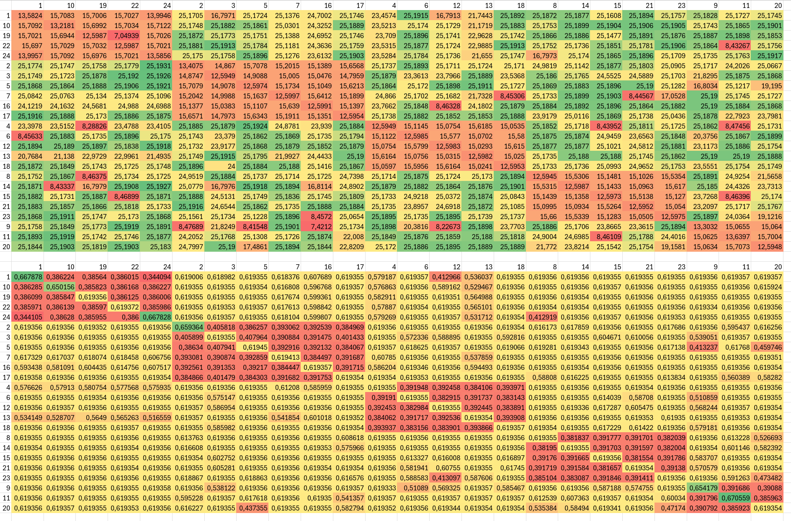
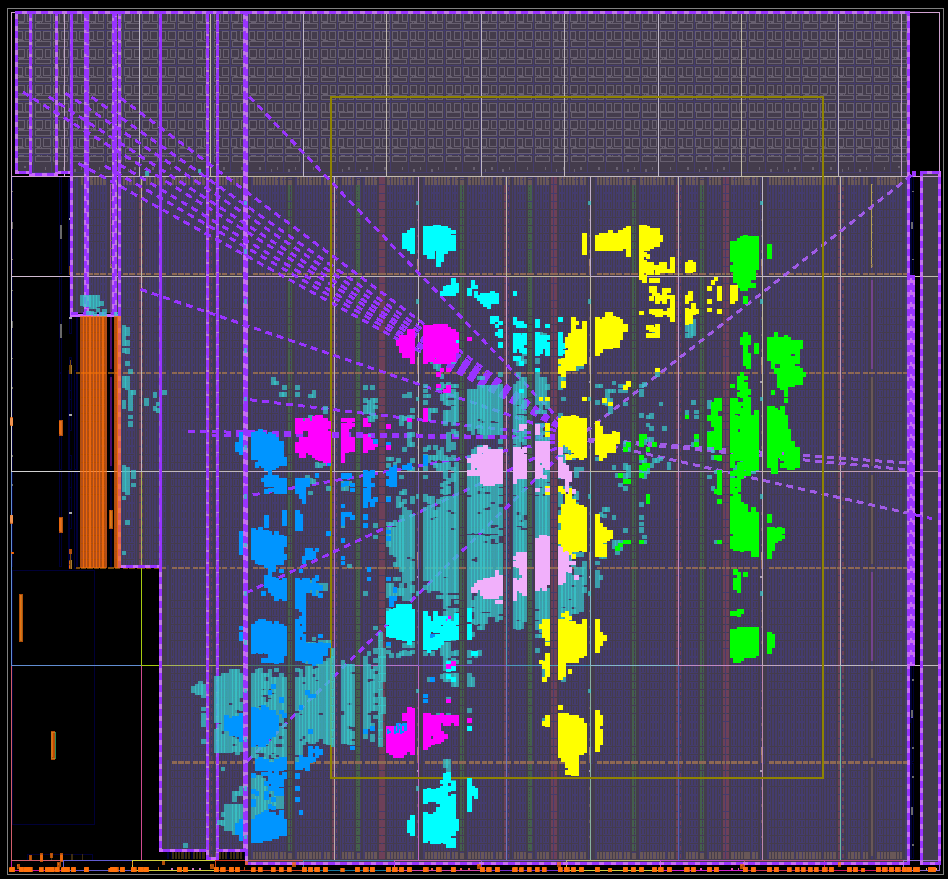
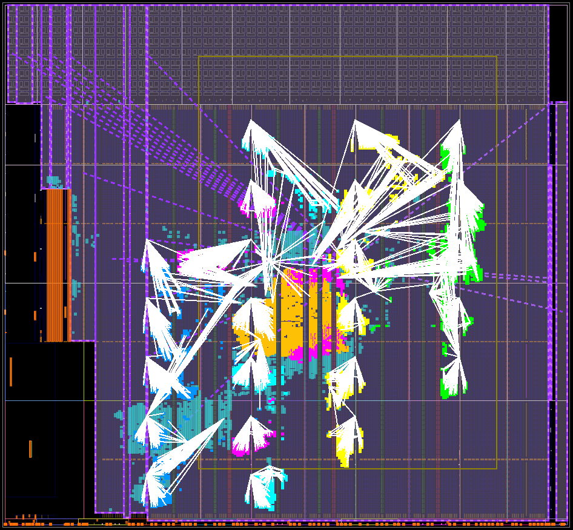
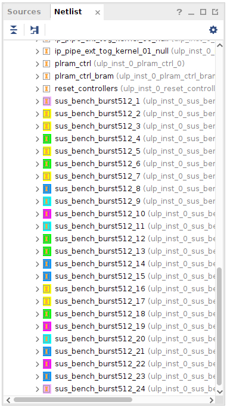

# 24x512bit Memory reader benchmark 320MHz


(Upper matrix is Bandwidths in GB/s, lower matrix is cycle usage efficiency)


(Observe Kernel 1 & 24 are not directly connected to a NoC interface - rather they are on a virtual NoC (orange region), which is connected to a shared interface)


| #parallel | Total Bandwidth (GB/s) |
| --- | --- |
| 1   | 13.5623 |
| 2   | 25.1748 |
| 3   | 22.0688 |
| 4   | 29.2881 |
| 5   | 25.6728 |
| 6   | 17.7485 |
| 7   | 27.5624 |
| 8   | 31.4736 |
| 9   | 35.4239 |
| 10  | 39.2506 |
| 11  | 42.9778 |
| 12  | 46.4071 |
| 13  | 47.063  |
| 14  | 50.8537 |
| 15  | 54.0014 |
| 16  | 47.826  |
| 17  | 44.5466 |
| 18  | 46.6465 |
| 19  | 47.7573 |
| 20  | 49.944  |
| 21  | 52.1049 |
| 22  | 51.6131 |
| 23  | 52.3697 |
| 24  | 47.9105 |

(we're simply starting from kernel #1, and adding kernels sequentially)

## Raw Log
```
[lennartv@n2hacc03 sw]$ make main.x && ./main.x e bigBench24x512.xclbin
g++ -g -std=c++17 -I/opt/software/FPGA/Xilinx/xrt/xrt_2.16/include -L/opt/software/FPGA/Xilinx/xrt/xrt_2.16/lib -lxrt_coreutil -pthread main.cpp -o main.x
Got VCK5000 in 0000:e1:00.1
device name:     xilinx_vck5000_gen4x8_qdma_base_2
device bdf:      0000:e1:00.1
Got XCLBIN
Making Buffer of 800000000 elements
Expected hash is 1078751232
Current AXIConfig:
  arsize        = 0
  arburst       = 0
  arprot        = 0
  arcache       = 2
  arqos         = 0
  arlock        = 0
  arregion      = 0
  max_in_flight = 2000
Starting Kernels
1 Parallel Kernels
    Time taken: 0.235861s, BW: 13.5673GB/s. Cycles used ratio: 0.662467
    sus_bench_burst512:{sus_bench_burst512_1} took 74871717 cycles for 50000000 transfers. 0.667809 effective.
1 Parallel Kernels
    Time taken: 0.238688s, BW: 13.4066GB/s. Cycles used ratio: 0.65462
    sus_bench_burst512:{sus_bench_burst512_2} took 75831710 cycles for 50000000 transfers. 0.659355 effective.
1 Parallel Kernels
    Time taken: 0.254249s, BW: 12.5861GB/s. Cycles used ratio: 0.614554
    sus_bench_burst512:{sus_bench_burst512_3} took 80728893 cycles for 50000000 transfers. 0.619357 effective.
1 Parallel Kernels
    Time taken: 0.25424s, BW: 12.5865GB/s. Cycles used ratio: 0.614577
    sus_bench_burst512:{sus_bench_burst512_4} took 80729186 cycles for 50000000 transfers. 0.619355 effective.
1 Parallel Kernels
    Time taken: 0.254235s, BW: 12.5868GB/s. Cycles used ratio: 0.614589
    sus_bench_burst512:{sus_bench_burst512_5} took 80723377 cycles for 50000000 transfers. 0.619399 effective.
1 Parallel Kernels
    Time taken: 0.254016s, BW: 12.5976GB/s. Cycles used ratio: 0.615118
    sus_bench_burst512:{sus_bench_burst512_6} took 80729285 cycles for 50000000 transfers. 0.619354 effective.
1 Parallel Kernels
    Time taken: 0.254062s, BW: 12.5954GB/s. Cycles used ratio: 0.615008
    sus_bench_burst512:{sus_bench_burst512_7} took 80719036 cycles for 50000000 transfers. 0.619433 effective.
1 Parallel Kernels
    Time taken: 0.254246s, BW: 12.5862GB/s. Cycles used ratio: 0.614562
    sus_bench_burst512:{sus_bench_burst512_8} took 80729201 cycles for 50000000 transfers. 0.619355 effective.
1 Parallel Kernels
    Time taken: 0.240655s, BW: 13.297GB/s. Cycles used ratio: 0.64927
    sus_bench_burst512:{sus_bench_burst512_9} took 76467464 cycles for 50000000 transfers. 0.653873 effective.
1 Parallel Kernels
    Time taken: 0.241971s, BW: 13.2247GB/s. Cycles used ratio: 0.645739
    sus_bench_burst512:{sus_bench_burst512_10} took 76828309 cycles for 50000000 transfers. 0.650802 effective.
1 Parallel Kernels
    Time taken: 0.234663s, BW: 13.6366GB/s. Cycles used ratio: 0.665848
    sus_bench_burst512:{sus_bench_burst512_11} took 74564143 cycles for 50000000 transfers. 0.670564 effective.
1 Parallel Kernels
    Time taken: 0.254085s, BW: 12.5942GB/s. Cycles used ratio: 0.614951
    sus_bench_burst512:{sus_bench_burst512_12} took 80729189 cycles for 50000000 transfers. 0.619355 effective.
1 Parallel Kernels
    Time taken: 0.254064s, BW: 12.5953GB/s. Cycles used ratio: 0.615003
    sus_bench_burst512:{sus_bench_burst512_13} took 80730183 cycles for 50000000 transfers. 0.619347 effective.
1 Parallel Kernels
    Time taken: 0.254095s, BW: 12.5937GB/s. Cycles used ratio: 0.614927
    sus_bench_burst512:{sus_bench_burst512_14} took 80728920 cycles for 50000000 transfers. 0.619357 effective.
1 Parallel Kernels
    Time taken: 0.254094s, BW: 12.5937GB/s. Cycles used ratio: 0.614929
    sus_bench_burst512:{sus_bench_burst512_15} took 80728939 cycles for 50000000 transfers. 0.619357 effective.
1 Parallel Kernels
    Time taken: 0.254077s, BW: 12.5946GB/s. Cycles used ratio: 0.61497
    sus_bench_burst512:{sus_bench_burst512_16} took 80729245 cycles for 50000000 transfers. 0.619354 effective.
1 Parallel Kernels
    Time taken: 0.254073s, BW: 12.5948GB/s. Cycles used ratio: 0.61498
    sus_bench_burst512:{sus_bench_burst512_17} took 80729044 cycles for 50000000 transfers. 0.619356 effective.
1 Parallel Kernels
    Time taken: 0.254067s, BW: 12.5951GB/s. Cycles used ratio: 0.614994
    sus_bench_burst512:{sus_bench_burst512_18} took 80729024 cycles for 50000000 transfers. 0.619356 effective.
1 Parallel Kernels
    Time taken: 0.254266s, BW: 12.5852GB/s. Cycles used ratio: 0.614514
    sus_bench_burst512:{sus_bench_burst512_19} took 80728914 cycles for 50000000 transfers. 0.619357 effective.
1 Parallel Kernels
    Time taken: 0.254223s, BW: 12.5874GB/s. Cycles used ratio: 0.614618
    sus_bench_burst512:{sus_bench_burst512_20} took 80729218 cycles for 50000000 transfers. 0.619354 effective.
1 Parallel Kernels
    Time taken: 0.254164s, BW: 12.5903GB/s. Cycles used ratio: 0.614761
    sus_bench_burst512:{sus_bench_burst512_21} took 80728954 cycles for 50000000 transfers. 0.619356 effective.
1 Parallel Kernels
    Time taken: 0.254054s, BW: 12.5957GB/s. Cycles used ratio: 0.615027
    sus_bench_burst512:{sus_bench_burst512_22} took 80728282 cycles for 50000000 transfers. 0.619362 effective.
1 Parallel Kernels
    Time taken: 0.25407s, BW: 12.595GB/s. Cycles used ratio: 0.614989
    sus_bench_burst512:{sus_bench_burst512_23} took 80729124 cycles for 50000000 transfers. 0.619355 effective.
1 Parallel Kernels
    Time taken: 0.235817s, BW: 13.5698GB/s. Cycles used ratio: 0.66259
    sus_bench_burst512:{sus_bench_burst512_24} took 74885795 cycles for 50000000 transfers. 0.667683 effective.
Starting 4x Parallel Kernels
4 Parallel Kernels
    Time taken: 0.436986s, BW: 29.2915GB/s. Cycles used ratio: 0.357563
    sus_bench_burst512:{sus_bench_burst512_1} took 112322630 cycles for 50000000 transfers. 0.445146 effective.
    sus_bench_burst512:{sus_bench_burst512_2} took 121268205 cycles for 50000000 transfers. 0.412309 effective.
    sus_bench_burst512:{sus_bench_burst512_3} took 138828893 cycles for 50000000 transfers. 0.360156 effective.
    sus_bench_burst512:{sus_bench_burst512_4} took 114425191 cycles for 50000000 transfers. 0.436967 effective.
4 Parallel Kernels
    Time taken: 0.427972s, BW: 29.9085GB/s. Cycles used ratio: 0.365094
    sus_bench_burst512:{sus_bench_burst512_5} took 130136354 cycles for 50000000 transfers. 0.384212 effective.
    sus_bench_burst512:{sus_bench_burst512_6} took 119071791 cycles for 50000000 transfers. 0.419915 effective.
    sus_bench_burst512:{sus_bench_burst512_7} took 136012075 cycles for 50000000 transfers. 0.367614 effective.
    sus_bench_burst512:{sus_bench_burst512_8} took 127640716 cycles for 50000000 transfers. 0.391725 effective.
4 Parallel Kernels
    Time taken: 0.438091s, BW: 29.2177GB/s. Cycles used ratio: 0.356661
    sus_bench_burst512:{sus_bench_burst512_9} took 139179508 cycles for 50000000 transfers. 0.359248 effective.
    sus_bench_burst512:{sus_bench_burst512_10} took 101211168 cycles for 50000000 transfers. 0.494017 effective.
    sus_bench_burst512:{sus_bench_burst512_11} took 132655281 cycles for 50000000 transfers. 0.376917 effective.
    sus_bench_burst512:{sus_bench_burst512_12} took 137069292 cycles for 50000000 transfers. 0.364779 effective.
4 Parallel Kernels
    Time taken: 0.430364s, BW: 29.7422GB/s. Cycles used ratio: 0.363064
    sus_bench_burst512:{sus_bench_burst512_13} took 119010255 cycles for 50000000 transfers. 0.420132 effective.
    sus_bench_burst512:{sus_bench_burst512_14} took 128520668 cycles for 50000000 transfers. 0.389042 effective.
    sus_bench_burst512:{sus_bench_burst512_15} took 136726725 cycles for 50000000 transfers. 0.365693 effective.
    sus_bench_burst512:{sus_bench_burst512_16} took 117742124 cycles for 50000000 transfers. 0.424657 effective.
4 Parallel Kernels
    Time taken: 0.367085s, BW: 34.8693GB/s. Cycles used ratio: 0.42565
    sus_bench_burst512:{sus_bench_burst512_17} took 116609160 cycles for 50000000 transfers. 0.428783 effective.
    sus_bench_burst512:{sus_bench_burst512_18} took 111463153 cycles for 50000000 transfers. 0.448579 effective.
    sus_bench_burst512:{sus_bench_burst512_19} took 112441981 cycles for 50000000 transfers. 0.444674 effective.
    sus_bench_burst512:{sus_bench_burst512_20} took 116639336 cycles for 50000000 transfers. 0.428672 effective.
4 Parallel Kernels
    Time taken: 0.433437s, BW: 29.5314GB/s. Cycles used ratio: 0.360491
    sus_bench_burst512:{sus_bench_burst512_21} took 137703612 cycles for 50000000 transfers. 0.363099 effective.
    sus_bench_burst512:{sus_bench_burst512_22} took 133265199 cycles for 50000000 transfers. 0.375192 effective.
    sus_bench_burst512:{sus_bench_burst512_23} took 125142633 cycles for 50000000 transfers. 0.399544 effective.
    sus_bench_burst512:{sus_bench_burst512_24} took 133261311 cycles for 50000000 transfers. 0.375203 effective.
Starting 1x-24x Parallel Kernels 512-bit
1 Parallel Kernels
    Time taken: 0.235948s, BW: 13.5623GB/s. Cycles used ratio: 0.662221
    sus_bench_burst512:{sus_bench_burst512_1} took 74919579 cycles for 50000000 transfers. 0.667382 effective.
2 Parallel Kernels
    Time taken: 0.254222s, BW: 25.1748GB/s. Cycles used ratio: 0.61462
    sus_bench_burst512:{sus_bench_burst512_1} took 80729187 cycles for 50000000 transfers. 0.619355 effective.
    sus_bench_burst512:{sus_bench_burst512_2} took 80729495 cycles for 50000000 transfers. 0.619352 effective.
3 Parallel Kernels
    Time taken: 0.435003s, BW: 22.0688GB/s. Cycles used ratio: 0.359193
    sus_bench_burst512:{sus_bench_burst512_1} took 90082777 cycles for 50000000 transfers. 0.555045 effective.
    sus_bench_burst512:{sus_bench_burst512_2} took 117640712 cycles for 50000000 transfers. 0.425023 effective.
    sus_bench_burst512:{sus_bench_burst512_3} took 138196542 cycles for 50000000 transfers. 0.361804 effective.
4 Parallel Kernels
    Time taken: 0.437038s, BW: 29.2881GB/s. Cycles used ratio: 0.357521
    sus_bench_burst512:{sus_bench_burst512_1} took 112250782 cycles for 50000000 transfers. 0.445431 effective.
    sus_bench_burst512:{sus_bench_burst512_2} took 121293248 cycles for 50000000 transfers. 0.412224 effective.
    sus_bench_burst512:{sus_bench_burst512_3} took 138848355 cycles for 50000000 transfers. 0.360105 effective.
    sus_bench_burst512:{sus_bench_burst512_4} took 114373482 cycles for 50000000 transfers. 0.437164 effective.
5 Parallel Kernels
    Time taken: 0.623228s, BW: 25.6728GB/s. Cycles used ratio: 0.250711
    sus_bench_burst512:{sus_bench_burst512_1} took 113008854 cycles for 50000000 transfers. 0.442443 effective.
    sus_bench_burst512:{sus_bench_burst512_2} took 170031195 cycles for 50000000 transfers. 0.294064 effective.
    sus_bench_burst512:{sus_bench_burst512_3} took 198039054 cycles for 50000000 transfers. 0.252475 effective.
    sus_bench_burst512:{sus_bench_burst512_4} took 114182497 cycles for 50000000 transfers. 0.437895 effective.
    sus_bench_burst512:{sus_bench_burst512_5} took 170025411 cycles for 50000000 transfers. 0.294074 effective.
6 Parallel Kernels
    Time taken: 1.08178s, BW: 17.7485GB/s. Cycles used ratio: 0.144438
    sus_bench_burst512:{sus_bench_burst512_1} took 162321519 cycles for 50000000 transfers. 0.308031 effective.
    sus_bench_burst512:{sus_bench_burst512_2} took 183814815 cycles for 50000000 transfers. 0.272013 effective.
    sus_bench_burst512:{sus_bench_burst512_3} took 198412682 cycles for 50000000 transfers. 0.252 effective.
    sus_bench_burst512:{sus_bench_burst512_4} took 173915026 cycles for 50000000 transfers. 0.287497 effective.
    sus_bench_burst512:{sus_bench_burst512_5} took 183808116 cycles for 50000000 transfers. 0.272023 effective.
    sus_bench_burst512:{sus_bench_burst512_6} took 197411690 cycles for 50000000 transfers. 0.253278 effective.
7 Parallel Kernels
    Time taken: 0.812702s, BW: 27.5624GB/s. Cycles used ratio: 0.19226
    sus_bench_burst512:{sus_bench_burst512_1} took 221064343 cycles for 50000000 transfers. 0.226178 effective.
    sus_bench_burst512:{sus_bench_burst512_2} took 250547208 cycles for 50000000 transfers. 0.199563 effective.
    sus_bench_burst512:{sus_bench_burst512_3} took 258329726 cycles for 50000000 transfers. 0.193551 effective.
    sus_bench_burst512:{sus_bench_burst512_4} took 229110483 cycles for 50000000 transfers. 0.218235 effective.
    sus_bench_burst512:{sus_bench_burst512_5} took 250548094 cycles for 50000000 transfers. 0.199562 effective.
    sus_bench_burst512:{sus_bench_burst512_6} took 252005622 cycles for 50000000 transfers. 0.198408 effective.
    sus_bench_burst512:{sus_bench_burst512_7} took 229621345 cycles for 50000000 transfers. 0.21775 effective.
8 Parallel Kernels
    Time taken: 0.813379s, BW: 31.4736GB/s. Cycles used ratio: 0.1921
    sus_bench_burst512:{sus_bench_burst512_1} took 221139202 cycles for 50000000 transfers. 0.226102 effective.
    sus_bench_burst512:{sus_bench_burst512_2} took 251606949 cycles for 50000000 transfers. 0.198723 effective.
    sus_bench_burst512:{sus_bench_burst512_3} took 258496251 cycles for 50000000 transfers. 0.193426 effective.
    sus_bench_burst512:{sus_bench_burst512_4} took 226827934 cycles for 50000000 transfers. 0.220431 effective.
    sus_bench_burst512:{sus_bench_burst512_5} took 251607640 cycles for 50000000 transfers. 0.198722 effective.
    sus_bench_burst512:{sus_bench_burst512_6} took 248524294 cycles for 50000000 transfers. 0.201188 effective.
    sus_bench_burst512:{sus_bench_burst512_7} took 227034669 cycles for 50000000 transfers. 0.220231 effective.
    sus_bench_burst512:{sus_bench_burst512_8} took 233061266 cycles for 50000000 transfers. 0.214536 effective.
9 Parallel Kernels
    Time taken: 0.813009s, BW: 35.4239GB/s. Cycles used ratio: 0.192187
    sus_bench_burst512:{sus_bench_burst512_1} took 231462231 cycles for 50000000 transfers. 0.216018 effective.
    sus_bench_burst512:{sus_bench_burst512_2} took 255881209 cycles for 50000000 transfers. 0.195403 effective.
    sus_bench_burst512:{sus_bench_burst512_3} took 258379411 cycles for 50000000 transfers. 0.193514 effective.
    sus_bench_burst512:{sus_bench_burst512_4} took 237874012 cycles for 50000000 transfers. 0.210195 effective.
    sus_bench_burst512:{sus_bench_burst512_5} took 255881210 cycles for 50000000 transfers. 0.195403 effective.
    sus_bench_burst512:{sus_bench_burst512_6} took 256345744 cycles for 50000000 transfers. 0.195049 effective.
    sus_bench_burst512:{sus_bench_burst512_7} took 237943229 cycles for 50000000 transfers. 0.210134 effective.
    sus_bench_burst512:{sus_bench_burst512_8} took 239480579 cycles for 50000000 transfers. 0.208785 effective.
    sus_bench_burst512:{sus_bench_burst512_9} took 246334905 cycles for 50000000 transfers. 0.202976 effective.
10 Parallel Kernels
    Time taken: 0.815274s, BW: 39.2506GB/s. Cycles used ratio: 0.191653
    sus_bench_burst512:{sus_bench_burst512_1} took 238016522 cycles for 50000000 transfers. 0.210069 effective.
    sus_bench_burst512:{sus_bench_burst512_2} took 255893829 cycles for 50000000 transfers. 0.195394 effective.
    sus_bench_burst512:{sus_bench_burst512_3} took 259092967 cycles for 50000000 transfers. 0.192981 effective.
    sus_bench_burst512:{sus_bench_burst512_4} took 246498992 cycles for 50000000 transfers. 0.202841 effective.
    sus_bench_burst512:{sus_bench_burst512_5} took 255893557 cycles for 50000000 transfers. 0.195394 effective.
    sus_bench_burst512:{sus_bench_burst512_6} took 256855865 cycles for 50000000 transfers. 0.194662 effective.
    sus_bench_burst512:{sus_bench_burst512_7} took 245829289 cycles for 50000000 transfers. 0.203393 effective.
    sus_bench_burst512:{sus_bench_burst512_8} took 237297314 cycles for 50000000 transfers. 0.210706 effective.
    sus_bench_burst512:{sus_bench_burst512_9} took 246086889 cycles for 50000000 transfers. 0.20318 effective.
    sus_bench_burst512:{sus_bench_burst512_10} took 237997393 cycles for 50000000 transfers. 0.210086 effective.
11 Parallel Kernels
    Time taken: 0.819028s, BW: 42.9778GB/s. Cycles used ratio: 0.190775
    sus_bench_burst512:{sus_bench_burst512_1} took 239090125 cycles for 50000000 transfers. 0.209126 effective.
    sus_bench_burst512:{sus_bench_burst512_2} took 259423412 cycles for 50000000 transfers. 0.192735 effective.
    sus_bench_burst512:{sus_bench_burst512_3} took 260300213 cycles for 50000000 transfers. 0.192086 effective.
    sus_bench_burst512:{sus_bench_burst512_4} took 245388168 cycles for 50000000 transfers. 0.203759 effective.
    sus_bench_burst512:{sus_bench_burst512_5} took 259424423 cycles for 50000000 transfers. 0.192734 effective.
    sus_bench_burst512:{sus_bench_burst512_6} took 257958371 cycles for 50000000 transfers. 0.19383 effective.
    sus_bench_burst512:{sus_bench_burst512_7} took 244926595 cycles for 50000000 transfers. 0.204143 effective.
    sus_bench_burst512:{sus_bench_burst512_8} took 253455715 cycles for 50000000 transfers. 0.197273 effective.
    sus_bench_burst512:{sus_bench_burst512_9} took 251610786 cycles for 50000000 transfers. 0.19872 effective.
    sus_bench_burst512:{sus_bench_burst512_10} took 239063616 cycles for 50000000 transfers. 0.209149 effective.
    sus_bench_burst512:{sus_bench_burst512_11} took 256667644 cycles for 50000000 transfers. 0.194804 effective.
12 Parallel Kernels
    Time taken: 0.827459s, BW: 46.4071GB/s. Cycles used ratio: 0.188831
    sus_bench_burst512:{sus_bench_burst512_1} took 240861462 cycles for 50000000 transfers. 0.207588 effective.
    sus_bench_burst512:{sus_bench_burst512_2} took 261018930 cycles for 50000000 transfers. 0.191557 effective.
    sus_bench_burst512:{sus_bench_burst512_3} took 263020483 cycles for 50000000 transfers. 0.190099 effective.
    sus_bench_burst512:{sus_bench_burst512_4} took 246153157 cycles for 50000000 transfers. 0.203126 effective.
    sus_bench_burst512:{sus_bench_burst512_5} took 261018862 cycles for 50000000 transfers. 0.191557 effective.
    sus_bench_burst512:{sus_bench_burst512_6} took 262838307 cycles for 50000000 transfers. 0.190231 effective.
    sus_bench_burst512:{sus_bench_burst512_7} took 245498247 cycles for 50000000 transfers. 0.203667 effective.
    sus_bench_burst512:{sus_bench_burst512_8} took 254696614 cycles for 50000000 transfers. 0.196312 effective.
    sus_bench_burst512:{sus_bench_burst512_9} took 256369126 cycles for 50000000 transfers. 0.195031 effective.
    sus_bench_burst512:{sus_bench_burst512_10} took 240836543 cycles for 50000000 transfers. 0.20761 effective.
    sus_bench_burst512:{sus_bench_burst512_11} took 258381745 cycles for 50000000 transfers. 0.193512 effective.
    sus_bench_burst512:{sus_bench_burst512_12} took 262817378 cycles for 50000000 transfers. 0.190246 effective.
13 Parallel Kernels
    Time taken: 0.883921s, BW: 47.063GB/s. Cycles used ratio: 0.176769
    sus_bench_burst512:{sus_bench_burst512_1} took 274532405 cycles for 50000000 transfers. 0.182128 effective.
    sus_bench_burst512:{sus_bench_burst512_2} took 262767582 cycles for 50000000 transfers. 0.190282 effective.
    sus_bench_burst512:{sus_bench_burst512_3} took 265550343 cycles for 50000000 transfers. 0.188288 effective.
    sus_bench_burst512:{sus_bench_burst512_4} took 280931544 cycles for 50000000 transfers. 0.177979 effective.
    sus_bench_burst512:{sus_bench_burst512_5} took 262769661 cycles for 50000000 transfers. 0.190281 effective.
    sus_bench_burst512:{sus_bench_burst512_6} took 265457208 cycles for 50000000 transfers. 0.188354 effective.
    sus_bench_burst512:{sus_bench_burst512_7} took 278179364 cycles for 50000000 transfers. 0.17974 effective.
    sus_bench_burst512:{sus_bench_burst512_8} took 255492363 cycles for 50000000 transfers. 0.195701 effective.
    sus_bench_burst512:{sus_bench_burst512_9} took 255707620 cycles for 50000000 transfers. 0.195536 effective.
    sus_bench_burst512:{sus_bench_burst512_10} took 274499634 cycles for 50000000 transfers. 0.18215 effective.
    sus_bench_burst512:{sus_bench_burst512_11} took 259782738 cycles for 50000000 transfers. 0.192469 effective.
    sus_bench_burst512:{sus_bench_burst512_12} took 265440940 cycles for 50000000 transfers. 0.188366 effective.
    sus_bench_burst512:{sus_bench_burst512_13} took 280918741 cycles for 50000000 transfers. 0.177987 effective.
14 Parallel Kernels
    Time taken: 0.880958s, BW: 50.8537GB/s. Cycles used ratio: 0.177364
    sus_bench_burst512:{sus_bench_burst512_1} took 273571731 cycles for 50000000 transfers. 0.182767 effective.
    sus_bench_burst512:{sus_bench_burst512_2} took 279985390 cycles for 50000000 transfers. 0.178581 effective.
    sus_bench_burst512:{sus_bench_burst512_3} took 260400173 cycles for 50000000 transfers. 0.192012 effective.
    sus_bench_burst512:{sus_bench_burst512_4} took 279382852 cycles for 50000000 transfers. 0.178966 effective.
    sus_bench_burst512:{sus_bench_burst512_5} took 279982998 cycles for 50000000 transfers. 0.178582 effective.
    sus_bench_burst512:{sus_bench_burst512_6} took 260261498 cycles for 50000000 transfers. 0.192114 effective.
    sus_bench_burst512:{sus_bench_burst512_7} took 277224988 cycles for 50000000 transfers. 0.180359 effective.
    sus_bench_burst512:{sus_bench_burst512_8} took 272758098 cycles for 50000000 transfers. 0.183313 effective.
    sus_bench_burst512:{sus_bench_burst512_9} took 251644320 cycles for 50000000 transfers. 0.198693 effective.
    sus_bench_burst512:{sus_bench_burst512_10} took 273545211 cycles for 50000000 transfers. 0.182785 effective.
    sus_bench_burst512:{sus_bench_burst512_11} took 275405309 cycles for 50000000 transfers. 0.181551 effective.
    sus_bench_burst512:{sus_bench_burst512_12} took 260242198 cycles for 50000000 transfers. 0.192129 effective.
    sus_bench_burst512:{sus_bench_burst512_13} took 279376372 cycles for 50000000 transfers. 0.17897 effective.
    sus_bench_burst512:{sus_bench_burst512_14} took 272985301 cycles for 50000000 transfers. 0.18316 effective.
15 Parallel Kernels
    Time taken: 0.888866s, BW: 54.0014GB/s. Cycles used ratio: 0.175786
    sus_bench_burst512:{sus_bench_burst512_1} took 274223162 cycles for 50000000 transfers. 0.182333 effective.
    sus_bench_burst512:{sus_bench_burst512_2} took 279264618 cycles for 50000000 transfers. 0.179042 effective.
    sus_bench_burst512:{sus_bench_burst512_3} took 281373059 cycles for 50000000 transfers. 0.1777 effective.
    sus_bench_burst512:{sus_bench_burst512_4} took 282500555 cycles for 50000000 transfers. 0.176991 effective.
    sus_bench_burst512:{sus_bench_burst512_5} took 279259537 cycles for 50000000 transfers. 0.179045 effective.
    sus_bench_burst512:{sus_bench_burst512_6} took 281330795 cycles for 50000000 transfers. 0.177727 effective.
    sus_bench_burst512:{sus_bench_burst512_7} took 279294117 cycles for 50000000 transfers. 0.179023 effective.
    sus_bench_burst512:{sus_bench_burst512_8} took 274324727 cycles for 50000000 transfers. 0.182266 effective.
    sus_bench_burst512:{sus_bench_burst512_9} took 272383935 cycles for 50000000 transfers. 0.183564 effective.
    sus_bench_burst512:{sus_bench_burst512_10} took 274196994 cycles for 50000000 transfers. 0.182351 effective.
    sus_bench_burst512:{sus_bench_burst512_11} took 274908678 cycles for 50000000 transfers. 0.181879 effective.
    sus_bench_burst512:{sus_bench_burst512_12} took 281313036 cycles for 50000000 transfers. 0.177738 effective.
    sus_bench_burst512:{sus_bench_burst512_13} took 282488099 cycles for 50000000 transfers. 0.176999 effective.
    sus_bench_burst512:{sus_bench_burst512_14} took 274466143 cycles for 50000000 transfers. 0.182172 effective.
    sus_bench_burst512:{sus_bench_burst512_15} took 270173619 cycles for 50000000 transfers. 0.185066 effective.
16 Parallel Kernels
    Time taken: 1.07055s, BW: 47.826GB/s. Cycles used ratio: 0.145953
    sus_bench_burst512:{sus_bench_burst512_1} took 336504038 cycles for 50000000 transfers. 0.148587 effective.
    sus_bench_burst512:{sus_bench_burst512_2} took 314000399 cycles for 50000000 transfers. 0.159235 effective.
    sus_bench_burst512:{sus_bench_burst512_3} took 315986914 cycles for 50000000 transfers. 0.158234 effective.
    sus_bench_burst512:{sus_bench_burst512_4} took 340307093 cycles for 50000000 transfers. 0.146926 effective.
    sus_bench_burst512:{sus_bench_burst512_5} took 314006857 cycles for 50000000 transfers. 0.159232 effective.
    sus_bench_burst512:{sus_bench_burst512_6} took 315647298 cycles for 50000000 transfers. 0.158405 effective.
    sus_bench_burst512:{sus_bench_burst512_7} took 339999766 cycles for 50000000 transfers. 0.147059 effective.
    sus_bench_burst512:{sus_bench_burst512_8} took 307407911 cycles for 50000000 transfers. 0.16265 effective.
    sus_bench_burst512:{sus_bench_burst512_9} took 308126257 cycles for 50000000 transfers. 0.162271 effective.
    sus_bench_burst512:{sus_bench_burst512_10} took 336475188 cycles for 50000000 transfers. 0.148599 effective.
    sus_bench_burst512:{sus_bench_burst512_11} took 309719412 cycles for 50000000 transfers. 0.161436 effective.
    sus_bench_burst512:{sus_bench_burst512_12} took 315627239 cycles for 50000000 transfers. 0.158415 effective.
    sus_bench_burst512:{sus_bench_burst512_13} took 340293183 cycles for 50000000 transfers. 0.146932 effective.
    sus_bench_burst512:{sus_bench_burst512_14} took 307484735 cycles for 50000000 transfers. 0.16261 effective.
    sus_bench_burst512:{sus_bench_burst512_15} took 301413846 cycles for 50000000 transfers. 0.165885 effective.
    sus_bench_burst512:{sus_bench_burst512_16} took 339896964 cycles for 50000000 transfers. 0.147103 effective.
17 Parallel Kernels
    Time taken: 1.22119s, BW: 44.5466GB/s. Cycles used ratio: 0.127949
    sus_bench_burst512:{sus_bench_burst512_1} took 369297637 cycles for 50000000 transfers. 0.135392 effective.
    sus_bench_burst512:{sus_bench_burst512_2} took 388091116 cycles for 50000000 transfers. 0.128836 effective.
    sus_bench_burst512:{sus_bench_burst512_3} took 341247833 cycles for 50000000 transfers. 0.146521 effective.
    sus_bench_burst512:{sus_bench_burst512_4} took 380475946 cycles for 50000000 transfers. 0.131414 effective.
    sus_bench_burst512:{sus_bench_burst512_5} took 388094938 cycles for 50000000 transfers. 0.128834 effective.
    sus_bench_burst512:{sus_bench_burst512_6} took 340473509 cycles for 50000000 transfers. 0.146854 effective.
    sus_bench_burst512:{sus_bench_burst512_7} took 379339621 cycles for 50000000 transfers. 0.131808 effective.
    sus_bench_burst512:{sus_bench_burst512_8} took 372040697 cycles for 50000000 transfers. 0.134394 effective.
    sus_bench_burst512:{sus_bench_burst512_9} took 332454946 cycles for 50000000 transfers. 0.150396 effective.
    sus_bench_burst512:{sus_bench_burst512_10} took 369271008 cycles for 50000000 transfers. 0.135402 effective.
    sus_bench_burst512:{sus_bench_burst512_11} took 381252281 cycles for 50000000 transfers. 0.131147 effective.
    sus_bench_burst512:{sus_bench_burst512_12} took 340455267 cycles for 50000000 transfers. 0.146862 effective.
    sus_bench_burst512:{sus_bench_burst512_13} took 380495544 cycles for 50000000 transfers. 0.131408 effective.
    sus_bench_burst512:{sus_bench_burst512_14} took 372248801 cycles for 50000000 transfers. 0.134319 effective.
    sus_bench_burst512:{sus_bench_burst512_15} took 322015866 cycles for 50000000 transfers. 0.155272 effective.
    sus_bench_burst512:{sus_bench_burst512_16} took 379298626 cycles for 50000000 transfers. 0.131822 effective.
    sus_bench_burst512:{sus_bench_burst512_17} took 388017527 cycles for 50000000 transfers. 0.12886 effective.
18 Parallel Kernels
    Time taken: 1.23482s, BW: 46.6465GB/s. Cycles used ratio: 0.126537
    sus_bench_burst512:{sus_bench_burst512_1} took 372105068 cycles for 50000000 transfers. 0.134371 effective.
    sus_bench_burst512:{sus_bench_burst512_2} took 391981125 cycles for 50000000 transfers. 0.127557 effective.
    sus_bench_burst512:{sus_bench_burst512_3} took 383985447 cycles for 50000000 transfers. 0.130213 effective.
    sus_bench_burst512:{sus_bench_burst512_4} took 384808496 cycles for 50000000 transfers. 0.129935 effective.
    sus_bench_burst512:{sus_bench_burst512_5} took 391995024 cycles for 50000000 transfers. 0.127553 effective.
    sus_bench_burst512:{sus_bench_burst512_6} took 385195843 cycles for 50000000 transfers. 0.129804 effective.
    sus_bench_burst512:{sus_bench_burst512_7} took 383528296 cycles for 50000000 transfers. 0.130368 effective.
    sus_bench_burst512:{sus_bench_burst512_8} took 372105452 cycles for 50000000 transfers. 0.134371 effective.
    sus_bench_burst512:{sus_bench_burst512_9} took 373435995 cycles for 50000000 transfers. 0.133892 effective.
    sus_bench_burst512:{sus_bench_burst512_10} took 372328681 cycles for 50000000 transfers. 0.13429 effective.
    sus_bench_burst512:{sus_bench_burst512_11} took 384581597 cycles for 50000000 transfers. 0.130011 effective.
    sus_bench_burst512:{sus_bench_burst512_12} took 385192151 cycles for 50000000 transfers. 0.129805 effective.
    sus_bench_burst512:{sus_bench_burst512_13} took 384933787 cycles for 50000000 transfers. 0.129892 effective.
    sus_bench_burst512:{sus_bench_burst512_14} took 372106555 cycles for 50000000 transfers. 0.13437 effective.
    sus_bench_burst512:{sus_bench_burst512_15} took 347718824 cycles for 50000000 transfers. 0.143794 effective.
    sus_bench_burst512:{sus_bench_burst512_16} took 383659883 cycles for 50000000 transfers. 0.130324 effective.
    sus_bench_burst512:{sus_bench_burst512_17} took 391500539 cycles for 50000000 transfers. 0.127714 effective.
    sus_bench_burst512:{sus_bench_burst512_18} took 384675972 cycles for 50000000 transfers. 0.12998 effective.
19 Parallel Kernels
    Time taken: 1.2731s, BW: 47.7573GB/s. Cycles used ratio: 0.122732
    sus_bench_burst512:{sus_bench_burst512_1} took 395249216 cycles for 50000000 transfers. 0.126502 effective.
    sus_bench_burst512:{sus_bench_burst512_2} took 382395088 cycles for 50000000 transfers. 0.130755 effective.
    sus_bench_burst512:{sus_bench_burst512_3} took 368802822 cycles for 50000000 transfers. 0.135574 effective.
    sus_bench_burst512:{sus_bench_burst512_4} took 404422011 cycles for 50000000 transfers. 0.123633 effective.
    sus_bench_burst512:{sus_bench_burst512_5} took 382395780 cycles for 50000000 transfers. 0.130755 effective.
    sus_bench_burst512:{sus_bench_burst512_6} took 369991568 cycles for 50000000 transfers. 0.135138 effective.
    sus_bench_burst512:{sus_bench_burst512_7} took 400603798 cycles for 50000000 transfers. 0.124812 effective.
    sus_bench_burst512:{sus_bench_burst512_8} took 361843272 cycles for 50000000 transfers. 0.138181 effective.
    sus_bench_burst512:{sus_bench_burst512_9} took 358380155 cycles for 50000000 transfers. 0.139517 effective.
    sus_bench_burst512:{sus_bench_burst512_10} took 395247424 cycles for 50000000 transfers. 0.126503 effective.
    sus_bench_burst512:{sus_bench_burst512_11} took 371238393 cycles for 50000000 transfers. 0.134684 effective.
    sus_bench_burst512:{sus_bench_burst512_12} took 369907791 cycles for 50000000 transfers. 0.135169 effective.
    sus_bench_burst512:{sus_bench_burst512_13} took 404000107 cycles for 50000000 transfers. 0.123762 effective.
    sus_bench_burst512:{sus_bench_burst512_14} took 362281140 cycles for 50000000 transfers. 0.138014 effective.
    sus_bench_burst512:{sus_bench_burst512_15} took 336597347 cycles for 50000000 transfers. 0.148545 effective.
    sus_bench_burst512:{sus_bench_burst512_16} took 400327012 cycles for 50000000 transfers. 0.124898 effective.
    sus_bench_burst512:{sus_bench_burst512_17} took 382700819 cycles for 50000000 transfers. 0.13065 effective.
    sus_bench_burst512:{sus_bench_burst512_18} took 369901363 cycles for 50000000 transfers. 0.135171 effective.
    sus_bench_burst512:{sus_bench_burst512_19} took 395123953 cycles for 50000000 transfers. 0.126543 effective.
20 Parallel Kernels
    Time taken: 1.28144s, BW: 49.944GB/s. Cycles used ratio: 0.121934
    sus_bench_burst512:{sus_bench_burst512_1} took 386801571 cycles for 50000000 transfers. 0.129265 effective.
    sus_bench_burst512:{sus_bench_burst512_2} took 406634991 cycles for 50000000 transfers. 0.12296 effective.
    sus_bench_burst512:{sus_bench_burst512_3} took 354664578 cycles for 50000000 transfers. 0.140978 effective.
    sus_bench_burst512:{sus_bench_burst512_4} took 399889628 cycles for 50000000 transfers. 0.125035 effective.
    sus_bench_burst512:{sus_bench_burst512_5} took 406714527 cycles for 50000000 transfers. 0.122936 effective.
    sus_bench_burst512:{sus_bench_burst512_6} took 355134125 cycles for 50000000 transfers. 0.140792 effective.
    sus_bench_burst512:{sus_bench_burst512_7} took 397685723 cycles for 50000000 transfers. 0.125727 effective.
    sus_bench_burst512:{sus_bench_burst512_8} took 373330413 cycles for 50000000 transfers. 0.13393 effective.
    sus_bench_burst512:{sus_bench_burst512_9} took 345491521 cycles for 50000000 transfers. 0.144721 effective.
    sus_bench_burst512:{sus_bench_burst512_10} took 387114598 cycles for 50000000 transfers. 0.129161 effective.
    sus_bench_burst512:{sus_bench_burst512_11} took 400592462 cycles for 50000000 transfers. 0.124815 effective.
    sus_bench_burst512:{sus_bench_burst512_12} took 355122309 cycles for 50000000 transfers. 0.140797 effective.
    sus_bench_burst512:{sus_bench_burst512_13} took 399892238 cycles for 50000000 transfers. 0.125034 effective.
    sus_bench_burst512:{sus_bench_burst512_14} took 373333289 cycles for 50000000 transfers. 0.133929 effective.
    sus_bench_burst512:{sus_bench_burst512_15} took 327975871 cycles for 50000000 transfers. 0.15245 effective.
    sus_bench_burst512:{sus_bench_burst512_16} took 397467278 cycles for 50000000 transfers. 0.125797 effective.
    sus_bench_burst512:{sus_bench_burst512_17} took 406425001 cycles for 50000000 transfers. 0.123024 effective.
    sus_bench_burst512:{sus_bench_burst512_18} took 354883601 cycles for 50000000 transfers. 0.140891 effective.
    sus_bench_burst512:{sus_bench_burst512_19} took 387338703 cycles for 50000000 transfers. 0.129086 effective.
    sus_bench_burst512:{sus_bench_burst512_20} took 400443256 cycles for 50000000 transfers. 0.124862 effective.
21 Parallel Kernels
    Time taken: 1.28971s, BW: 52.1049GB/s. Cycles used ratio: 0.121152
    sus_bench_burst512:{sus_bench_burst512_1} took 386574146 cycles for 50000000 transfers. 0.129341 effective.
    sus_bench_burst512:{sus_bench_burst512_2} took 409400411 cycles for 50000000 transfers. 0.12213 effective.
    sus_bench_burst512:{sus_bench_burst512_3} took 405975620 cycles for 50000000 transfers. 0.12316 effective.
    sus_bench_burst512:{sus_bench_burst512_4} took 405293309 cycles for 50000000 transfers. 0.123367 effective.
    sus_bench_burst512:{sus_bench_burst512_5} took 409453168 cycles for 50000000 transfers. 0.122114 effective.
    sus_bench_burst512:{sus_bench_burst512_6} took 408331905 cycles for 50000000 transfers. 0.122449 effective.
    sus_bench_burst512:{sus_bench_burst512_7} took 400964967 cycles for 50000000 transfers. 0.124699 effective.
    sus_bench_burst512:{sus_bench_burst512_8} took 374460190 cycles for 50000000 transfers. 0.133526 effective.
    sus_bench_burst512:{sus_bench_burst512_9} took 390515511 cycles for 50000000 transfers. 0.128036 effective.
    sus_bench_burst512:{sus_bench_burst512_10} took 386882450 cycles for 50000000 transfers. 0.129238 effective.
    sus_bench_burst512:{sus_bench_burst512_11} took 402249424 cycles for 50000000 transfers. 0.124301 effective.
    sus_bench_burst512:{sus_bench_burst512_12} took 408327131 cycles for 50000000 transfers. 0.122451 effective.
    sus_bench_burst512:{sus_bench_burst512_13} took 405296041 cycles for 50000000 transfers. 0.123367 effective.
    sus_bench_burst512:{sus_bench_burst512_14} took 374465969 cycles for 50000000 transfers. 0.133523 effective.
    sus_bench_burst512:{sus_bench_burst512_15} took 367708264 cycles for 50000000 transfers. 0.135977 effective.
    sus_bench_burst512:{sus_bench_burst512_16} took 400998772 cycles for 50000000 transfers. 0.124689 effective.
    sus_bench_burst512:{sus_bench_burst512_17} took 409650159 cycles for 50000000 transfers. 0.122055 effective.
    sus_bench_burst512:{sus_bench_burst512_18} took 408176970 cycles for 50000000 transfers. 0.122496 effective.
    sus_bench_burst512:{sus_bench_burst512_19} took 387097062 cycles for 50000000 transfers. 0.129167 effective.
    sus_bench_burst512:{sus_bench_burst512_20} took 402323120 cycles for 50000000 transfers. 0.124278 effective.
    sus_bench_burst512:{sus_bench_burst512_21} took 367998448 cycles for 50000000 transfers. 0.13587 effective.
22 Parallel Kernels
    Time taken: 1.364s, BW: 51.6131GB/s. Cycles used ratio: 0.114553
    sus_bench_burst512:{sus_bench_burst512_1} took 424196567 cycles for 50000000 transfers. 0.11787 effective.
    sus_bench_burst512:{sus_bench_burst512_2} took 403960283 cycles for 50000000 transfers. 0.123775 effective.
    sus_bench_burst512:{sus_bench_burst512_3} took 396852079 cycles for 50000000 transfers. 0.125992 effective.
    sus_bench_burst512:{sus_bench_burst512_4} took 433602607 cycles for 50000000 transfers. 0.115313 effective.
    sus_bench_burst512:{sus_bench_burst512_5} took 403969456 cycles for 50000000 transfers. 0.123772 effective.
    sus_bench_burst512:{sus_bench_burst512_6} took 400261626 cycles for 50000000 transfers. 0.124918 effective.
    sus_bench_burst512:{sus_bench_burst512_7} took 428505748 cycles for 50000000 transfers. 0.116685 effective.
    sus_bench_burst512:{sus_bench_burst512_8} took 367800059 cycles for 50000000 transfers. 0.135943 effective.
    sus_bench_burst512:{sus_bench_burst512_9} took 380865853 cycles for 50000000 transfers. 0.13128 effective.
    sus_bench_burst512:{sus_bench_burst512_10} took 424123079 cycles for 50000000 transfers. 0.11789 effective.
    sus_bench_burst512:{sus_bench_burst512_11} took 391878061 cycles for 50000000 transfers. 0.127591 effective.
    sus_bench_burst512:{sus_bench_burst512_12} took 400260006 cycles for 50000000 transfers. 0.124919 effective.
    sus_bench_burst512:{sus_bench_burst512_13} took 433591452 cycles for 50000000 transfers. 0.115316 effective.
    sus_bench_burst512:{sus_bench_burst512_14} took 367867126 cycles for 50000000 transfers. 0.135919 effective.
    sus_bench_burst512:{sus_bench_burst512_15} took 359774974 cycles for 50000000 transfers. 0.138976 effective.
    sus_bench_burst512:{sus_bench_burst512_16} took 428423444 cycles for 50000000 transfers. 0.116707 effective.
    sus_bench_burst512:{sus_bench_burst512_17} took 405722606 cycles for 50000000 transfers. 0.123237 effective.
    sus_bench_burst512:{sus_bench_burst512_18} took 400202965 cycles for 50000000 transfers. 0.124937 effective.
    sus_bench_burst512:{sus_bench_burst512_19} took 424167637 cycles for 50000000 transfers. 0.117878 effective.
    sus_bench_burst512:{sus_bench_burst512_20} took 392054093 cycles for 50000000 transfers. 0.127533 effective.
    sus_bench_burst512:{sus_bench_burst512_21} took 359778186 cycles for 50000000 transfers. 0.138975 effective.
    sus_bench_burst512:{sus_bench_burst512_22} took 424205009 cycles for 50000000 transfers. 0.117868 effective.
23 Parallel Kernels
    Time taken: 1.40539s, BW: 52.3697GB/s. Cycles used ratio: 0.111179
    sus_bench_burst512:{sus_bench_burst512_1} took 421389931 cycles for 50000000 transfers. 0.118655 effective.
    sus_bench_burst512:{sus_bench_burst512_2} took 445750550 cycles for 50000000 transfers. 0.11217 effective.
    sus_bench_burst512:{sus_bench_burst512_3} took 391533452 cycles for 50000000 transfers. 0.127703 effective.
    sus_bench_burst512:{sus_bench_burst512_4} took 438698444 cycles for 50000000 transfers. 0.113974 effective.
    sus_bench_burst512:{sus_bench_burst512_5} took 445751291 cycles for 50000000 transfers. 0.11217 effective.
    sus_bench_burst512:{sus_bench_burst512_6} took 393322530 cycles for 50000000 transfers. 0.127122 effective.
    sus_bench_burst512:{sus_bench_burst512_7} took 434947461 cycles for 50000000 transfers. 0.114956 effective.
    sus_bench_burst512:{sus_bench_burst512_8} took 402975035 cycles for 50000000 transfers. 0.124077 effective.
    sus_bench_burst512:{sus_bench_burst512_9} took 375123276 cycles for 50000000 transfers. 0.13329 effective.
    sus_bench_burst512:{sus_bench_burst512_10} took 421274215 cycles for 50000000 transfers. 0.118688 effective.
    sus_bench_burst512:{sus_bench_burst512_11} took 431487152 cycles for 50000000 transfers. 0.115878 effective.
    sus_bench_burst512:{sus_bench_burst512_12} took 393301282 cycles for 50000000 transfers. 0.127129 effective.
    sus_bench_burst512:{sus_bench_burst512_13} took 438693607 cycles for 50000000 transfers. 0.113975 effective.
    sus_bench_burst512:{sus_bench_burst512_14} took 403058704 cycles for 50000000 transfers. 0.124051 effective.
    sus_bench_burst512:{sus_bench_burst512_15} took 363312956 cycles for 50000000 transfers. 0.137622 effective.
    sus_bench_burst512:{sus_bench_burst512_16} took 434880098 cycles for 50000000 transfers. 0.114974 effective.
    sus_bench_burst512:{sus_bench_burst512_17} took 446550371 cycles for 50000000 transfers. 0.111969 effective.
    sus_bench_burst512:{sus_bench_burst512_18} took 393258949 cycles for 50000000 transfers. 0.127143 effective.
    sus_bench_burst512:{sus_bench_burst512_19} took 421463199 cycles for 50000000 transfers. 0.118634 effective.
    sus_bench_burst512:{sus_bench_burst512_20} took 431615510 cycles for 50000000 transfers. 0.115844 effective.
    sus_bench_burst512:{sus_bench_burst512_21} took 363441605 cycles for 50000000 transfers. 0.137574 effective.
    sus_bench_burst512:{sus_bench_burst512_22} took 421437891 cycles for 50000000 transfers. 0.118641 effective.
    sus_bench_burst512:{sus_bench_burst512_23} took 402965229 cycles for 50000000 transfers. 0.12408 effective.
24 Parallel Kernels
    Time taken: 1.60299s, BW: 47.9105GB/s. Cycles used ratio: 0.0974742
    sus_bench_burst512:{sus_bench_burst512_1} took 509594880 cycles for 50000000 transfers. 0.0981172 effective.
    sus_bench_burst512:{sus_bench_burst512_2} took 445904717 cycles for 50000000 transfers. 0.112132 effective.
    sus_bench_burst512:{sus_bench_burst512_3} took 391144240 cycles for 50000000 transfers. 0.12783 effective.
    sus_bench_burst512:{sus_bench_burst512_4} took 440893069 cycles for 50000000 transfers. 0.113406 effective.
    sus_bench_burst512:{sus_bench_burst512_5} took 445904594 cycles for 50000000 transfers. 0.112132 effective.
    sus_bench_burst512:{sus_bench_burst512_6} took 392986348 cycles for 50000000 transfers. 0.127231 effective.
    sus_bench_burst512:{sus_bench_burst512_7} took 436602933 cycles for 50000000 transfers. 0.114521 effective.
    sus_bench_burst512:{sus_bench_burst512_8} took 402636660 cycles for 50000000 transfers. 0.124181 effective.
    sus_bench_burst512:{sus_bench_burst512_9} took 374629292 cycles for 50000000 transfers. 0.133465 effective.
    sus_bench_burst512:{sus_bench_burst512_10} took 421786392 cycles for 50000000 transfers. 0.118543 effective.
    sus_bench_burst512:{sus_bench_burst512_11} took 430679991 cycles for 50000000 transfers. 0.116095 effective.
    sus_bench_burst512:{sus_bench_burst512_12} took 392974697 cycles for 50000000 transfers. 0.127235 effective.
    sus_bench_burst512:{sus_bench_burst512_13} took 440887842 cycles for 50000000 transfers. 0.113408 effective.
    sus_bench_burst512:{sus_bench_burst512_14} took 402679556 cycles for 50000000 transfers. 0.124168 effective.
    sus_bench_burst512:{sus_bench_burst512_15} took 362921148 cycles for 50000000 transfers. 0.137771 effective.
    sus_bench_burst512:{sus_bench_burst512_16} took 436597396 cycles for 50000000 transfers. 0.114522 effective.
    sus_bench_burst512:{sus_bench_burst512_17} took 446955005 cycles for 50000000 transfers. 0.111868 effective.
    sus_bench_burst512:{sus_bench_burst512_18} took 392965740 cycles for 50000000 transfers. 0.127238 effective.
    sus_bench_burst512:{sus_bench_burst512_19} took 422021598 cycles for 50000000 transfers. 0.118477 effective.
    sus_bench_burst512:{sus_bench_burst512_20} took 430759043 cycles for 50000000 transfers. 0.116074 effective.
    sus_bench_burst512:{sus_bench_burst512_21} took 363030453 cycles for 50000000 transfers. 0.137729 effective.
    sus_bench_burst512:{sus_bench_burst512_22} took 422016433 cycles for 50000000 transfers. 0.118479 effective.
    sus_bench_burst512:{sus_bench_burst512_23} took 402628899 cycles for 50000000 transfers. 0.124184 effective.
    sus_bench_burst512:{sus_bench_burst512_24} took 509548225 cycles for 50000000 transfers. 0.0981261 effective.
0 Parallel Kernels
    Time taken: 1.4e-07s, BW: 0GB/s. Cycles used ratio: 0
ALL KERNELS
24 Parallel Kernels
    Time taken: 1.60221s, BW: 47.9339GB/s. Cycles used ratio: 0.0975217
    sus_bench_burst512:{sus_bench_burst512_1} took 509300987 cycles for 50000000 transfers. 0.0981738 effective.
    sus_bench_burst512:{sus_bench_burst512_2} took 445695222 cycles for 50000000 transfers. 0.112184 effective.
    sus_bench_burst512:{sus_bench_burst512_3} took 390908839 cycles for 50000000 transfers. 0.127907 effective.
    sus_bench_burst512:{sus_bench_burst512_4} took 440721023 cycles for 50000000 transfers. 0.11345 effective.
    sus_bench_burst512:{sus_bench_burst512_5} took 445688971 cycles for 50000000 transfers. 0.112186 effective.
    sus_bench_burst512:{sus_bench_burst512_6} took 392780686 cycles for 50000000 transfers. 0.127298 effective.
    sus_bench_burst512:{sus_bench_burst512_7} took 436317867 cycles for 50000000 transfers. 0.114595 effective.
    sus_bench_burst512:{sus_bench_burst512_8} took 402437092 cycles for 50000000 transfers. 0.124243 effective.
    sus_bench_burst512:{sus_bench_burst512_9} took 374111538 cycles for 50000000 transfers. 0.13365 effective.
    sus_bench_burst512:{sus_bench_burst512_10} took 421345065 cycles for 50000000 transfers. 0.118668 effective.
    sus_bench_burst512:{sus_bench_burst512_11} took 430162308 cycles for 50000000 transfers. 0.116235 effective.
    sus_bench_burst512:{sus_bench_burst512_12} took 392776666 cycles for 50000000 transfers. 0.127299 effective.
    sus_bench_burst512:{sus_bench_burst512_13} took 440637241 cycles for 50000000 transfers. 0.113472 effective.
    sus_bench_burst512:{sus_bench_burst512_14} took 402491793 cycles for 50000000 transfers. 0.124226 effective.
    sus_bench_burst512:{sus_bench_burst512_15} took 362786682 cycles for 50000000 transfers. 0.137822 effective.
    sus_bench_burst512:{sus_bench_burst512_16} took 436261104 cycles for 50000000 transfers. 0.11461 effective.
    sus_bench_burst512:{sus_bench_burst512_17} took 446608847 cycles for 50000000 transfers. 0.111955 effective.
    sus_bench_burst512:{sus_bench_burst512_18} took 392721998 cycles for 50000000 transfers. 0.127317 effective.
    sus_bench_burst512:{sus_bench_burst512_19} took 421639896 cycles for 50000000 transfers. 0.118585 effective.
    sus_bench_burst512:{sus_bench_burst512_20} took 430282343 cycles for 50000000 transfers. 0.116203 effective.
    sus_bench_burst512:{sus_bench_burst512_21} took 362855806 cycles for 50000000 transfers. 0.137796 effective.
    sus_bench_burst512:{sus_bench_burst512_22} took 421604915 cycles for 50000000 transfers. 0.118594 effective.
    sus_bench_burst512:{sus_bench_burst512_23} took 402420836 cycles for 50000000 transfers. 0.124248 effective.
    sus_bench_burst512:{sus_bench_burst512_24} took 509143299 cycles for 50000000 transfers. 0.0982042 effective.
ALL 512-bit PAIRS
2 Parallel Kernels
    Time taken: 0.471248s, BW: 13.581GB/s. Cycles used ratio: 0.331567
    sus_bench_burst512:{sus_bench_burst512_1} took 74864002 cycles for 50000000 transfers. 0.667878 effective.
    sus_bench_burst512:{sus_bench_burst512_1} took 74864002 cycles for 50000000 transfers. 0.667878 effective.
2 Parallel Kernels
    Time taken: 0.38114s, BW: 16.7917GB/s. Cycles used ratio: 0.409954
    sus_bench_burst512:{sus_bench_burst512_1} took 121090375 cycles for 50000000 transfers. 0.412915 effective.
    sus_bench_burst512:{sus_bench_burst512_2} took 121090264 cycles for 50000000 transfers. 0.412915 effective.
2 Parallel Kernels
    Time taken: 0.381175s, BW: 16.7902GB/s. Cycles used ratio: 0.409916
    sus_bench_burst512:{sus_bench_burst512_1} took 121090317 cycles for 50000000 transfers. 0.412915 effective.
    sus_bench_burst512:{sus_bench_burst512_3} took 121090581 cycles for 50000000 transfers. 0.412914 effective.
2 Parallel Kernels
    Time taken: 0.272835s, BW: 23.4574GB/s. Cycles used ratio: 0.572691
    sus_bench_burst512:{sus_bench_burst512_1} took 86648815 cycles for 50000000 transfers. 0.577042 effective.
    sus_bench_burst512:{sus_bench_burst512_4} took 86651521 cycles for 50000000 transfers. 0.577024 effective.
2 Parallel Kernels
    Time taken: 0.254247s, BW: 25.1724GB/s. Cycles used ratio: 0.61456
    sus_bench_burst512:{sus_bench_burst512_1} took 80729400 cycles for 50000000 transfers. 0.619353 effective.
    sus_bench_burst512:{sus_bench_burst512_5} took 80729188 cycles for 50000000 transfers. 0.619355 effective.
2 Parallel Kernels
    Time taken: 0.254054s, BW: 25.1915GB/s. Cycles used ratio: 0.615027
    sus_bench_burst512:{sus_bench_burst512_1} took 80728639 cycles for 50000000 transfers. 0.619359 effective.
    sus_bench_burst512:{sus_bench_burst512_6} took 80729092 cycles for 50000000 transfers. 0.619355 effective.
2 Parallel Kernels
    Time taken: 0.258963s, BW: 24.7139GB/s. Cycles used ratio: 0.603368
    sus_bench_burst512:{sus_bench_burst512_1} took 82285564 cycles for 50000000 transfers. 0.60764 effective.
    sus_bench_burst512:{sus_bench_burst512_7} took 82285022 cycles for 50000000 transfers. 0.607644 effective.
2 Parallel Kernels
    Time taken: 0.254097s, BW: 25.1872GB/s. Cycles used ratio: 0.614921
    sus_bench_burst512:{sus_bench_burst512_1} took 80728915 cycles for 50000000 transfers. 0.619357 effective.
    sus_bench_burst512:{sus_bench_burst512_8} took 80729229 cycles for 50000000 transfers. 0.619354 effective.
2 Parallel Kernels
    Time taken: 0.381188s, BW: 16.7896GB/s. Cycles used ratio: 0.409903
    sus_bench_burst512:{sus_bench_burst512_1} took 121090296 cycles for 50000000 transfers. 0.412915 effective.
    sus_bench_burst512:{sus_bench_burst512_9} took 121089850 cycles for 50000000 transfers. 0.412917 effective.
2 Parallel Kernels
    Time taken: 0.407527s, BW: 15.7045GB/s. Cycles used ratio: 0.38341
    sus_bench_burst512:{sus_bench_burst512_1} took 129462354 cycles for 50000000 transfers. 0.386213 effective.
    sus_bench_burst512:{sus_bench_burst512_10} took 129462461 cycles for 50000000 transfers. 0.386212 effective.
2 Parallel Kernels
    Time taken: 0.254248s, BW: 25.1723GB/s. Cycles used ratio: 0.614558
    sus_bench_burst512:{sus_bench_burst512_1} took 80729105 cycles for 50000000 transfers. 0.619355 effective.
    sus_bench_burst512:{sus_bench_burst512_11} took 80729034 cycles for 50000000 transfers. 0.619356 effective.
2 Parallel Kernels
    Time taken: 0.38118s, BW: 16.7899GB/s. Cycles used ratio: 0.409911
    sus_bench_burst512:{sus_bench_burst512_1} took 121088930 cycles for 50000000 transfers. 0.41292 effective.
    sus_bench_burst512:{sus_bench_burst512_12} took 121089692 cycles for 50000000 transfers. 0.412917 effective.
2 Parallel Kernels
    Time taken: 0.296479s, BW: 21.5867GB/s. Cycles used ratio: 0.527018
    sus_bench_burst512:{sus_bench_burst512_1} took 94166839 cycles for 50000000 transfers. 0.530972 effective.
    sus_bench_burst512:{sus_bench_burst512_13} took 94173419 cycles for 50000000 transfers. 0.530935 effective.
2 Parallel Kernels
    Time taken: 0.254208s, BW: 25.1762GB/s. Cycles used ratio: 0.614654
    sus_bench_burst512:{sus_bench_burst512_1} took 80729145 cycles for 50000000 transfers. 0.619355 effective.
    sus_bench_burst512:{sus_bench_burst512_14} took 80729010 cycles for 50000000 transfers. 0.619356 effective.
2 Parallel Kernels
    Time taken: 0.381012s, BW: 16.7974GB/s. Cycles used ratio: 0.410092
    sus_bench_burst512:{sus_bench_burst512_1} took 121089850 cycles for 50000000 transfers. 0.412917 effective.
    sus_bench_burst512:{sus_bench_burst512_15} took 121089868 cycles for 50000000 transfers. 0.412916 effective.
2 Parallel Kernels
    Time taken: 0.259108s, BW: 24.7002GB/s. Cycles used ratio: 0.603031
    sus_bench_burst512:{sus_bench_burst512_1} took 82279036 cycles for 50000000 transfers. 0.607688 effective.
    sus_bench_burst512:{sus_bench_burst512_16} took 82278726 cycles for 50000000 transfers. 0.60769 effective.
2 Parallel Kernels
    Time taken: 0.254241s, BW: 25.173GB/s. Cycles used ratio: 0.614575
    sus_bench_burst512:{sus_bench_burst512_1} took 80729068 cycles for 50000000 transfers. 0.619356 effective.
    sus_bench_burst512:{sus_bench_burst512_17} took 80729105 cycles for 50000000 transfers. 0.619355 effective.
2 Parallel Kernels
    Time taken: 0.38102s, BW: 16.797GB/s. Cycles used ratio: 0.410083
    sus_bench_burst512:{sus_bench_burst512_1} took 121089178 cycles for 50000000 transfers. 0.412919 effective.
    sus_bench_burst512:{sus_bench_burst512_18} took 121089781 cycles for 50000000 transfers. 0.412917 effective.
2 Parallel Kernels
    Time taken: 0.408095s, BW: 15.6826GB/s. Cycles used ratio: 0.382877
    sus_bench_burst512:{sus_bench_burst512_1} took 129654060 cycles for 50000000 transfers. 0.385642 effective.
    sus_bench_burst512:{sus_bench_burst512_19} took 129654880 cycles for 50000000 transfers. 0.385639 effective.
2 Parallel Kernels
    Time taken: 0.254225s, BW: 25.1745GB/s. Cycles used ratio: 0.614612
    sus_bench_burst512:{sus_bench_burst512_1} took 80728901 cycles for 50000000 transfers. 0.619357 effective.
    sus_bench_burst512:{sus_bench_burst512_20} took 80729308 cycles for 50000000 transfers. 0.619354 effective.
2 Parallel Kernels
    Time taken: 0.254211s, BW: 25.176GB/s. Cycles used ratio: 0.614648
    sus_bench_burst512:{sus_bench_burst512_1} took 80729200 cycles for 50000000 transfers. 0.619355 effective.
    sus_bench_burst512:{sus_bench_burst512_21} took 80729085 cycles for 50000000 transfers. 0.619355 effective.
2 Parallel Kernels
    Time taken: 0.407573s, BW: 15.7027GB/s. Cycles used ratio: 0.383367
    sus_bench_burst512:{sus_bench_burst512_1} took 129528678 cycles for 50000000 transfers. 0.386015 effective.
    sus_bench_burst512:{sus_bench_burst512_22} took 129528693 cycles for 50000000 transfers. 0.386015 effective.
2 Parallel Kernels
    Time taken: 0.254213s, BW: 25.1757GB/s. Cycles used ratio: 0.614641
    sus_bench_burst512:{sus_bench_burst512_1} took 80729250 cycles for 50000000 transfers. 0.619354 effective.
    sus_bench_burst512:{sus_bench_burst512_23} took 80729143 cycles for 50000000 transfers. 0.619355 effective.
2 Parallel Kernels
    Time taken: 0.960753s, BW: 6.66144GB/s. Cycles used ratio: 0.162633
    sus_bench_burst512:{sus_bench_burst512_1} took 145309776 cycles for 50000000 transfers. 0.344092 effective.
    sus_bench_burst512:{sus_bench_burst512_24} took 145310847 cycles for 50000000 transfers. 0.34409 effective.
2 Parallel Kernels
    Time taken: 0.254197s, BW: 25.1774GB/s. Cycles used ratio: 0.614682
    sus_bench_burst512:{sus_bench_burst512_2} took 80729165 cycles for 50000000 transfers. 0.619355 effective.
    sus_bench_burst512:{sus_bench_burst512_1} took 80728933 cycles for 50000000 transfers. 0.619357 effective.
2 Parallel Kernels
    Time taken: 0.477493s, BW: 13.4033GB/s. Cycles used ratio: 0.32723
    sus_bench_burst512:{sus_bench_burst512_2} took 75833389 cycles for 50000000 transfers. 0.65934 effective.
    sus_bench_burst512:{sus_bench_burst512_2} took 75833389 cycles for 50000000 transfers. 0.65934 effective.
2 Parallel Kernels
    Time taken: 0.430483s, BW: 14.867GB/s. Cycles used ratio: 0.362964
    sus_bench_burst512:{sus_bench_burst512_2} took 112097515 cycles for 50000000 transfers. 0.44604 effective.
    sus_bench_burst512:{sus_bench_burst512_3} took 136762716 cycles for 50000000 transfers. 0.365597 effective.
2 Parallel Kernels
    Time taken: 0.380991s, BW: 16.7983GB/s. Cycles used ratio: 0.410115
    sus_bench_burst512:{sus_bench_burst512_2} took 121025351 cycles for 50000000 transfers. 0.413137 effective.
    sus_bench_burst512:{sus_bench_burst512_4} took 121026646 cycles for 50000000 transfers. 0.413132 effective.
2 Parallel Kernels
    Time taken: 0.407571s, BW: 15.7028GB/s. Cycles used ratio: 0.383369
    sus_bench_burst512:{sus_bench_burst512_2} took 129484164 cycles for 50000000 transfers. 0.386148 effective.
    sus_bench_burst512:{sus_bench_burst512_5} took 129484311 cycles for 50000000 transfers. 0.386147 effective.
2 Parallel Kernels
    Time taken: 0.254264s, BW: 25.1706GB/s. Cycles used ratio: 0.614518
    sus_bench_burst512:{sus_bench_burst512_2} took 80729233 cycles for 50000000 transfers. 0.619354 effective.
    sus_bench_burst512:{sus_bench_burst512_6} took 80729069 cycles for 50000000 transfers. 0.619356 effective.
2 Parallel Kernels
    Time taken: 0.42111s, BW: 15.1979GB/s. Cycles used ratio: 0.371043
    sus_bench_burst512:{sus_bench_burst512_2} took 121249760 cycles for 50000000 transfers. 0.412372 effective.
    sus_bench_burst512:{sus_bench_burst512_7} took 133778177 cycles for 50000000 transfers. 0.373753 effective.
2 Parallel Kernels
    Time taken: 0.259075s, BW: 24.7033GB/s. Cycles used ratio: 0.603108
    sus_bench_burst512:{sus_bench_burst512_2} took 82265045 cycles for 50000000 transfers. 0.607792 effective.
    sus_bench_burst512:{sus_bench_burst512_8} took 82264299 cycles for 50000000 transfers. 0.607797 effective.
2 Parallel Kernels
    Time taken: 0.254253s, BW: 25.1717GB/s. Cycles used ratio: 0.614544
    sus_bench_burst512:{sus_bench_burst512_2} took 80729113 cycles for 50000000 transfers. 0.619355 effective.
    sus_bench_burst512:{sus_bench_burst512_9} took 80729176 cycles for 50000000 transfers. 0.619355 effective.
2 Parallel Kernels
    Time taken: 0.254223s, BW: 25.1747GB/s. Cycles used ratio: 0.614617
    sus_bench_burst512:{sus_bench_burst512_2} took 80729296 cycles for 50000000 transfers. 0.619354 effective.
    sus_bench_burst512:{sus_bench_burst512_10} took 80728964 cycles for 50000000 transfers. 0.619356 effective.
2 Parallel Kernels
    Time taken: 0.264434s, BW: 24.2026GB/s. Cycles used ratio: 0.590885
    sus_bench_burst512:{sus_bench_burst512_2} took 83971907 cycles for 50000000 transfers. 0.595437 effective.
    sus_bench_burst512:{sus_bench_burst512_11} took 83971869 cycles for 50000000 transfers. 0.595438 effective.
2 Parallel Kernels
    Time taken: 0.380966s, BW: 16.7994GB/s. Cycles used ratio: 0.410141
    sus_bench_burst512:{sus_bench_burst512_2} took 121085836 cycles for 50000000 transfers. 0.41293 effective.
    sus_bench_burst512:{sus_bench_burst512_12} took 121086292 cycles for 50000000 transfers. 0.412929 effective.
2 Parallel Kernels
    Time taken: 0.381148s, BW: 16.7914GB/s. Cycles used ratio: 0.409945
    sus_bench_burst512:{sus_bench_burst512_2} took 121089185 cycles for 50000000 transfers. 0.412919 effective.
    sus_bench_burst512:{sus_bench_burst512_13} took 121089425 cycles for 50000000 transfers. 0.412918 effective.
2 Parallel Kernels
    Time taken: 0.254836s, BW: 25.1142GB/s. Cycles used ratio: 0.61314
    sus_bench_burst512:{sus_bench_burst512_2} took 80924705 cycles for 50000000 transfers. 0.617858 effective.
    sus_bench_burst512:{sus_bench_burst512_14} took 80924618 cycles for 50000000 transfers. 0.617859 effective.
2 Parallel Kernels
    Time taken: 0.254147s, BW: 25.1823GB/s. Cycles used ratio: 0.614802
    sus_bench_burst512:{sus_bench_burst512_2} took 80729111 cycles for 50000000 transfers. 0.619355 effective.
    sus_bench_burst512:{sus_bench_burst512_15} took 80728948 cycles for 50000000 transfers. 0.619357 effective.
2 Parallel Kernels
    Time taken: 0.422752s, BW: 15.1389GB/s. Cycles used ratio: 0.369602
    sus_bench_burst512:{sus_bench_burst512_2} took 121131257 cycles for 50000000 transfers. 0.412775 effective.
    sus_bench_burst512:{sus_bench_burst512_16} took 134299590 cycles for 50000000 transfers. 0.372302 effective.
2 Parallel Kernels
    Time taken: 0.408768s, BW: 15.6568GB/s. Cycles used ratio: 0.382246
    sus_bench_burst512:{sus_bench_burst512_2} took 129916286 cycles for 50000000 transfers. 0.384863 effective.
    sus_bench_burst512:{sus_bench_burst512_17} took 129916702 cycles for 50000000 transfers. 0.384862 effective.
2 Parallel Kernels
    Time taken: 0.381144s, BW: 16.7916GB/s. Cycles used ratio: 0.40995
    sus_bench_burst512:{sus_bench_burst512_2} took 121089538 cycles for 50000000 transfers. 0.412918 effective.
    sus_bench_burst512:{sus_bench_burst512_18} took 121089346 cycles for 50000000 transfers. 0.412918 effective.
2 Parallel Kernels
    Time taken: 0.254212s, BW: 25.1758GB/s. Cycles used ratio: 0.614644
    sus_bench_burst512:{sus_bench_burst512_2} took 80729362 cycles for 50000000 transfers. 0.619353 effective.
    sus_bench_burst512:{sus_bench_burst512_19} took 80729758 cycles for 50000000 transfers. 0.61935 effective.
2 Parallel Kernels
    Time taken: 0.255318s, BW: 25.0667GB/s. Cycles used ratio: 0.611981
    sus_bench_burst512:{sus_bench_burst512_2} took 81135149 cycles for 50000000 transfers. 0.616256 effective.
    sus_bench_burst512:{sus_bench_burst512_20} took 81135176 cycles for 50000000 transfers. 0.616256 effective.
2 Parallel Kernels
    Time taken: 0.254167s, BW: 25.1803GB/s. Cycles used ratio: 0.614754
    sus_bench_burst512:{sus_bench_burst512_2} took 80729036 cycles for 50000000 transfers. 0.619356 effective.
    sus_bench_burst512:{sus_bench_burst512_21} took 80729258 cycles for 50000000 transfers. 0.619354 effective.
2 Parallel Kernels
    Time taken: 0.254191s, BW: 25.1779GB/s. Cycles used ratio: 0.614694
    sus_bench_burst512:{sus_bench_burst512_2} took 80729065 cycles for 50000000 transfers. 0.619356 effective.
    sus_bench_burst512:{sus_bench_burst512_22} took 80729217 cycles for 50000000 transfers. 0.619354 effective.
2 Parallel Kernels
    Time taken: 0.255077s, BW: 25.0905GB/s. Cycles used ratio: 0.61256
    sus_bench_burst512:{sus_bench_burst512_2} took 80991283 cycles for 50000000 transfers. 0.61735 effective.
    sus_bench_burst512:{sus_bench_burst512_23} took 80991641 cycles for 50000000 transfers. 0.617348 effective.
2 Parallel Kernels
    Time taken: 0.254037s, BW: 25.1931GB/s. Cycles used ratio: 0.615067
    sus_bench_burst512:{sus_bench_burst512_2} took 80729056 cycles for 50000000 transfers. 0.619356 effective.
    sus_bench_burst512:{sus_bench_burst512_24} took 80729122 cycles for 50000000 transfers. 0.619355 effective.
2 Parallel Kernels
    Time taken: 0.254221s, BW: 25.1749GB/s. Cycles used ratio: 0.614622
    sus_bench_burst512:{sus_bench_burst512_3} took 80729116 cycles for 50000000 transfers. 0.619355 effective.
    sus_bench_burst512:{sus_bench_burst512_1} took 80729048 cycles for 50000000 transfers. 0.619356 effective.
2 Parallel Kernels
    Time taken: 0.430333s, BW: 14.8722GB/s. Cycles used ratio: 0.363091
    sus_bench_burst512:{sus_bench_burst512_3} took 136749001 cycles for 50000000 transfers. 0.365633 effective.
    sus_bench_burst512:{sus_bench_burst512_2} took 112066171 cycles for 50000000 transfers. 0.446165 effective.
2 Parallel Kernels
    Time taken: 0.508156s, BW: 12.5946GB/s. Cycles used ratio: 0.307484
    sus_bench_burst512:{sus_bench_burst512_3} took 80729192 cycles for 50000000 transfers. 0.619355 effective.
    sus_bench_burst512:{sus_bench_burst512_3} took 80729192 cycles for 50000000 transfers. 0.619355 effective.
2 Parallel Kernels
    Time taken: 0.25409s, BW: 25.1879GB/s. Cycles used ratio: 0.614939
    sus_bench_burst512:{sus_bench_burst512_3} took 80729324 cycles for 50000000 transfers. 0.619354 effective.
    sus_bench_burst512:{sus_bench_burst512_4} took 80728952 cycles for 50000000 transfers. 0.619356 effective.
2 Parallel Kernels
    Time taken: 0.42942s, BW: 14.9038GB/s. Cycles used ratio: 0.363863
    sus_bench_burst512:{sus_bench_burst512_3} took 136430602 cycles for 50000000 transfers. 0.366487 effective.
    sus_bench_burst512:{sus_bench_burst512_5} took 111299845 cycles for 50000000 transfers. 0.449237 effective.
2 Parallel Kernels
    Time taken: 0.275617s, BW: 23.2206GB/s. Cycles used ratio: 0.56691
    sus_bench_burst512:{sus_bench_burst512_3} took 87523195 cycles for 50000000 transfers. 0.571277 effective.
    sus_bench_burst512:{sus_bench_burst512_6} took 87523150 cycles for 50000000 transfers. 0.571277 effective.
2 Parallel Kernels
    Time taken: 0.426524s, BW: 15.005GB/s. Cycles used ratio: 0.366334
    sus_bench_burst512:{sus_bench_burst512_3} took 135556195 cycles for 50000000 transfers. 0.368851 effective.
    sus_bench_burst512:{sus_bench_burst512_7} took 121093904 cycles for 50000000 transfers. 0.412903 effective.
2 Parallel Kernels
    Time taken: 0.254257s, BW: 25.1714GB/s. Cycles used ratio: 0.614537
    sus_bench_burst512:{sus_bench_burst512_3} took 80729062 cycles for 50000000 transfers. 0.619356 effective.
    sus_bench_burst512:{sus_bench_burst512_8} took 80729202 cycles for 50000000 transfers. 0.619355 effective.
2 Parallel Kernels
    Time taken: 0.294413s, BW: 21.7382GB/s. Cycles used ratio: 0.530717
    sus_bench_burst512:{sus_bench_burst512_3} took 93502344 cycles for 50000000 transfers. 0.534746 effective.
    sus_bench_burst512:{sus_bench_burst512_9} took 92608396 cycles for 50000000 transfers. 0.539908 effective.
2 Parallel Kernels
    Time taken: 0.254248s, BW: 25.1723GB/s. Cycles used ratio: 0.614558
    sus_bench_burst512:{sus_bench_burst512_3} took 80729006 cycles for 50000000 transfers. 0.619356 effective.
    sus_bench_burst512:{sus_bench_burst512_10} took 80728969 cycles for 50000000 transfers. 0.619356 effective.
2 Parallel Kernels
    Time taken: 0.254258s, BW: 25.1713GB/s. Cycles used ratio: 0.614534
    sus_bench_burst512:{sus_bench_burst512_3} took 80728963 cycles for 50000000 transfers. 0.619356 effective.
    sus_bench_burst512:{sus_bench_burst512_11} took 80728917 cycles for 50000000 transfers. 0.619357 effective.
2 Parallel Kernels
    Time taken: 0.268979s, BW: 23.7937GB/s. Cycles used ratio: 0.580901
    sus_bench_burst512:{sus_bench_burst512_3} took 85421010 cycles for 50000000 transfers. 0.585336 effective.
    sus_bench_burst512:{sus_bench_burst512_12} took 85420854 cycles for 50000000 transfers. 0.585337 effective.
2 Parallel Kernels
    Time taken: 0.25408s, BW: 25.1889GB/s. Cycles used ratio: 0.614964
    sus_bench_burst512:{sus_bench_burst512_3} took 80729414 cycles for 50000000 transfers. 0.619353 effective.
    sus_bench_burst512:{sus_bench_burst512_13} took 80729728 cycles for 50000000 transfers. 0.619351 effective.
2 Parallel Kernels
    Time taken: 0.254205s, BW: 25.1765GB/s. Cycles used ratio: 0.614662
    sus_bench_burst512:{sus_bench_burst512_3} took 80729169 cycles for 50000000 transfers. 0.619355 effective.
    sus_bench_burst512:{sus_bench_burst512_14} took 80729150 cycles for 50000000 transfers. 0.619355 effective.
2 Parallel Kernels
    Time taken: 0.260666s, BW: 24.5525GB/s. Cycles used ratio: 0.599427
    sus_bench_burst512:{sus_bench_burst512_3} took 82773750 cycles for 50000000 transfers. 0.604056 effective.
    sus_bench_burst512:{sus_bench_burst512_15} took 82605660 cycles for 50000000 transfers. 0.605285 effective.
2 Parallel Kernels
    Time taken: 0.425318s, BW: 15.0476GB/s. Cycles used ratio: 0.367372
    sus_bench_burst512:{sus_bench_burst512_3} took 135121318 cycles for 50000000 transfers. 0.370038 effective.
    sus_bench_burst512:{sus_bench_burst512_16} took 121094259 cycles for 50000000 transfers. 0.412901 effective.
2 Parallel Kernels
    Time taken: 0.432553s, BW: 14.7959GB/s. Cycles used ratio: 0.361227
    sus_bench_burst512:{sus_bench_burst512_3} took 137475240 cycles for 50000000 transfers. 0.363702 effective.
    sus_bench_burst512:{sus_bench_burst512_17} took 113943433 cycles for 50000000 transfers. 0.438814 effective.
2 Parallel Kernels
    Time taken: 0.768439s, BW: 8.32857GB/s. Cycles used ratio: 0.203334
    sus_bench_burst512:{sus_bench_burst512_3} took 84343072 cycles for 50000000 transfers. 0.592817 effective.
    sus_bench_burst512:{sus_bench_burst512_18} took 84343248 cycles for 50000000 transfers. 0.592816 effective.
2 Parallel Kernels
    Time taken: 0.254239s, BW: 25.1732GB/s. Cycles used ratio: 0.61458
    sus_bench_burst512:{sus_bench_burst512_3} took 80729304 cycles for 50000000 transfers. 0.619354 effective.
    sus_bench_burst512:{sus_bench_burst512_19} took 80729220 cycles for 50000000 transfers. 0.619354 effective.
2 Parallel Kernels
    Time taken: 0.254164s, BW: 25.1806GB/s. Cycles used ratio: 0.61476
    sus_bench_burst512:{sus_bench_burst512_3} took 80729187 cycles for 50000000 transfers. 0.619355 effective.
    sus_bench_burst512:{sus_bench_burst512_20} took 80729216 cycles for 50000000 transfers. 0.619354 effective.
2 Parallel Kernels
    Time taken: 0.26028s, BW: 24.5889GB/s. Cycles used ratio: 0.600316
    sus_bench_burst512:{sus_bench_burst512_3} took 82649179 cycles for 50000000 transfers. 0.604967 effective.
    sus_bench_burst512:{sus_bench_burst512_21} took 82649130 cycles for 50000000 transfers. 0.604967 effective.
2 Parallel Kernels
    Time taken: 0.254261s, BW: 25.171GB/s. Cycles used ratio: 0.614526
    sus_bench_burst512:{sus_bench_burst512_3} took 80731269 cycles for 50000000 transfers. 0.619339 effective.
    sus_bench_burst512:{sus_bench_burst512_22} took 80729852 cycles for 50000000 transfers. 0.61935 effective.
2 Parallel Kernels
    Time taken: 0.254268s, BW: 25.1703GB/s. Cycles used ratio: 0.614509
    sus_bench_burst512:{sus_bench_burst512_3} took 80729068 cycles for 50000000 transfers. 0.619356 effective.
    sus_bench_burst512:{sus_bench_burst512_23} took 80729264 cycles for 50000000 transfers. 0.619354 effective.
2 Parallel Kernels
    Time taken: 0.254042s, BW: 25.1926GB/s. Cycles used ratio: 0.615055
    sus_bench_burst512:{sus_bench_burst512_3} took 80729396 cycles for 50000000 transfers. 0.619353 effective.
    sus_bench_burst512:{sus_bench_burst512_24} took 80729100 cycles for 50000000 transfers. 0.619355 effective.
2 Parallel Kernels
    Time taken: 0.27353s, BW: 23.3978GB/s. Cycles used ratio: 0.571235
    sus_bench_burst512:{sus_bench_burst512_4} took 86912539 cycles for 50000000 transfers. 0.575291 effective.
    sus_bench_burst512:{sus_bench_burst512_1} took 86912218 cycles for 50000000 transfers. 0.575293 effective.
2 Parallel Kernels
    Time taken: 0.254084s, BW: 25.1885GB/s. Cycles used ratio: 0.614953
    sus_bench_burst512:{sus_bench_burst512_4} took 80729081 cycles for 50000000 transfers. 0.619355 effective.
    sus_bench_burst512:{sus_bench_burst512_2} took 80729029 cycles for 50000000 transfers. 0.619356 effective.
2 Parallel Kernels
    Time taken: 0.25409s, BW: 25.1879GB/s. Cycles used ratio: 0.61494
    sus_bench_burst512:{sus_bench_burst512_4} took 80729023 cycles for 50000000 transfers. 0.619356 effective.
    sus_bench_burst512:{sus_bench_burst512_3} took 80728916 cycles for 50000000 transfers. 0.619357 effective.
2 Parallel Kernels
    Time taken: 0.508142s, BW: 12.5949GB/s. Cycles used ratio: 0.307493
    sus_bench_burst512:{sus_bench_burst512_4} took 80729170 cycles for 50000000 transfers. 0.619355 effective.
    sus_bench_burst512:{sus_bench_burst512_4} took 80729170 cycles for 50000000 transfers. 0.619355 effective.
2 Parallel Kernels
    Time taken: 0.254045s, BW: 25.1924GB/s. Cycles used ratio: 0.615048
    sus_bench_burst512:{sus_bench_burst512_4} took 80729076 cycles for 50000000 transfers. 0.619356 effective.
    sus_bench_burst512:{sus_bench_burst512_5} took 80729156 cycles for 50000000 transfers. 0.619355 effective.
2 Parallel Kernels
    Time taken: 0.423434s, BW: 15.1145GB/s. Cycles used ratio: 0.369007
    sus_bench_burst512:{sus_bench_burst512_4} took 134571777 cycles for 50000000 transfers. 0.371549 effective.
    sus_bench_burst512:{sus_bench_burst512_6} took 121257200 cycles for 50000000 transfers. 0.412347 effective.
2 Parallel Kernels
    Time taken: 0.257254s, BW: 24.8781GB/s. Cycles used ratio: 0.607376
    sus_bench_burst512:{sus_bench_burst512_4} took 81689002 cycles for 50000000 transfers. 0.612077 effective.
    sus_bench_burst512:{sus_bench_burst512_7} took 81688342 cycles for 50000000 transfers. 0.612082 effective.
2 Parallel Kernels
    Time taken: 0.254118s, BW: 25.1852GB/s. Cycles used ratio: 0.614873
    sus_bench_burst512:{sus_bench_burst512_4} took 80729349 cycles for 50000000 transfers. 0.619353 effective.
    sus_bench_burst512:{sus_bench_burst512_8} took 80728949 cycles for 50000000 transfers. 0.619357 effective.
2 Parallel Kernels
    Time taken: 0.254107s, BW: 25.1862GB/s. Cycles used ratio: 0.614898
    sus_bench_burst512:{sus_bench_burst512_4} took 80729253 cycles for 50000000 transfers. 0.619354 effective.
    sus_bench_burst512:{sus_bench_burst512_9} took 80728930 cycles for 50000000 transfers. 0.619357 effective.
2 Parallel Kernels
    Time taken: 0.272165s, BW: 23.5152GB/s. Cycles used ratio: 0.574101
    sus_bench_burst512:{sus_bench_burst512_4} took 86482627 cycles for 50000000 transfers. 0.578151 effective.
    sus_bench_burst512:{sus_bench_burst512_10} took 86393873 cycles for 50000000 transfers. 0.578745 effective.
2 Parallel Kernels
    Time taken: 0.796752s, BW: 8.03262GB/s. Cycles used ratio: 0.196109
    sus_bench_burst512:{sus_bench_burst512_4} took 92783275 cycles for 50000000 transfers. 0.53889 effective.
    sus_bench_burst512:{sus_bench_burst512_11} took 92775594 cycles for 50000000 transfers. 0.538935 effective.
2 Parallel Kernels
    Time taken: 0.424533s, BW: 15.0754GB/s. Cycles used ratio: 0.368051
    sus_bench_burst512:{sus_bench_burst512_4} took 134924813 cycles for 50000000 transfers. 0.370577 effective.
    sus_bench_burst512:{sus_bench_burst512_12} took 120702317 cycles for 50000000 transfers. 0.414242 effective.
2 Parallel Kernels
    Time taken: 0.409801s, BW: 15.6173GB/s. Cycles used ratio: 0.381283
    sus_bench_burst512:{sus_bench_burst512_4} took 130234405 cycles for 50000000 transfers. 0.383923 effective.
    sus_bench_burst512:{sus_bench_burst512_13} took 130234154 cycles for 50000000 transfers. 0.383924 effective.
2 Parallel Kernels
    Time taken: 0.254252s, BW: 25.1718GB/s. Cycles used ratio: 0.614547
    sus_bench_burst512:{sus_bench_burst512_4} took 80728979 cycles for 50000000 transfers. 0.619356 effective.
    sus_bench_burst512:{sus_bench_burst512_14} took 80729035 cycles for 50000000 transfers. 0.619356 effective.
2 Parallel Kernels
    Time taken: 0.758337s, BW: 8.43952GB/s. Cycles used ratio: 0.206043
    sus_bench_burst512:{sus_bench_burst512_4} took 80729184 cycles for 50000000 transfers. 0.619355 effective.
    sus_bench_burst512:{sus_bench_burst512_15} took 80729156 cycles for 50000000 transfers. 0.619355 effective.
2 Parallel Kernels
    Time taken: 0.2687s, BW: 23.8184GB/s. Cycles used ratio: 0.581504
    sus_bench_burst512:{sus_bench_burst512_4} took 85330096 cycles for 50000000 transfers. 0.58596 effective.
    sus_bench_burst512:{sus_bench_burst512_16} took 85330332 cycles for 50000000 transfers. 0.585958 effective.
2 Parallel Kernels
    Time taken: 0.25424s, BW: 25.173GB/s. Cycles used ratio: 0.614576
    sus_bench_burst512:{sus_bench_burst512_4} took 80729218 cycles for 50000000 transfers. 0.619354 effective.
    sus_bench_burst512:{sus_bench_burst512_17} took 80729071 cycles for 50000000 transfers. 0.619356 effective.
2 Parallel Kernels
    Time taken: 0.425163s, BW: 15.053GB/s. Cycles used ratio: 0.367506
    sus_bench_burst512:{sus_bench_burst512_4} took 135066568 cycles for 50000000 transfers. 0.370188 effective.
    sus_bench_burst512:{sus_bench_burst512_18} took 119687771 cycles for 50000000 transfers. 0.417754 effective.
2 Parallel Kernels
    Time taken: 0.779084s, BW: 8.21478GB/s. Cycles used ratio: 0.200556
    sus_bench_burst512:{sus_bench_burst512_4} took 86095036 cycles for 50000000 transfers. 0.580754 effective.
    sus_bench_burst512:{sus_bench_burst512_19} took 86094905 cycles for 50000000 transfers. 0.580754 effective.
2 Parallel Kernels
    Time taken: 0.254239s, BW: 25.1731GB/s. Cycles used ratio: 0.614578
    sus_bench_burst512:{sus_bench_burst512_4} took 80728956 cycles for 50000000 transfers. 0.619356 effective.
    sus_bench_burst512:{sus_bench_burst512_20} took 80729130 cycles for 50000000 transfers. 0.619355 effective.
2 Parallel Kernels
    Time taken: 0.254158s, BW: 25.1811GB/s. Cycles used ratio: 0.614774
    sus_bench_burst512:{sus_bench_burst512_4} took 80729140 cycles for 50000000 transfers. 0.619355 effective.
    sus_bench_burst512:{sus_bench_burst512_21} took 80729372 cycles for 50000000 transfers. 0.619353 effective.
2 Parallel Kernels
    Time taken: 0.774842s, BW: 8.25975GB/s. Cycles used ratio: 0.201654
    sus_bench_burst512:{sus_bench_burst512_4} took 86569714 cycles for 50000000 transfers. 0.577569 effective.
    sus_bench_burst512:{sus_bench_burst512_22} took 86570053 cycles for 50000000 transfers. 0.577567 effective.
2 Parallel Kernels
    Time taken: 0.254263s, BW: 25.1708GB/s. Cycles used ratio: 0.614522
    sus_bench_burst512:{sus_bench_burst512_4} took 80729072 cycles for 50000000 transfers. 0.619356 effective.
    sus_bench_burst512:{sus_bench_burst512_23} took 80729026 cycles for 50000000 transfers. 0.619356 effective.
2 Parallel Kernels
    Time taken: 0.273382s, BW: 23.4105GB/s. Cycles used ratio: 0.571545
    sus_bench_burst512:{sus_bench_burst512_4} took 86815434 cycles for 50000000 transfers. 0.575934 effective.
    sus_bench_burst512:{sus_bench_burst512_24} took 86815169 cycles for 50000000 transfers. 0.575936 effective.
2 Parallel Kernels
    Time taken: 0.254204s, BW: 25.1767GB/s. Cycles used ratio: 0.614665
    sus_bench_burst512:{sus_bench_burst512_5} took 80729118 cycles for 50000000 transfers. 0.619355 effective.
    sus_bench_burst512:{sus_bench_burst512_1} took 80729063 cycles for 50000000 transfers. 0.619356 effective.
2 Parallel Kernels
    Time taken: 0.913965s, BW: 7.00246GB/s. Cycles used ratio: 0.170958
    sus_bench_burst512:{sus_bench_burst512_5} took 129419553 cycles for 50000000 transfers. 0.38634 effective.
    sus_bench_burst512:{sus_bench_burst512_2} took 129419540 cycles for 50000000 transfers. 0.38634 effective.
2 Parallel Kernels
    Time taken: 0.429306s, BW: 14.9078GB/s. Cycles used ratio: 0.363959
    sus_bench_burst512:{sus_bench_burst512_5} took 111314684 cycles for 50000000 transfers. 0.449177 effective.
    sus_bench_burst512:{sus_bench_burst512_3} took 136436700 cycles for 50000000 transfers. 0.36647 effective.
2 Parallel Kernels
    Time taken: 0.254216s, BW: 25.1755GB/s. Cycles used ratio: 0.614635
    sus_bench_burst512:{sus_bench_burst512_5} took 80729133 cycles for 50000000 transfers. 0.619355 effective.
    sus_bench_burst512:{sus_bench_burst512_4} took 80729038 cycles for 50000000 transfers. 0.619356 effective.
2 Parallel Kernels
    Time taken: 0.508043s, BW: 12.5974GB/s. Cycles used ratio: 0.307553
    sus_bench_burst512:{sus_bench_burst512_5} took 80716790 cycles for 50000000 transfers. 0.61945 effective.
    sus_bench_burst512:{sus_bench_burst512_5} took 80716790 cycles for 50000000 transfers. 0.61945 effective.
2 Parallel Kernels
    Time taken: 0.254586s, BW: 25.1389GB/s. Cycles used ratio: 0.613742
    sus_bench_burst512:{sus_bench_burst512_5} took 80849651 cycles for 50000000 transfers. 0.618432 effective.
    sus_bench_burst512:{sus_bench_burst512_6} took 80852089 cycles for 50000000 transfers. 0.618413 effective.
2 Parallel Kernels
    Time taken: 0.421791s, BW: 15.1734GB/s. Cycles used ratio: 0.370444
    sus_bench_burst512:{sus_bench_burst512_5} took 121115179 cycles for 50000000 transfers. 0.41283 effective.
    sus_bench_burst512:{sus_bench_burst512_7} took 134047634 cycles for 50000000 transfers. 0.373002 effective.
2 Parallel Kernels
    Time taken: 0.254101s, BW: 25.1868GB/s. Cycles used ratio: 0.614912
    sus_bench_burst512:{sus_bench_burst512_5} took 80738857 cycles for 50000000 transfers. 0.619281 effective.
    sus_bench_burst512:{sus_bench_burst512_8} took 80738741 cycles for 50000000 transfers. 0.619281 effective.
2 Parallel Kernels
    Time taken: 0.380874s, BW: 16.8034GB/s. Cycles used ratio: 0.41024
    sus_bench_burst512:{sus_bench_burst512_5} took 121051216 cycles for 50000000 transfers. 0.413048 effective.
    sus_bench_burst512:{sus_bench_burst512_9} took 121050503 cycles for 50000000 transfers. 0.413051 effective.
2 Parallel Kernels
    Time taken: 0.254105s, BW: 25.1864GB/s. Cycles used ratio: 0.614903
    sus_bench_burst512:{sus_bench_burst512_5} took 80728986 cycles for 50000000 transfers. 0.619356 effective.
    sus_bench_burst512:{sus_bench_burst512_10} took 80729117 cycles for 50000000 transfers. 0.619355 effective.
2 Parallel Kernels
    Time taken: 0.25476s, BW: 25.1217GB/s. Cycles used ratio: 0.613323
    sus_bench_burst512:{sus_bench_burst512_5} took 80948196 cycles for 50000000 transfers. 0.617679 effective.
    sus_bench_burst512:{sus_bench_burst512_11} took 80947988 cycles for 50000000 transfers. 0.617681 effective.
2 Parallel Kernels
    Time taken: 0.254071s, BW: 25.1898GB/s. Cycles used ratio: 0.614986
    sus_bench_burst512:{sus_bench_burst512_5} took 80728816 cycles for 50000000 transfers. 0.619358 effective.
    sus_bench_burst512:{sus_bench_burst512_12} took 80728964 cycles for 50000000 transfers. 0.619356 effective.
2 Parallel Kernels
    Time taken: 0.254058s, BW: 25.1911GB/s. Cycles used ratio: 0.615017
    sus_bench_burst512:{sus_bench_burst512_5} took 80729198 cycles for 50000000 transfers. 0.619355 effective.
    sus_bench_burst512:{sus_bench_burst512_13} took 80730075 cycles for 50000000 transfers. 0.619348 effective.
2 Parallel Kernels
    Time taken: 0.254087s, BW: 25.1883GB/s. Cycles used ratio: 0.614948
    sus_bench_burst512:{sus_bench_burst512_5} took 80733615 cycles for 50000000 transfers. 0.619321 effective.
    sus_bench_burst512:{sus_bench_burst512_14} took 80733524 cycles for 50000000 transfers. 0.619321 effective.
2 Parallel Kernels
    Time taken: 0.254073s, BW: 25.1896GB/s. Cycles used ratio: 0.614981
    sus_bench_burst512:{sus_bench_burst512_5} took 80729207 cycles for 50000000 transfers. 0.619355 effective.
    sus_bench_burst512:{sus_bench_burst512_15} took 80729208 cycles for 50000000 transfers. 0.619355 effective.
2 Parallel Kernels
    Time taken: 0.423704s, BW: 15.1049GB/s. Cycles used ratio: 0.368772
    sus_bench_burst512:{sus_bench_burst512_5} took 121095145 cycles for 50000000 transfers. 0.412898 effective.
    sus_bench_burst512:{sus_bench_burst512_16} took 134660295 cycles for 50000000 transfers. 0.371305 effective.
2 Parallel Kernels
    Time taken: 0.409698s, BW: 15.6213GB/s. Cycles used ratio: 0.381378
    sus_bench_burst512:{sus_bench_burst512_5} took 130208618 cycles for 50000000 transfers. 0.383999 effective.
    sus_bench_burst512:{sus_bench_burst512_17} took 130208848 cycles for 50000000 transfers. 0.383998 effective.
2 Parallel Kernels
    Time taken: 0.380991s, BW: 16.7983GB/s. Cycles used ratio: 0.410115
    sus_bench_burst512:{sus_bench_burst512_5} took 121079064 cycles for 50000000 transfers. 0.412953 effective.
    sus_bench_burst512:{sus_bench_burst512_18} took 121079398 cycles for 50000000 transfers. 0.412952 effective.
2 Parallel Kernels
    Time taken: 0.254081s, BW: 25.1888GB/s. Cycles used ratio: 0.614961
    sus_bench_burst512:{sus_bench_burst512_5} took 80729219 cycles for 50000000 transfers. 0.619354 effective.
    sus_bench_burst512:{sus_bench_burst512_19} took 80729124 cycles for 50000000 transfers. 0.619355 effective.
2 Parallel Kernels
    Time taken: 0.342266s, BW: 18.6989GB/s. Cycles used ratio: 0.456516
    sus_bench_burst512:{sus_bench_burst512_5} took 108742215 cycles for 50000000 transfers. 0.459803 effective.
    sus_bench_burst512:{sus_bench_burst512_20} took 108769150 cycles for 50000000 transfers. 0.459689 effective.
2 Parallel Kernels
    Time taken: 0.254069s, BW: 25.19GB/s. Cycles used ratio: 0.614991
    sus_bench_burst512:{sus_bench_burst512_5} took 80729330 cycles for 50000000 transfers. 0.619354 effective.
    sus_bench_burst512:{sus_bench_burst512_21} took 80729273 cycles for 50000000 transfers. 0.619354 effective.
2 Parallel Kernels
    Time taken: 0.254063s, BW: 25.1906GB/s. Cycles used ratio: 0.615006
    sus_bench_burst512:{sus_bench_burst512_5} took 80729180 cycles for 50000000 transfers. 0.619355 effective.
    sus_bench_burst512:{sus_bench_burst512_22} took 80729202 cycles for 50000000 transfers. 0.619355 effective.
2 Parallel Kernels
    Time taken: 0.755748s, BW: 8.46843GB/s. Cycles used ratio: 0.206749
    sus_bench_burst512:{sus_bench_burst512_5} took 81019128 cycles for 50000000 transfers. 0.617138 effective.
    sus_bench_burst512:{sus_bench_burst512_23} took 81019139 cycles for 50000000 transfers. 0.617138 effective.
2 Parallel Kernels
    Time taken: 0.254048s, BW: 25.1921GB/s. Cycles used ratio: 0.615042
    sus_bench_burst512:{sus_bench_burst512_5} took 80729121 cycles for 50000000 transfers. 0.619355 effective.
    sus_bench_burst512:{sus_bench_burst512_24} took 80729143 cycles for 50000000 transfers. 0.619355 effective.
2 Parallel Kernels
    Time taken: 0.756829s, BW: 8.45633GB/s. Cycles used ratio: 0.206453
    sus_bench_burst512:{sus_bench_burst512_6} took 80729376 cycles for 50000000 transfers. 0.619353 effective.
    sus_bench_burst512:{sus_bench_burst512_1} took 80729127 cycles for 50000000 transfers. 0.619355 effective.
2 Parallel Kernels
    Time taken: 0.254259s, BW: 25.1712GB/s. Cycles used ratio: 0.614531
    sus_bench_burst512:{sus_bench_burst512_6} took 80730190 cycles for 50000000 transfers. 0.619347 effective.
    sus_bench_burst512:{sus_bench_burst512_2} took 80729200 cycles for 50000000 transfers. 0.619355 effective.
2 Parallel Kernels
    Time taken: 0.27375s, BW: 23.379GB/s. Cycles used ratio: 0.570777
    sus_bench_burst512:{sus_bench_burst512_6} took 86934461 cycles for 50000000 transfers. 0.575146 effective.
    sus_bench_burst512:{sus_bench_burst512_3} took 86934204 cycles for 50000000 transfers. 0.575148 effective.
2 Parallel Kernels
    Time taken: 0.423499s, BW: 15.1122GB/s. Cycles used ratio: 0.36895
    sus_bench_burst512:{sus_bench_burst512_6} took 121260588 cycles for 50000000 transfers. 0.412335 effective.
    sus_bench_burst512:{sus_bench_burst512_4} took 134594946 cycles for 50000000 transfers. 0.371485 effective.
2 Parallel Kernels
    Time taken: 0.254107s, BW: 25.1862GB/s. Cycles used ratio: 0.614897
    sus_bench_burst512:{sus_bench_burst512_6} took 80729356 cycles for 50000000 transfers. 0.619353 effective.
    sus_bench_burst512:{sus_bench_burst512_5} took 80728980 cycles for 50000000 transfers. 0.619356 effective.
2 Parallel Kernels
    Time taken: 0.507996s, BW: 12.5985GB/s. Cycles used ratio: 0.307581
    sus_bench_burst512:{sus_bench_burst512_6} took 80729370 cycles for 50000000 transfers. 0.619353 effective.
    sus_bench_burst512:{sus_bench_burst512_6} took 80729370 cycles for 50000000 transfers. 0.619353 effective.
2 Parallel Kernels
    Time taken: 0.254101s, BW: 25.1869GB/s. Cycles used ratio: 0.614914
    sus_bench_burst512:{sus_bench_burst512_6} took 80729150 cycles for 50000000 transfers. 0.619355 effective.
    sus_bench_burst512:{sus_bench_burst512_7} took 80728997 cycles for 50000000 transfers. 0.619356 effective.
2 Parallel Kernels
    Time taken: 0.254094s, BW: 25.1875GB/s. Cycles used ratio: 0.61493
    sus_bench_burst512:{sus_bench_burst512_6} took 80729306 cycles for 50000000 transfers. 0.619354 effective.
    sus_bench_burst512:{sus_bench_burst512_8} took 80728914 cycles for 50000000 transfers. 0.619357 effective.
2 Parallel Kernels
    Time taken: 0.314241s, BW: 20.3665GB/s. Cycles used ratio: 0.497229
    sus_bench_burst512:{sus_bench_burst512_6} took 99859531 cycles for 50000000 transfers. 0.500703 effective.
    sus_bench_burst512:{sus_bench_burst512_9} took 96203415 cycles for 50000000 transfers. 0.519732 effective.
2 Parallel Kernels
    Time taken: 0.254091s, BW: 25.1878GB/s. Cycles used ratio: 0.614937
    sus_bench_burst512:{sus_bench_burst512_6} took 80729091 cycles for 50000000 transfers. 0.619355 effective.
    sus_bench_burst512:{sus_bench_burst512_10} took 80729189 cycles for 50000000 transfers. 0.619355 effective.
2 Parallel Kernels
    Time taken: 0.254103s, BW: 25.1867GB/s. Cycles used ratio: 0.614909
    sus_bench_burst512:{sus_bench_burst512_6} took 80729055 cycles for 50000000 transfers. 0.619356 effective.
    sus_bench_burst512:{sus_bench_burst512_11} took 80729107 cycles for 50000000 transfers. 0.619355 effective.
2 Parallel Kernels
    Time taken: 0.410863s, BW: 15.577GB/s. Cycles used ratio: 0.380297
    sus_bench_burst512:{sus_bench_burst512_6} took 130580060 cycles for 50000000 transfers. 0.382907 effective.
    sus_bench_burst512:{sus_bench_burst512_12} took 130579684 cycles for 50000000 transfers. 0.382908 effective.
2 Parallel Kernels
    Time taken: 0.424706s, BW: 15.0692GB/s. Cycles used ratio: 0.367902
    sus_bench_burst512:{sus_bench_burst512_6} took 121107133 cycles for 50000000 transfers. 0.412858 effective.
    sus_bench_burst512:{sus_bench_burst512_13} took 134930650 cycles for 50000000 transfers. 0.370561 effective.
2 Parallel Kernels
    Time taken: 0.254096s, BW: 25.1874GB/s. Cycles used ratio: 0.614926
    sus_bench_burst512:{sus_bench_burst512_6} took 80729213 cycles for 50000000 transfers. 0.619354 effective.
    sus_bench_burst512:{sus_bench_burst512_14} took 80729164 cycles for 50000000 transfers. 0.619355 effective.
2 Parallel Kernels
    Time taken: 0.256555s, BW: 24.9459GB/s. Cycles used ratio: 0.60903
    sus_bench_burst512:{sus_bench_burst512_6} took 81520393 cycles for 50000000 transfers. 0.613343 effective.
    sus_bench_burst512:{sus_bench_burst512_15} took 81335841 cycles for 50000000 transfers. 0.614735 effective.
2 Parallel Kernels
    Time taken: 0.254236s, BW: 25.1735GB/s. Cycles used ratio: 0.614587
    sus_bench_burst512:{sus_bench_burst512_6} took 80729148 cycles for 50000000 transfers. 0.619355 effective.
    sus_bench_burst512:{sus_bench_burst512_16} took 80729222 cycles for 50000000 transfers. 0.619354 effective.
2 Parallel Kernels
    Time taken: 0.254176s, BW: 25.1794GB/s. Cycles used ratio: 0.614731
    sus_bench_burst512:{sus_bench_burst512_6} took 80738833 cycles for 50000000 transfers. 0.619281 effective.
    sus_bench_burst512:{sus_bench_burst512_17} took 80739534 cycles for 50000000 transfers. 0.619275 effective.
2 Parallel Kernels
    Time taken: 0.410784s, BW: 15.58GB/s. Cycles used ratio: 0.38037
    sus_bench_burst512:{sus_bench_burst512_6} took 130499735 cycles for 50000000 transfers. 0.383143 effective.
    sus_bench_burst512:{sus_bench_burst512_18} took 130499234 cycles for 50000000 transfers. 0.383144 effective.
2 Parallel Kernels
    Time taken: 0.254236s, BW: 25.1735GB/s. Cycles used ratio: 0.614587
    sus_bench_burst512:{sus_bench_burst512_6} took 80729372 cycles for 50000000 transfers. 0.619353 effective.
    sus_bench_burst512:{sus_bench_burst512_19} took 80729050 cycles for 50000000 transfers. 0.619356 effective.
2 Parallel Kernels
    Time taken: 0.25407s, BW: 25.1899GB/s. Cycles used ratio: 0.614988
    sus_bench_burst512:{sus_bench_burst512_6} took 80729025 cycles for 50000000 transfers. 0.619356 effective.
    sus_bench_burst512:{sus_bench_burst512_20} took 80729341 cycles for 50000000 transfers. 0.619354 effective.
2 Parallel Kernels
    Time taken: 0.271372s, BW: 23.5838GB/s. Cycles used ratio: 0.575777
    sus_bench_burst512:{sus_bench_burst512_6} took 86177673 cycles for 50000000 transfers. 0.580197 effective.
    sus_bench_burst512:{sus_bench_burst512_21} took 86177680 cycles for 50000000 transfers. 0.580197 effective.
2 Parallel Kernels
    Time taken: 0.254226s, BW: 25.1745GB/s. Cycles used ratio: 0.614611
    sus_bench_burst512:{sus_bench_burst512_6} took 80729129 cycles for 50000000 transfers. 0.619355 effective.
    sus_bench_burst512:{sus_bench_burst512_22} took 80728977 cycles for 50000000 transfers. 0.619356 effective.
2 Parallel Kernels
    Time taken: 0.254122s, BW: 25.1848GB/s. Cycles used ratio: 0.614863
    sus_bench_burst512:{sus_bench_burst512_6} took 80729360 cycles for 50000000 transfers. 0.619353 effective.
    sus_bench_burst512:{sus_bench_burst512_23} took 80729273 cycles for 50000000 transfers. 0.619354 effective.
2 Parallel Kernels
    Time taken: 0.254221s, BW: 25.175GB/s. Cycles used ratio: 0.614624
    sus_bench_burst512:{sus_bench_burst512_6} took 80729146 cycles for 50000000 transfers. 0.619355 effective.
    sus_bench_burst512:{sus_bench_burst512_24} took 80728979 cycles for 50000000 transfers. 0.619356 effective.
2 Parallel Kernels
    Time taken: 0.255361s, BW: 25.0626GB/s. Cycles used ratio: 0.61188
    sus_bench_burst512:{sus_bench_burst512_7} took 81082634 cycles for 50000000 transfers. 0.616655 effective.
    sus_bench_burst512:{sus_bench_burst512_1} took 81082443 cycles for 50000000 transfers. 0.616656 effective.
2 Parallel Kernels
    Time taken: 0.420936s, BW: 15.2042GB/s. Cycles used ratio: 0.371197
    sus_bench_burst512:{sus_bench_burst512_7} took 133784530 cycles for 50000000 transfers. 0.373735 effective.
    sus_bench_burst512:{sus_bench_burst512_2} took 121233671 cycles for 50000000 transfers. 0.412427 effective.
2 Parallel Kernels
    Time taken: 0.426731s, BW: 14.9977GB/s. Cycles used ratio: 0.366156
    sus_bench_burst512:{sus_bench_burst512_7} took 121092318 cycles for 50000000 transfers. 0.412908 effective.
    sus_bench_burst512:{sus_bench_burst512_3} took 135567412 cycles for 50000000 transfers. 0.36882 effective.
2 Parallel Kernels
    Time taken: 0.259208s, BW: 24.6906GB/s. Cycles used ratio: 0.602797
    sus_bench_burst512:{sus_bench_burst512_7} took 82300313 cycles for 50000000 transfers. 0.607531 effective.
    sus_bench_burst512:{sus_bench_burst512_4} took 82300459 cycles for 50000000 transfers. 0.60753 effective.
2 Parallel Kernels
    Time taken: 0.42206s, BW: 15.1637GB/s. Cycles used ratio: 0.370208
    sus_bench_burst512:{sus_bench_burst512_7} took 134082041 cycles for 50000000 transfers. 0.372906 effective.
    sus_bench_burst512:{sus_bench_burst512_5} took 121120452 cycles for 50000000 transfers. 0.412812 effective.
2 Parallel Kernels
    Time taken: 0.25783s, BW: 24.8226GB/s. Cycles used ratio: 0.606019
    sus_bench_burst512:{sus_bench_burst512_7} took 81875403 cycles for 50000000 transfers. 0.610684 effective.
    sus_bench_burst512:{sus_bench_burst512_6} took 81878330 cycles for 50000000 transfers. 0.610662 effective.
2 Parallel Kernels
    Time taken: 0.508085s, BW: 12.5963GB/s. Cycles used ratio: 0.307528
    sus_bench_burst512:{sus_bench_burst512_7} took 80721535 cycles for 50000000 transfers. 0.619413 effective.
    sus_bench_burst512:{sus_bench_burst512_7} took 80721535 cycles for 50000000 transfers. 0.619413 effective.
2 Parallel Kernels
    Time taken: 0.254237s, BW: 25.1733GB/s. Cycles used ratio: 0.614583
    sus_bench_burst512:{sus_bench_burst512_7} took 80729217 cycles for 50000000 transfers. 0.619354 effective.
    sus_bench_burst512:{sus_bench_burst512_8} took 80729127 cycles for 50000000 transfers. 0.619355 effective.
2 Parallel Kernels
    Time taken: 0.25423s, BW: 25.1741GB/s. Cycles used ratio: 0.614602
    sus_bench_burst512:{sus_bench_burst512_7} took 80729681 cycles for 50000000 transfers. 0.619351 effective.
    sus_bench_burst512:{sus_bench_burst512_9} took 80729259 cycles for 50000000 transfers. 0.619354 effective.
2 Parallel Kernels
    Time taken: 0.255221s, BW: 25.0763GB/s. Cycles used ratio: 0.612214
    sus_bench_burst512:{sus_bench_burst512_7} took 81032564 cycles for 50000000 transfers. 0.617036 effective.
    sus_bench_burst512:{sus_bench_burst512_10} took 81032392 cycles for 50000000 transfers. 0.617037 effective.
2 Parallel Kernels
    Time taken: 0.254236s, BW: 25.1735GB/s. Cycles used ratio: 0.614587
    sus_bench_burst512:{sus_bench_burst512_7} took 80729216 cycles for 50000000 transfers. 0.619354 effective.
    sus_bench_burst512:{sus_bench_burst512_11} took 80729217 cycles for 50000000 transfers. 0.619354 effective.
2 Parallel Kernels
    Time taken: 0.25429s, BW: 25.1682GB/s. Cycles used ratio: 0.614457
    sus_bench_burst512:{sus_bench_burst512_7} took 80746161 cycles for 50000000 transfers. 0.619224 effective.
    sus_bench_burst512:{sus_bench_burst512_12} took 80747658 cycles for 50000000 transfers. 0.619213 effective.
2 Parallel Kernels
    Time taken: 0.294486s, BW: 21.7328GB/s. Cycles used ratio: 0.530585
    sus_bench_burst512:{sus_bench_burst512_7} took 92863138 cycles for 50000000 transfers. 0.538427 effective.
    sus_bench_burst512:{sus_bench_burst512_13} took 93577896 cycles for 50000000 transfers. 0.534314 effective.
2 Parallel Kernels
    Time taken: 0.769909s, BW: 8.31267GB/s. Cycles used ratio: 0.202946
    sus_bench_burst512:{sus_bench_burst512_7} took 85239059 cycles for 50000000 transfers. 0.586586 effective.
    sus_bench_burst512:{sus_bench_burst512_14} took 85241622 cycles for 50000000 transfers. 0.586568 effective.
2 Parallel Kernels
    Time taken: 0.254066s, BW: 25.1903GB/s. Cycles used ratio: 0.614997
    sus_bench_burst512:{sus_bench_burst512_7} took 80728824 cycles for 50000000 transfers. 0.619357 effective.
    sus_bench_burst512:{sus_bench_burst512_15} took 80729118 cycles for 50000000 transfers. 0.619355 effective.
2 Parallel Kernels
    Time taken: 0.409176s, BW: 15.6412GB/s. Cycles used ratio: 0.381865
    sus_bench_burst512:{sus_bench_burst512_7} took 130039837 cycles for 50000000 transfers. 0.384498 effective.
    sus_bench_burst512:{sus_bench_burst512_16} took 130040266 cycles for 50000000 transfers. 0.384496 effective.
2 Parallel Kernels
    Time taken: 0.421333s, BW: 15.1899GB/s. Cycles used ratio: 0.370847
    sus_bench_burst512:{sus_bench_burst512_7} took 133903195 cycles for 50000000 transfers. 0.373404 effective.
    sus_bench_burst512:{sus_bench_burst512_17} took 122038991 cycles for 50000000 transfers. 0.409705 effective.
2 Parallel Kernels
    Time taken: 0.759735s, BW: 8.42399GB/s. Cycles used ratio: 0.205664
    sus_bench_burst512:{sus_bench_burst512_7} took 80729107 cycles for 50000000 transfers. 0.619355 effective.
    sus_bench_burst512:{sus_bench_burst512_18} took 80729240 cycles for 50000000 transfers. 0.619354 effective.
2 Parallel Kernels
    Time taken: 0.254635s, BW: 25.134GB/s. Cycles used ratio: 0.613623
    sus_bench_burst512:{sus_bench_burst512_7} took 80896033 cycles for 50000000 transfers. 0.618077 effective.
    sus_bench_burst512:{sus_bench_burst512_19} took 80896990 cycles for 50000000 transfers. 0.61807 effective.
2 Parallel Kernels
    Time taken: 0.256275s, BW: 24.9732GB/s. Cycles used ratio: 0.609697
    sus_bench_burst512:{sus_bench_burst512_7} took 81426036 cycles for 50000000 transfers. 0.614054 effective.
    sus_bench_burst512:{sus_bench_burst512_20} took 81428396 cycles for 50000000 transfers. 0.614036 effective.
2 Parallel Kernels
    Time taken: 0.757784s, BW: 8.44567GB/s. Cycles used ratio: 0.206193
    sus_bench_burst512:{sus_bench_burst512_7} took 80729011 cycles for 50000000 transfers. 0.619356 effective.
    sus_bench_burst512:{sus_bench_burst512_21} took 80729148 cycles for 50000000 transfers. 0.619355 effective.
2 Parallel Kernels
    Time taken: 0.254601s, BW: 25.1374GB/s. Cycles used ratio: 0.613706
    sus_bench_burst512:{sus_bench_burst512_7} took 80846227 cycles for 50000000 transfers. 0.618458 effective.
    sus_bench_burst512:{sus_bench_burst512_22} took 80846344 cycles for 50000000 transfers. 0.618457 effective.
2 Parallel Kernels
    Time taken: 0.375304s, BW: 17.0528GB/s. Cycles used ratio: 0.416329
    sus_bench_burst512:{sus_bench_burst512_7} took 119232012 cycles for 50000000 transfers. 0.41935 effective.
    sus_bench_burst512:{sus_bench_burst512_23} took 119233313 cycles for 50000000 transfers. 0.419346 effective.
2 Parallel Kernels
    Time taken: 0.259489s, BW: 24.6638GB/s. Cycles used ratio: 0.602144
    sus_bench_burst512:{sus_bench_burst512_7} took 82405322 cycles for 50000000 transfers. 0.606757 effective.
    sus_bench_burst512:{sus_bench_burst512_24} took 82405685 cycles for 50000000 transfers. 0.606754 effective.
2 Parallel Kernels
    Time taken: 0.254219s, BW: 25.1752GB/s. Cycles used ratio: 0.614628
    sus_bench_burst512:{sus_bench_burst512_8} took 80729172 cycles for 50000000 transfers. 0.619355 effective.
    sus_bench_burst512:{sus_bench_burst512_1} took 80729184 cycles for 50000000 transfers. 0.619355 effective.
2 Parallel Kernels
    Time taken: 0.256526s, BW: 24.9487GB/s. Cycles used ratio: 0.6091
    sus_bench_burst512:{sus_bench_burst512_8} took 81485047 cycles for 50000000 transfers. 0.61361 effective.
    sus_bench_burst512:{sus_bench_burst512_2} took 81485295 cycles for 50000000 transfers. 0.613608 effective.
2 Parallel Kernels
    Time taken: 0.254085s, BW: 25.1884GB/s. Cycles used ratio: 0.614951
    sus_bench_burst512:{sus_bench_burst512_8} took 80729160 cycles for 50000000 transfers. 0.619355 effective.
    sus_bench_burst512:{sus_bench_burst512_3} took 80728986 cycles for 50000000 transfers. 0.619356 effective.
2 Parallel Kernels
    Time taken: 0.759693s, BW: 8.42445GB/s. Cycles used ratio: 0.205675
    sus_bench_burst512:{sus_bench_burst512_8} took 80729209 cycles for 50000000 transfers. 0.619355 effective.
    sus_bench_burst512:{sus_bench_burst512_4} took 80729083 cycles for 50000000 transfers. 0.619355 effective.
2 Parallel Kernels
    Time taken: 0.254234s, BW: 25.1737GB/s. Cycles used ratio: 0.614592
    sus_bench_burst512:{sus_bench_burst512_8} took 80730840 cycles for 50000000 transfers. 0.619342 effective.
    sus_bench_burst512:{sus_bench_burst512_5} took 80731082 cycles for 50000000 transfers. 0.61934 effective.
2 Parallel Kernels
    Time taken: 0.254229s, BW: 25.1742GB/s. Cycles used ratio: 0.614604
    sus_bench_burst512:{sus_bench_burst512_8} took 80728902 cycles for 50000000 transfers. 0.619357 effective.
    sus_bench_burst512:{sus_bench_burst512_6} took 80729201 cycles for 50000000 transfers. 0.619355 effective.
2 Parallel Kernels
    Time taken: 0.254261s, BW: 25.1709GB/s. Cycles used ratio: 0.614525
    sus_bench_burst512:{sus_bench_burst512_8} took 80728946 cycles for 50000000 transfers. 0.619357 effective.
    sus_bench_burst512:{sus_bench_burst512_7} took 80729143 cycles for 50000000 transfers. 0.619355 effective.
2 Parallel Kernels
    Time taken: 0.508157s, BW: 12.5945GB/s. Cycles used ratio: 0.307484
    sus_bench_burst512:{sus_bench_burst512_8} took 80729186 cycles for 50000000 transfers. 0.619355 effective.
    sus_bench_burst512:{sus_bench_burst512_8} took 80729186 cycles for 50000000 transfers. 0.619355 effective.
2 Parallel Kernels
    Time taken: 0.254078s, BW: 25.1891GB/s. Cycles used ratio: 0.614968
    sus_bench_burst512:{sus_bench_burst512_8} took 80729177 cycles for 50000000 transfers. 0.619355 effective.
    sus_bench_burst512:{sus_bench_burst512_9} took 80728884 cycles for 50000000 transfers. 0.619357 effective.
2 Parallel Kernels
    Time taken: 0.254103s, BW: 25.1867GB/s. Cycles used ratio: 0.614909
    sus_bench_burst512:{sus_bench_burst512_8} took 80729176 cycles for 50000000 transfers. 0.619355 effective.
    sus_bench_burst512:{sus_bench_burst512_10} took 80729173 cycles for 50000000 transfers. 0.619355 effective.
2 Parallel Kernels
    Time taken: 0.256766s, BW: 24.9254GB/s. Cycles used ratio: 0.60853
    sus_bench_burst512:{sus_bench_burst512_8} took 81535629 cycles for 50000000 transfers. 0.613229 effective.
    sus_bench_burst512:{sus_bench_burst512_11} took 81535799 cycles for 50000000 transfers. 0.613228 effective.
2 Parallel Kernels
    Time taken: 0.254267s, BW: 25.1704GB/s. Cycles used ratio: 0.614513
    sus_bench_burst512:{sus_bench_burst512_8} took 80729136 cycles for 50000000 transfers. 0.619355 effective.
    sus_bench_burst512:{sus_bench_burst512_12} took 80729111 cycles for 50000000 transfers. 0.619355 effective.
2 Parallel Kernels
    Time taken: 0.254259s, BW: 25.1712GB/s. Cycles used ratio: 0.614531
    sus_bench_burst512:{sus_bench_burst512_8} took 80729193 cycles for 50000000 transfers. 0.619355 effective.
    sus_bench_burst512:{sus_bench_burst512_13} took 80729349 cycles for 50000000 transfers. 0.619353 effective.
2 Parallel Kernels
    Time taken: 0.41209s, BW: 15.5306GB/s. Cycles used ratio: 0.379165
    sus_bench_burst512:{sus_bench_burst512_8} took 130976270 cycles for 50000000 transfers. 0.381749 effective.
    sus_bench_burst512:{sus_bench_burst512_14} took 130976221 cycles for 50000000 transfers. 0.381749 effective.
2 Parallel Kernels
    Time taken: 0.42265s, BW: 15.1425GB/s. Cycles used ratio: 0.369691
    sus_bench_burst512:{sus_bench_burst512_8} took 121598876 cycles for 50000000 transfers. 0.411188 effective.
    sus_bench_burst512:{sus_bench_burst512_15} took 134276619 cycles for 50000000 transfers. 0.372366 effective.
2 Parallel Kernels
    Time taken: 0.254246s, BW: 25.1725GB/s. Cycles used ratio: 0.614563
    sus_bench_burst512:{sus_bench_burst512_8} took 80729212 cycles for 50000000 transfers. 0.619354 effective.
    sus_bench_burst512:{sus_bench_burst512_16} took 80729081 cycles for 50000000 transfers. 0.619355 effective.
2 Parallel Kernels
    Time taken: 0.258693s, BW: 24.7398GB/s. Cycles used ratio: 0.603998
    sus_bench_burst512:{sus_bench_burst512_8} took 82152379 cycles for 50000000 transfers. 0.608625 effective.
    sus_bench_burst512:{sus_bench_burst512_17} took 82154251 cycles for 50000000 transfers. 0.608611 effective.
2 Parallel Kernels
    Time taken: 0.254075s, BW: 25.1894GB/s. Cycles used ratio: 0.614975
    sus_bench_burst512:{sus_bench_burst512_8} took 80729007 cycles for 50000000 transfers. 0.619356 effective.
    sus_bench_burst512:{sus_bench_burst512_18} took 80729015 cycles for 50000000 transfers. 0.619356 effective.
2 Parallel Kernels
    Time taken: 0.761737s, BW: 8.40185GB/s. Cycles used ratio: 0.205123
    sus_bench_burst512:{sus_bench_burst512_8} took 80729327 cycles for 50000000 transfers. 0.619354 effective.
    sus_bench_burst512:{sus_bench_burst512_19} took 80729089 cycles for 50000000 transfers. 0.619355 effective.
2 Parallel Kernels
    Time taken: 0.298844s, BW: 21.4159GB/s. Cycles used ratio: 0.522848
    sus_bench_burst512:{sus_bench_burst512_8} took 94900554 cycles for 50000000 transfers. 0.526867 effective.
    sus_bench_burst512:{sus_bench_burst512_20} took 94963322 cycles for 50000000 transfers. 0.526519 effective.
2 Parallel Kernels
    Time taken: 0.423769s, BW: 15.1026GB/s. Cycles used ratio: 0.368715
    sus_bench_burst512:{sus_bench_burst512_8} took 121323087 cycles for 50000000 transfers. 0.412123 effective.
    sus_bench_burst512:{sus_bench_burst512_21} took 134677731 cycles for 50000000 transfers. 0.371257 effective.
2 Parallel Kernels
    Time taken: 0.254236s, BW: 25.1734GB/s. Cycles used ratio: 0.614586
    sus_bench_burst512:{sus_bench_burst512_8} took 80729104 cycles for 50000000 transfers. 0.619355 effective.
    sus_bench_burst512:{sus_bench_burst512_22} took 80729003 cycles for 50000000 transfers. 0.619356 effective.
2 Parallel Kernels
    Time taken: 0.411961s, BW: 15.5354GB/s. Cycles used ratio: 0.379283
    sus_bench_burst512:{sus_bench_burst512_8} took 130876943 cycles for 50000000 transfers. 0.382038 effective.
    sus_bench_burst512:{sus_bench_burst512_23} took 130876722 cycles for 50000000 transfers. 0.382039 effective.
2 Parallel Kernels
    Time taken: 0.254247s, BW: 25.1723GB/s. Cycles used ratio: 0.614559
    sus_bench_burst512:{sus_bench_burst512_8} took 80729197 cycles for 50000000 transfers. 0.619355 effective.
    sus_bench_burst512:{sus_bench_burst512_24} took 80729109 cycles for 50000000 transfers. 0.619355 effective.
2 Parallel Kernels
    Time taken: 0.254212s, BW: 25.1758GB/s. Cycles used ratio: 0.614644
    sus_bench_burst512:{sus_bench_burst512_9} took 80728939 cycles for 50000000 transfers. 0.619357 effective.
    sus_bench_burst512:{sus_bench_burst512_1} took 80729031 cycles for 50000000 transfers. 0.619356 effective.
2 Parallel Kernels
    Time taken: 0.754994s, BW: 8.47689GB/s. Cycles used ratio: 0.206955
    sus_bench_burst512:{sus_bench_burst512_9} took 80728674 cycles for 50000000 transfers. 0.619359 effective.
    sus_bench_burst512:{sus_bench_burst512_2} took 80729342 cycles for 50000000 transfers. 0.619353 effective.
2 Parallel Kernels
    Time taken: 0.294381s, BW: 21.7405GB/s. Cycles used ratio: 0.530775
    sus_bench_burst512:{sus_bench_burst512_9} took 92658970 cycles for 50000000 transfers. 0.539613 effective.
    sus_bench_burst512:{sus_bench_burst512_3} took 93507834 cycles for 50000000 transfers. 0.534715 effective.
2 Parallel Kernels
    Time taken: 0.25423s, BW: 25.1741GB/s. Cycles used ratio: 0.614601
    sus_bench_burst512:{sus_bench_burst512_9} took 80731147 cycles for 50000000 transfers. 0.61934 effective.
    sus_bench_burst512:{sus_bench_burst512_4} took 80732922 cycles for 50000000 transfers. 0.619326 effective.
2 Parallel Kernels
    Time taken: 0.760504s, BW: 8.41548GB/s. Cycles used ratio: 0.205456
    sus_bench_burst512:{sus_bench_burst512_9} took 80729062 cycles for 50000000 transfers. 0.619356 effective.
    sus_bench_burst512:{sus_bench_burst512_5} took 80729011 cycles for 50000000 transfers. 0.619356 effective.
2 Parallel Kernels
    Time taken: 0.314271s, BW: 20.3646GB/s. Cycles used ratio: 0.497182
    sus_bench_burst512:{sus_bench_burst512_9} took 96178992 cycles for 50000000 transfers. 0.519864 effective.
    sus_bench_burst512:{sus_bench_burst512_6} took 99865562 cycles for 50000000 transfers. 0.500673 effective.
2 Parallel Kernels
    Time taken: 0.254259s, BW: 25.1712GB/s. Cycles used ratio: 0.614531
    sus_bench_burst512:{sus_bench_burst512_9} took 80729256 cycles for 50000000 transfers. 0.619354 effective.
    sus_bench_burst512:{sus_bench_burst512_7} took 80729136 cycles for 50000000 transfers. 0.619355 effective.
2 Parallel Kernels
    Time taken: 0.254247s, BW: 25.1724GB/s. Cycles used ratio: 0.614561
    sus_bench_burst512:{sus_bench_burst512_9} took 80729092 cycles for 50000000 transfers. 0.619355 effective.
    sus_bench_burst512:{sus_bench_burst512_8} took 80729056 cycles for 50000000 transfers. 0.619356 effective.
2 Parallel Kernels
    Time taken: 0.481738s, BW: 13.2852GB/s. Cycles used ratio: 0.324346
    sus_bench_burst512:{sus_bench_burst512_9} took 76554473 cycles for 50000000 transfers. 0.65313 effective.
    sus_bench_burst512:{sus_bench_burst512_9} took 76554473 cycles for 50000000 transfers. 0.65313 effective.
2 Parallel Kernels
    Time taken: 0.254121s, BW: 25.1849GB/s. Cycles used ratio: 0.614865
    sus_bench_burst512:{sus_bench_burst512_9} took 80729098 cycles for 50000000 transfers. 0.619355 effective.
    sus_bench_burst512:{sus_bench_burst512_10} took 80729004 cycles for 50000000 transfers. 0.619356 effective.
2 Parallel Kernels
    Time taken: 0.424812s, BW: 15.0655GB/s. Cycles used ratio: 0.36781
    sus_bench_burst512:{sus_bench_burst512_9} took 134956366 cycles for 50000000 transfers. 0.37049 effective.
    sus_bench_burst512:{sus_bench_burst512_11} took 121099777 cycles for 50000000 transfers. 0.412883 effective.
2 Parallel Kernels
    Time taken: 0.781866s, BW: 8.18554GB/s. Cycles used ratio: 0.199842
    sus_bench_burst512:{sus_bench_burst512_9} took 87910137 cycles for 50000000 transfers. 0.568763 effective.
    sus_bench_burst512:{sus_bench_burst512_12} took 87949656 cycles for 50000000 transfers. 0.568507 effective.
2 Parallel Kernels
    Time taken: 0.254071s, BW: 25.1898GB/s. Cycles used ratio: 0.614985
    sus_bench_burst512:{sus_bench_burst512_9} took 80728562 cycles for 50000000 transfers. 0.619359 effective.
    sus_bench_burst512:{sus_bench_burst512_13} took 80729276 cycles for 50000000 transfers. 0.619354 effective.
2 Parallel Kernels
    Time taken: 0.254264s, BW: 25.1706GB/s. Cycles used ratio: 0.614518
    sus_bench_burst512:{sus_bench_burst512_9} took 80728975 cycles for 50000000 transfers. 0.619356 effective.
    sus_bench_burst512:{sus_bench_burst512_14} took 80729038 cycles for 50000000 transfers. 0.619356 effective.
2 Parallel Kernels
    Time taken: 0.268158s, BW: 23.8665GB/s. Cycles used ratio: 0.582679
    sus_bench_burst512:{sus_bench_burst512_9} took 85151856 cycles for 50000000 transfers. 0.587186 effective.
    sus_bench_burst512:{sus_bench_burst512_15} took 85151438 cycles for 50000000 transfers. 0.587189 effective.
2 Parallel Kernels
    Time taken: 0.862394s, BW: 7.4212GB/s. Cycles used ratio: 0.181182
    sus_bench_burst512:{sus_bench_burst512_9} took 113713600 cycles for 50000000 transfers. 0.439701 effective.
    sus_bench_burst512:{sus_bench_burst512_16} took 113716372 cycles for 50000000 transfers. 0.43969 effective.
2 Parallel Kernels
    Time taken: 0.254276s, BW: 25.1695GB/s. Cycles used ratio: 0.61449
    sus_bench_burst512:{sus_bench_burst512_9} took 80728951 cycles for 50000000 transfers. 0.619356 effective.
    sus_bench_burst512:{sus_bench_burst512_17} took 80728915 cycles for 50000000 transfers. 0.619357 effective.
2 Parallel Kernels
    Time taken: 0.269243s, BW: 23.7703GB/s. Cycles used ratio: 0.580331
    sus_bench_burst512:{sus_bench_burst512_9} took 85496234 cycles for 50000000 transfers. 0.584821 effective.
    sus_bench_burst512:{sus_bench_burst512_18} took 85497314 cycles for 50000000 transfers. 0.584814 effective.
2 Parallel Kernels
    Time taken: 0.254197s, BW: 25.1773GB/s. Cycles used ratio: 0.614681
    sus_bench_burst512:{sus_bench_burst512_9} took 80744034 cycles for 50000000 transfers. 0.619241 effective.
    sus_bench_burst512:{sus_bench_burst512_19} took 80745806 cycles for 50000000 transfers. 0.619227 effective.
2 Parallel Kernels
    Time taken: 0.424854s, BW: 15.064GB/s. Cycles used ratio: 0.367774
    sus_bench_burst512:{sus_bench_burst512_9} took 134992703 cycles for 50000000 transfers. 0.37039 effective.
    sus_bench_burst512:{sus_bench_burst512_20} took 121557224 cycles for 50000000 transfers. 0.411329 effective.
2 Parallel Kernels
    Time taken: 0.273955s, BW: 23.3615GB/s. Cycles used ratio: 0.570349
    sus_bench_burst512:{sus_bench_burst512_9} took 86993657 cycles for 50000000 transfers. 0.574755 effective.
    sus_bench_burst512:{sus_bench_burst512_21} took 86993445 cycles for 50000000 transfers. 0.574756 effective.
2 Parallel Kernels
    Time taken: 0.25405s, BW: 25.1919GB/s. Cycles used ratio: 0.615036
    sus_bench_burst512:{sus_bench_burst512_9} took 80729247 cycles for 50000000 transfers. 0.619354 effective.
    sus_bench_burst512:{sus_bench_burst512_22} took 80729146 cycles for 50000000 transfers. 0.619355 effective.
2 Parallel Kernels
    Time taken: 0.254075s, BW: 25.1894GB/s. Cycles used ratio: 0.614977
    sus_bench_burst512:{sus_bench_burst512_9} took 80729273 cycles for 50000000 transfers. 0.619354 effective.
    sus_bench_burst512:{sus_bench_burst512_23} took 80729308 cycles for 50000000 transfers. 0.619354 effective.
2 Parallel Kernels
    Time taken: 0.254078s, BW: 25.1891GB/s. Cycles used ratio: 0.614968
    sus_bench_burst512:{sus_bench_burst512_9} took 80728621 cycles for 50000000 transfers. 0.619359 effective.
    sus_bench_burst512:{sus_bench_burst512_24} took 80728793 cycles for 50000000 transfers. 0.619358 effective.
2 Parallel Kernels
    Time taken: 0.407403s, BW: 15.7092GB/s. Cycles used ratio: 0.383527
    sus_bench_burst512:{sus_bench_burst512_10} took 129438105 cycles for 50000000 transfers. 0.386285 effective.
    sus_bench_burst512:{sus_bench_burst512_1} took 129438325 cycles for 50000000 transfers. 0.386284 effective.
2 Parallel Kernels
    Time taken: 0.254222s, BW: 25.1748GB/s. Cycles used ratio: 0.61462
    sus_bench_burst512:{sus_bench_burst512_10} took 80729143 cycles for 50000000 transfers. 0.619355 effective.
    sus_bench_burst512:{sus_bench_burst512_2} took 80729244 cycles for 50000000 transfers. 0.619354 effective.
2 Parallel Kernels
    Time taken: 0.254087s, BW: 25.1882GB/s. Cycles used ratio: 0.614947
    sus_bench_burst512:{sus_bench_burst512_10} took 80729149 cycles for 50000000 transfers. 0.619355 effective.
    sus_bench_burst512:{sus_bench_burst512_3} took 80729272 cycles for 50000000 transfers. 0.619354 effective.
2 Parallel Kernels
    Time taken: 0.27468s, BW: 23.2998GB/s. Cycles used ratio: 0.568844
    sus_bench_burst512:{sus_bench_burst512_10} took 87169095 cycles for 50000000 transfers. 0.573598 effective.
    sus_bench_burst512:{sus_bench_burst512_4} took 87279626 cycles for 50000000 transfers. 0.572871 effective.
2 Parallel Kernels
    Time taken: 0.25422s, BW: 25.175GB/s. Cycles used ratio: 0.614624
    sus_bench_burst512:{sus_bench_burst512_10} took 80729307 cycles for 50000000 transfers. 0.619354 effective.
    sus_bench_burst512:{sus_bench_burst512_5} took 80729133 cycles for 50000000 transfers. 0.619355 effective.
2 Parallel Kernels
    Time taken: 0.254231s, BW: 25.174GB/s. Cycles used ratio: 0.6146
    sus_bench_burst512:{sus_bench_burst512_10} took 80729213 cycles for 50000000 transfers. 0.619354 effective.
    sus_bench_burst512:{sus_bench_burst512_6} took 80729163 cycles for 50000000 transfers. 0.619355 effective.
2 Parallel Kernels
    Time taken: 0.255773s, BW: 25.0221GB/s. Cycles used ratio: 0.610892
    sus_bench_burst512:{sus_bench_burst512_10} took 81260679 cycles for 50000000 transfers. 0.615304 effective.
    sus_bench_burst512:{sus_bench_burst512_7} took 81261034 cycles for 50000000 transfers. 0.615301 effective.
2 Parallel Kernels
    Time taken: 0.254218s, BW: 25.1753GB/s. Cycles used ratio: 0.614631
    sus_bench_burst512:{sus_bench_burst512_10} took 80728898 cycles for 50000000 transfers. 0.619357 effective.
    sus_bench_burst512:{sus_bench_burst512_8} took 80729365 cycles for 50000000 transfers. 0.619353 effective.
2 Parallel Kernels
    Time taken: 0.254228s, BW: 25.1743GB/s. Cycles used ratio: 0.614607
    sus_bench_burst512:{sus_bench_burst512_10} took 80729279 cycles for 50000000 transfers. 0.619354 effective.
    sus_bench_burst512:{sus_bench_burst512_9} took 80729085 cycles for 50000000 transfers. 0.619355 effective.
2 Parallel Kernels
    Time taken: 0.484679s, BW: 13.2046GB/s. Cycles used ratio: 0.322378
    sus_bench_burst512:{sus_bench_burst512_10} took 76937806 cycles for 50000000 transfers. 0.649876 effective.
    sus_bench_burst512:{sus_bench_burst512_10} took 76937806 cycles for 50000000 transfers. 0.649876 effective.
2 Parallel Kernels
    Time taken: 0.254105s, BW: 25.1865GB/s. Cycles used ratio: 0.614904
    sus_bench_burst512:{sus_bench_burst512_10} took 80728938 cycles for 50000000 transfers. 0.619357 effective.
    sus_bench_burst512:{sus_bench_burst512_11} took 80729127 cycles for 50000000 transfers. 0.619355 effective.
2 Parallel Kernels
    Time taken: 0.267098s, BW: 23.9613GB/s. Cycles used ratio: 0.584992
    sus_bench_burst512:{sus_bench_burst512_10} took 84865033 cycles for 50000000 transfers. 0.589171 effective.
    sus_bench_burst512:{sus_bench_burst512_12} took 84867475 cycles for 50000000 transfers. 0.589154 effective.
2 Parallel Kernels
    Time taken: 0.302288s, BW: 21.1719GB/s. Cycles used ratio: 0.516891
    sus_bench_burst512:{sus_bench_burst512_10} took 92868037 cycles for 50000000 transfers. 0.538398 effective.
    sus_bench_burst512:{sus_bench_burst512_13} took 96054922 cycles for 50000000 transfers. 0.520536 effective.
2 Parallel Kernels
    Time taken: 0.25408s, BW: 25.1889GB/s. Cycles used ratio: 0.614963
    sus_bench_burst512:{sus_bench_burst512_10} took 80729054 cycles for 50000000 transfers. 0.619356 effective.
    sus_bench_burst512:{sus_bench_burst512_14} took 80729082 cycles for 50000000 transfers. 0.619355 effective.
2 Parallel Kernels
    Time taken: 0.254066s, BW: 25.1903GB/s. Cycles used ratio: 0.614997
    sus_bench_burst512:{sus_bench_burst512_10} took 80728727 cycles for 50000000 transfers. 0.619358 effective.
    sus_bench_burst512:{sus_bench_burst512_15} took 80728929 cycles for 50000000 transfers. 0.619357 effective.
2 Parallel Kernels
    Time taken: 0.265828s, BW: 24.0757GB/s. Cycles used ratio: 0.587787
    sus_bench_burst512:{sus_bench_burst512_10} took 84466726 cycles for 50000000 transfers. 0.591949 effective.
    sus_bench_burst512:{sus_bench_burst512_16} took 84467035 cycles for 50000000 transfers. 0.591947 effective.
2 Parallel Kernels
    Time taken: 0.25408s, BW: 25.1889GB/s. Cycles used ratio: 0.614963
    sus_bench_burst512:{sus_bench_burst512_10} took 80729064 cycles for 50000000 transfers. 0.619356 effective.
    sus_bench_burst512:{sus_bench_burst512_17} took 80729089 cycles for 50000000 transfers. 0.619355 effective.
2 Parallel Kernels
    Time taken: 0.2541s, BW: 25.1869GB/s. Cycles used ratio: 0.614916
    sus_bench_burst512:{sus_bench_burst512_10} took 80728966 cycles for 50000000 transfers. 0.619356 effective.
    sus_bench_burst512:{sus_bench_burst512_18} took 80729045 cycles for 50000000 transfers. 0.619356 effective.
2 Parallel Kernels
    Time taken: 0.408287s, BW: 15.6752GB/s. Cycles used ratio: 0.382696
    sus_bench_burst512:{sus_bench_burst512_10} took 129755207 cycles for 50000000 transfers. 0.385341 effective.
    sus_bench_burst512:{sus_bench_burst512_19} took 129755754 cycles for 50000000 transfers. 0.385339 effective.
2 Parallel Kernels
    Time taken: 0.255481s, BW: 25.0508GB/s. Cycles used ratio: 0.611592
    sus_bench_burst512:{sus_bench_burst512_10} took 81177429 cycles for 50000000 transfers. 0.615935 effective.
    sus_bench_burst512:{sus_bench_burst512_20} took 81180339 cycles for 50000000 transfers. 0.615913 effective.
2 Parallel Kernels
    Time taken: 0.254063s, BW: 25.1906GB/s. Cycles used ratio: 0.615005
    sus_bench_burst512:{sus_bench_burst512_10} took 80728961 cycles for 50000000 transfers. 0.619356 effective.
    sus_bench_burst512:{sus_bench_burst512_21} took 80729115 cycles for 50000000 transfers. 0.619355 effective.
2 Parallel Kernels
    Time taken: 0.40757s, BW: 15.7028GB/s. Cycles used ratio: 0.383369
    sus_bench_burst512:{sus_bench_burst512_10} took 129484212 cycles for 50000000 transfers. 0.386147 effective.
    sus_bench_burst512:{sus_bench_burst512_22} took 129484027 cycles for 50000000 transfers. 0.386148 effective.
2 Parallel Kernels
    Time taken: 0.254064s, BW: 25.1905GB/s. Cycles used ratio: 0.615003
    sus_bench_burst512:{sus_bench_burst512_10} took 80729117 cycles for 50000000 transfers. 0.619355 effective.
    sus_bench_burst512:{sus_bench_burst512_23} took 80729049 cycles for 50000000 transfers. 0.619356 effective.
2 Parallel Kernels
    Time taken: 0.407346s, BW: 15.7115GB/s. Cycles used ratio: 0.383581
    sus_bench_burst512:{sus_bench_burst512_10} took 129457260 cycles for 50000000 transfers. 0.386228 effective.
    sus_bench_burst512:{sus_bench_burst512_24} took 129457525 cycles for 50000000 transfers. 0.386227 effective.
2 Parallel Kernels
    Time taken: 0.254076s, BW: 25.1893GB/s. Cycles used ratio: 0.614973
    sus_bench_burst512:{sus_bench_burst512_11} took 80728978 cycles for 50000000 transfers. 0.619356 effective.
    sus_bench_burst512:{sus_bench_burst512_1} took 80729112 cycles for 50000000 transfers. 0.619355 effective.
2 Parallel Kernels
    Time taken: 0.264406s, BW: 24.2052GB/s. Cycles used ratio: 0.590948
    sus_bench_burst512:{sus_bench_burst512_11} took 84001554 cycles for 50000000 transfers. 0.595227 effective.
    sus_bench_burst512:{sus_bench_burst512_2} took 84001264 cycles for 50000000 transfers. 0.595229 effective.
2 Parallel Kernels
    Time taken: 0.254202s, BW: 25.1768GB/s. Cycles used ratio: 0.614668
    sus_bench_burst512:{sus_bench_burst512_11} took 80728652 cycles for 50000000 transfers. 0.619359 effective.
    sus_bench_burst512:{sus_bench_burst512_3} took 80729119 cycles for 50000000 transfers. 0.619355 effective.
2 Parallel Kernels
    Time taken: 0.254121s, BW: 25.1849GB/s. Cycles used ratio: 0.614866
    sus_bench_burst512:{sus_bench_burst512_11} took 80728714 cycles for 50000000 transfers. 0.619358 effective.
    sus_bench_burst512:{sus_bench_burst512_4} took 80728981 cycles for 50000000 transfers. 0.619356 effective.
2 Parallel Kernels
    Time taken: 0.254942s, BW: 25.1037GB/s. Cycles used ratio: 0.612884
    sus_bench_burst512:{sus_bench_burst512_11} took 80956011 cycles for 50000000 transfers. 0.617619 effective.
    sus_bench_burst512:{sus_bench_burst512_5} took 80956261 cycles for 50000000 transfers. 0.617617 effective.
2 Parallel Kernels
    Time taken: 0.254094s, BW: 25.1876GB/s. Cycles used ratio: 0.614931
    sus_bench_burst512:{sus_bench_burst512_11} took 80729061 cycles for 50000000 transfers. 0.619356 effective.
    sus_bench_burst512:{sus_bench_burst512_6} took 80729290 cycles for 50000000 transfers. 0.619354 effective.
2 Parallel Kernels
    Time taken: 0.254245s, BW: 25.1726GB/s. Cycles used ratio: 0.614565
    sus_bench_burst512:{sus_bench_burst512_11} took 80729195 cycles for 50000000 transfers. 0.619355 effective.
    sus_bench_burst512:{sus_bench_burst512_7} took 80729211 cycles for 50000000 transfers. 0.619354 effective.
2 Parallel Kernels
    Time taken: 0.259116s, BW: 24.6994GB/s. Cycles used ratio: 0.603012
    sus_bench_burst512:{sus_bench_burst512_11} took 82327626 cycles for 50000000 transfers. 0.60733 effective.
    sus_bench_burst512:{sus_bench_burst512_8} took 82327977 cycles for 50000000 transfers. 0.607327 effective.
2 Parallel Kernels
    Time taken: 0.424898s, BW: 15.0625GB/s. Cycles used ratio: 0.367736
    sus_bench_burst512:{sus_bench_burst512_11} took 121096687 cycles for 50000000 transfers. 0.412893 effective.
    sus_bench_burst512:{sus_bench_burst512_9} took 135042583 cycles for 50000000 transfers. 0.370254 effective.
2 Parallel Kernels
    Time taken: 0.25405s, BW: 25.1919GB/s. Cycles used ratio: 0.615036
    sus_bench_burst512:{sus_bench_burst512_11} took 80729853 cycles for 50000000 transfers. 0.61935 effective.
    sus_bench_burst512:{sus_bench_burst512_10} took 80729728 cycles for 50000000 transfers. 0.619351 effective.
2 Parallel Kernels
    Time taken: 0.469236s, BW: 13.6392GB/s. Cycles used ratio: 0.332988
    sus_bench_burst512:{sus_bench_burst512_11} took 74564622 cycles for 50000000 transfers. 0.670559 effective.
    sus_bench_burst512:{sus_bench_burst512_11} took 74564622 cycles for 50000000 transfers. 0.670559 effective.
2 Parallel Kernels
    Time taken: 0.25411s, BW: 25.1859GB/s. Cycles used ratio: 0.614891
    sus_bench_burst512:{sus_bench_burst512_11} took 80730158 cycles for 50000000 transfers. 0.619347 effective.
    sus_bench_burst512:{sus_bench_burst512_12} took 80730127 cycles for 50000000 transfers. 0.619347 effective.
2 Parallel Kernels
    Time taken: 0.254089s, BW: 25.188GB/s. Cycles used ratio: 0.614941
    sus_bench_burst512:{sus_bench_burst512_11} took 80729423 cycles for 50000000 transfers. 0.619353 effective.
    sus_bench_burst512:{sus_bench_burst512_13} took 80729738 cycles for 50000000 transfers. 0.61935 effective.
2 Parallel Kernels
    Time taken: 0.259125s, BW: 24.6985GB/s. Cycles used ratio: 0.602991
    sus_bench_burst512:{sus_bench_burst512_11} took 82323152 cycles for 50000000 transfers. 0.607363 effective.
    sus_bench_burst512:{sus_bench_burst512_14} took 82323156 cycles for 50000000 transfers. 0.607363 effective.
2 Parallel Kernels
    Time taken: 0.881875s, BW: 7.25727GB/s. Cycles used ratio: 0.177179
    sus_bench_burst512:{sus_bench_burst512_11} took 121084812 cycles for 50000000 transfers. 0.412934 effective.
    sus_bench_burst512:{sus_bench_burst512_15} took 121084409 cycles for 50000000 transfers. 0.412935 effective.
2 Parallel Kernels
    Time taken: 0.254214s, BW: 25.1756GB/s. Cycles used ratio: 0.614639
    sus_bench_burst512:{sus_bench_burst512_11} took 80770188 cycles for 50000000 transfers. 0.61904 effective.
    sus_bench_burst512:{sus_bench_burst512_16} took 80771390 cycles for 50000000 transfers. 0.619031 effective.
2 Parallel Kernels
    Time taken: 0.290804s, BW: 22.008GB/s. Cycles used ratio: 0.537304
    sus_bench_burst512:{sus_bench_burst512_11} took 92360545 cycles for 50000000 transfers. 0.541357 effective.
    sus_bench_burst512:{sus_bench_burst512_17} took 92360323 cycles for 50000000 transfers. 0.541358 effective.
2 Parallel Kernels
    Time taken: 0.254245s, BW: 25.1726GB/s. Cycles used ratio: 0.614565
    sus_bench_burst512:{sus_bench_burst512_11} took 80729102 cycles for 50000000 transfers. 0.619355 effective.
    sus_bench_burst512:{sus_bench_burst512_18} took 80729131 cycles for 50000000 transfers. 0.619355 effective.
2 Parallel Kernels
    Time taken: 0.254228s, BW: 25.1742GB/s. Cycles used ratio: 0.614605
    sus_bench_burst512:{sus_bench_burst512_11} took 80728904 cycles for 50000000 transfers. 0.619357 effective.
    sus_bench_burst512:{sus_bench_burst512_19} took 80729340 cycles for 50000000 transfers. 0.619354 effective.
2 Parallel Kernels
    Time taken: 0.407634s, BW: 15.7004GB/s. Cycles used ratio: 0.38331
    sus_bench_burst512:{sus_bench_burst512_11} took 129546342 cycles for 50000000 transfers. 0.385962 effective.
    sus_bench_burst512:{sus_bench_burst512_20} took 129546106 cycles for 50000000 transfers. 0.385963 effective.
2 Parallel Kernels
    Time taken: 0.254237s, BW: 25.1734GB/s. Cycles used ratio: 0.614584
    sus_bench_burst512:{sus_bench_burst512_11} took 80729225 cycles for 50000000 transfers. 0.619354 effective.
    sus_bench_burst512:{sus_bench_burst512_21} took 80729305 cycles for 50000000 transfers. 0.619354 effective.
2 Parallel Kernels
    Time taken: 0.761227s, BW: 8.40748GB/s. Cycles used ratio: 0.205261
    sus_bench_burst512:{sus_bench_burst512_11} took 80729339 cycles for 50000000 transfers. 0.619354 effective.
    sus_bench_burst512:{sus_bench_burst512_22} took 80729258 cycles for 50000000 transfers. 0.619354 effective.
2 Parallel Kernels
    Time taken: 0.262278s, BW: 24.4016GB/s. Cycles used ratio: 0.595743
    sus_bench_burst512:{sus_bench_burst512_11} took 83286044 cycles for 50000000 transfers. 0.600341 effective.
    sus_bench_burst512:{sus_bench_burst512_23} took 83286225 cycles for 50000000 transfers. 0.600339 effective.
2 Parallel Kernels
    Time taken: 0.254244s, BW: 25.1726GB/s. Cycles used ratio: 0.614566
    sus_bench_burst512:{sus_bench_burst512_11} took 80729193 cycles for 50000000 transfers. 0.619355 effective.
    sus_bench_burst512:{sus_bench_burst512_24} took 80729160 cycles for 50000000 transfers. 0.619355 effective.
2 Parallel Kernels
    Time taken: 0.254255s, BW: 25.1715GB/s. Cycles used ratio: 0.614539
    sus_bench_burst512:{sus_bench_burst512_12} took 80728985 cycles for 50000000 transfers. 0.619356 effective.
    sus_bench_burst512:{sus_bench_burst512_1} took 80729237 cycles for 50000000 transfers. 0.619354 effective.
2 Parallel Kernels
    Time taken: 0.756265s, BW: 8.46264GB/s. Cycles used ratio: 0.206607
    sus_bench_burst512:{sus_bench_burst512_12} took 80731722 cycles for 50000000 transfers. 0.619335 effective.
    sus_bench_burst512:{sus_bench_burst512_2} took 80730937 cycles for 50000000 transfers. 0.619341 effective.
2 Parallel Kernels
    Time taken: 0.268324s, BW: 23.8518GB/s. Cycles used ratio: 0.582319
    sus_bench_burst512:{sus_bench_burst512_12} took 85260782 cycles for 50000000 transfers. 0.586436 effective.
    sus_bench_burst512:{sus_bench_burst512_3} took 85260528 cycles for 50000000 transfers. 0.586438 effective.
2 Parallel Kernels
    Time taken: 0.424534s, BW: 15.0754GB/s. Cycles used ratio: 0.368051
    sus_bench_burst512:{sus_bench_burst512_12} took 120690022 cycles for 50000000 transfers. 0.414284 effective.
    sus_bench_burst512:{sus_bench_burst512_4} took 134922676 cycles for 50000000 transfers. 0.370583 effective.
2 Parallel Kernels
    Time taken: 0.254102s, BW: 25.1868GB/s. Cycles used ratio: 0.614911
    sus_bench_burst512:{sus_bench_burst512_12} took 80729100 cycles for 50000000 transfers. 0.619355 effective.
    sus_bench_burst512:{sus_bench_burst512_5} took 80729135 cycles for 50000000 transfers. 0.619355 effective.
2 Parallel Kernels
    Time taken: 0.410785s, BW: 15.5799GB/s. Cycles used ratio: 0.380369
    sus_bench_burst512:{sus_bench_burst512_12} took 130553671 cycles for 50000000 transfers. 0.382984 effective.
    sus_bench_burst512:{sus_bench_burst512_6} took 130553675 cycles for 50000000 transfers. 0.382984 effective.
2 Parallel Kernels
    Time taken: 0.25409s, BW: 25.1879GB/s. Cycles used ratio: 0.614939
    sus_bench_burst512:{sus_bench_burst512_12} took 80729124 cycles for 50000000 transfers. 0.619355 effective.
    sus_bench_burst512:{sus_bench_burst512_7} took 80729223 cycles for 50000000 transfers. 0.619354 effective.
2 Parallel Kernels
    Time taken: 0.254262s, BW: 25.1709GB/s. Cycles used ratio: 0.614523
    sus_bench_burst512:{sus_bench_burst512_12} took 80729073 cycles for 50000000 transfers. 0.619356 effective.
    sus_bench_burst512:{sus_bench_burst512_8} took 80729301 cycles for 50000000 transfers. 0.619354 effective.
2 Parallel Kernels
    Time taken: 0.778727s, BW: 8.21854GB/s. Cycles used ratio: 0.200648
    sus_bench_burst512:{sus_bench_burst512_12} took 88067783 cycles for 50000000 transfers. 0.567745 effective.
    sus_bench_burst512:{sus_bench_burst512_9} took 88030363 cycles for 50000000 transfers. 0.567986 effective.
2 Parallel Kernels
    Time taken: 0.254242s, BW: 25.1729GB/s. Cycles used ratio: 0.614572
    sus_bench_burst512:{sus_bench_burst512_12} took 80729009 cycles for 50000000 transfers. 0.619356 effective.
    sus_bench_burst512:{sus_bench_burst512_10} took 80728888 cycles for 50000000 transfers. 0.619357 effective.
2 Parallel Kernels
    Time taken: 0.254083s, BW: 25.1886GB/s. Cycles used ratio: 0.614957
    sus_bench_burst512:{sus_bench_burst512_12} took 80729326 cycles for 50000000 transfers. 0.619354 effective.
    sus_bench_burst512:{sus_bench_burst512_11} took 80729096 cycles for 50000000 transfers. 0.619355 effective.
2 Parallel Kernels
    Time taken: 0.508005s, BW: 12.5983GB/s. Cycles used ratio: 0.307576
    sus_bench_burst512:{sus_bench_burst512_12} took 80729117 cycles for 50000000 transfers. 0.619355 effective.
    sus_bench_burst512:{sus_bench_burst512_12} took 80729117 cycles for 50000000 transfers. 0.619355 effective.
2 Parallel Kernels
    Time taken: 0.425834s, BW: 15.0293GB/s. Cycles used ratio: 0.366927
    sus_bench_burst512:{sus_bench_burst512_12} took 120394856 cycles for 50000000 transfers. 0.4153 effective.
    sus_bench_burst512:{sus_bench_burst512_13} took 135331257 cycles for 50000000 transfers. 0.369464 effective.
2 Parallel Kernels
    Time taken: 0.254104s, BW: 25.1866GB/s. Cycles used ratio: 0.614906
    sus_bench_burst512:{sus_bench_burst512_12} took 80730800 cycles for 50000000 transfers. 0.619342 effective.
    sus_bench_burst512:{sus_bench_burst512_14} took 80732515 cycles for 50000000 transfers. 0.619329 effective.
2 Parallel Kernels
    Time taken: 0.254959s, BW: 25.1021GB/s. Cycles used ratio: 0.612845
    sus_bench_burst512:{sus_bench_burst512_12} took 80999608 cycles for 50000000 transfers. 0.617287 effective.
    sus_bench_burst512:{sus_bench_burst512_15} took 80999596 cycles for 50000000 transfers. 0.617287 effective.
2 Parallel Kernels
    Time taken: 0.254118s, BW: 25.1852GB/s. Cycles used ratio: 0.614872
    sus_bench_burst512:{sus_bench_burst512_12} took 80729076 cycles for 50000000 transfers. 0.619356 effective.
    sus_bench_burst512:{sus_bench_burst512_16} took 80728995 cycles for 50000000 transfers. 0.619356 effective.
2 Parallel Kernels
    Time taken: 0.25409s, BW: 25.1879GB/s. Cycles used ratio: 0.614938
    sus_bench_burst512:{sus_bench_burst512_12} took 80729071 cycles for 50000000 transfers. 0.619356 effective.
    sus_bench_burst512:{sus_bench_burst512_17} took 80729158 cycles for 50000000 transfers. 0.619355 effective.
2 Parallel Kernels
    Time taken: 0.409862s, BW: 15.615GB/s. Cycles used ratio: 0.381226
    sus_bench_burst512:{sus_bench_burst512_12} took 130256720 cycles for 50000000 transfers. 0.383857 effective.
    sus_bench_burst512:{sus_bench_burst512_18} took 130256721 cycles for 50000000 transfers. 0.383857 effective.
2 Parallel Kernels
    Time taken: 0.254072s, BW: 25.1897GB/s. Cycles used ratio: 0.614983
    sus_bench_burst512:{sus_bench_burst512_12} took 80729132 cycles for 50000000 transfers. 0.619355 effective.
    sus_bench_burst512:{sus_bench_burst512_19} took 80729145 cycles for 50000000 transfers. 0.619355 effective.
2 Parallel Kernels
    Time taken: 0.254233s, BW: 25.1738GB/s. Cycles used ratio: 0.614594
    sus_bench_burst512:{sus_bench_burst512_12} took 80729214 cycles for 50000000 transfers. 0.619354 effective.
    sus_bench_burst512:{sus_bench_burst512_20} took 80729243 cycles for 50000000 transfers. 0.619354 effective.
2 Parallel Kernels
    Time taken: 0.260362s, BW: 24.5812GB/s. Cycles used ratio: 0.600127
    sus_bench_burst512:{sus_bench_burst512_12} took 82672642 cycles for 50000000 transfers. 0.604795 effective.
    sus_bench_burst512:{sus_bench_burst512_21} took 82673021 cycles for 50000000 transfers. 0.604792 effective.
2 Parallel Kernels
    Time taken: 0.254131s, BW: 25.1838GB/s. Cycles used ratio: 0.61484
    sus_bench_burst512:{sus_bench_burst512_12} took 80729178 cycles for 50000000 transfers. 0.619355 effective.
    sus_bench_burst512:{sus_bench_burst512_22} took 80729128 cycles for 50000000 transfers. 0.619355 effective.
2 Parallel Kernels
    Time taken: 0.25426s, BW: 25.171GB/s. Cycles used ratio: 0.614527
    sus_bench_burst512:{sus_bench_burst512_12} took 80729274 cycles for 50000000 transfers. 0.619354 effective.
    sus_bench_burst512:{sus_bench_burst512_23} took 80729210 cycles for 50000000 transfers. 0.619355 effective.
2 Parallel Kernels
    Time taken: 0.254051s, BW: 25.1918GB/s. Cycles used ratio: 0.615035
    sus_bench_burst512:{sus_bench_burst512_12} took 80729095 cycles for 50000000 transfers. 0.619355 effective.
    sus_bench_burst512:{sus_bench_burst512_24} took 80729123 cycles for 50000000 transfers. 0.619355 effective.
2 Parallel Kernels
    Time taken: 0.308161s, BW: 20.7684GB/s. Cycles used ratio: 0.50704
    sus_bench_burst512:{sus_bench_burst512_13} took 97940479 cycles for 50000000 transfers. 0.510514 effective.
    sus_bench_burst512:{sus_bench_burst512_1} took 97915129 cycles for 50000000 transfers. 0.510646 effective.
2 Parallel Kernels
    Time taken: 0.254257s, BW: 25.1714GB/s. Cycles used ratio: 0.614536
    sus_bench_burst512:{sus_bench_burst512_13} took 80729265 cycles for 50000000 transfers. 0.619354 effective.
    sus_bench_burst512:{sus_bench_burst512_2} took 80729179 cycles for 50000000 transfers. 0.619355 effective.
2 Parallel Kernels
    Time taken: 0.254221s, BW: 25.175GB/s. Cycles used ratio: 0.614624
    sus_bench_burst512:{sus_bench_burst512_13} took 80729123 cycles for 50000000 transfers. 0.619355 effective.
    sus_bench_burst512:{sus_bench_burst512_3} took 80729148 cycles for 50000000 transfers. 0.619355 effective.
2 Parallel Kernels
    Time taken: 0.409881s, BW: 15.6143GB/s. Cycles used ratio: 0.381208
    sus_bench_burst512:{sus_bench_burst512_13} took 130218311 cycles for 50000000 transfers. 0.383971 effective.
    sus_bench_burst512:{sus_bench_burst512_4} took 130218546 cycles for 50000000 transfers. 0.38397 effective.
2 Parallel Kernels
    Time taken: 0.254246s, BW: 25.1724GB/s. Cycles used ratio: 0.614561
    sus_bench_burst512:{sus_bench_burst512_13} took 80729202 cycles for 50000000 transfers. 0.619355 effective.
    sus_bench_burst512:{sus_bench_burst512_5} took 80729140 cycles for 50000000 transfers. 0.619355 effective.
2 Parallel Kernels
    Time taken: 0.424684s, BW: 15.07GB/s. Cycles used ratio: 0.367921
    sus_bench_burst512:{sus_bench_burst512_13} took 134928874 cycles for 50000000 transfers. 0.370566 effective.
    sus_bench_burst512:{sus_bench_burst512_6} took 121111444 cycles for 50000000 transfers. 0.412843 effective.
2 Parallel Kernels
    Time taken: 0.295601s, BW: 21.6508GB/s. Cycles used ratio: 0.528584
    sus_bench_burst512:{sus_bench_burst512_13} took 93931793 cycles for 50000000 transfers. 0.532301 effective.
    sus_bench_burst512:{sus_bench_burst512_7} took 93190151 cycles for 50000000 transfers. 0.536537 effective.
2 Parallel Kernels
    Time taken: 0.254236s, BW: 25.1735GB/s. Cycles used ratio: 0.614586
    sus_bench_burst512:{sus_bench_burst512_13} took 80729019 cycles for 50000000 transfers. 0.619356 effective.
    sus_bench_burst512:{sus_bench_burst512_8} took 80728947 cycles for 50000000 transfers. 0.619357 effective.
2 Parallel Kernels
    Time taken: 0.254069s, BW: 25.19GB/s. Cycles used ratio: 0.61499
    sus_bench_burst512:{sus_bench_burst512_13} took 80729395 cycles for 50000000 transfers. 0.619353 effective.
    sus_bench_burst512:{sus_bench_burst512_9} took 80728864 cycles for 50000000 transfers. 0.619357 effective.
2 Parallel Kernels
    Time taken: 0.302773s, BW: 21.138GB/s. Cycles used ratio: 0.516064
    sus_bench_burst512:{sus_bench_burst512_13} took 96214323 cycles for 50000000 transfers. 0.519673 effective.
    sus_bench_burst512:{sus_bench_burst512_10} took 92981755 cycles for 50000000 transfers. 0.53774 effective.
2 Parallel Kernels
    Time taken: 0.254069s, BW: 25.19GB/s. Cycles used ratio: 0.614991
    sus_bench_burst512:{sus_bench_burst512_13} took 80729887 cycles for 50000000 transfers. 0.619349 effective.
    sus_bench_burst512:{sus_bench_burst512_11} took 80728880 cycles for 50000000 transfers. 0.619357 effective.
2 Parallel Kernels
    Time taken: 0.425773s, BW: 15.0315GB/s. Cycles used ratio: 0.36698
    sus_bench_burst512:{sus_bench_burst512_13} took 135322824 cycles for 50000000 transfers. 0.369487 effective.
    sus_bench_burst512:{sus_bench_burst512_12} took 120371183 cycles for 50000000 transfers. 0.415382 effective.
2 Parallel Kernels
    Time taken: 0.508008s, BW: 12.5982GB/s. Cycles used ratio: 0.307574
    sus_bench_burst512:{sus_bench_burst512_13} took 80729246 cycles for 50000000 transfers. 0.619354 effective.
    sus_bench_burst512:{sus_bench_burst512_13} took 80729246 cycles for 50000000 transfers. 0.619354 effective.
2 Parallel Kernels
    Time taken: 0.254089s, BW: 25.188GB/s. Cycles used ratio: 0.614941
    sus_bench_burst512:{sus_bench_burst512_13} took 80729374 cycles for 50000000 transfers. 0.619353 effective.
    sus_bench_burst512:{sus_bench_burst512_14} took 80729132 cycles for 50000000 transfers. 0.619355 effective.
2 Parallel Kernels
    Time taken: 0.254089s, BW: 25.188GB/s. Cycles used ratio: 0.614942
    sus_bench_burst512:{sus_bench_burst512_13} took 80729119 cycles for 50000000 transfers. 0.619355 effective.
    sus_bench_burst512:{sus_bench_burst512_15} took 80729228 cycles for 50000000 transfers. 0.619354 effective.
2 Parallel Kernels
    Time taken: 0.262888s, BW: 24.3449GB/s. Cycles used ratio: 0.594359
    sus_bench_burst512:{sus_bench_burst512_13} took 83531877 cycles for 50000000 transfers. 0.598574 effective.
    sus_bench_burst512:{sus_bench_burst512_16} took 83531998 cycles for 50000000 transfers. 0.598573 effective.
2 Parallel Kernels
    Time taken: 0.254069s, BW: 25.19GB/s. Cycles used ratio: 0.614989
    sus_bench_burst512:{sus_bench_burst512_13} took 80729727 cycles for 50000000 transfers. 0.619351 effective.
    sus_bench_burst512:{sus_bench_burst512_17} took 80729298 cycles for 50000000 transfers. 0.619354 effective.
2 Parallel Kernels
    Time taken: 0.425956s, BW: 15.025GB/s. Cycles used ratio: 0.366822
    sus_bench_burst512:{sus_bench_burst512_13} took 135371689 cycles for 50000000 transfers. 0.369353 effective.
    sus_bench_burst512:{sus_bench_burst512_18} took 119499271 cycles for 50000000 transfers. 0.418413 effective.
2 Parallel Kernels
    Time taken: 0.278589s, BW: 22.9729GB/s. Cycles used ratio: 0.560862
    sus_bench_burst512:{sus_bench_burst512_13} took 88511403 cycles for 50000000 transfers. 0.564899 effective.
    sus_bench_burst512:{sus_bench_burst512_19} took 88511156 cycles for 50000000 transfers. 0.564901 effective.
2 Parallel Kernels
    Time taken: 0.254081s, BW: 25.1888GB/s. Cycles used ratio: 0.614962
    sus_bench_burst512:{sus_bench_burst512_13} took 80729393 cycles for 50000000 transfers. 0.619353 effective.
    sus_bench_burst512:{sus_bench_burst512_20} took 80729219 cycles for 50000000 transfers. 0.619354 effective.
2 Parallel Kernels
    Time taken: 0.254225s, BW: 25.1745GB/s. Cycles used ratio: 0.614612
    sus_bench_burst512:{sus_bench_burst512_13} took 80729669 cycles for 50000000 transfers. 0.619351 effective.
    sus_bench_burst512:{sus_bench_burst512_21} took 80729168 cycles for 50000000 transfers. 0.619355 effective.
2 Parallel Kernels
    Time taken: 0.278369s, BW: 22.991GB/s. Cycles used ratio: 0.561305
    sus_bench_burst512:{sus_bench_burst512_13} took 88454685 cycles for 50000000 transfers. 0.565261 effective.
    sus_bench_burst512:{sus_bench_burst512_22} took 88454158 cycles for 50000000 transfers. 0.565265 effective.
2 Parallel Kernels
    Time taken: 0.254107s, BW: 25.1862GB/s. Cycles used ratio: 0.614898
    sus_bench_burst512:{sus_bench_burst512_13} took 80732329 cycles for 50000000 transfers. 0.619331 effective.
    sus_bench_burst512:{sus_bench_burst512_23} took 80729456 cycles for 50000000 transfers. 0.619353 effective.
2 Parallel Kernels
    Time taken: 0.831141s, BW: 7.70026GB/s. Cycles used ratio: 0.187995
    sus_bench_burst512:{sus_bench_burst512_13} took 102695730 cycles for 50000000 transfers. 0.486875 effective.
    sus_bench_burst512:{sus_bench_burst512_24} took 102695581 cycles for 50000000 transfers. 0.486876 effective.
2 Parallel Kernels
    Time taken: 0.254099s, BW: 25.1871GB/s. Cycles used ratio: 0.614918
    sus_bench_burst512:{sus_bench_burst512_14} took 80729153 cycles for 50000000 transfers. 0.619355 effective.
    sus_bench_burst512:{sus_bench_burst512_1} took 80729412 cycles for 50000000 transfers. 0.619353 effective.
2 Parallel Kernels
    Time taken: 0.255205s, BW: 25.0779GB/s. Cycles used ratio: 0.612252
    sus_bench_burst512:{sus_bench_burst512_14} took 81088901 cycles for 50000000 transfers. 0.616607 effective.
    sus_bench_burst512:{sus_bench_burst512_2} took 81088719 cycles for 50000000 transfers. 0.616609 effective.
2 Parallel Kernels
    Time taken: 0.759976s, BW: 8.42131GB/s. Cycles used ratio: 0.205598
    sus_bench_burst512:{sus_bench_burst512_14} took 80736466 cycles for 50000000 transfers. 0.619299 effective.
    sus_bench_burst512:{sus_bench_burst512_3} took 80737621 cycles for 50000000 transfers. 0.61929 effective.
2 Parallel Kernels
    Time taken: 0.254261s, BW: 25.171GB/s. Cycles used ratio: 0.614527
    sus_bench_burst512:{sus_bench_burst512_14} took 80729110 cycles for 50000000 transfers. 0.619355 effective.
    sus_bench_burst512:{sus_bench_burst512_4} took 80729184 cycles for 50000000 transfers. 0.619355 effective.
2 Parallel Kernels
    Time taken: 0.254051s, BW: 25.1918GB/s. Cycles used ratio: 0.615035
    sus_bench_burst512:{sus_bench_burst512_14} took 80729335 cycles for 50000000 transfers. 0.619354 effective.
    sus_bench_burst512:{sus_bench_burst512_5} took 80729211 cycles for 50000000 transfers. 0.619354 effective.
2 Parallel Kernels
    Time taken: 0.254087s, BW: 25.1882GB/s. Cycles used ratio: 0.614946
    sus_bench_burst512:{sus_bench_burst512_14} took 80729310 cycles for 50000000 transfers. 0.619354 effective.
    sus_bench_burst512:{sus_bench_burst512_6} took 80729025 cycles for 50000000 transfers. 0.619356 effective.
2 Parallel Kernels
    Time taken: 0.254075s, BW: 25.1894GB/s. Cycles used ratio: 0.614975
    sus_bench_burst512:{sus_bench_burst512_14} took 80729326 cycles for 50000000 transfers. 0.619354 effective.
    sus_bench_burst512:{sus_bench_burst512_7} took 80729011 cycles for 50000000 transfers. 0.619356 effective.
2 Parallel Kernels
    Time taken: 0.412065s, BW: 15.5315GB/s. Cycles used ratio: 0.379188
    sus_bench_burst512:{sus_bench_burst512_14} took 130907188 cycles for 50000000 transfers. 0.38195 effective.
    sus_bench_burst512:{sus_bench_burst512_8} took 130907391 cycles for 50000000 transfers. 0.381949 effective.
2 Parallel Kernels
    Time taken: 0.25412s, BW: 25.185GB/s. Cycles used ratio: 0.614868
    sus_bench_burst512:{sus_bench_burst512_14} took 80729292 cycles for 50000000 transfers. 0.619354 effective.
    sus_bench_burst512:{sus_bench_burst512_9} took 80729284 cycles for 50000000 transfers. 0.619354 effective.
2 Parallel Kernels
    Time taken: 0.760394s, BW: 8.41669GB/s. Cycles used ratio: 0.205486
    sus_bench_burst512:{sus_bench_burst512_14} took 80729310 cycles for 50000000 transfers. 0.619354 effective.
    sus_bench_burst512:{sus_bench_burst512_10} took 80729081 cycles for 50000000 transfers. 0.619355 effective.
2 Parallel Kernels
    Time taken: 0.261945s, BW: 24.4326GB/s. Cycles used ratio: 0.5965
    sus_bench_burst512:{sus_bench_burst512_14} took 83174522 cycles for 50000000 transfers. 0.601146 effective.
    sus_bench_burst512:{sus_bench_burst512_11} took 83174392 cycles for 50000000 transfers. 0.601147 effective.
2 Parallel Kernels
    Time taken: 0.25426s, BW: 25.1711GB/s. Cycles used ratio: 0.614528
    sus_bench_burst512:{sus_bench_burst512_14} took 80729246 cycles for 50000000 transfers. 0.619354 effective.
    sus_bench_burst512:{sus_bench_burst512_12} took 80728946 cycles for 50000000 transfers. 0.619357 effective.
2 Parallel Kernels
    Time taken: 0.254376s, BW: 25.1596GB/s. Cycles used ratio: 0.614249
    sus_bench_burst512:{sus_bench_burst512_14} took 80781395 cycles for 50000000 transfers. 0.618954 effective.
    sus_bench_burst512:{sus_bench_burst512_13} took 80782609 cycles for 50000000 transfers. 0.618945 effective.
2 Parallel Kernels
    Time taken: 0.507987s, BW: 12.5987GB/s. Cycles used ratio: 0.307587
    sus_bench_burst512:{sus_bench_burst512_14} took 80729218 cycles for 50000000 transfers. 0.619354 effective.
    sus_bench_burst512:{sus_bench_burst512_14} took 80729218 cycles for 50000000 transfers. 0.619354 effective.
2 Parallel Kernels
    Time taken: 0.422874s, BW: 15.1345GB/s. Cycles used ratio: 0.369496
    sus_bench_burst512:{sus_bench_burst512_14} took 121593210 cycles for 50000000 transfers. 0.411207 effective.
    sus_bench_burst512:{sus_bench_burst512_15} took 134336638 cycles for 50000000 transfers. 0.372199 effective.
2 Parallel Kernels
    Time taken: 0.381169s, BW: 16.7904GB/s. Cycles used ratio: 0.409923
    sus_bench_burst512:{sus_bench_burst512_14} took 121090301 cycles for 50000000 transfers. 0.412915 effective.
    sus_bench_burst512:{sus_bench_burst512_16} took 121090286 cycles for 50000000 transfers. 0.412915 effective.
2 Parallel Kernels
    Time taken: 0.27477s, BW: 23.2922GB/s. Cycles used ratio: 0.568657
    sus_bench_burst512:{sus_bench_burst512_14} took 87315869 cycles for 50000000 transfers. 0.572634 effective.
    sus_bench_burst512:{sus_bench_burst512_17} took 87315847 cycles for 50000000 transfers. 0.572634 effective.
2 Parallel Kernels
    Time taken: 0.254068s, BW: 25.1901GB/s. Cycles used ratio: 0.614992
    sus_bench_burst512:{sus_bench_burst512_14} took 80728981 cycles for 50000000 transfers. 0.619356 effective.
    sus_bench_burst512:{sus_bench_burst512_18} took 80729177 cycles for 50000000 transfers. 0.619355 effective.
2 Parallel Kernels
    Time taken: 0.381s, BW: 16.7979GB/s. Cycles used ratio: 0.410105
    sus_bench_burst512:{sus_bench_burst512_14} took 121089313 cycles for 50000000 transfers. 0.412918 effective.
    sus_bench_burst512:{sus_bench_burst512_19} took 121088827 cycles for 50000000 transfers. 0.41292 effective.
2 Parallel Kernels
    Time taken: 0.270174s, BW: 23.6884GB/s. Cycles used ratio: 0.57833
    sus_bench_burst512:{sus_bench_burst512_14} took 85852613 cycles for 50000000 transfers. 0.582393 effective.
    sus_bench_burst512:{sus_bench_burst512_20} took 85852923 cycles for 50000000 transfers. 0.582391 effective.
2 Parallel Kernels
    Time taken: 0.423982s, BW: 15.095GB/s. Cycles used ratio: 0.368529
    sus_bench_burst512:{sus_bench_burst512_14} took 121322270 cycles for 50000000 transfers. 0.412125 effective.
    sus_bench_burst512:{sus_bench_burst512_21} took 134745645 cycles for 50000000 transfers. 0.37107 effective.
2 Parallel Kernels
    Time taken: 0.254061s, BW: 25.1908GB/s. Cycles used ratio: 0.615011
    sus_bench_burst512:{sus_bench_burst512_14} took 80729358 cycles for 50000000 transfers. 0.619353 effective.
    sus_bench_burst512:{sus_bench_burst512_22} took 80729164 cycles for 50000000 transfers. 0.619355 effective.
2 Parallel Kernels
    Time taken: 0.41183s, BW: 15.5404GB/s. Cycles used ratio: 0.379404
    sus_bench_burst512:{sus_bench_burst512_14} took 130888766 cycles for 50000000 transfers. 0.382004 effective.
    sus_bench_burst512:{sus_bench_burst512_23} took 130888595 cycles for 50000000 transfers. 0.382004 effective.
2 Parallel Kernels
    Time taken: 0.254041s, BW: 25.1927GB/s. Cycles used ratio: 0.615057
    sus_bench_burst512:{sus_bench_burst512_14} took 80728962 cycles for 50000000 transfers. 0.619356 effective.
    sus_bench_burst512:{sus_bench_burst512_24} took 80729074 cycles for 50000000 transfers. 0.619356 effective.
2 Parallel Kernels
    Time taken: 0.254088s, BW: 25.1882GB/s. Cycles used ratio: 0.614945
    sus_bench_burst512:{sus_bench_burst512_15} took 80729697 cycles for 50000000 transfers. 0.619351 effective.
    sus_bench_burst512:{sus_bench_burst512_1} took 80729250 cycles for 50000000 transfers. 0.619354 effective.
2 Parallel Kernels
    Time taken: 0.254096s, BW: 25.1874GB/s. Cycles used ratio: 0.614926
    sus_bench_burst512:{sus_bench_burst512_15} took 80729768 cycles for 50000000 transfers. 0.61935 effective.
    sus_bench_burst512:{sus_bench_burst512_2} took 80729090 cycles for 50000000 transfers. 0.619355 effective.
2 Parallel Kernels
    Time taken: 0.261805s, BW: 24.4457GB/s. Cycles used ratio: 0.596819
    sus_bench_burst512:{sus_bench_burst512_15} took 82927169 cycles for 50000000 transfers. 0.602939 effective.
    sus_bench_burst512:{sus_bench_burst512_3} took 83124192 cycles for 50000000 transfers. 0.60151 effective.
2 Parallel Kernels
    Time taken: 0.254238s, BW: 25.1733GB/s. Cycles used ratio: 0.614581
    sus_bench_burst512:{sus_bench_burst512_15} took 80729080 cycles for 50000000 transfers. 0.619356 effective.
    sus_bench_burst512:{sus_bench_burst512_4} took 80729221 cycles for 50000000 transfers. 0.619354 effective.
2 Parallel Kernels
    Time taken: 0.254221s, BW: 25.1749GB/s. Cycles used ratio: 0.614622
    sus_bench_burst512:{sus_bench_burst512_15} took 80729211 cycles for 50000000 transfers. 0.619354 effective.
    sus_bench_burst512:{sus_bench_burst512_5} took 80728914 cycles for 50000000 transfers. 0.619357 effective.
2 Parallel Kernels
    Time taken: 0.256899s, BW: 24.9125GB/s. Cycles used ratio: 0.608215
    sus_bench_burst512:{sus_bench_burst512_15} took 81420574 cycles for 50000000 transfers. 0.614095 effective.
    sus_bench_burst512:{sus_bench_burst512_6} took 81624895 cycles for 50000000 transfers. 0.612558 effective.
2 Parallel Kernels
    Time taken: 0.25415s, BW: 25.182GB/s. Cycles used ratio: 0.614795
    sus_bench_burst512:{sus_bench_burst512_15} took 80729298 cycles for 50000000 transfers. 0.619354 effective.
    sus_bench_burst512:{sus_bench_burst512_7} took 80728873 cycles for 50000000 transfers. 0.619357 effective.
2 Parallel Kernels
    Time taken: 0.422635s, BW: 15.1431GB/s. Cycles used ratio: 0.369704
    sus_bench_burst512:{sus_bench_burst512_15} took 134271549 cycles for 50000000 transfers. 0.37238 effective.
    sus_bench_burst512:{sus_bench_burst512_8} took 121612772 cycles for 50000000 transfers. 0.411141 effective.
2 Parallel Kernels
    Time taken: 0.270716s, BW: 23.641GB/s. Cycles used ratio: 0.577173
    sus_bench_burst512:{sus_bench_burst512_15} took 86019624 cycles for 50000000 transfers. 0.581263 effective.
    sus_bench_burst512:{sus_bench_burst512_9} took 86019656 cycles for 50000000 transfers. 0.581262 effective.
2 Parallel Kernels
    Time taken: 0.254244s, BW: 25.1727GB/s. Cycles used ratio: 0.614568
    sus_bench_burst512:{sus_bench_burst512_15} took 80729175 cycles for 50000000 transfers. 0.619355 effective.
    sus_bench_burst512:{sus_bench_burst512_10} took 80729005 cycles for 50000000 transfers. 0.619356 effective.
2 Parallel Kernels
    Time taken: 0.756148s, BW: 8.46396GB/s. Cycles used ratio: 0.20664
    sus_bench_burst512:{sus_bench_burst512_15} took 80729418 cycles for 50000000 transfers. 0.619353 effective.
    sus_bench_burst512:{sus_bench_burst512_11} took 80729220 cycles for 50000000 transfers. 0.619354 effective.
2 Parallel Kernels
    Time taken: 0.25562s, BW: 25.0372GB/s. Cycles used ratio: 0.61126
    sus_bench_burst512:{sus_bench_burst512_15} took 81167693 cycles for 50000000 transfers. 0.616009 effective.
    sus_bench_burst512:{sus_bench_burst512_12} took 81167904 cycles for 50000000 transfers. 0.616007 effective.
2 Parallel Kernels
    Time taken: 0.254095s, BW: 25.1874GB/s. Cycles used ratio: 0.614926
    sus_bench_burst512:{sus_bench_burst512_15} took 80729189 cycles for 50000000 transfers. 0.619355 effective.
    sus_bench_burst512:{sus_bench_burst512_13} took 80728992 cycles for 50000000 transfers. 0.619356 effective.
2 Parallel Kernels
    Time taken: 0.422839s, BW: 15.1358GB/s. Cycles used ratio: 0.369526
    sus_bench_burst512:{sus_bench_burst512_15} took 134336360 cycles for 50000000 transfers. 0.3722 effective.
    sus_bench_burst512:{sus_bench_burst512_14} took 121616132 cycles for 50000000 transfers. 0.41113 effective.
2 Parallel Kernels
    Time taken: 0.508046s, BW: 12.5973GB/s. Cycles used ratio: 0.307551
    sus_bench_burst512:{sus_bench_burst512_15} took 80728953 cycles for 50000000 transfers. 0.619356 effective.
    sus_bench_burst512:{sus_bench_burst512_15} took 80728953 cycles for 50000000 transfers. 0.619356 effective.
2 Parallel Kernels
    Time taken: 0.254225s, BW: 25.1745GB/s. Cycles used ratio: 0.614613
    sus_bench_burst512:{sus_bench_burst512_15} took 80729616 cycles for 50000000 transfers. 0.619351 effective.
    sus_bench_burst512:{sus_bench_burst512_16} took 80729989 cycles for 50000000 transfers. 0.619349 effective.
2 Parallel Kernels
    Time taken: 0.254161s, BW: 25.1809GB/s. Cycles used ratio: 0.614768
    sus_bench_burst512:{sus_bench_burst512_15} took 80729147 cycles for 50000000 transfers. 0.619355 effective.
    sus_bench_burst512:{sus_bench_burst512_17} took 80729210 cycles for 50000000 transfers. 0.619355 effective.
2 Parallel Kernels
    Time taken: 0.25541s, BW: 25.0577GB/s. Cycles used ratio: 0.611761
    sus_bench_burst512:{sus_bench_burst512_15} took 81108020 cycles for 50000000 transfers. 0.616462 effective.
    sus_bench_burst512:{sus_bench_burst512_18} took 81107735 cycles for 50000000 transfers. 0.616464 effective.
2 Parallel Kernels
    Time taken: 0.254084s, BW: 25.1885GB/s. Cycles used ratio: 0.614954
    sus_bench_burst512:{sus_bench_burst512_15} took 80729002 cycles for 50000000 transfers. 0.619356 effective.
    sus_bench_burst512:{sus_bench_burst512_19} took 80729032 cycles for 50000000 transfers. 0.619356 effective.
2 Parallel Kernels
    Time taken: 0.254231s, BW: 25.174GB/s. Cycles used ratio: 0.614599
    sus_bench_burst512:{sus_bench_burst512_15} took 80729230 cycles for 50000000 transfers. 0.619354 effective.
    sus_bench_burst512:{sus_bench_burst512_20} took 80730186 cycles for 50000000 transfers. 0.619347 effective.
2 Parallel Kernels
    Time taken: 0.413917s, BW: 15.462GB/s. Cycles used ratio: 0.377491
    sus_bench_burst512:{sus_bench_burst512_15} took 131511778 cycles for 50000000 transfers. 0.380194 effective.
    sus_bench_burst512:{sus_bench_burst512_21} took 131512517 cycles for 50000000 transfers. 0.380192 effective.
2 Parallel Kernels
    Time taken: 0.755698s, BW: 8.46899GB/s. Cycles used ratio: 0.206762
    sus_bench_burst512:{sus_bench_burst512_15} took 80729122 cycles for 50000000 transfers. 0.619355 effective.
    sus_bench_burst512:{sus_bench_burst512_22} took 80729120 cycles for 50000000 transfers. 0.619355 effective.
2 Parallel Kernels
    Time taken: 0.423084s, BW: 15.127GB/s. Cycles used ratio: 0.369312
    sus_bench_burst512:{sus_bench_burst512_15} took 134404218 cycles for 50000000 transfers. 0.372012 effective.
    sus_bench_burst512:{sus_bench_burst512_23} took 121528099 cycles for 50000000 transfers. 0.411427 effective.
2 Parallel Kernels
    Time taken: 0.254098s, BW: 25.1871GB/s. Cycles used ratio: 0.614919
    sus_bench_burst512:{sus_bench_burst512_15} took 80729133 cycles for 50000000 transfers. 0.619355 effective.
    sus_bench_burst512:{sus_bench_burst512_24} took 80729185 cycles for 50000000 transfers. 0.619355 effective.
2 Parallel Kernels
    Time taken: 0.265319s, BW: 24.1219GB/s. Cycles used ratio: 0.588913
    sus_bench_burst512:{sus_bench_burst512_16} took 84254887 cycles for 50000000 transfers. 0.593437 effective.
    sus_bench_burst512:{sus_bench_burst512_1} took 84254798 cycles for 50000000 transfers. 0.593438 effective.
2 Parallel Kernels
    Time taken: 0.422804s, BW: 15.137GB/s. Cycles used ratio: 0.369557
    sus_bench_burst512:{sus_bench_burst512_16} took 134323368 cycles for 50000000 transfers. 0.372236 effective.
    sus_bench_burst512:{sus_bench_burst512_2} took 121140043 cycles for 50000000 transfers. 0.412745 effective.
2 Parallel Kernels
    Time taken: 0.425579s, BW: 15.0383GB/s. Cycles used ratio: 0.367147
    sus_bench_burst512:{sus_bench_burst512_16} took 121099333 cycles for 50000000 transfers. 0.412884 effective.
    sus_bench_burst512:{sus_bench_burst512_3} took 135200029 cycles for 50000000 transfers. 0.369822 effective.
2 Parallel Kernels
    Time taken: 0.269378s, BW: 23.7584GB/s. Cycles used ratio: 0.58004
    sus_bench_burst512:{sus_bench_burst512_16} took 85561685 cycles for 50000000 transfers. 0.584374 effective.
    sus_bench_burst512:{sus_bench_burst512_4} took 85561516 cycles for 50000000 transfers. 0.584375 effective.
2 Parallel Kernels
    Time taken: 0.42354s, BW: 15.1107GB/s. Cycles used ratio: 0.368914
    sus_bench_burst512:{sus_bench_burst512_16} took 134608520 cycles for 50000000 transfers. 0.371448 effective.
    sus_bench_burst512:{sus_bench_burst512_5} took 121096990 cycles for 50000000 transfers. 0.412892 effective.
2 Parallel Kernels
    Time taken: 0.254121s, BW: 25.1848GB/s. Cycles used ratio: 0.614863
    sus_bench_burst512:{sus_bench_burst512_16} took 80730610 cycles for 50000000 transfers. 0.619344 effective.
    sus_bench_burst512:{sus_bench_burst512_6} took 80730800 cycles for 50000000 transfers. 0.619342 effective.
2 Parallel Kernels
    Time taken: 0.409233s, BW: 15.639GB/s. Cycles used ratio: 0.381811
    sus_bench_burst512:{sus_bench_burst512_16} took 130057067 cycles for 50000000 transfers. 0.384447 effective.
    sus_bench_burst512:{sus_bench_burst512_7} took 130056851 cycles for 50000000 transfers. 0.384447 effective.
2 Parallel Kernels
    Time taken: 0.254085s, BW: 25.1884GB/s. Cycles used ratio: 0.614952
    sus_bench_burst512:{sus_bench_burst512_16} took 80729092 cycles for 50000000 transfers. 0.619355 effective.
    sus_bench_burst512:{sus_bench_burst512_8} took 80729193 cycles for 50000000 transfers. 0.619355 effective.
2 Parallel Kernels
    Time taken: 0.254069s, BW: 25.19GB/s. Cycles used ratio: 0.61499
    sus_bench_burst512:{sus_bench_burst512_16} took 80729197 cycles for 50000000 transfers. 0.619355 effective.
    sus_bench_burst512:{sus_bench_burst512_9} took 80729075 cycles for 50000000 transfers. 0.619356 effective.
2 Parallel Kernels
    Time taken: 0.270788s, BW: 23.6347GB/s. Cycles used ratio: 0.577019
    sus_bench_burst512:{sus_bench_burst512_16} took 86045089 cycles for 50000000 transfers. 0.581091 effective.
    sus_bench_burst512:{sus_bench_burst512_10} took 86044948 cycles for 50000000 transfers. 0.581092 effective.
2 Parallel Kernels
    Time taken: 0.254085s, BW: 25.1884GB/s. Cycles used ratio: 0.614952
    sus_bench_burst512:{sus_bench_burst512_16} took 80729063 cycles for 50000000 transfers. 0.619356 effective.
    sus_bench_burst512:{sus_bench_burst512_11} took 80728937 cycles for 50000000 transfers. 0.619357 effective.
2 Parallel Kernels
    Time taken: 0.756208s, BW: 8.46328GB/s. Cycles used ratio: 0.206623
    sus_bench_burst512:{sus_bench_burst512_16} took 80728962 cycles for 50000000 transfers. 0.619356 effective.
    sus_bench_burst512:{sus_bench_burst512_12} took 80729069 cycles for 50000000 transfers. 0.619356 effective.
2 Parallel Kernels
    Time taken: 0.265984s, BW: 24.0616GB/s. Cycles used ratio: 0.587441
    sus_bench_burst512:{sus_bench_burst512_16} took 84459476 cycles for 50000000 transfers. 0.592 effective.
    sus_bench_burst512:{sus_bench_burst512_13} took 84459205 cycles for 50000000 transfers. 0.592002 effective.
2 Parallel Kernels
    Time taken: 0.254082s, BW: 25.1887GB/s. Cycles used ratio: 0.614958
    sus_bench_burst512:{sus_bench_burst512_16} took 80729356 cycles for 50000000 transfers. 0.619353 effective.
    sus_bench_burst512:{sus_bench_burst512_14} took 80729152 cycles for 50000000 transfers. 0.619355 effective.
2 Parallel Kernels
    Time taken: 0.254073s, BW: 25.1896GB/s. Cycles used ratio: 0.61498
    sus_bench_burst512:{sus_bench_burst512_16} took 80729039 cycles for 50000000 transfers. 0.619356 effective.
    sus_bench_burst512:{sus_bench_burst512_15} took 80728928 cycles for 50000000 transfers. 0.619357 effective.
2 Parallel Kernels
    Time taken: 0.508126s, BW: 12.5953GB/s. Cycles used ratio: 0.307502
    sus_bench_burst512:{sus_bench_burst512_16} took 80728876 cycles for 50000000 transfers. 0.619357 effective.
    sus_bench_burst512:{sus_bench_burst512_16} took 80728876 cycles for 50000000 transfers. 0.619357 effective.
2 Parallel Kernels
    Time taken: 0.422845s, BW: 15.1356GB/s. Cycles used ratio: 0.369521
    sus_bench_burst512:{sus_bench_burst512_16} took 134341888 cycles for 50000000 transfers. 0.372185 effective.
    sus_bench_burst512:{sus_bench_burst512_17} took 121582008 cycles for 50000000 transfers. 0.411245 effective.
2 Parallel Kernels
    Time taken: 0.254264s, BW: 25.1707GB/s. Cycles used ratio: 0.61452
    sus_bench_burst512:{sus_bench_burst512_16} took 80729029 cycles for 50000000 transfers. 0.619356 effective.
    sus_bench_burst512:{sus_bench_burst512_18} took 80728919 cycles for 50000000 transfers. 0.619357 effective.
2 Parallel Kernels
    Time taken: 0.2605s, BW: 24.5681GB/s. Cycles used ratio: 0.599807
    sus_bench_burst512:{sus_bench_burst512_16} took 82721958 cycles for 50000000 transfers. 0.604434 effective.
    sus_bench_burst512:{sus_bench_burst512_19} took 82721813 cycles for 50000000 transfers. 0.604435 effective.
2 Parallel Kernels
    Time taken: 0.25424s, BW: 25.173GB/s. Cycles used ratio: 0.614576
    sus_bench_burst512:{sus_bench_burst512_16} took 80730022 cycles for 50000000 transfers. 0.619348 effective.
    sus_bench_burst512:{sus_bench_burst512_20} took 80732556 cycles for 50000000 transfers. 0.619329 effective.
2 Parallel Kernels
    Time taken: 0.254282s, BW: 25.1689GB/s. Cycles used ratio: 0.614476
    sus_bench_burst512:{sus_bench_burst512_16} took 80729161 cycles for 50000000 transfers. 0.619355 effective.
    sus_bench_burst512:{sus_bench_burst512_21} took 80729085 cycles for 50000000 transfers. 0.619355 effective.
2 Parallel Kernels
    Time taken: 0.256122s, BW: 24.988GB/s. Cycles used ratio: 0.61006
    sus_bench_burst512:{sus_bench_burst512_16} took 81333113 cycles for 50000000 transfers. 0.614756 effective.
    sus_bench_burst512:{sus_bench_burst512_22} took 81332923 cycles for 50000000 transfers. 0.614757 effective.
2 Parallel Kernels
    Time taken: 0.254255s, BW: 25.1716GB/s. Cycles used ratio: 0.614541
    sus_bench_burst512:{sus_bench_burst512_16} took 80729188 cycles for 50000000 transfers. 0.619355 effective.
    sus_bench_burst512:{sus_bench_burst512_23} took 80729129 cycles for 50000000 transfers. 0.619355 effective.
2 Parallel Kernels
    Time taken: 0.259157s, BW: 24.6954GB/s. Cycles used ratio: 0.602915
    sus_bench_burst512:{sus_bench_burst512_16} took 82302202 cycles for 50000000 transfers. 0.607517 effective.
    sus_bench_burst512:{sus_bench_burst512_24} took 82302318 cycles for 50000000 transfers. 0.607516 effective.
2 Parallel Kernels
    Time taken: 0.254053s, BW: 25.1916GB/s. Cycles used ratio: 0.61503
    sus_bench_burst512:{sus_bench_burst512_17} took 80729041 cycles for 50000000 transfers. 0.619356 effective.
    sus_bench_burst512:{sus_bench_burst512_1} took 80728447 cycles for 50000000 transfers. 0.61936 effective.
2 Parallel Kernels
    Time taken: 0.40876s, BW: 15.6571GB/s. Cycles used ratio: 0.382253
    sus_bench_burst512:{sus_bench_burst512_17} took 129915454 cycles for 50000000 transfers. 0.384866 effective.
    sus_bench_burst512:{sus_bench_burst512_2} took 129915238 cycles for 50000000 transfers. 0.384866 effective.
2 Parallel Kernels
    Time taken: 0.432511s, BW: 14.7973GB/s. Cycles used ratio: 0.361262
    sus_bench_burst512:{sus_bench_burst512_17} took 113891679 cycles for 50000000 transfers. 0.439014 effective.
    sus_bench_burst512:{sus_bench_burst512_3} took 137454776 cycles for 50000000 transfers. 0.363756 effective.
2 Parallel Kernels
    Time taken: 0.255089s, BW: 25.0893GB/s. Cycles used ratio: 0.612531
    sus_bench_burst512:{sus_bench_burst512_17} took 80997483 cycles for 50000000 transfers. 0.617303 effective.
    sus_bench_burst512:{sus_bench_burst512_4} took 80996850 cycles for 50000000 transfers. 0.617308 effective.
2 Parallel Kernels
    Time taken: 0.409355s, BW: 15.6343GB/s. Cycles used ratio: 0.381698
    sus_bench_burst512:{sus_bench_burst512_17} took 130105707 cycles for 50000000 transfers. 0.384303 effective.
    sus_bench_burst512:{sus_bench_burst512_5} took 130105402 cycles for 50000000 transfers. 0.384304 effective.
2 Parallel Kernels
    Time taken: 0.254087s, BW: 25.1882GB/s. Cycles used ratio: 0.614947
    sus_bench_burst512:{sus_bench_burst512_17} took 80730522 cycles for 50000000 transfers. 0.619344 effective.
    sus_bench_burst512:{sus_bench_burst512_6} took 80729839 cycles for 50000000 transfers. 0.61935 effective.
2 Parallel Kernels
    Time taken: 0.421305s, BW: 15.1909GB/s. Cycles used ratio: 0.370872
    sus_bench_burst512:{sus_bench_burst512_17} took 121969746 cycles for 50000000 transfers. 0.409938 effective.
    sus_bench_burst512:{sus_bench_burst512_7} took 133895260 cycles for 50000000 transfers. 0.373426 effective.
2 Parallel Kernels
    Time taken: 0.267582s, BW: 23.9179GB/s. Cycles used ratio: 0.583933
    sus_bench_burst512:{sus_bench_burst512_17} took 85023308 cycles for 50000000 transfers. 0.588074 effective.
    sus_bench_burst512:{sus_bench_burst512_8} took 85021475 cycles for 50000000 transfers. 0.588087 effective.
2 Parallel Kernels
    Time taken: 0.254105s, BW: 25.1865GB/s. Cycles used ratio: 0.614904
    sus_bench_burst512:{sus_bench_burst512_17} took 80729303 cycles for 50000000 transfers. 0.619354 effective.
    sus_bench_burst512:{sus_bench_burst512_9} took 80729057 cycles for 50000000 transfers. 0.619356 effective.
2 Parallel Kernels
    Time taken: 0.254081s, BW: 25.1888GB/s. Cycles used ratio: 0.614961
    sus_bench_burst512:{sus_bench_burst512_17} took 80729060 cycles for 50000000 transfers. 0.619356 effective.
    sus_bench_burst512:{sus_bench_burst512_10} took 80729024 cycles for 50000000 transfers. 0.619356 effective.
2 Parallel Kernels
    Time taken: 0.280796s, BW: 22.7923GB/s. Cycles used ratio: 0.556453
    sus_bench_burst512:{sus_bench_burst512_17} took 89223898 cycles for 50000000 transfers. 0.560388 effective.
    sus_bench_burst512:{sus_bench_burst512_11} took 89223616 cycles for 50000000 transfers. 0.56039 effective.
2 Parallel Kernels
    Time taken: 0.254118s, BW: 25.1852GB/s. Cycles used ratio: 0.614872
    sus_bench_burst512:{sus_bench_burst512_17} took 80731083 cycles for 50000000 transfers. 0.61934 effective.
    sus_bench_burst512:{sus_bench_burst512_12} took 80729117 cycles for 50000000 transfers. 0.619355 effective.
2 Parallel Kernels
    Time taken: 0.254117s, BW: 25.1853GB/s. Cycles used ratio: 0.614875
    sus_bench_burst512:{sus_bench_burst512_17} took 80729133 cycles for 50000000 transfers. 0.619355 effective.
    sus_bench_burst512:{sus_bench_burst512_13} took 80729027 cycles for 50000000 transfers. 0.619356 effective.
2 Parallel Kernels
    Time taken: 0.255881s, BW: 25.0116GB/s. Cycles used ratio: 0.610636
    sus_bench_burst512:{sus_bench_burst512_17} took 81302184 cycles for 50000000 transfers. 0.61499 effective.
    sus_bench_burst512:{sus_bench_burst512_14} took 81302454 cycles for 50000000 transfers. 0.614988 effective.
2 Parallel Kernels
    Time taken: 0.2541s, BW: 25.1869GB/s. Cycles used ratio: 0.614915
    sus_bench_burst512:{sus_bench_burst512_17} took 80729366 cycles for 50000000 transfers. 0.619353 effective.
    sus_bench_burst512:{sus_bench_burst512_15} took 80729091 cycles for 50000000 transfers. 0.619355 effective.
2 Parallel Kernels
    Time taken: 0.422857s, BW: 15.1351GB/s. Cycles used ratio: 0.36951
    sus_bench_burst512:{sus_bench_burst512_17} took 121581151 cycles for 50000000 transfers. 0.411248 effective.
    sus_bench_burst512:{sus_bench_burst512_16} took 134337704 cycles for 50000000 transfers. 0.372196 effective.
2 Parallel Kernels
    Time taken: 0.508121s, BW: 12.5954GB/s. Cycles used ratio: 0.307505
    sus_bench_burst512:{sus_bench_burst512_17} took 80730354 cycles for 50000000 transfers. 0.619346 effective.
    sus_bench_burst512:{sus_bench_burst512_17} took 80730354 cycles for 50000000 transfers. 0.619346 effective.
2 Parallel Kernels
    Time taken: 0.254081s, BW: 25.1888GB/s. Cycles used ratio: 0.614961
    sus_bench_burst512:{sus_bench_burst512_17} took 80729828 cycles for 50000000 transfers. 0.61935 effective.
    sus_bench_burst512:{sus_bench_burst512_18} took 80729106 cycles for 50000000 transfers. 0.619355 effective.
2 Parallel Kernels
    Time taken: 0.25424s, BW: 25.173GB/s. Cycles used ratio: 0.614576
    sus_bench_burst512:{sus_bench_burst512_17} took 80729238 cycles for 50000000 transfers. 0.619354 effective.
    sus_bench_burst512:{sus_bench_burst512_19} took 80728921 cycles for 50000000 transfers. 0.619357 effective.
2 Parallel Kernels
    Time taken: 0.270575s, BW: 23.6534GB/s. Cycles used ratio: 0.577474
    sus_bench_burst512:{sus_bench_burst512_17} took 85789868 cycles for 50000000 transfers. 0.582819 effective.
    sus_bench_burst512:{sus_bench_burst512_20} took 85789649 cycles for 50000000 transfers. 0.582821 effective.
2 Parallel Kernels
    Time taken: 0.254233s, BW: 25.1738GB/s. Cycles used ratio: 0.614594
    sus_bench_burst512:{sus_bench_burst512_17} took 80729341 cycles for 50000000 transfers. 0.619354 effective.
    sus_bench_burst512:{sus_bench_burst512_21} took 80729184 cycles for 50000000 transfers. 0.619355 effective.
2 Parallel Kernels
    Time taken: 0.254221s, BW: 25.175GB/s. Cycles used ratio: 0.614624
    sus_bench_burst512:{sus_bench_burst512_17} took 80729174 cycles for 50000000 transfers. 0.619355 effective.
    sus_bench_burst512:{sus_bench_burst512_22} took 80729151 cycles for 50000000 transfers. 0.619355 effective.
2 Parallel Kernels
    Time taken: 0.25644s, BW: 24.9571GB/s. Cycles used ratio: 0.609305
    sus_bench_burst512:{sus_bench_burst512_17} took 81470920 cycles for 50000000 transfers. 0.613716 effective.
    sus_bench_burst512:{sus_bench_burst512_23} took 81439639 cycles for 50000000 transfers. 0.613952 effective.
2 Parallel Kernels
    Time taken: 0.755439s, BW: 8.47189GB/s. Cycles used ratio: 0.206833
    sus_bench_burst512:{sus_bench_burst512_17} took 80729289 cycles for 50000000 transfers. 0.619354 effective.
    sus_bench_burst512:{sus_bench_burst512_24} took 80729313 cycles for 50000000 transfers. 0.619354 effective.
2 Parallel Kernels
    Time taken: 0.25426s, BW: 25.1711GB/s. Cycles used ratio: 0.614528
    sus_bench_burst512:{sus_bench_burst512_18} took 80729251 cycles for 50000000 transfers. 0.619354 effective.
    sus_bench_burst512:{sus_bench_burst512_1} took 80729076 cycles for 50000000 transfers. 0.619356 effective.
2 Parallel Kernels
    Time taken: 0.254243s, BW: 25.1728GB/s. Cycles used ratio: 0.614569
    sus_bench_burst512:{sus_bench_burst512_18} took 80729293 cycles for 50000000 transfers. 0.619354 effective.
    sus_bench_burst512:{sus_bench_burst512_2} took 80729053 cycles for 50000000 transfers. 0.619356 effective.
2 Parallel Kernels
    Time taken: 0.268681s, BW: 23.8201GB/s. Cycles used ratio: 0.581545
    sus_bench_burst512:{sus_bench_burst512_18} took 85326959 cycles for 50000000 transfers. 0.585981 effective.
    sus_bench_burst512:{sus_bench_burst512_3} took 85326738 cycles for 50000000 transfers. 0.585983 effective.
2 Parallel Kernels
    Time taken: 0.425168s, BW: 15.0529GB/s. Cycles used ratio: 0.367502
    sus_bench_burst512:{sus_bench_burst512_18} took 119704684 cycles for 50000000 transfers. 0.417695 effective.
    sus_bench_burst512:{sus_bench_burst512_4} took 135069957 cycles for 50000000 transfers. 0.370179 effective.
2 Parallel Kernels
    Time taken: 0.254085s, BW: 25.1884GB/s. Cycles used ratio: 0.614952
    sus_bench_burst512:{sus_bench_burst512_18} took 80729021 cycles for 50000000 transfers. 0.619356 effective.
    sus_bench_burst512:{sus_bench_burst512_5} took 80729055 cycles for 50000000 transfers. 0.619356 effective.
2 Parallel Kernels
    Time taken: 0.410662s, BW: 15.5846GB/s. Cycles used ratio: 0.380483
    sus_bench_burst512:{sus_bench_burst512_18} took 130495053 cycles for 50000000 transfers. 0.383156 effective.
    sus_bench_burst512:{sus_bench_burst512_6} took 130495255 cycles for 50000000 transfers. 0.383156 effective.
2 Parallel Kernels
    Time taken: 0.254089s, BW: 25.188GB/s. Cycles used ratio: 0.614942
    sus_bench_burst512:{sus_bench_burst512_18} took 80729330 cycles for 50000000 transfers. 0.619354 effective.
    sus_bench_burst512:{sus_bench_burst512_7} took 80729265 cycles for 50000000 transfers. 0.619354 effective.
2 Parallel Kernels
    Time taken: 0.381148s, BW: 16.7914GB/s. Cycles used ratio: 0.409946
    sus_bench_burst512:{sus_bench_burst512_18} took 121057619 cycles for 50000000 transfers. 0.413026 effective.
    sus_bench_burst512:{sus_bench_burst512_8} took 121057299 cycles for 50000000 transfers. 0.413028 effective.
2 Parallel Kernels
    Time taken: 0.271703s, BW: 23.5551GB/s. Cycles used ratio: 0.575076
    sus_bench_burst512:{sus_bench_burst512_18} took 86329481 cycles for 50000000 transfers. 0.579176 effective.
    sus_bench_burst512:{sus_bench_burst512_9} took 86328029 cycles for 50000000 transfers. 0.579186 effective.
2 Parallel Kernels
    Time taken: 0.25412s, BW: 25.1849GB/s. Cycles used ratio: 0.614867
    sus_bench_burst512:{sus_bench_burst512_18} took 80729021 cycles for 50000000 transfers. 0.619356 effective.
    sus_bench_burst512:{sus_bench_burst512_10} took 80729194 cycles for 50000000 transfers. 0.619355 effective.
2 Parallel Kernels
    Time taken: 0.254216s, BW: 25.1754GB/s. Cycles used ratio: 0.614634
    sus_bench_burst512:{sus_bench_burst512_18} took 80728993 cycles for 50000000 transfers. 0.619356 effective.
    sus_bench_burst512:{sus_bench_burst512_11} took 80729087 cycles for 50000000 transfers. 0.619355 effective.
2 Parallel Kernels
    Time taken: 0.409825s, BW: 15.6164GB/s. Cycles used ratio: 0.38126
    sus_bench_burst512:{sus_bench_burst512_18} took 130241970 cycles for 50000000 transfers. 0.383901 effective.
    sus_bench_burst512:{sus_bench_burst512_12} took 130242069 cycles for 50000000 transfers. 0.383901 effective.
2 Parallel Kernels
    Time taken: 0.425983s, BW: 15.0241GB/s. Cycles used ratio: 0.366798
    sus_bench_burst512:{sus_bench_burst512_18} took 119505324 cycles for 50000000 transfers. 0.418391 effective.
    sus_bench_burst512:{sus_bench_burst512_13} took 135376594 cycles for 50000000 transfers. 0.36934 effective.
2 Parallel Kernels
    Time taken: 0.759339s, BW: 8.42838GB/s. Cycles used ratio: 0.205771
    sus_bench_burst512:{sus_bench_burst512_18} took 80729012 cycles for 50000000 transfers. 0.619356 effective.
    sus_bench_burst512:{sus_bench_burst512_14} took 80729258 cycles for 50000000 transfers. 0.619354 effective.
2 Parallel Kernels
    Time taken: 0.254987s, BW: 25.0993GB/s. Cycles used ratio: 0.612776
    sus_bench_burst512:{sus_bench_burst512_18} took 81006984 cycles for 50000000 transfers. 0.617231 effective.
    sus_bench_burst512:{sus_bench_burst512_15} took 81007371 cycles for 50000000 transfers. 0.617228 effective.
2 Parallel Kernels
    Time taken: 0.254558s, BW: 25.1416GB/s. Cycles used ratio: 0.613808
    sus_bench_burst512:{sus_bench_burst512_18} took 80799607 cycles for 50000000 transfers. 0.618815 effective.
    sus_bench_burst512:{sus_bench_burst512_16} took 80799795 cycles for 50000000 transfers. 0.618813 effective.
2 Parallel Kernels
    Time taken: 0.254102s, BW: 25.1867GB/s. Cycles used ratio: 0.61491
    sus_bench_burst512:{sus_bench_burst512_18} took 80729242 cycles for 50000000 transfers. 0.619354 effective.
    sus_bench_burst512:{sus_bench_burst512_17} took 80730742 cycles for 50000000 transfers. 0.619343 effective.
2 Parallel Kernels
    Time taken: 0.508151s, BW: 12.5947GB/s. Cycles used ratio: 0.307487
    sus_bench_burst512:{sus_bench_burst512_18} took 80728917 cycles for 50000000 transfers. 0.619357 effective.
    sus_bench_burst512:{sus_bench_burst512_18} took 80728917 cycles for 50000000 transfers. 0.619357 effective.
2 Parallel Kernels
    Time taken: 0.254517s, BW: 25.1456GB/s. Cycles used ratio: 0.613907
    sus_bench_burst512:{sus_bench_burst512_18} took 80729925 cycles for 50000000 transfers. 0.619349 effective.
    sus_bench_burst512:{sus_bench_burst512_19} took 80729812 cycles for 50000000 transfers. 0.61935 effective.
2 Parallel Kernels
    Time taken: 0.25425s, BW: 25.172GB/s. Cycles used ratio: 0.614552
    sus_bench_burst512:{sus_bench_burst512_18} took 80729272 cycles for 50000000 transfers. 0.619354 effective.
    sus_bench_burst512:{sus_bench_burst512_20} took 80729316 cycles for 50000000 transfers. 0.619354 effective.
2 Parallel Kernels
    Time taken: 0.256357s, BW: 24.9652GB/s. Cycles used ratio: 0.609502
    sus_bench_burst512:{sus_bench_burst512_18} took 81404018 cycles for 50000000 transfers. 0.61422 effective.
    sus_bench_burst512:{sus_bench_burst512_21} took 81404106 cycles for 50000000 transfers. 0.61422 effective.
2 Parallel Kernels
    Time taken: 0.254248s, BW: 25.1722GB/s. Cycles used ratio: 0.614556
    sus_bench_burst512:{sus_bench_burst512_18} took 80729256 cycles for 50000000 transfers. 0.619354 effective.
    sus_bench_burst512:{sus_bench_burst512_22} took 80729269 cycles for 50000000 transfers. 0.619354 effective.
2 Parallel Kernels
    Time taken: 0.254217s, BW: 25.1753GB/s. Cycles used ratio: 0.614632
    sus_bench_burst512:{sus_bench_burst512_18} took 80729049 cycles for 50000000 transfers. 0.619356 effective.
    sus_bench_burst512:{sus_bench_burst512_23} took 80728988 cycles for 50000000 transfers. 0.619356 effective.
2 Parallel Kernels
    Time taken: 0.254222s, BW: 25.1748GB/s. Cycles used ratio: 0.61462
    sus_bench_burst512:{sus_bench_burst512_18} took 80729086 cycles for 50000000 transfers. 0.619355 effective.
    sus_bench_burst512:{sus_bench_burst512_24} took 80729190 cycles for 50000000 transfers. 0.619355 effective.
2 Parallel Kernels
    Time taken: 0.407588s, BW: 15.7021GB/s. Cycles used ratio: 0.383353
    sus_bench_burst512:{sus_bench_burst512_19} took 129500317 cycles for 50000000 transfers. 0.386099 effective.
    sus_bench_burst512:{sus_bench_burst512_1} took 129500526 cycles for 50000000 transfers. 0.386099 effective.
2 Parallel Kernels
    Time taken: 0.25426s, BW: 25.1711GB/s. Cycles used ratio: 0.614528
    sus_bench_burst512:{sus_bench_burst512_19} took 80729023 cycles for 50000000 transfers. 0.619356 effective.
    sus_bench_burst512:{sus_bench_burst512_2} took 80729214 cycles for 50000000 transfers. 0.619354 effective.
2 Parallel Kernels
    Time taken: 0.254198s, BW: 25.1773GB/s. Cycles used ratio: 0.614679
    sus_bench_burst512:{sus_bench_burst512_19} took 80729304 cycles for 50000000 transfers. 0.619354 effective.
    sus_bench_burst512:{sus_bench_burst512_3} took 80728964 cycles for 50000000 transfers. 0.619356 effective.
2 Parallel Kernels
    Time taken: 0.26994s, BW: 23.709GB/s. Cycles used ratio: 0.578832
    sus_bench_burst512:{sus_bench_burst512_19} took 85776497 cycles for 50000000 transfers. 0.58291 effective.
    sus_bench_burst512:{sus_bench_burst512_4} took 85776161 cycles for 50000000 transfers. 0.582913 effective.
2 Parallel Kernels
    Time taken: 0.254219s, BW: 25.1751GB/s. Cycles used ratio: 0.614627
    sus_bench_burst512:{sus_bench_burst512_19} took 80729178 cycles for 50000000 transfers. 0.619355 effective.
    sus_bench_burst512:{sus_bench_burst512_5} took 80729275 cycles for 50000000 transfers. 0.619354 effective.
2 Parallel Kernels
    Time taken: 0.254073s, BW: 25.1896GB/s. Cycles used ratio: 0.61498
    sus_bench_burst512:{sus_bench_burst512_19} took 80729374 cycles for 50000000 transfers. 0.619353 effective.
    sus_bench_burst512:{sus_bench_burst512_6} took 80729054 cycles for 50000000 transfers. 0.619356 effective.
2 Parallel Kernels
    Time taken: 0.254927s, BW: 25.1052GB/s. Cycles used ratio: 0.612921
    sus_bench_burst512:{sus_bench_burst512_19} took 80999773 cycles for 50000000 transfers. 0.617286 effective.
    sus_bench_burst512:{sus_bench_burst512_7} took 80997846 cycles for 50000000 transfers. 0.6173 effective.
2 Parallel Kernels
    Time taken: 0.254266s, BW: 25.1705GB/s. Cycles used ratio: 0.614514
    sus_bench_burst512:{sus_bench_burst512_19} took 80729191 cycles for 50000000 transfers. 0.619355 effective.
    sus_bench_burst512:{sus_bench_burst512_8} took 80728912 cycles for 50000000 transfers. 0.619357 effective.
2 Parallel Kernels
    Time taken: 0.254082s, BW: 25.1887GB/s. Cycles used ratio: 0.614959
    sus_bench_burst512:{sus_bench_burst512_19} took 80729132 cycles for 50000000 transfers. 0.619355 effective.
    sus_bench_burst512:{sus_bench_burst512_9} took 80729157 cycles for 50000000 transfers. 0.619355 effective.
2 Parallel Kernels
    Time taken: 0.407789s, BW: 15.6944GB/s. Cycles used ratio: 0.383164
    sus_bench_burst512:{sus_bench_burst512_19} took 129597719 cycles for 50000000 transfers. 0.385809 effective.
    sus_bench_burst512:{sus_bench_burst512_10} took 129597469 cycles for 50000000 transfers. 0.38581 effective.
2 Parallel Kernels
    Time taken: 0.254072s, BW: 25.1898GB/s. Cycles used ratio: 0.614984
    sus_bench_burst512:{sus_bench_burst512_19} took 80729284 cycles for 50000000 transfers. 0.619354 effective.
    sus_bench_burst512:{sus_bench_burst512_11} took 80729292 cycles for 50000000 transfers. 0.619354 effective.
2 Parallel Kernels
    Time taken: 0.381138s, BW: 16.7918GB/s. Cycles used ratio: 0.409957
    sus_bench_burst512:{sus_bench_burst512_19} took 121082390 cycles for 50000000 transfers. 0.412942 effective.
    sus_bench_burst512:{sus_bench_burst512_12} took 121082149 cycles for 50000000 transfers. 0.412943 effective.
2 Parallel Kernels
    Time taken: 0.278711s, BW: 22.9628GB/s. Cycles used ratio: 0.560616
    sus_bench_burst512:{sus_bench_burst512_19} took 88495815 cycles for 50000000 transfers. 0.564998 effective.
    sus_bench_burst512:{sus_bench_burst512_13} took 88499029 cycles for 50000000 transfers. 0.564978 effective.
2 Parallel Kernels
    Time taken: 0.254245s, BW: 25.1726GB/s. Cycles used ratio: 0.614564
    sus_bench_burst512:{sus_bench_burst512_19} took 80729423 cycles for 50000000 transfers. 0.619353 effective.
    sus_bench_burst512:{sus_bench_burst512_14} took 80729231 cycles for 50000000 transfers. 0.619354 effective.
2 Parallel Kernels
    Time taken: 0.254496s, BW: 25.1477GB/s. Cycles used ratio: 0.613958
    sus_bench_burst512:{sus_bench_burst512_19} took 80729309 cycles for 50000000 transfers. 0.619354 effective.
    sus_bench_burst512:{sus_bench_burst512_15} took 80729054 cycles for 50000000 transfers. 0.619356 effective.
2 Parallel Kernels
    Time taken: 0.262577s, BW: 24.3738GB/s. Cycles used ratio: 0.595064
    sus_bench_burst512:{sus_bench_burst512_19} took 83422014 cycles for 50000000 transfers. 0.599362 effective.
    sus_bench_burst512:{sus_bench_burst512_16} took 83422364 cycles for 50000000 transfers. 0.59936 effective.
2 Parallel Kernels
    Time taken: 0.254225s, BW: 25.1746GB/s. Cycles used ratio: 0.614614
    sus_bench_burst512:{sus_bench_burst512_19} took 80728922 cycles for 50000000 transfers. 0.619357 effective.
    sus_bench_burst512:{sus_bench_burst512_17} took 80729295 cycles for 50000000 transfers. 0.619354 effective.
2 Parallel Kernels
    Time taken: 0.254229s, BW: 25.1742GB/s. Cycles used ratio: 0.614604
    sus_bench_burst512:{sus_bench_burst512_19} took 80729123 cycles for 50000000 transfers. 0.619355 effective.
    sus_bench_burst512:{sus_bench_burst512_18} took 80729078 cycles for 50000000 transfers. 0.619356 effective.
2 Parallel Kernels
    Time taken: 0.507989s, BW: 12.5987GB/s. Cycles used ratio: 0.307585
    sus_bench_burst512:{sus_bench_burst512_19} took 80729072 cycles for 50000000 transfers. 0.619356 effective.
    sus_bench_burst512:{sus_bench_burst512_19} took 80729072 cycles for 50000000 transfers. 0.619356 effective.
2 Parallel Kernels
    Time taken: 0.254262s, BW: 25.1709GB/s. Cycles used ratio: 0.614525
    sus_bench_burst512:{sus_bench_burst512_19} took 80729179 cycles for 50000000 transfers. 0.619355 effective.
    sus_bench_burst512:{sus_bench_burst512_20} took 80729299 cycles for 50000000 transfers. 0.619354 effective.
2 Parallel Kernels
    Time taken: 0.254078s, BW: 25.1891GB/s. Cycles used ratio: 0.614969
    sus_bench_burst512:{sus_bench_burst512_19} took 80729102 cycles for 50000000 transfers. 0.619355 effective.
    sus_bench_burst512:{sus_bench_burst512_21} took 80728947 cycles for 50000000 transfers. 0.619357 effective.
2 Parallel Kernels
    Time taken: 0.90788s, BW: 7.04939GB/s. Cycles used ratio: 0.172104
    sus_bench_burst512:{sus_bench_burst512_19} took 129491591 cycles for 50000000 transfers. 0.386125 effective.
    sus_bench_burst512:{sus_bench_burst512_22} took 129491709 cycles for 50000000 transfers. 0.386125 effective.
2 Parallel Kernels
    Time taken: 0.254239s, BW: 25.1731GB/s. Cycles used ratio: 0.614579
    sus_bench_burst512:{sus_bench_burst512_19} took 80729228 cycles for 50000000 transfers. 0.619354 effective.
    sus_bench_burst512:{sus_bench_burst512_23} took 80729174 cycles for 50000000 transfers. 0.619355 effective.
2 Parallel Kernels
    Time taken: 0.407575s, BW: 15.7026GB/s. Cycles used ratio: 0.383365
    sus_bench_burst512:{sus_bench_burst512_19} took 129531570 cycles for 50000000 transfers. 0.386006 effective.
    sus_bench_burst512:{sus_bench_burst512_24} took 129531760 cycles for 50000000 transfers. 0.386006 effective.
2 Parallel Kernels
    Time taken: 0.254125s, BW: 25.1844GB/s. Cycles used ratio: 0.614855
    sus_bench_burst512:{sus_bench_burst512_20} took 80729124 cycles for 50000000 transfers. 0.619355 effective.
    sus_bench_burst512:{sus_bench_burst512_1} took 80729048 cycles for 50000000 transfers. 0.619356 effective.
2 Parallel Kernels
    Time taken: 0.259837s, BW: 24.6309GB/s. Cycles used ratio: 0.601339
    sus_bench_burst512:{sus_bench_burst512_20} took 82530494 cycles for 50000000 transfers. 0.605837 effective.
    sus_bench_burst512:{sus_bench_burst512_2} took 82527108 cycles for 50000000 transfers. 0.605862 effective.
2 Parallel Kernels
    Time taken: 0.254069s, BW: 25.19GB/s. Cycles used ratio: 0.614991
    sus_bench_burst512:{sus_bench_burst512_20} took 80729073 cycles for 50000000 transfers. 0.619356 effective.
    sus_bench_burst512:{sus_bench_burst512_3} took 80729388 cycles for 50000000 transfers. 0.619353 effective.
2 Parallel Kernels
    Time taken: 0.254423s, BW: 25.155GB/s. Cycles used ratio: 0.614135
    sus_bench_burst512:{sus_bench_burst512_20} took 80729797 cycles for 50000000 transfers. 0.61935 effective.
    sus_bench_burst512:{sus_bench_burst512_4} took 80729343 cycles for 50000000 transfers. 0.619353 effective.
2 Parallel Kernels
    Time taken: 0.366005s, BW: 17.4861GB/s. Cycles used ratio: 0.426907
    sus_bench_burst512:{sus_bench_burst512_20} took 116316713 cycles for 50000000 transfers. 0.429861 effective.
    sus_bench_burst512:{sus_bench_burst512_5} took 116315687 cycles for 50000000 transfers. 0.429865 effective.
2 Parallel Kernels
    Time taken: 0.254083s, BW: 25.1886GB/s. Cycles used ratio: 0.614956
    sus_bench_burst512:{sus_bench_burst512_20} took 80728987 cycles for 50000000 transfers. 0.619356 effective.
    sus_bench_burst512:{sus_bench_burst512_6} took 80729169 cycles for 50000000 transfers. 0.619355 effective.
2 Parallel Kernels
    Time taken: 0.254075s, BW: 25.1894GB/s. Cycles used ratio: 0.614977
    sus_bench_burst512:{sus_bench_burst512_20} took 80729191 cycles for 50000000 transfers. 0.619355 effective.
    sus_bench_burst512:{sus_bench_burst512_7} took 80728999 cycles for 50000000 transfers. 0.619356 effective.
2 Parallel Kernels
    Time taken: 0.293955s, BW: 21.772GB/s. Cycles used ratio: 0.531544
    sus_bench_burst512:{sus_bench_burst512_20} took 93408938 cycles for 50000000 transfers. 0.535281 effective.
    sus_bench_burst512:{sus_bench_burst512_8} took 93372833 cycles for 50000000 transfers. 0.535488 effective.
2 Parallel Kernels
    Time taken: 0.424871s, BW: 15.0634GB/s. Cycles used ratio: 0.367758
    sus_bench_burst512:{sus_bench_burst512_20} took 121588277 cycles for 50000000 transfers. 0.411224 effective.
    sus_bench_burst512:{sus_bench_burst512_9} took 135003435 cycles for 50000000 transfers. 0.370361 effective.
2 Parallel Kernels
    Time taken: 0.254081s, BW: 25.1888GB/s. Cycles used ratio: 0.61496
    sus_bench_burst512:{sus_bench_burst512_20} took 80728991 cycles for 50000000 transfers. 0.619356 effective.
    sus_bench_burst512:{sus_bench_burst512_10} took 80728760 cycles for 50000000 transfers. 0.619358 effective.
2 Parallel Kernels
    Time taken: 0.407653s, BW: 15.6996GB/s. Cycles used ratio: 0.383292
    sus_bench_burst512:{sus_bench_burst512_20} took 129559799 cycles for 50000000 transfers. 0.385922 effective.
    sus_bench_burst512:{sus_bench_burst512_11} took 129559508 cycles for 50000000 transfers. 0.385923 effective.
2 Parallel Kernels
    Time taken: 0.381384s, BW: 16.781GB/s. Cycles used ratio: 0.409692
    sus_bench_burst512:{sus_bench_burst512_20} took 121037465 cycles for 50000000 transfers. 0.413095 effective.
    sus_bench_burst512:{sus_bench_burst512_12} took 121037473 cycles for 50000000 transfers. 0.413095 effective.
2 Parallel Kernels
    Time taken: 0.381112s, BW: 16.793GB/s. Cycles used ratio: 0.409984
    sus_bench_burst512:{sus_bench_burst512_20} took 121054971 cycles for 50000000 transfers. 0.413035 effective.
    sus_bench_burst512:{sus_bench_burst512_13} took 121055353 cycles for 50000000 transfers. 0.413034 effective.
2 Parallel Kernels
    Time taken: 0.269016s, BW: 23.7904GB/s. Cycles used ratio: 0.58082
    sus_bench_burst512:{sus_bench_burst512_20} took 85479188 cycles for 50000000 transfers. 0.584938 effective.
    sus_bench_burst512:{sus_bench_burst512_14} took 85478615 cycles for 50000000 transfers. 0.584942 effective.
2 Parallel Kernels
    Time taken: 0.254431s, BW: 25.1542GB/s. Cycles used ratio: 0.614116
    sus_bench_burst512:{sus_bench_burst512_20} took 80784677 cycles for 50000000 transfers. 0.618929 effective.
    sus_bench_burst512:{sus_bench_burst512_15} took 80775563 cycles for 50000000 transfers. 0.618999 effective.
2 Parallel Kernels
    Time taken: 0.254125s, BW: 25.1844GB/s. Cycles used ratio: 0.614854
    sus_bench_burst512:{sus_bench_burst512_20} took 80729612 cycles for 50000000 transfers. 0.619351 effective.
    sus_bench_burst512:{sus_bench_burst512_16} took 80729638 cycles for 50000000 transfers. 0.619351 effective.
2 Parallel Kernels
    Time taken: 0.280445s, BW: 22.8209GB/s. Cycles used ratio: 0.557151
    sus_bench_burst512:{sus_bench_burst512_20} took 89032519 cycles for 50000000 transfers. 0.561593 effective.
    sus_bench_burst512:{sus_bench_burst512_17} took 89032086 cycles for 50000000 transfers. 0.561595 effective.
2 Parallel Kernels
    Time taken: 0.25408s, BW: 25.1889GB/s. Cycles used ratio: 0.614963
    sus_bench_burst512:{sus_bench_burst512_20} took 80729374 cycles for 50000000 transfers. 0.619353 effective.
    sus_bench_burst512:{sus_bench_burst512_18} took 80729143 cycles for 50000000 transfers. 0.619355 effective.
2 Parallel Kernels
    Time taken: 0.254291s, BW: 25.168GB/s. Cycles used ratio: 0.614453
    sus_bench_burst512:{sus_bench_burst512_20} took 80729949 cycles for 50000000 transfers. 0.619349 effective.
    sus_bench_burst512:{sus_bench_burst512_19} took 80729229 cycles for 50000000 transfers. 0.619354 effective.
2 Parallel Kernels
    Time taken: 0.508144s, BW: 12.5948GB/s. Cycles used ratio: 0.307491
    sus_bench_burst512:{sus_bench_burst512_20} took 80729234 cycles for 50000000 transfers. 0.619354 effective.
    sus_bench_burst512:{sus_bench_burst512_20} took 80729234 cycles for 50000000 transfers. 0.619354 effective.
2 Parallel Kernels
    Time taken: 0.254216s, BW: 25.1754GB/s. Cycles used ratio: 0.614634
    sus_bench_burst512:{sus_bench_burst512_20} took 80728996 cycles for 50000000 transfers. 0.619356 effective.
    sus_bench_burst512:{sus_bench_burst512_21} took 80729087 cycles for 50000000 transfers. 0.619355 effective.
2 Parallel Kernels
    Time taken: 0.254066s, BW: 25.1903GB/s. Cycles used ratio: 0.614997
    sus_bench_burst512:{sus_bench_burst512_20} took 80729334 cycles for 50000000 transfers. 0.619354 effective.
    sus_bench_burst512:{sus_bench_burst512_22} took 80729392 cycles for 50000000 transfers. 0.619353 effective.
2 Parallel Kernels
    Time taken: 0.337509s, BW: 18.9625GB/s. Cycles used ratio: 0.462951
    sus_bench_burst512:{sus_bench_burst512_20} took 107216160 cycles for 50000000 transfers. 0.466348 effective.
    sus_bench_burst512:{sus_bench_burst512_23} took 106494317 cycles for 50000000 transfers. 0.469509 effective.
2 Parallel Kernels
    Time taken: 0.254235s, BW: 25.1736GB/s. Cycles used ratio: 0.61459
    sus_bench_burst512:{sus_bench_burst512_20} took 80729043 cycles for 50000000 transfers. 0.619356 effective.
    sus_bench_burst512:{sus_bench_burst512_24} took 80728966 cycles for 50000000 transfers. 0.619356 effective.
2 Parallel Kernels
    Time taken: 0.254086s, BW: 25.1883GB/s. Cycles used ratio: 0.61495
    sus_bench_burst512:{sus_bench_burst512_21} took 80729085 cycles for 50000000 transfers. 0.619355 effective.
    sus_bench_burst512:{sus_bench_burst512_1} took 80729198 cycles for 50000000 transfers. 0.619355 effective.
2 Parallel Kernels
    Time taken: 0.254053s, BW: 25.1916GB/s. Cycles used ratio: 0.615028
    sus_bench_burst512:{sus_bench_burst512_21} took 80729199 cycles for 50000000 transfers. 0.619355 effective.
    sus_bench_burst512:{sus_bench_burst512_2} took 80729051 cycles for 50000000 transfers. 0.619356 effective.
2 Parallel Kernels
    Time taken: 0.259996s, BW: 24.6157GB/s. Cycles used ratio: 0.60097
    sus_bench_burst512:{sus_bench_burst512_21} took 82606147 cycles for 50000000 transfers. 0.605282 effective.
    sus_bench_burst512:{sus_bench_burst512_3} took 82606380 cycles for 50000000 transfers. 0.60528 effective.
2 Parallel Kernels
    Time taken: 0.254635s, BW: 25.1341GB/s. Cycles used ratio: 0.613624
    sus_bench_burst512:{sus_bench_burst512_21} took 80729376 cycles for 50000000 transfers. 0.619353 effective.
    sus_bench_burst512:{sus_bench_burst512_4} took 80729098 cycles for 50000000 transfers. 0.619355 effective.
2 Parallel Kernels
    Time taken: 0.254108s, BW: 25.1862GB/s. Cycles used ratio: 0.614897
    sus_bench_burst512:{sus_bench_burst512_21} took 80729155 cycles for 50000000 transfers. 0.619355 effective.
    sus_bench_burst512:{sus_bench_burst512_5} took 80729197 cycles for 50000000 transfers. 0.619355 effective.
2 Parallel Kernels
    Time taken: 0.271741s, BW: 23.5518GB/s. Cycles used ratio: 0.574996
    sus_bench_burst512:{sus_bench_burst512_21} took 86340741 cycles for 50000000 transfers. 0.579101 effective.
    sus_bench_burst512:{sus_bench_burst512_6} took 86340535 cycles for 50000000 transfers. 0.579102 effective.
2 Parallel Kernels
    Time taken: 0.254235s, BW: 25.1735GB/s. Cycles used ratio: 0.614589
    sus_bench_burst512:{sus_bench_burst512_21} took 80729058 cycles for 50000000 transfers. 0.619356 effective.
    sus_bench_burst512:{sus_bench_burst512_7} took 80728970 cycles for 50000000 transfers. 0.619356 effective.
2 Parallel Kernels
    Time taken: 0.423884s, BW: 15.0985GB/s. Cycles used ratio: 0.368615
    sus_bench_burst512:{sus_bench_burst512_21} took 134680972 cycles for 50000000 transfers. 0.371248 effective.
    sus_bench_burst512:{sus_bench_burst512_8} took 121312010 cycles for 50000000 transfers. 0.41216 effective.
2 Parallel Kernels
    Time taken: 0.275957s, BW: 23.192GB/s. Cycles used ratio: 0.566211
    sus_bench_burst512:{sus_bench_burst512_21} took 87630312 cycles for 50000000 transfers. 0.570579 effective.
    sus_bench_burst512:{sus_bench_burst512_9} took 87630139 cycles for 50000000 transfers. 0.57058 effective.
2 Parallel Kernels
    Time taken: 0.254113s, BW: 25.1857GB/s. Cycles used ratio: 0.614884
    sus_bench_burst512:{sus_bench_burst512_21} took 80728978 cycles for 50000000 transfers. 0.619356 effective.
    sus_bench_burst512:{sus_bench_burst512_10} took 80728959 cycles for 50000000 transfers. 0.619356 effective.
2 Parallel Kernels
    Time taken: 0.254254s, BW: 25.1717GB/s. Cycles used ratio: 0.614544
    sus_bench_burst512:{sus_bench_burst512_21} took 80729367 cycles for 50000000 transfers. 0.619353 effective.
    sus_bench_burst512:{sus_bench_burst512_11} took 80729110 cycles for 50000000 transfers. 0.619355 effective.
2 Parallel Kernels
    Time taken: 0.259196s, BW: 24.6918GB/s. Cycles used ratio: 0.602826
    sus_bench_burst512:{sus_bench_burst512_21} took 82297750 cycles for 50000000 transfers. 0.60755 effective.
    sus_bench_burst512:{sus_bench_burst512_12} took 82297754 cycles for 50000000 transfers. 0.60755 effective.
2 Parallel Kernels
    Time taken: 0.254098s, BW: 25.1872GB/s. Cycles used ratio: 0.614921
    sus_bench_burst512:{sus_bench_burst512_21} took 80729235 cycles for 50000000 transfers. 0.619354 effective.
    sus_bench_burst512:{sus_bench_burst512_13} took 80728992 cycles for 50000000 transfers. 0.619356 effective.
2 Parallel Kernels
    Time taken: 0.424139s, BW: 15.0894GB/s. Cycles used ratio: 0.368393
    sus_bench_burst512:{sus_bench_burst512_21} took 134746970 cycles for 50000000 transfers. 0.371066 effective.
    sus_bench_burst512:{sus_bench_burst512_14} took 121329006 cycles for 50000000 transfers. 0.412103 effective.
2 Parallel Kernels
    Time taken: 0.412358s, BW: 15.5205GB/s. Cycles used ratio: 0.378918
    sus_bench_burst512:{sus_bench_burst512_21} took 131007801 cycles for 50000000 transfers. 0.381657 effective.
    sus_bench_burst512:{sus_bench_burst512_15} took 131007850 cycles for 50000000 transfers. 0.381657 effective.
2 Parallel Kernels
    Time taken: 0.254251s, BW: 25.172GB/s. Cycles used ratio: 0.61455
    sus_bench_burst512:{sus_bench_burst512_21} took 80729196 cycles for 50000000 transfers. 0.619355 effective.
    sus_bench_burst512:{sus_bench_burst512_16} took 80729267 cycles for 50000000 transfers. 0.619354 effective.
2 Parallel Kernels
    Time taken: 0.254253s, BW: 25.1718GB/s. Cycles used ratio: 0.614546
    sus_bench_burst512:{sus_bench_burst512_21} took 80729180 cycles for 50000000 transfers. 0.619355 effective.
    sus_bench_burst512:{sus_bench_burst512_17} took 80729246 cycles for 50000000 transfers. 0.619354 effective.
2 Parallel Kernels
    Time taken: 0.255617s, BW: 25.0375GB/s. Cycles used ratio: 0.611266
    sus_bench_burst512:{sus_bench_burst512_21} took 81159301 cycles for 50000000 transfers. 0.616072 effective.
    sus_bench_burst512:{sus_bench_burst512_18} took 81159245 cycles for 50000000 transfers. 0.616073 effective.
2 Parallel Kernels
    Time taken: 0.254255s, BW: 25.1716GB/s. Cycles used ratio: 0.61454
    sus_bench_burst512:{sus_bench_burst512_21} took 80729225 cycles for 50000000 transfers. 0.619354 effective.
    sus_bench_burst512:{sus_bench_burst512_19} took 80729219 cycles for 50000000 transfers. 0.619354 effective.
2 Parallel Kernels
    Time taken: 0.254234s, BW: 25.1737GB/s. Cycles used ratio: 0.614592
    sus_bench_burst512:{sus_bench_burst512_21} took 80729294 cycles for 50000000 transfers. 0.619354 effective.
    sus_bench_burst512:{sus_bench_burst512_20} took 80729321 cycles for 50000000 transfers. 0.619354 effective.
2 Parallel Kernels
    Time taken: 0.508128s, BW: 12.5952GB/s. Cycles used ratio: 0.307501
    sus_bench_burst512:{sus_bench_burst512_21} took 80729249 cycles for 50000000 transfers. 0.619354 effective.
    sus_bench_burst512:{sus_bench_burst512_21} took 80729249 cycles for 50000000 transfers. 0.619354 effective.
2 Parallel Kernels
    Time taken: 0.254244s, BW: 25.1726GB/s. Cycles used ratio: 0.614566
    sus_bench_burst512:{sus_bench_burst512_21} took 80729309 cycles for 50000000 transfers. 0.619354 effective.
    sus_bench_burst512:{sus_bench_burst512_22} took 80729226 cycles for 50000000 transfers. 0.619354 effective.
2 Parallel Kernels
    Time taken: 0.425137s, BW: 15.054GB/s. Cycles used ratio: 0.367528
    sus_bench_burst512:{sus_bench_burst512_21} took 135071844 cycles for 50000000 transfers. 0.370173 effective.
    sus_bench_burst512:{sus_bench_burst512_23} took 121186597 cycles for 50000000 transfers. 0.412587 effective.
2 Parallel Kernels
    Time taken: 0.254237s, BW: 25.1733GB/s. Cycles used ratio: 0.614583
    sus_bench_burst512:{sus_bench_burst512_21} took 80729087 cycles for 50000000 transfers. 0.619355 effective.
    sus_bench_burst512:{sus_bench_burst512_24} took 80728951 cycles for 50000000 transfers. 0.619356 effective.
2 Parallel Kernels
    Time taken: 0.40798s, BW: 15.687GB/s. Cycles used ratio: 0.382985
    sus_bench_burst512:{sus_bench_burst512_22} took 129607351 cycles for 50000000 transfers. 0.385781 effective.
    sus_bench_burst512:{sus_bench_burst512_1} took 129604066 cycles for 50000000 transfers. 0.38579 effective.
2 Parallel Kernels
    Time taken: 0.254244s, BW: 25.1727GB/s. Cycles used ratio: 0.614568
    sus_bench_burst512:{sus_bench_burst512_22} took 80729237 cycles for 50000000 transfers. 0.619354 effective.
    sus_bench_burst512:{sus_bench_burst512_2} took 80729165 cycles for 50000000 transfers. 0.619355 effective.
2 Parallel Kernels
    Time taken: 0.254061s, BW: 25.1908GB/s. Cycles used ratio: 0.615009
    sus_bench_burst512:{sus_bench_burst512_22} took 80729363 cycles for 50000000 transfers. 0.619353 effective.
    sus_bench_burst512:{sus_bench_burst512_3} took 80729387 cycles for 50000000 transfers. 0.619353 effective.
2 Parallel Kernels
    Time taken: 0.271976s, BW: 23.5315GB/s. Cycles used ratio: 0.574499
    sus_bench_burst512:{sus_bench_burst512_22} took 86375084 cycles for 50000000 transfers. 0.578871 effective.
    sus_bench_burst512:{sus_bench_burst512_4} took 86375316 cycles for 50000000 transfers. 0.578869 effective.
2 Parallel Kernels
    Time taken: 0.254186s, BW: 25.1784GB/s. Cycles used ratio: 0.614708
    sus_bench_burst512:{sus_bench_burst512_22} took 80728626 cycles for 50000000 transfers. 0.619359 effective.
    sus_bench_burst512:{sus_bench_burst512_5} took 80729158 cycles for 50000000 transfers. 0.619355 effective.
2 Parallel Kernels
    Time taken: 0.381192s, BW: 16.7894GB/s. Cycles used ratio: 0.409898
    sus_bench_burst512:{sus_bench_burst512_22} took 121036661 cycles for 50000000 transfers. 0.413098 effective.
    sus_bench_burst512:{sus_bench_burst512_6} took 121037442 cycles for 50000000 transfers. 0.413095 effective.
2 Parallel Kernels
    Time taken: 0.254797s, BW: 25.1181GB/s. Cycles used ratio: 0.613234
    sus_bench_burst512:{sus_bench_burst512_22} took 80957127 cycles for 50000000 transfers. 0.617611 effective.
    sus_bench_burst512:{sus_bench_burst512_7} took 80956648 cycles for 50000000 transfers. 0.617615 effective.
2 Parallel Kernels
    Time taken: 0.254218s, BW: 25.1752GB/s. Cycles used ratio: 0.614629
    sus_bench_burst512:{sus_bench_burst512_22} took 80730603 cycles for 50000000 transfers. 0.619344 effective.
    sus_bench_burst512:{sus_bench_burst512_8} took 80730374 cycles for 50000000 transfers. 0.619346 effective.
2 Parallel Kernels
    Time taken: 0.381057s, BW: 16.7954GB/s. Cycles used ratio: 0.410044
    sus_bench_burst512:{sus_bench_burst512_22} took 121056320 cycles for 50000000 transfers. 0.413031 effective.
    sus_bench_burst512:{sus_bench_burst512_9} took 121054754 cycles for 50000000 transfers. 0.413036 effective.
2 Parallel Kernels
    Time taken: 0.407718s, BW: 15.6971GB/s. Cycles used ratio: 0.383231
    sus_bench_burst512:{sus_bench_burst512_22} took 129578700 cycles for 50000000 transfers. 0.385866 effective.
    sus_bench_burst512:{sus_bench_burst512_10} took 129578481 cycles for 50000000 transfers. 0.385867 effective.
2 Parallel Kernels
    Time taken: 0.761197s, BW: 8.40781GB/s. Cycles used ratio: 0.205269
    sus_bench_burst512:{sus_bench_burst512_22} took 80729107 cycles for 50000000 transfers. 0.619355 effective.
    sus_bench_burst512:{sus_bench_burst512_11} took 80728961 cycles for 50000000 transfers. 0.619356 effective.
2 Parallel Kernels
    Time taken: 0.254501s, BW: 25.1472GB/s. Cycles used ratio: 0.613946
    sus_bench_burst512:{sus_bench_burst512_22} took 80729137 cycles for 50000000 transfers. 0.619355 effective.
    sus_bench_burst512:{sus_bench_burst512_12} took 80729225 cycles for 50000000 transfers. 0.619354 effective.
2 Parallel Kernels
    Time taken: 0.282062s, BW: 22.69GB/s. Cycles used ratio: 0.553956
    sus_bench_burst512:{sus_bench_burst512_22} took 89629753 cycles for 50000000 transfers. 0.55785 effective.
    sus_bench_burst512:{sus_bench_burst512_13} took 89629580 cycles for 50000000 transfers. 0.557852 effective.
2 Parallel Kernels
    Time taken: 0.256766s, BW: 24.9255GB/s. Cycles used ratio: 0.608532
    sus_bench_burst512:{sus_bench_burst512_22} took 81579803 cycles for 50000000 transfers. 0.612897 effective.
    sus_bench_burst512:{sus_bench_burst512_14} took 81582678 cycles for 50000000 transfers. 0.612875 effective.
2 Parallel Kernels
    Time taken: 0.254119s, BW: 25.1851GB/s. Cycles used ratio: 0.61487
    sus_bench_burst512:{sus_bench_burst512_22} took 80746395 cycles for 50000000 transfers. 0.619223 effective.
    sus_bench_burst512:{sus_bench_burst512_15} took 80745475 cycles for 50000000 transfers. 0.61923 effective.
2 Parallel Kernels
    Time taken: 0.276145s, BW: 23.1762GB/s. Cycles used ratio: 0.565826
    sus_bench_burst512:{sus_bench_burst512_22} took 87537024 cycles for 50000000 transfers. 0.571187 effective.
    sus_bench_burst512:{sus_bench_burst512_16} took 87537216 cycles for 50000000 transfers. 0.571186 effective.
2 Parallel Kernels
    Time taken: 0.254211s, BW: 25.1759GB/s. Cycles used ratio: 0.614646
    sus_bench_burst512:{sus_bench_burst512_22} took 80729318 cycles for 50000000 transfers. 0.619354 effective.
    sus_bench_burst512:{sus_bench_burst512_17} took 80729002 cycles for 50000000 transfers. 0.619356 effective.
2 Parallel Kernels
    Time taken: 0.254213s, BW: 25.1758GB/s. Cycles used ratio: 0.614643
    sus_bench_burst512:{sus_bench_burst512_22} took 80728882 cycles for 50000000 transfers. 0.619357 effective.
    sus_bench_burst512:{sus_bench_burst512_18} took 80729226 cycles for 50000000 transfers. 0.619354 effective.
2 Parallel Kernels
    Time taken: 0.407561s, BW: 15.7032GB/s. Cycles used ratio: 0.383378
    sus_bench_burst512:{sus_bench_burst512_22} took 129543671 cycles for 50000000 transfers. 0.38597 effective.
    sus_bench_burst512:{sus_bench_burst512_19} took 129543592 cycles for 50000000 transfers. 0.38597 effective.
2 Parallel Kernels
    Time taken: 0.254236s, BW: 25.1735GB/s. Cycles used ratio: 0.614586
    sus_bench_burst512:{sus_bench_burst512_22} took 80729070 cycles for 50000000 transfers. 0.619356 effective.
    sus_bench_burst512:{sus_bench_burst512_20} took 80729060 cycles for 50000000 transfers. 0.619356 effective.
2 Parallel Kernels
    Time taken: 0.254189s, BW: 25.1781GB/s. Cycles used ratio: 0.6147
    sus_bench_burst512:{sus_bench_burst512_22} took 80729139 cycles for 50000000 transfers. 0.619355 effective.
    sus_bench_burst512:{sus_bench_burst512_21} took 80729102 cycles for 50000000 transfers. 0.619355 effective.
2 Parallel Kernels
    Time taken: 0.50811s, BW: 12.5957GB/s. Cycles used ratio: 0.307512
    sus_bench_burst512:{sus_bench_burst512_22} took 80726913 cycles for 50000000 transfers. 0.619372 effective.
    sus_bench_burst512:{sus_bench_burst512_22} took 80726913 cycles for 50000000 transfers. 0.619372 effective.
2 Parallel Kernels
    Time taken: 0.254209s, BW: 25.1761GB/s. Cycles used ratio: 0.614651
    sus_bench_burst512:{sus_bench_burst512_22} took 80729481 cycles for 50000000 transfers. 0.619352 effective.
    sus_bench_burst512:{sus_bench_burst512_23} took 80729093 cycles for 50000000 transfers. 0.619355 effective.
2 Parallel Kernels
    Time taken: 0.407588s, BW: 15.7021GB/s. Cycles used ratio: 0.383353
    sus_bench_burst512:{sus_bench_burst512_22} took 129543504 cycles for 50000000 transfers. 0.385971 effective.
    sus_bench_burst512:{sus_bench_burst512_24} took 129543155 cycles for 50000000 transfers. 0.385972 effective.
2 Parallel Kernels
    Time taken: 0.254247s, BW: 25.1724GB/s. Cycles used ratio: 0.61456
    sus_bench_burst512:{sus_bench_burst512_23} took 80729129 cycles for 50000000 transfers. 0.619355 effective.
    sus_bench_burst512:{sus_bench_burst512_1} took 80729167 cycles for 50000000 transfers. 0.619355 effective.
2 Parallel Kernels
    Time taken: 0.254411s, BW: 25.1561GB/s. Cycles used ratio: 0.614163
    sus_bench_burst512:{sus_bench_burst512_23} took 80793018 cycles for 50000000 transfers. 0.618865 effective.
    sus_bench_burst512:{sus_bench_burst512_2} took 80792619 cycles for 50000000 transfers. 0.618868 effective.
2 Parallel Kernels
    Time taken: 0.381046s, BW: 16.7959GB/s. Cycles used ratio: 0.410055
    sus_bench_burst512:{sus_bench_burst512_23} took 121055682 cycles for 50000000 transfers. 0.413033 effective.
    sus_bench_burst512:{sus_bench_burst512_3} took 121056605 cycles for 50000000 transfers. 0.41303 effective.
2 Parallel Kernels
    Time taken: 0.254236s, BW: 25.1735GB/s. Cycles used ratio: 0.614586
    sus_bench_burst512:{sus_bench_burst512_23} took 80729060 cycles for 50000000 transfers. 0.619356 effective.
    sus_bench_burst512:{sus_bench_burst512_4} took 80729375 cycles for 50000000 transfers. 0.619353 effective.
2 Parallel Kernels
    Time taken: 0.254749s, BW: 25.1228GB/s. Cycles used ratio: 0.61335
    sus_bench_burst512:{sus_bench_burst512_23} took 80888911 cycles for 50000000 transfers. 0.618132 effective.
    sus_bench_burst512:{sus_bench_burst512_5} took 80888948 cycles for 50000000 transfers. 0.618131 effective.
2 Parallel Kernels
    Time taken: 0.288373s, BW: 22.1935GB/s. Cycles used ratio: 0.541832
    sus_bench_burst512:{sus_bench_burst512_23} took 91633971 cycles for 50000000 transfers. 0.545649 effective.
    sus_bench_burst512:{sus_bench_burst512_6} took 91639270 cycles for 50000000 transfers. 0.545618 effective.
2 Parallel Kernels
    Time taken: 0.254074s, BW: 25.1896GB/s. Cycles used ratio: 0.614979
    sus_bench_burst512:{sus_bench_burst512_23} took 80729083 cycles for 50000000 transfers. 0.619355 effective.
    sus_bench_burst512:{sus_bench_burst512_7} took 80729069 cycles for 50000000 transfers. 0.619356 effective.
2 Parallel Kernels
    Time taken: 0.408685s, BW: 15.66GB/s. Cycles used ratio: 0.382324
    sus_bench_burst512:{sus_bench_burst512_23} took 129840356 cycles for 50000000 transfers. 0.385088 effective.
    sus_bench_burst512:{sus_bench_burst512_8} took 129840280 cycles for 50000000 transfers. 0.385089 effective.
2 Parallel Kernels
    Time taken: 0.254072s, BW: 25.1897GB/s. Cycles used ratio: 0.614982
    sus_bench_burst512:{sus_bench_burst512_23} took 80729058 cycles for 50000000 transfers. 0.619356 effective.
    sus_bench_burst512:{sus_bench_burst512_9} took 80728992 cycles for 50000000 transfers. 0.619356 effective.
2 Parallel Kernels
    Time taken: 0.254058s, BW: 25.1911GB/s. Cycles used ratio: 0.615017
    sus_bench_burst512:{sus_bench_burst512_23} took 80729321 cycles for 50000000 transfers. 0.619354 effective.
    sus_bench_burst512:{sus_bench_burst512_10} took 80729171 cycles for 50000000 transfers. 0.619355 effective.
2 Parallel Kernels
    Time taken: 0.266263s, BW: 24.0364GB/s. Cycles used ratio: 0.586825
    sus_bench_burst512:{sus_bench_burst512_23} took 84564901 cycles for 50000000 transfers. 0.591262 effective.
    sus_bench_burst512:{sus_bench_burst512_11} took 84564514 cycles for 50000000 transfers. 0.591265 effective.
2 Parallel Kernels
    Time taken: 0.881499s, BW: 7.26036GB/s. Cycles used ratio: 0.177255
    sus_bench_burst512:{sus_bench_burst512_23} took 121088339 cycles for 50000000 transfers. 0.412922 effective.
    sus_bench_burst512:{sus_bench_burst512_12} took 121088494 cycles for 50000000 transfers. 0.412921 effective.
2 Parallel Kernels
    Time taken: 0.350248s, BW: 18.2728GB/s. Cycles used ratio: 0.446112
    sus_bench_burst512:{sus_bench_burst512_23} took 111271305 cycles for 50000000 transfers. 0.449352 effective.
    sus_bench_burst512:{sus_bench_burst512_13} took 111273858 cycles for 50000000 transfers. 0.449342 effective.
2 Parallel Kernels
    Time taken: 0.412001s, BW: 15.5339GB/s. Cycles used ratio: 0.379246
    sus_bench_burst512:{sus_bench_burst512_23} took 130894199 cycles for 50000000 transfers. 0.381988 effective.
    sus_bench_burst512:{sus_bench_burst512_14} took 130893934 cycles for 50000000 transfers. 0.381989 effective.
2 Parallel Kernels
    Time taken: 0.423049s, BW: 15.1283GB/s. Cycles used ratio: 0.369342
    sus_bench_burst512:{sus_bench_burst512_23} took 121486440 cycles for 50000000 transfers. 0.411569 effective.
    sus_bench_burst512:{sus_bench_burst512_15} took 134400037 cycles for 50000000 transfers. 0.372024 effective.
2 Parallel Kernels
    Time taken: 0.759113s, BW: 8.4309GB/s. Cycles used ratio: 0.205832
    sus_bench_burst512:{sus_bench_burst512_23} took 80729194 cycles for 50000000 transfers. 0.619355 effective.
    sus_bench_burst512:{sus_bench_burst512_16} took 80728905 cycles for 50000000 transfers. 0.619357 effective.
2 Parallel Kernels
    Time taken: 0.255332s, BW: 25.0654GB/s. Cycles used ratio: 0.611947
    sus_bench_burst512:{sus_bench_burst512_23} took 81083261 cycles for 50000000 transfers. 0.61665 effective.
    sus_bench_burst512:{sus_bench_burst512_17} took 81102833 cycles for 50000000 transfers. 0.616501 effective.
2 Parallel Kernels
    Time taken: 0.254233s, BW: 25.1737GB/s. Cycles used ratio: 0.614593
    sus_bench_burst512:{sus_bench_burst512_23} took 80729498 cycles for 50000000 transfers. 0.619352 effective.
    sus_bench_burst512:{sus_bench_burst512_18} took 80729739 cycles for 50000000 transfers. 0.61935 effective.
2 Parallel Kernels
    Time taken: 0.254249s, BW: 25.1722GB/s. Cycles used ratio: 0.614556
    sus_bench_burst512:{sus_bench_burst512_23} took 80729004 cycles for 50000000 transfers. 0.619356 effective.
    sus_bench_burst512:{sus_bench_burst512_19} took 80729028 cycles for 50000000 transfers. 0.619356 effective.
2 Parallel Kernels
    Time taken: 0.338562s, BW: 18.9035GB/s. Cycles used ratio: 0.461511
    sus_bench_burst512:{sus_bench_burst512_23} took 106839773 cycles for 50000000 transfers. 0.467991 effective.
    sus_bench_burst512:{sus_bench_burst512_20} took 107541834 cycles for 50000000 transfers. 0.464935 effective.
2 Parallel Kernels
    Time taken: 0.425235s, BW: 15.0505GB/s. Cycles used ratio: 0.367444
    sus_bench_burst512:{sus_bench_burst512_23} took 121189792 cycles for 50000000 transfers. 0.412576 effective.
    sus_bench_burst512:{sus_bench_burst512_21} took 135094461 cycles for 50000000 transfers. 0.370111 effective.
2 Parallel Kernels
    Time taken: 0.254243s, BW: 25.1728GB/s. Cycles used ratio: 0.614569
    sus_bench_burst512:{sus_bench_burst512_23} took 80729178 cycles for 50000000 transfers. 0.619355 effective.
    sus_bench_burst512:{sus_bench_burst512_22} took 80728945 cycles for 50000000 transfers. 0.619357 effective.
2 Parallel Kernels
    Time taken: 0.508151s, BW: 12.5947GB/s. Cycles used ratio: 0.307487
    sus_bench_burst512:{sus_bench_burst512_23} took 80728963 cycles for 50000000 transfers. 0.619356 effective.
    sus_bench_burst512:{sus_bench_burst512_23} took 80728963 cycles for 50000000 transfers. 0.619356 effective.
2 Parallel Kernels
    Time taken: 0.254202s, BW: 25.1768GB/s. Cycles used ratio: 0.614668
    sus_bench_burst512:{sus_bench_burst512_23} took 80729184 cycles for 50000000 transfers. 0.619355 effective.
    sus_bench_burst512:{sus_bench_burst512_24} took 80729139 cycles for 50000000 transfers. 0.619355 effective.
2 Parallel Kernels
    Time taken: 0.457285s, BW: 13.9957GB/s. Cycles used ratio: 0.341691
    sus_bench_burst512:{sus_bench_burst512_24} took 145304122 cycles for 50000000 transfers. 0.344106 effective.
    sus_bench_burst512:{sus_bench_burst512_1} took 145305176 cycles for 50000000 transfers. 0.344103 effective.
2 Parallel Kernels
    Time taken: 0.25422s, BW: 25.175GB/s. Cycles used ratio: 0.614625
    sus_bench_burst512:{sus_bench_burst512_24} took 80728981 cycles for 50000000 transfers. 0.619356 effective.
    sus_bench_burst512:{sus_bench_burst512_2} took 80729065 cycles for 50000000 transfers. 0.619356 effective.
2 Parallel Kernels
    Time taken: 0.254212s, BW: 25.1758GB/s. Cycles used ratio: 0.614644
    sus_bench_burst512:{sus_bench_burst512_24} took 80728581 cycles for 50000000 transfers. 0.619359 effective.
    sus_bench_burst512:{sus_bench_burst512_3} took 80729069 cycles for 50000000 transfers. 0.619356 effective.
2 Parallel Kernels
    Time taken: 0.272659s, BW: 23.4726GB/s. Cycles used ratio: 0.573061
    sus_bench_burst512:{sus_bench_burst512_24} took 86608372 cycles for 50000000 transfers. 0.577311 effective.
    sus_bench_burst512:{sus_bench_burst512_4} took 86609702 cycles for 50000000 transfers. 0.577303 effective.
2 Parallel Kernels
    Time taken: 0.381155s, BW: 16.7911GB/s. Cycles used ratio: 0.409938
    sus_bench_burst512:{sus_bench_burst512_24} took 121086060 cycles for 50000000 transfers. 0.412929 effective.
    sus_bench_burst512:{sus_bench_burst512_5} took 121086350 cycles for 50000000 transfers. 0.412928 effective.
2 Parallel Kernels
    Time taken: 0.254219s, BW: 25.1752GB/s. Cycles used ratio: 0.614628
    sus_bench_burst512:{sus_bench_burst512_24} took 80734093 cycles for 50000000 transfers. 0.619317 effective.
    sus_bench_burst512:{sus_bench_burst512_6} took 80735781 cycles for 50000000 transfers. 0.619304 effective.
2 Parallel Kernels
    Time taken: 0.2547s, BW: 25.1276GB/s. Cycles used ratio: 0.613467
    sus_bench_burst512:{sus_bench_burst512_24} took 80892423 cycles for 50000000 transfers. 0.618105 effective.
    sus_bench_burst512:{sus_bench_burst512_7} took 80892642 cycles for 50000000 transfers. 0.618103 effective.
2 Parallel Kernels
    Time taken: 0.381195s, BW: 16.7893GB/s. Cycles used ratio: 0.409895
    sus_bench_burst512:{sus_bench_burst512_24} took 121089820 cycles for 50000000 transfers. 0.412917 effective.
    sus_bench_burst512:{sus_bench_burst512_8} took 121090471 cycles for 50000000 transfers. 0.412914 effective.
2 Parallel Kernels
    Time taken: 0.254248s, BW: 25.1722GB/s. Cycles used ratio: 0.614557
    sus_bench_burst512:{sus_bench_burst512_24} took 80729758 cycles for 50000000 transfers. 0.61935 effective.
    sus_bench_burst512:{sus_bench_burst512_9} took 80729594 cycles for 50000000 transfers. 0.619352 effective.
2 Parallel Kernels
    Time taken: 0.407453s, BW: 15.7073GB/s. Cycles used ratio: 0.38348
    sus_bench_burst512:{sus_bench_burst512_24} took 129439978 cycles for 50000000 transfers. 0.386279 effective.
    sus_bench_burst512:{sus_bench_burst512_10} took 129439817 cycles for 50000000 transfers. 0.38628 effective.
2 Parallel Kernels
    Time taken: 0.254207s, BW: 25.1763GB/s. Cycles used ratio: 0.614656
    sus_bench_burst512:{sus_bench_burst512_24} took 80729293 cycles for 50000000 transfers. 0.619354 effective.
    sus_bench_burst512:{sus_bench_burst512_11} took 80729069 cycles for 50000000 transfers. 0.619356 effective.
2 Parallel Kernels
    Time taken: 0.254234s, BW: 25.1736GB/s. Cycles used ratio: 0.614591
    sus_bench_burst512:{sus_bench_burst512_24} took 80728748 cycles for 50000000 transfers. 0.619358 effective.
    sus_bench_burst512:{sus_bench_burst512_12} took 80729037 cycles for 50000000 transfers. 0.619356 effective.
2 Parallel Kernels
    Time taken: 0.295886s, BW: 21.6299GB/s. Cycles used ratio: 0.528074
    sus_bench_burst512:{sus_bench_burst512_24} took 94034955 cycles for 50000000 transfers. 0.531717 effective.
    sus_bench_burst512:{sus_bench_burst512_13} took 94036627 cycles for 50000000 transfers. 0.531708 effective.
2 Parallel Kernels
    Time taken: 0.254261s, BW: 25.171GB/s. Cycles used ratio: 0.614526
    sus_bench_burst512:{sus_bench_burst512_24} took 80729070 cycles for 50000000 transfers. 0.619356 effective.
    sus_bench_burst512:{sus_bench_burst512_14} took 80728979 cycles for 50000000 transfers. 0.619356 effective.
2 Parallel Kernels
    Time taken: 0.254194s, BW: 25.1776GB/s. Cycles used ratio: 0.614687
    sus_bench_burst512:{sus_bench_burst512_24} took 80728615 cycles for 50000000 transfers. 0.619359 effective.
    sus_bench_burst512:{sus_bench_burst512_15} took 80729116 cycles for 50000000 transfers. 0.619355 effective.
2 Parallel Kernels
    Time taken: 0.271035s, BW: 23.6132GB/s. Cycles used ratio: 0.576494
    sus_bench_burst512:{sus_bench_burst512_24} took 86084617 cycles for 50000000 transfers. 0.580824 effective.
    sus_bench_burst512:{sus_bench_burst512_16} took 86086932 cycles for 50000000 transfers. 0.580808 effective.
2 Parallel Kernels
    Time taken: 0.254066s, BW: 25.1903GB/s. Cycles used ratio: 0.614997
    sus_bench_burst512:{sus_bench_burst512_24} took 80732233 cycles for 50000000 transfers. 0.619331 effective.
    sus_bench_burst512:{sus_bench_burst512_17} took 80733725 cycles for 50000000 transfers. 0.61932 effective.
2 Parallel Kernels
    Time taken: 0.254315s, BW: 25.1656GB/s. Cycles used ratio: 0.614396
    sus_bench_burst512:{sus_bench_burst512_24} took 80814942 cycles for 50000000 transfers. 0.618697 effective.
    sus_bench_burst512:{sus_bench_burst512_18} took 80814095 cycles for 50000000 transfers. 0.618704 effective.
2 Parallel Kernels
    Time taken: 0.407851s, BW: 15.692GB/s. Cycles used ratio: 0.383105
    sus_bench_burst512:{sus_bench_burst512_24} took 129583205 cycles for 50000000 transfers. 0.385852 effective.
    sus_bench_burst512:{sus_bench_burst512_19} took 129583229 cycles for 50000000 transfers. 0.385852 effective.
2 Parallel Kernels
    Time taken: 0.254051s, BW: 25.1917GB/s. Cycles used ratio: 0.615033
    sus_bench_burst512:{sus_bench_burst512_24} took 80729226 cycles for 50000000 transfers. 0.619354 effective.
    sus_bench_burst512:{sus_bench_burst512_20} took 80729215 cycles for 50000000 transfers. 0.619354 effective.
2 Parallel Kernels
    Time taken: 0.25419s, BW: 25.178GB/s. Cycles used ratio: 0.614698
    sus_bench_burst512:{sus_bench_burst512_24} took 80728848 cycles for 50000000 transfers. 0.619357 effective.
    sus_bench_burst512:{sus_bench_burst512_21} took 80729090 cycles for 50000000 transfers. 0.619355 effective.
2 Parallel Kernels
    Time taken: 0.407713s, BW: 15.6973GB/s. Cycles used ratio: 0.383235
    sus_bench_burst512:{sus_bench_burst512_24} took 129533954 cycles for 50000000 transfers. 0.385999 effective.
    sus_bench_burst512:{sus_bench_burst512_22} took 129533710 cycles for 50000000 transfers. 0.386 effective.
2 Parallel Kernels
    Time taken: 0.254299s, BW: 25.1672GB/s. Cycles used ratio: 0.614434
    sus_bench_burst512:{sus_bench_burst512_24} took 80748666 cycles for 50000000 transfers. 0.619205 effective.
    sus_bench_burst512:{sus_bench_burst512_23} took 80748233 cycles for 50000000 transfers. 0.619209 effective.
2 Parallel Kernels
    Time taken: 0.471268s, BW: 13.5804GB/s. Cycles used ratio: 0.331553
    sus_bench_burst512:{sus_bench_burst512_24} took 74926704 cycles for 50000000 transfers. 0.667319 effective.
    sus_bench_burst512:{sus_bench_burst512_24} took 74926704 cycles for 50000000 transfers. 0.667319 effective.
Summary Bandwidths:
13.581,	16.7917,	16.7902,	23.4574,	25.1724,	25.1915,	24.7139,	25.1872,	16.7896,	15.7045,	25.1723,	16.7899,	21.5867,	25.1762,	16.7974,	24.7002,	     25.173,	16.797,	15.6826,	     25.1745,	     25.176,	15.7027,	     25.1757,	     6.66144,
25.1774,	13.4033,	14.867,	16.7983,	15.7028,	25.1706,	15.1979,	24.7033,	25.1717,	25.1747,	24.2026,	16.7994,	16.7914,	25.1142,	25.1823,	15.1389,	     15.6568,	     16.7916,	     25.1758,	     25.0667,	     25.1803,	     25.1779,	     25.0905,	     25.1931,
25.1749,	14.8722,	12.5946,	25.1879,	14.9038,	23.2206,	15.005,	25.1714,	21.7382,	25.1723,	25.1713,	23.7937,	25.1889,	25.1765,	24.5525,	15.0476,	     14.7959,	     8.32857,	     25.1732,	     25.1806,	     24.5889,	     25.171,	25.1703,	     25.1926,
23.3978,	25.1885,	25.1879,	12.5949,	25.1924,	15.1145,	24.8781,	25.1852,	25.1862,	23.5152,	8.03262,	15.0754,	15.6173,	25.1718,	8.43952,	     23.8184,	     25.173,	15.053,	8.21478,	     25.1731,	     25.1811,	     8.25975,	     25.1708,	     23.4105,
25.1767,	7.00246,	14.9078,	25.1755,	12.5974,	25.1389,	15.1734,	25.1868,	16.8034,	25.1864,	25.1217,	25.1898,	25.1911,	25.1883,	25.1896,	     15.1049,	     15.6213,	     16.7983,	     25.1888,	     18.6989,	     25.19,	25.1906,	     8.46843,	     25.1921,
8.45633,	25.1712,	23.379,	15.1122,	25.1862,	12.5985,	25.1869,	25.1875,	20.3665,	25.1878,	25.1867,	15.577,	15.0692,	25.1874,	24.9459,	25.1735,	     25.1794,	     15.58,	25.1735,	     25.1899,	     23.5838,	     25.1745,	     25.1848,	     25.175,
25.0626,	15.2042,	14.9977,	24.6906,	15.1637,	24.8226,	12.5963,	25.1733,	25.1741,	25.0763,	25.1735,	25.1682,	21.7328,	8.31267,	25.1903,	     15.6412,	     15.1899,	     8.42399,	     25.134,	24.9732,	     8.44567,	     25.1374,	     17.0528,	     24.6638,
25.1752,	24.9487,	25.1884,	8.42445,	25.1737,	25.1742,	25.1709,	12.5945,	25.1891,	25.1867,	24.9254,	25.1704,	25.1712,	15.5306,	15.1425,	     25.1725,	     24.7398,	     25.1894,	     8.40185,	     21.4159,	     15.1026,	     25.1734,	     15.5354,	     25.1723,
25.1758,	8.47689,	21.7405,	25.1741,	8.41548,	20.3646,	25.1712,	25.1724,	13.2852,	25.1849,	15.0655,	8.18554,	25.1898,	25.1706,	23.8665,	     7.4212,	25.1695,	     23.7703,	     25.1773,	     15.064,	23.3615,	     25.1919,	     25.1894,	     25.1891,
15.7092,	25.1748,	25.1882,	23.2998,	25.175,	25.174,	25.0221,	25.1753,	25.1743,	13.2046,	25.1865,	23.9613,	21.1719,	25.1889,	25.1903,	24.0757,	     25.1889,	     25.1869,	     15.6752,	     25.0508,	     25.1906,	     15.7028,	     25.1905,	     15.7115,
25.1893,	24.2052,	25.1768,	25.1849,	25.1037,	25.1876,	25.1726,	24.6994,	15.0625,	25.1919,	13.6392,	25.1859,	25.188,	24.6985,	7.25727,	25.1756,	     22.008,	25.1726,	     25.1742,	     15.7004,	     25.1734,	     8.40748,	     24.4016,	     25.1726,
25.1715,	8.46264,	23.8518,	15.0754,	25.1868,	15.5799,	25.1879,	25.1709,	8.21854,	25.1729,	25.1886,	12.5983,	15.0293,	25.1866,	25.1021,	     25.1852,	     25.1879,	     15.615,	25.1897,	     25.1738,	     24.5812,	     25.1838,	     25.171,	25.1918,
20.7684,	25.1714,	25.175,	15.6143,	25.1724,	15.07,	21.6508,	25.1735,	25.19,	21.138,	25.19,	15.0315,	12.5982,	25.188,	25.188,	24.3449,	25.19,	15.025,	     22.9729,	     25.1888,	     25.1745,	     22.991,	25.1862,	     7.70026,
25.1871,	25.0779,	8.42131,	25.171,	25.1918,	25.1882,	25.1894,	15.5315,	25.185,	8.41669,	24.4326,	25.1711,	25.1596,	12.5987,	15.1345,	16.7904,	     23.2922,	     25.1901,	     16.7979,	     23.6884,	     15.095,	25.1908,	     15.5404,	     25.1927,
25.1882,	25.1874,	24.4457,	25.1733,	25.1749,	24.9125,	25.182,	15.1431,	23.641,	25.1727,	8.46396,	25.0372,	25.1874,	15.1358,	12.5973,	25.1745,	     25.1809,	     25.0577,	     25.1885,	     25.174,	15.462,	8.46899,	     15.127,	25.1871,
24.1219,	15.137,	15.0383,	23.7584,	15.1107,	25.1848,	15.639,	25.1884,	25.19,	23.6347,	25.1884,	8.46328,	24.0616,	25.1887,	25.1896,	12.5953,	15.1356,	     25.1707,	     24.5681,	     25.173,	25.1689,	     24.988,	25.1716,	     24.6954,
25.1916,	15.6571,	14.7973,	25.0893,	15.6343,	25.1882,	15.1909,	23.9179,	25.1865,	25.1888,	22.7923,	25.1852,	25.1853,	25.0116,	25.1869,	     15.1351,	     12.5954,	     25.1888,	     25.173,	23.6534,	     25.1738,	     25.175,	24.9571,	     8.47189,
25.1711,	25.1728,	23.8201,	15.0529,	25.1884,	15.5846,	25.188,	16.7914,	23.5551,	25.1849,	25.1754,	15.6164,	15.0241,	8.42838,	25.0993,	25.1416,	     25.1867,	     12.5947,	     25.1456,	     25.172,	24.9652,	     25.1722,	     25.1753,	     25.1748,
15.7021,	25.1711,	25.1773,	23.709,	25.1751,	25.1896,	25.1052,	25.1705,	25.1887,	15.6944,	25.1898,	16.7918,	22.9628,	25.1726,	25.1477,	24.3738,	     25.1746,	     25.1742,	     12.5987,	     25.1709,	     25.1891,	     7.04939,	     25.1731,	     15.7026,
25.1844,	24.6309,	25.19,	25.155,	17.4861,	25.1886,	25.1894,	21.772,	15.0634,	25.1888,	15.6996,	16.781,	16.793,	23.7904,	25.1542,	25.1844,	22.8209,	25.1889,	     25.168,	12.5948,	     25.1754,	     25.1903,	     18.9625,	     25.1736,
25.1883,	25.1916,	24.6157,	25.1341,	25.1862,	23.5518,	25.1735,	15.0985,	23.192,	25.1857,	25.1717,	24.6918,	25.1872,	15.0894,	15.5205,	25.172,	25.1718,	     25.0375,	     25.1716,	     25.1737,	     12.5952,	     25.1726,	     15.054,	25.1733,
15.687,	25.1727,	25.1908,	23.5315,	25.1784,	16.7894,	25.1181,	25.1752,	16.7954,	15.6971,	8.40781,	25.1472,	22.69,	24.9255,	25.1851,	23.1762,	     25.1759,	     25.1758,	     15.7032,	     25.1735,	     25.1781,	     12.5957,	     25.1761,	     15.7021,
25.1724,	25.1561,	16.7959,	25.1735,	25.1228,	22.1935,	25.1896,	15.66,	25.1897,	25.1911,	24.0364,	7.26036,	18.2728,	15.5339,	15.1283,	8.4309,	25.0654,	     25.1737,	     25.1722,	     18.9035,	     15.0505,	     25.1728,	     12.5947,	     25.1768,
13.9957,	25.175,	25.1758,	23.4726,	16.7911,	25.1752,	25.1276,	16.7893,	25.1722,	15.7073,	25.1763,	25.1736,	21.6299,	25.171,	25.1776,	23.6132,	     25.1903,	     25.1656,	     15.692,	25.1917,	     25.178,	15.6973,	     25.1672,	     13.5804,
Summary Efficiencies:
0.667878,	0.412915,	0.412914,	0.577033,	0.619354,	0.619357,	0.607642,	0.619356,	0.412916,	0.386212,	0.619356,	0.412918,	0.530954,	0.619356,	0.412916,	     0.607689,	     0.619355,	     0.412918,	     0.38564,	     0.619355,	     0.619355,	     0.386015,	     0.619355,	     0.344091,
0.619356,	0.65934,	0.405818,	0.413134,	0.386147,	0.619355,	0.393062,	0.607794,	0.619355,	0.619355,	0.595437,	0.412929,	0.412918,	0.617859,	0.619356,	     0.392539,	     0.384863,	     0.412918,	     0.619352,	     0.616256,	     0.619355,	     0.619355,	     0.617349,	     0.619355,
0.619355,	0.405899,	0.619355,	0.619355,	0.407862,	0.571277,	0.390877,	0.619355,	0.537327,	0.619356,	0.619357,	0.585337,	0.619352,	0.619355,	0.604671,	     0.39147,	     0.401258,	     0.592816,	     0.619354,	     0.619355,	     0.604967,	     0.619344,	     0.619355,	     0.619354,
0.575292,	0.619356,	0.619356,	0.619355,	0.619355,	0.391948,	0.61208,	0.619355,	0.619355,	0.578448,	0.538913,	0.39241,	0.383923,	0.619356,	0.619355,	     0.585959,	     0.619355,	     0.393971,	     0.580754,	     0.619356,	     0.619354,	     0.577568,	     0.619356,	     0.575935,
0.619355,	0.38634,	0.407824,	0.619355,	0.61945,	0.618423,	0.392916,	0.619281,	0.41305,	0.619356,	0.61768,	0.619357,	0.619351,	0.619321,	0.619355,	     0.392102,	     0.383999,	     0.412953,	     0.619355,	     0.459746,	     0.619354,	     0.619355,	     0.617138,	     0.619355,
0.619354,	0.619351,	0.575147,	0.39191,	0.619355,	0.619353,	0.619356,	0.619355,	0.510218,	0.619355,	0.619355,	0.382907,	0.391709,	0.619355,	0.614039,	     0.619355,	     0.619278,	     0.383143,	     0.619354,	     0.619355,	     0.580197,	     0.619356,	     0.619354,	     0.619356,
0.616656,	0.393081,	0.390864,	0.607531,	0.392859,	0.610673,	0.619413,	0.619355,	0.619353,	0.617037,	0.619354,	0.619219,	0.53637,	0.586577,	0.619356,	     0.384497,	     0.391555,	     0.619355,	     0.618074,	     0.614045,	     0.619356,	     0.618458,	     0.419348,	     0.606756,
0.619355,	0.613609,	0.619356,	0.619355,	0.619341,	0.619356,	0.619356,	0.619355,	0.619356,	0.619355,	0.613228,	0.619355,	0.619354,	0.381749,	0.391777,	     0.619355,	     0.608618,	     0.619356,	     0.619355,	     0.526693,	     0.39169,	     0.619356,	     0.382039,	     0.619355,
0.619356,	0.619356,	0.537164,	0.619333,	0.619356,	0.510269,	0.619355,	0.619356,	0.65313,	0.619356,	0.391686,	0.568635,	0.619357,	0.619356,	0.587188,	     0.439696,	     0.619357,	     0.584817,	     0.619234,	     0.39086,	     0.574755,	     0.619355,	     0.619354,	     0.619358,
0.386285,	0.619355,	0.619355,	0.573235,	0.619354,	0.619355,	0.615302,	0.619355,	0.619355,	0.649876,	0.619356,	0.589162,	0.529467,	0.619356,	0.619357,	     0.591948,	     0.619356,	     0.619356,	     0.38534,	     0.615924,	     0.619356,	     0.386148,	     0.619355,	     0.386227,
0.619356,	0.595228,	0.619357,	0.619357,	0.617618,	0.619355,	0.619355,	0.607328,	0.391573,	0.61935,	0.670559,	0.619347,	0.619352,	0.607363,	0.412934,	     0.619036,	     0.541357,	     0.619355,	     0.619355,	     0.385963,	     0.619354,	     0.619354,	     0.60034,	     0.619355,
0.619355,	0.619338,	0.586437,	0.392434,	0.619355,	0.382984,	0.619355,	0.619355,	0.567865,	0.619357,	0.619354,	0.619355,	0.392382,	0.619336,	0.617287,	     0.619356,	     0.619355,	     0.383857,	     0.619355,	     0.619354,	     0.604794,	     0.619355,	     0.619354,	     0.619355,
0.51058,	0.619354,	0.619355,	0.38397,	0.619355,	0.391704,	0.534419,	0.619356,	0.619355,	0.528707,	0.619353,	0.392434,	0.619354,	0.619354,	0.619355,	     0.598573,	     0.619352,	     0.393883,	     0.5649,	0.619354,	     0.619353,	     0.565263,	     0.619342,	     0.486876,
0.619354,	0.616608,	0.619294,	0.619355,	0.619354,	0.619355,	0.619355,	0.38195,	0.619354,	0.619355,	0.601146,	0.619355,	0.61895,	0.619354,	0.391703,	     0.412915,	     0.572634,	     0.619356,	     0.412919,	     0.582392,	     0.391597,	     0.619354,	     0.382004,	     0.619356,
0.619352,	0.619353,	0.602224,	0.619355,	0.619356,	0.613327,	0.619355,	0.39176,	0.581263,	0.619355,	0.619354,	0.616008,	0.619355,	0.391665,	0.619356,	     0.61935,	     0.619355,	     0.616463,	     0.619356,	     0.619351,	     0.380193,	     0.619355,	     0.39172,	     0.619355,
0.593438,	0.392491,	0.391353,	0.584374,	0.39217,	0.619343,	0.384447,	0.619355,	0.619355,	0.581091,	0.619356,	0.619356,	0.592001,	0.619354,	0.619356,	     0.619357,	     0.391715,	     0.619356,	     0.604435,	     0.619339,	     0.619355,	     0.614756,	     0.619355,	     0.607517,
0.619358,	0.384866,	0.401385,	0.617306,	0.384303,	0.619347,	0.391682,	0.58808,	0.619355,	0.619356,	0.560389,	0.619348,	0.619356,	0.614989,	0.619354,	     0.391722,	     0.619346,	     0.619353,	     0.619356,	     0.58282,	     0.619354,	     0.619355,	     0.613834,	     0.619354,
0.619355,	0.619355,	0.585982,	0.393937,	0.619356,	0.383156,	0.619354,	0.413027,	0.579181,	0.619355,	0.619356,	0.383901,	0.393866,	0.619355,	0.617229,	     0.618814,	     0.619349,	     0.619357,	     0.619349,	     0.619354,	     0.61422,	     0.619354,	     0.619356,	     0.619355,
0.386099,	0.619355,	0.619355,	0.582911,	0.619354,	0.619354,	0.617293,	0.619356,	0.619355,	0.38581,	0.619354,	0.412942,	0.564988,	0.619354,	0.619355,	     0.599361,	     0.619355,	     0.619355,	     0.619356,	     0.619354,	     0.619356,	     0.386125,	     0.619355,	     0.386006,
0.619355,	0.605849,	0.619354,	0.619352,	0.429863,	0.619356,	0.619355,	0.535384,	0.390792,	0.619357,	0.385923,	0.413095,	0.413035,	0.58494,	0.618964,	     0.619351,	     0.561594,	     0.619354,	     0.619352,	     0.619354,	     0.619356,	     0.619353,	     0.467928,	     0.619356,
0.619355,	0.619355,	0.605281,	0.619354,	0.619355,	0.579102,	0.619356,	0.391704,	0.570579,	0.619356,	0.619354,	0.60755,	0.619355,	0.391584,	0.381657,	     0.619354,	     0.619354,	     0.616073,	     0.619354,	     0.619354,	     0.619354,	     0.619354,	     0.39138,	     0.619356,
0.385785,	0.619355,	0.619353,	0.57887,	0.619357,	0.413097,	0.617613,	0.619345,	0.413034,	0.385866,	0.619356,	0.619355,	0.557851,	0.612886,	0.619226,	     0.571186,	     0.619355,	     0.619356,	     0.38597,	     0.619356,	     0.619355,	     0.619372,	     0.619354,	     0.385971,
0.619355,	0.618867,	0.413031,	0.619354,	0.618132,	0.545633,	0.619356,	0.385088,	0.619356,	0.619354,	0.591263,	0.412921,	0.449347,	0.381988,	0.391796,	     0.619356,	     0.616576,	     0.619351,	     0.619356,	     0.466463,	     0.391344,	     0.619356,	     0.619356,	     0.619355,
0.344105,	0.619356,	0.619357,	0.577307,	0.412929,	0.619311,	0.618104,	0.412916,	0.619351,	0.38628,	0.619355,	0.619357,	0.531712,	0.619356,	0.619357,	     0.580816,	     0.619326,	     0.618701,	     0.385852,	     0.619354,	     0.619356,	     0.386,	0.619207,	     0.667319,
ALL MEMORY HASHES MATCHED CORRECT ANSWER 1078751232
```