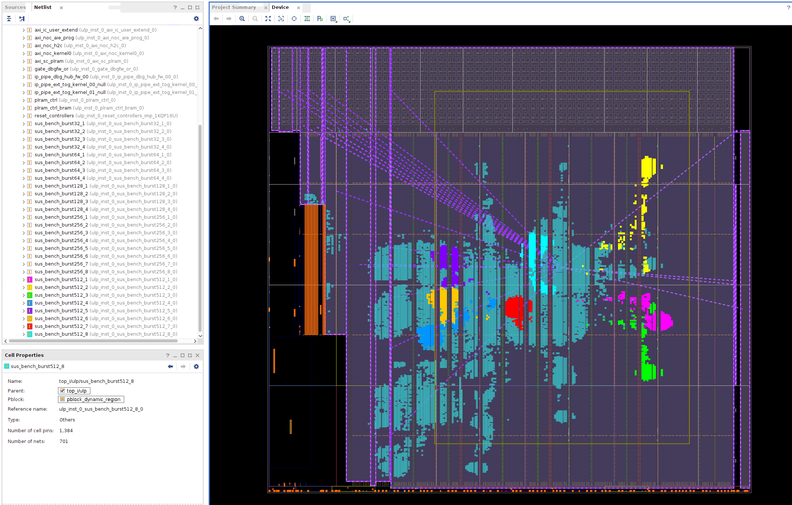
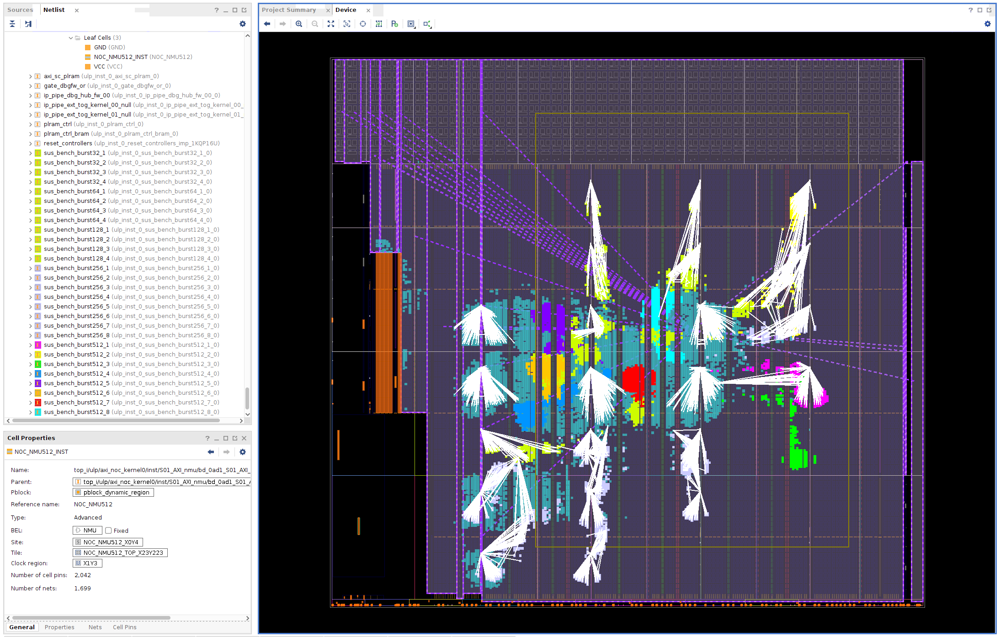

# Memory reader benchmark 355.2MHz, 4x 32bit, 4x 64bit 4x 128bit 8x 256bit 8x 512bit   - CACHING FLAG ENABLED


```
CONFLICTS WITH (x means lower total bandwidth)
  1 2 3 4 5 6 7 8
1   x x . . . . ?
2     x . x . . .
3       . . . . x
4         . . . .
5           x . .
6             . .
7               x
```

SECOND RUN:
```
CONFLICTS WITH(x means lower total bandwidth)
  1 2 3 4 5 6 7 8
1   x x x . . . ?
2     x . . . . .
3       ? . . . .
4         . . . .
5           x . .
6             . .
7               x
```

#### NOC doesn't directly connect to *all* accelerators? Perhaps too many NOC resources used? 




```
[lennartv@n2hacc03 sw]$ make main.x && ./main.x e ./bench_accel3.xclbin
g++ -g -std=c++17 -I/opt/software/FPGA/Xilinx/xrt/xrt_2.16/include -L/opt/software/FPGA/Xilinx/xrt/xrt_2.16/lib -lxrt_coreutil -pthread main.cpp -o main.x
Got VCK5000 in 0000:e1:00.1
device name:     xilinx_vck5000_gen4x8_qdma_base_2
device bdf:      0000:e1:00.1
Got XCLBIN
Making Buffer of 800000000 elements
Expected hash is 1078751232
Current AXIConfig:
  arsize        = 0
  arburst       = 0
  arprot        = 0
  arcache       = 2
  arqos         = 0
  arlock        = 0
  arregion      = 0
  max_in_flight = 2000
Starting Kernels
1 Parallel Kernels
    Time taken: 2.26809s, BW: 1.41088GB/s. Cycles used ratio: 0.993016
    sus_bench_burst32:{sus_bench_burst32_1} took 800000069 cycles for 800000000 transfers. 1 effective.
1 Parallel Kernels
    Time taken: 2.26794s, BW: 1.41097GB/s. Cycles used ratio: 0.993082
    sus_bench_burst32:{sus_bench_burst32_2} took 800000077 cycles for 800000000 transfers. 1 effective.
1 Parallel Kernels
    Time taken: 2.26792s, BW: 1.41099GB/s. Cycles used ratio: 0.993093
    sus_bench_burst32:{sus_bench_burst32_3} took 800000071 cycles for 800000000 transfers. 1 effective.
1 Parallel Kernels
    Time taken: 2.26808s, BW: 1.41089GB/s. Cycles used ratio: 0.993023
    sus_bench_burst32:{sus_bench_burst32_4} took 800000072 cycles for 800000000 transfers. 1 effective.
1 Parallel Kernels
    Time taken: 1.13421s, BW: 2.82135GB/s. Cycles used ratio: 0.992872
    sus_bench_burst64:{sus_bench_burst64_1} took 400000075 cycles for 400000000 transfers. 1 effective.
1 Parallel Kernels
    Time taken: 1.13421s, BW: 2.82134GB/s. Cycles used ratio: 0.992871
    sus_bench_burst64:{sus_bench_burst64_2} took 400000055 cycles for 400000000 transfers. 1 effective.
1 Parallel Kernels
    Time taken: 1.13414s, BW: 2.82151GB/s. Cycles used ratio: 0.992931
    sus_bench_burst64:{sus_bench_burst64_3} took 400000053 cycles for 400000000 transfers. 1 effective.
1 Parallel Kernels
    Time taken: 1.13411s, BW: 2.8216GB/s. Cycles used ratio: 0.992962
    sus_bench_burst64:{sus_bench_burst64_4} took 400000049 cycles for 400000000 transfers. 1 effective.
1 Parallel Kernels
    Time taken: 0.575771s, BW: 5.55777GB/s. Cycles used ratio: 0.97793
    sus_bench_burst128:{sus_bench_burst128_1} took 203057158 cycles for 200000000 transfers. 0.984944 effective.
1 Parallel Kernels
    Time taken: 0.575788s, BW: 5.5576GB/s. Cycles used ratio: 0.9779
    sus_bench_burst128:{sus_bench_burst128_2} took 203057693 cycles for 200000000 transfers. 0.984942 effective.
1 Parallel Kernels
    Time taken: 0.578706s, BW: 5.52958GB/s. Cycles used ratio: 0.972969
    sus_bench_burst128:{sus_bench_burst128_3} took 204031898 cycles for 200000000 transfers. 0.980239 effective.
1 Parallel Kernels
    Time taken: 0.577666s, BW: 5.53953GB/s. Cycles used ratio: 0.974721
    sus_bench_burst128:{sus_bench_burst128_4} took 203724934 cycles for 200000000 transfers. 0.981716 effective.
1 Parallel Kernels
    Time taken: 0.305021s, BW: 10.4911GB/s. Cycles used ratio: 0.92299
    sus_bench_burst256:{sus_bench_burst256_1} took 107486999 cycles for 100000000 transfers. 0.930345 effective.
1 Parallel Kernels
    Time taken: 0.304873s, BW: 10.4962GB/s. Cycles used ratio: 0.92344
    sus_bench_burst256:{sus_bench_burst256_2} took 107486667 cycles for 100000000 transfers. 0.930348 effective.
1 Parallel Kernels
    Time taken: 0.304874s, BW: 10.4961GB/s. Cycles used ratio: 0.923435
    sus_bench_burst256:{sus_bench_burst256_3} took 107486608 cycles for 100000000 transfers. 0.930348 effective.
1 Parallel Kernels
    Time taken: 0.304857s, BW: 10.4967GB/s. Cycles used ratio: 0.923486
    sus_bench_burst256:{sus_bench_burst256_4} took 107486732 cycles for 100000000 transfers. 0.930347 effective.
1 Parallel Kernels
    Time taken: 0.30487s, BW: 10.4963GB/s. Cycles used ratio: 0.923448
    sus_bench_burst256:{sus_bench_burst256_5} took 107486834 cycles for 100000000 transfers. 0.930347 effective.
1 Parallel Kernels
    Time taken: 0.305047s, BW: 10.4902GB/s. Cycles used ratio: 0.922913
    sus_bench_burst256:{sus_bench_burst256_6} took 107486971 cycles for 100000000 transfers. 0.930345 effective.
1 Parallel Kernels
    Time taken: 0.304836s, BW: 10.4974GB/s. Cycles used ratio: 0.923549
    sus_bench_burst256:{sus_bench_burst256_7} took 107487228 cycles for 100000000 transfers. 0.930343 effective.
1 Parallel Kernels
    Time taken: 0.304901s, BW: 10.4952GB/s. Cycles used ratio: 0.923354
    sus_bench_burst256:{sus_bench_burst256_8} took 107487182 cycles for 100000000 transfers. 0.930343 effective.
1 Parallel Kernels
    Time taken: 0.254115s, BW: 12.5927GB/s. Cycles used ratio: 0.553946
    sus_bench_burst512:{sus_bench_burst512_1} took 89572594 cycles for 50000000 transfers. 0.558206 effective.
1 Parallel Kernels
    Time taken: 0.254246s, BW: 12.5862GB/s. Cycles used ratio: 0.55366
    sus_bench_burst512:{sus_bench_burst512_2} took 89572578 cycles for 50000000 transfers. 0.558207 effective.
1 Parallel Kernels
    Time taken: 0.254083s, BW: 12.5943GB/s. Cycles used ratio: 0.554015
    sus_bench_burst512:{sus_bench_burst512_3} took 89571786 cycles for 50000000 transfers. 0.558211 effective.
1 Parallel Kernels
    Time taken: 0.236091s, BW: 13.5541GB/s. Cycles used ratio: 0.596235
    sus_bench_burst512:{sus_bench_burst512_4} took 83219311 cycles for 50000000 transfers. 0.600822 effective.
1 Parallel Kernels
    Time taken: 0.254249s, BW: 12.5861GB/s. Cycles used ratio: 0.553653
    sus_bench_burst512:{sus_bench_burst512_5} took 89572238 cycles for 50000000 transfers. 0.558209 effective.
1 Parallel Kernels
    Time taken: 0.254089s, BW: 12.594GB/s. Cycles used ratio: 0.554003
    sus_bench_burst512:{sus_bench_burst512_6} took 89570689 cycles for 50000000 transfers. 0.558218 effective.
1 Parallel Kernels
    Time taken: 0.234708s, BW: 13.634GB/s. Cycles used ratio: 0.59975
    sus_bench_burst512:{sus_bench_burst512_7} took 82734186 cycles for 50000000 transfers. 0.604345 effective.
1 Parallel Kernels
    Time taken: 0.254053s, BW: 12.5958GB/s. Cycles used ratio: 0.554079
    sus_bench_burst512:{sus_bench_burst512_8} took 89572205 cycles for 50000000 transfers. 0.558209 effective.
Starting 4x Parallel Kernels
4 Parallel Kernels
    Time taken: 2.26808s, BW: 5.64353GB/s. Cycles used ratio: 0.99302
    sus_bench_burst32:{sus_bench_burst32_1} took 800000075 cycles for 800000000 transfers. 1 effective.
    sus_bench_burst32:{sus_bench_burst32_2} took 800000072 cycles for 800000000 transfers. 1 effective.
    sus_bench_burst32:{sus_bench_burst32_3} took 800000066 cycles for 800000000 transfers. 1 effective.
    sus_bench_burst32:{sus_bench_burst32_4} took 800000067 cycles for 800000000 transfers. 1 effective.
4 Parallel Kernels
    Time taken: 1.13408s, BW: 11.2867GB/s. Cycles used ratio: 0.992985
    sus_bench_burst64:{sus_bench_burst64_1} took 400000080 cycles for 400000000 transfers. 1 effective.
    sus_bench_burst64:{sus_bench_burst64_2} took 400000050 cycles for 400000000 transfers. 1 effective.
    sus_bench_burst64:{sus_bench_burst64_3} took 400000043 cycles for 400000000 transfers. 1 effective.
    sus_bench_burst64:{sus_bench_burst64_4} took 400000046 cycles for 400000000 transfers. 1 effective.
4 Parallel Kernels
    Time taken: 0.582158s, BW: 21.9872GB/s. Cycles used ratio: 0.9672
    sus_bench_burst128:{sus_bench_burst128_1} took 204570529 cycles for 200000000 transfers. 0.977658 effective.
    sus_bench_burst128:{sus_bench_burst128_2} took 204176507 cycles for 200000000 transfers. 0.979545 effective.
    sus_bench_burst128:{sus_bench_burst128_3} took 205008987 cycles for 200000000 transfers. 0.975567 effective.
    sus_bench_burst128:{sus_bench_burst128_4} took 205255202 cycles for 200000000 transfers. 0.974397 effective.
4 Parallel Kernels
    Time taken: 0.419743s, BW: 30.4949GB/s. Cycles used ratio: 0.670724
    sus_bench_burst256:{sus_bench_burst256_1} took 147953491 cycles for 100000000 transfers. 0.675888 effective.
    sus_bench_burst256:{sus_bench_burst256_2} took 123918163 cycles for 100000000 transfers. 0.806984 effective.
    sus_bench_burst256:{sus_bench_burst256_3} took 123655515 cycles for 100000000 transfers. 0.808698 effective.
    sus_bench_burst256:{sus_bench_burst256_4} took 147948125 cycles for 100000000 transfers. 0.675913 effective.
4 Parallel Kernels
    Time taken: 0.422801s, BW: 30.2743GB/s. Cycles used ratio: 0.665872
    sus_bench_burst256:{sus_bench_burst256_5} took 149031426 cycles for 100000000 transfers. 0.670999 effective.
    sus_bench_burst256:{sus_bench_burst256_6} took 118749475 cycles for 100000000 transfers. 0.842109 effective.
    sus_bench_burst256:{sus_bench_burst256_7} took 122334381 cycles for 100000000 transfers. 0.817432 effective.
    sus_bench_burst256:{sus_bench_burst256_8} took 149027625 cycles for 100000000 transfers. 0.671017 effective.
4 Parallel Kernels
    Time taken: 0.61432s, BW: 20.8361GB/s. Cycles used ratio: 0.229141
    sus_bench_burst512:{sus_bench_burst512_1} took 208869065 cycles for 50000000 transfers. 0.239384 effective.
    sus_bench_burst512:{sus_bench_burst512_2} took 187895761 cycles for 50000000 transfers. 0.266105 effective.
    sus_bench_burst512:{sus_bench_burst512_3} took 216589465 cycles for 50000000 transfers. 0.230851 effective.
    sus_bench_burst512:{sus_bench_burst512_4} took 182996959 cycles for 50000000 transfers. 0.273229 effective.
Starting 1x-8x Parallel Kernels 256-bit
1 Parallel Kernels
    Time taken: 0.305017s, BW: 10.4912GB/s. Cycles used ratio: 0.923004
    sus_bench_burst256:{sus_bench_burst256_1} took 107486855 cycles for 100000000 transfers. 0.930346 effective.
2 Parallel Kernels
    Time taken: 0.304839s, BW: 20.9947GB/s. Cycles used ratio: 0.923542
    sus_bench_burst256:{sus_bench_burst256_1} took 107486910 cycles for 100000000 transfers. 0.930346 effective.
    sus_bench_burst256:{sus_bench_burst256_2} took 107486663 cycles for 100000000 transfers. 0.930348 effective.
3 Parallel Kernels
    Time taken: 0.332389s, BW: 28.8818GB/s. Cycles used ratio: 0.846995
    sus_bench_burst256:{sus_bench_burst256_1} took 117199667 cycles for 100000000 transfers. 0.853245 effective.
    sus_bench_burst256:{sus_bench_burst256_2} took 115129238 cycles for 100000000 transfers. 0.868589 effective.
    sus_bench_burst256:{sus_bench_burst256_3} took 114924634 cycles for 100000000 transfers. 0.870135 effective.
4 Parallel Kernels
    Time taken: 0.419039s, BW: 30.5461GB/s. Cycles used ratio: 0.671851
    sus_bench_burst256:{sus_bench_burst256_1} took 147765130 cycles for 100000000 transfers. 0.67675 effective.
    sus_bench_burst256:{sus_bench_burst256_2} took 125224208 cycles for 100000000 transfers. 0.798568 effective.
    sus_bench_burst256:{sus_bench_burst256_3} took 125003555 cycles for 100000000 transfers. 0.799977 effective.
    sus_bench_burst256:{sus_bench_burst256_4} took 147756650 cycles for 100000000 transfers. 0.676788 effective.
5 Parallel Kernels
    Time taken: 0.42454s, BW: 37.6879GB/s. Cycles used ratio: 0.663146
    sus_bench_burst256:{sus_bench_burst256_1} took 149704249 cycles for 100000000 transfers. 0.667984 effective.
    sus_bench_burst256:{sus_bench_burst256_2} took 131885817 cycles for 100000000 transfers. 0.758232 effective.
    sus_bench_burst256:{sus_bench_burst256_3} took 126064674 cycles for 100000000 transfers. 0.793244 effective.
    sus_bench_burst256:{sus_bench_burst256_4} took 149695716 cycles for 100000000 transfers. 0.668022 effective.
    sus_bench_burst256:{sus_bench_burst256_5} took 132235337 cycles for 100000000 transfers. 0.756228 effective.
6 Parallel Kernels
    Time taken: 0.605495s, BW: 31.7096GB/s. Cycles used ratio: 0.464961
    sus_bench_burst256:{sus_bench_burst256_1} took 213489252 cycles for 100000000 transfers. 0.468408 effective.
    sus_bench_burst256:{sus_bench_burst256_2} took 161025799 cycles for 100000000 transfers. 0.621018 effective.
    sus_bench_burst256:{sus_bench_burst256_3} took 201315771 cycles for 100000000 transfers. 0.496732 effective.
    sus_bench_burst256:{sus_bench_burst256_4} took 213488911 cycles for 100000000 transfers. 0.468408 effective.
    sus_bench_burst256:{sus_bench_burst256_5} took 161799684 cycles for 100000000 transfers. 0.618048 effective.
    sus_bench_burst256:{sus_bench_burst256_6} took 210475051 cycles for 100000000 transfers. 0.475116 effective.
7 Parallel Kernels
    Time taken: 0.613347s, BW: 36.5209GB/s. Cycles used ratio: 0.459009
    sus_bench_burst256:{sus_bench_burst256_1} took 216313039 cycles for 100000000 transfers. 0.462293 effective.
    sus_bench_burst256:{sus_bench_burst256_2} took 178721400 cycles for 100000000 transfers. 0.55953 effective.
    sus_bench_burst256:{sus_bench_burst256_3} took 203927277 cycles for 100000000 transfers. 0.490371 effective.
    sus_bench_burst256:{sus_bench_burst256_4} took 216312113 cycles for 100000000 transfers. 0.462295 effective.
    sus_bench_burst256:{sus_bench_burst256_5} took 179684805 cycles for 100000000 transfers. 0.55653 effective.
    sus_bench_burst256:{sus_bench_burst256_6} took 212989599 cycles for 100000000 transfers. 0.469506 effective.
    sus_bench_burst256:{sus_bench_burst256_7} took 215990651 cycles for 100000000 transfers. 0.462983 effective.
8 Parallel Kernels
    Time taken: 0.61579s, BW: 41.5726GB/s. Cycles used ratio: 0.457187
    sus_bench_burst256:{sus_bench_burst256_1} took 217115536 cycles for 100000000 transfers. 0.460584 effective.
    sus_bench_burst256:{sus_bench_burst256_2} took 189670755 cycles for 100000000 transfers. 0.527229 effective.
    sus_bench_burst256:{sus_bench_burst256_3} took 204798479 cycles for 100000000 transfers. 0.488285 effective.
    sus_bench_burst256:{sus_bench_burst256_4} took 217114945 cycles for 100000000 transfers. 0.460586 effective.
    sus_bench_burst256:{sus_bench_burst256_5} took 193605416 cycles for 100000000 transfers. 0.516514 effective.
    sus_bench_burst256:{sus_bench_burst256_6} took 213848041 cycles for 100000000 transfers. 0.467622 effective.
    sus_bench_burst256:{sus_bench_burst256_7} took 216746631 cycles for 100000000 transfers. 0.461368 effective.
    sus_bench_burst256:{sus_bench_burst256_8} took 193593855 cycles for 100000000 transfers. 0.516545 effective.
Starting 1x-8x Parallel Kernels 512-bit
1 Parallel Kernels
    Time taken: 0.25409s, BW: 12.594GB/s. Cycles used ratio: 0.554
    sus_bench_burst512:{sus_bench_burst512_1} took 89572329 cycles for 50000000 transfers. 0.558208 effective.
2 Parallel Kernels
    Time taken: 0.418274s, BW: 15.301GB/s. Cycles used ratio: 0.336539
    sus_bench_burst512:{sus_bench_burst512_1} took 147445168 cycles for 50000000 transfers. 0.339109 effective.
    sus_bench_burst512:{sus_bench_burst512_2} took 135523354 cycles for 50000000 transfers. 0.36894 effective.
3 Parallel Kernels
    Time taken: 0.610873s, BW: 15.7152GB/s. Cycles used ratio: 0.230434
    sus_bench_burst512:{sus_bench_burst512_1} took 206060774 cycles for 50000000 transfers. 0.242647 effective.
    sus_bench_burst512:{sus_bench_burst512_2} took 179354267 cycles for 50000000 transfers. 0.278778 effective.
    sus_bench_burst512:{sus_bench_burst512_3} took 215380819 cycles for 50000000 transfers. 0.232147 effective.
4 Parallel Kernels
    Time taken: 0.614342s, BW: 20.8353GB/s. Cycles used ratio: 0.229133
    sus_bench_burst512:{sus_bench_burst512_1} took 208882886 cycles for 50000000 transfers. 0.239369 effective.
    sus_bench_burst512:{sus_bench_burst512_2} took 188016282 cycles for 50000000 transfers. 0.265934 effective.
    sus_bench_burst512:{sus_bench_burst512_3} took 216591504 cycles for 50000000 transfers. 0.230849 effective.
    sus_bench_burst512:{sus_bench_burst512_4} took 183267921 cycles for 50000000 transfers. 0.272825 effective.
5 Parallel Kernels
    Time taken: 0.616804s, BW: 25.9402GB/s. Cycles used ratio: 0.228218
    sus_bench_burst512:{sus_bench_burst512_1} took 213474889 cycles for 50000000 transfers. 0.23422 effective.
    sus_bench_burst512:{sus_bench_burst512_2} took 192206789 cycles for 50000000 transfers. 0.260136 effective.
    sus_bench_burst512:{sus_bench_burst512_3} took 217469844 cycles for 50000000 transfers. 0.229917 effective.
    sus_bench_burst512:{sus_bench_burst512_4} took 190922775 cycles for 50000000 transfers. 0.261886 effective.
    sus_bench_burst512:{sus_bench_burst512_5} took 171550186 cycles for 50000000 transfers. 0.29146 effective.
6 Parallel Kernels
    Time taken: 0.617558s, BW: 31.0902GB/s. Cycles used ratio: 0.227939
    sus_bench_burst512:{sus_bench_burst512_1} took 214825434 cycles for 50000000 transfers. 0.232747 effective.
    sus_bench_burst512:{sus_bench_burst512_2} took 204027969 cycles for 50000000 transfers. 0.245064 effective.
    sus_bench_burst512:{sus_bench_burst512_3} took 217744201 cycles for 50000000 transfers. 0.229627 effective.
    sus_bench_burst512:{sus_bench_burst512_4} took 186774751 cycles for 50000000 transfers. 0.267702 effective.
    sus_bench_burst512:{sus_bench_burst512_5} took 187063264 cycles for 50000000 transfers. 0.267289 effective.
    sus_bench_burst512:{sus_bench_burst512_6} took 179303050 cycles for 50000000 transfers. 0.278857 effective.
7 Parallel Kernels
    Time taken: 0.61535s, BW: 36.4021GB/s. Cycles used ratio: 0.228757
    sus_bench_burst512:{sus_bench_burst512_1} took 216906690 cycles for 50000000 transfers. 0.230514 effective.
    sus_bench_burst512:{sus_bench_burst512_2} took 215599068 cycles for 50000000 transfers. 0.231912 effective.
    sus_bench_burst512:{sus_bench_burst512_3} took 217006382 cycles for 50000000 transfers. 0.230408 effective.
    sus_bench_burst512:{sus_bench_burst512_4} took 215228310 cycles for 50000000 transfers. 0.232311 effective.
    sus_bench_burst512:{sus_bench_burst512_5} took 187465351 cycles for 50000000 transfers. 0.266716 effective.
    sus_bench_burst512:{sus_bench_burst512_6} took 189470335 cycles for 50000000 transfers. 0.263894 effective.
    sus_bench_burst512:{sus_bench_burst512_7} took 215477288 cycles for 50000000 transfers. 0.232043 effective.
8 Parallel Kernels
    Time taken: 0.620197s, BW: 41.2772GB/s. Cycles used ratio: 0.22697
    sus_bench_burst512:{sus_bench_burst512_1} took 218163174 cycles for 50000000 transfers. 0.229186 effective.
    sus_bench_burst512:{sus_bench_burst512_2} took 215698140 cycles for 50000000 transfers. 0.231805 effective.
    sus_bench_burst512:{sus_bench_burst512_3} took 218728656 cycles for 50000000 transfers. 0.228594 effective.
    sus_bench_burst512:{sus_bench_burst512_4} took 216625975 cycles for 50000000 transfers. 0.230813 effective.
    sus_bench_burst512:{sus_bench_burst512_5} took 211485603 cycles for 50000000 transfers. 0.236423 effective.
    sus_bench_burst512:{sus_bench_burst512_6} took 188240381 cycles for 50000000 transfers. 0.265618 effective.
    sus_bench_burst512:{sus_bench_burst512_7} took 218009094 cycles for 50000000 transfers. 0.229348 effective.
    sus_bench_burst512:{sus_bench_burst512_8} took 214287585 cycles for 50000000 transfers. 0.233331 effective.
8x 256-bit PLUS 8x 512-bit
16 Parallel Kernels
    Time taken: 0.945086s, BW: 54.175GB/s. Cycles used ratio: 0.29789
    sus_bench_burst256:{sus_bench_burst256_1} took 301275013 cycles for 100000000 transfers. 0.331923 effective.
    sus_bench_burst512:{sus_bench_burst512_1} took 301775709 cycles for 50000000 transfers. 0.165686 effective.
    sus_bench_burst256:{sus_bench_burst256_2} took 315367089 cycles for 100000000 transfers. 0.317091 effective.
    sus_bench_burst512:{sus_bench_burst512_2} took 305911377 cycles for 50000000 transfers. 0.163446 effective.
    sus_bench_burst256:{sus_bench_burst256_3} took 292788668 cycles for 100000000 transfers. 0.341543 effective.
    sus_bench_burst512:{sus_bench_burst512_3} took 333316010 cycles for 50000000 transfers. 0.150008 effective.
    sus_bench_burst256:{sus_bench_burst256_4} took 301258204 cycles for 100000000 transfers. 0.331941 effective.
    sus_bench_burst512:{sus_bench_burst512_4} took 323348536 cycles for 50000000 transfers. 0.154632 effective.
    sus_bench_burst256:{sus_bench_burst256_5} took 330865471 cycles for 100000000 transfers. 0.302238 effective.
    sus_bench_burst512:{sus_bench_burst512_5} took 293445112 cycles for 50000000 transfers. 0.17039 effective.
    sus_bench_burst256:{sus_bench_burst256_6} took 293876693 cycles for 100000000 transfers. 0.340279 effective.
    sus_bench_burst512:{sus_bench_burst512_6} took 300925174 cycles for 50000000 transfers. 0.166154 effective.
    sus_bench_burst256:{sus_bench_burst256_7} took 305829392 cycles for 100000000 transfers. 0.32698 effective.
    sus_bench_burst512:{sus_bench_burst512_7} took 330868254 cycles for 50000000 transfers. 0.151118 effective.
    sus_bench_burst256:{sus_bench_burst256_8} took 330866327 cycles for 100000000 transfers. 0.302237 effective.
    sus_bench_burst512:{sus_bench_burst512_8} took 297677877 cycles for 50000000 transfers. 0.167967 effective.
ALL KERNELS
28 Parallel Kernels
    Time taken: 3.43944s, BW: 26.0508GB/s. Cycles used ratio: 0.654832
    sus_bench_burst32:{sus_bench_burst32_1} took 1172544420 cycles for 800000000 transfers. 0.682277 effective.
    sus_bench_burst32:{sus_bench_burst32_2} took 1113591066 cycles for 800000000 transfers. 0.718397 effective.
    sus_bench_burst32:{sus_bench_burst32_3} took 1213221099 cycles for 800000000 transfers. 0.659402 effective.
    sus_bench_burst32:{sus_bench_burst32_4} took 1196896853 cycles for 800000000 transfers. 0.668395 effective.
    sus_bench_burst64:{sus_bench_burst64_1} took 989251491 cycles for 400000000 transfers. 0.404346 effective.
    sus_bench_burst64:{sus_bench_burst64_2} took 657770896 cycles for 400000000 transfers. 0.608114 effective.
    sus_bench_burst64:{sus_bench_burst64_3} took 615893178 cycles for 400000000 transfers. 0.649463 effective.
    sus_bench_burst64:{sus_bench_burst64_4} took 615929660 cycles for 400000000 transfers. 0.649425 effective.
    sus_bench_burst128:{sus_bench_burst128_1} took 583763147 cycles for 200000000 transfers. 0.342605 effective.
    sus_bench_burst128:{sus_bench_burst128_2} took 475302248 cycles for 200000000 transfers. 0.420785 effective.
    sus_bench_burst128:{sus_bench_burst128_3} took 443887799 cycles for 200000000 transfers. 0.450564 effective.
    sus_bench_burst128:{sus_bench_burst128_4} took 414586073 cycles for 200000000 transfers. 0.482409 effective.
    sus_bench_burst256:{sus_bench_burst256_1} took 550880985 cycles for 100000000 transfers. 0.181527 effective.
    sus_bench_burst256:{sus_bench_burst256_2} took 394046392 cycles for 100000000 transfers. 0.253777 effective.
    sus_bench_burst256:{sus_bench_burst256_3} took 367767437 cycles for 100000000 transfers. 0.271911 effective.
    sus_bench_burst256:{sus_bench_burst256_4} took 550610580 cycles for 100000000 transfers. 0.181617 effective.
    sus_bench_burst256:{sus_bench_burst256_5} took 457686259 cycles for 100000000 transfers. 0.21849 effective.
    sus_bench_burst256:{sus_bench_burst256_6} took 384224206 cycles for 100000000 transfers. 0.260265 effective.
    sus_bench_burst256:{sus_bench_burst256_7} took 594802972 cycles for 100000000 transfers. 0.168123 effective.
    sus_bench_burst256:{sus_bench_burst256_8} took 457762138 cycles for 100000000 transfers. 0.218454 effective.
    sus_bench_burst512:{sus_bench_burst512_1} took 413333365 cycles for 50000000 transfers. 0.120968 effective.
    sus_bench_burst512:{sus_bench_burst512_2} took 595485546 cycles for 50000000 transfers. 0.0839651 effective.
    sus_bench_burst512:{sus_bench_burst512_3} took 465922225 cycles for 50000000 transfers. 0.107314 effective.
    sus_bench_burst512:{sus_bench_burst512_4} took 465877861 cycles for 50000000 transfers. 0.107324 effective.
    sus_bench_burst512:{sus_bench_burst512_5} took 406924274 cycles for 50000000 transfers. 0.122873 effective.
    sus_bench_burst512:{sus_bench_burst512_6} took 506554081 cycles for 50000000 transfers. 0.0987061 effective.
    sus_bench_burst512:{sus_bench_burst512_7} took 490230327 cycles for 50000000 transfers. 0.101993 effective.
    sus_bench_burst512:{sus_bench_burst512_8} took 471125971 cycles for 50000000 transfers. 0.106129 effective.
ALL MEMORY HASHES MATCHED CORRECT ANSWER 1078751232
```


# Memory reader benchmark 355.2MHz, 4x 32bit, 4x 64bit 4x 128bit 8x 256bit 8x 512bit   - CACHING FLAG DISABLED
```
[lennartv@n2hacc03 sw]$ make main.x && ./main.x e ./bench_accel3.xclbin
g++ -g -std=c++17 -I/opt/software/FPGA/Xilinx/xrt/xrt_2.16/include -L/opt/software/FPGA/Xilinx/xrt/xrt_2.16/lib -lxrt_coreutil -pthread main.cpp -o main.x
main.cpp: In function ‘int main(int, const char**)’:
main.cpp:352:66: warning: narrowing conversion of ‘(kernel_id_a + 20)’ from ‘int’ to ‘long unsigned int’ [-Wnarrowing]
  352 |             run_parallel_kernels(std::vector<size_t>{kernel_id_a + 20, kernel_id_b + 20}, config);
      |                                                      ~~~~~~~~~~~~^~~~
main.cpp:352:66: warning: narrowing conversion of ‘(kernel_id_a + 20)’ from ‘int’ to ‘long unsigned int’ [-Wnarrowing]
main.cpp:352:84: warning: narrowing conversion of ‘(kernel_id_b + 20)’ from ‘int’ to ‘long unsigned int’ [-Wnarrowing]
  352 |             run_parallel_kernels(std::vector<size_t>{kernel_id_a + 20, kernel_id_b + 20}, config);
      |                                                                        ~~~~~~~~~~~~^~~~
main.cpp:352:84: warning: narrowing conversion of ‘(kernel_id_b + 20)’ from ‘int’ to ‘long unsigned int’ [-Wnarrowing]
Got VCK5000 in 0000:e1:00.1
device name:     xilinx_vck5000_gen4x8_qdma_base_2
device bdf:      0000:e1:00.1
Got XCLBIN
Making Buffer of 800000000 elements
Expected hash is 1078751232
Current AXIConfig:
  arsize        = 0
  arburst       = 0
  arprot        = 0
  arcache       = 0
  arqos         = 0
  arlock        = 0
  arregion      = 0
  max_in_flight = 2000
Starting Kernels
1 Parallel Kernels
    Time taken: 2.26813s, BW: 1.41085GB/s. Cycles used ratio: 0.993
    sus_bench_burst32:{sus_bench_burst32_1} took 800000074 cycles for 800000000 transfers. 1 effective.
1 Parallel Kernels
    Time taken: 2.26807s, BW: 1.41089GB/s. Cycles used ratio: 0.993026
    sus_bench_burst32:{sus_bench_burst32_2} took 800000072 cycles for 800000000 transfers. 1 effective.
1 Parallel Kernels
    Time taken: 2.26794s, BW: 1.41097GB/s. Cycles used ratio: 0.993084
    sus_bench_burst32:{sus_bench_burst32_3} took 800000071 cycles for 800000000 transfers. 1 effective.
1 Parallel Kernels
    Time taken: 2.26805s, BW: 1.4109GB/s. Cycles used ratio: 0.993034
    sus_bench_burst32:{sus_bench_burst32_4} took 800000077 cycles for 800000000 transfers. 1 effective.
1 Parallel Kernels
    Time taken: 1.1342s, BW: 2.82138GB/s. Cycles used ratio: 0.992884
    sus_bench_burst64:{sus_bench_burst64_1} took 400000075 cycles for 400000000 transfers. 1 effective.
1 Parallel Kernels
    Time taken: 1.13419s, BW: 2.8214GB/s. Cycles used ratio: 0.99289
    sus_bench_burst64:{sus_bench_burst64_2} took 400000055 cycles for 400000000 transfers. 1 effective.
1 Parallel Kernels
    Time taken: 1.13422s, BW: 2.82133GB/s. Cycles used ratio: 0.992866
    sus_bench_burst64:{sus_bench_burst64_3} took 400000048 cycles for 400000000 transfers. 1 effective.
1 Parallel Kernels
    Time taken: 1.13419s, BW: 2.82139GB/s. Cycles used ratio: 0.992889
    sus_bench_burst64:{sus_bench_burst64_4} took 400000049 cycles for 400000000 transfers. 1 effective.
1 Parallel Kernels
    Time taken: 0.575942s, BW: 5.55612GB/s. Cycles used ratio: 0.977639
    sus_bench_burst128:{sus_bench_burst128_1} took 203057589 cycles for 200000000 transfers. 0.984942 effective.
1 Parallel Kernels
    Time taken: 0.575791s, BW: 5.55757GB/s. Cycles used ratio: 0.977894
    sus_bench_burst128:{sus_bench_burst128_2} took 203057095 cycles for 200000000 transfers. 0.984945 effective.
1 Parallel Kernels
    Time taken: 0.578689s, BW: 5.52974GB/s. Cycles used ratio: 0.972998
    sus_bench_burst128:{sus_bench_burst128_3} took 204030684 cycles for 200000000 transfers. 0.980245 effective.
1 Parallel Kernels
    Time taken: 0.577668s, BW: 5.53951GB/s. Cycles used ratio: 0.974717
    sus_bench_burst128:{sus_bench_burst128_4} took 203725140 cycles for 200000000 transfers. 0.981715 effective.
1 Parallel Kernels
    Time taken: 0.304887s, BW: 10.4957GB/s. Cycles used ratio: 0.923396
    sus_bench_burst256:{sus_bench_burst256_1} took 107486643 cycles for 100000000 transfers. 0.930348 effective.
1 Parallel Kernels
    Time taken: 0.304855s, BW: 10.4968GB/s. Cycles used ratio: 0.923494
    sus_bench_burst256:{sus_bench_burst256_2} took 107487112 cycles for 100000000 transfers. 0.930344 effective.
1 Parallel Kernels
    Time taken: 0.304856s, BW: 10.4968GB/s. Cycles used ratio: 0.92349
    sus_bench_burst256:{sus_bench_burst256_3} took 107486896 cycles for 100000000 transfers. 0.930346 effective.
1 Parallel Kernels
    Time taken: 0.304896s, BW: 10.4954GB/s. Cycles used ratio: 0.923368
    sus_bench_burst256:{sus_bench_burst256_4} took 107487001 cycles for 100000000 transfers. 0.930345 effective.
1 Parallel Kernels
    Time taken: 0.304882s, BW: 10.4959GB/s. Cycles used ratio: 0.923412
    sus_bench_burst256:{sus_bench_burst256_5} took 107486822 cycles for 100000000 transfers. 0.930347 effective.
1 Parallel Kernels
    Time taken: 0.304871s, BW: 10.4962GB/s. Cycles used ratio: 0.923444
    sus_bench_burst256:{sus_bench_burst256_6} took 107486942 cycles for 100000000 transfers. 0.930346 effective.
1 Parallel Kernels
    Time taken: 0.304874s, BW: 10.4961GB/s. Cycles used ratio: 0.923435
    sus_bench_burst256:{sus_bench_burst256_7} took 107487022 cycles for 100000000 transfers. 0.930345 effective.
1 Parallel Kernels
    Time taken: 0.304862s, BW: 10.4965GB/s. Cycles used ratio: 0.923471
    sus_bench_burst256:{sus_bench_burst256_8} took 107486896 cycles for 100000000 transfers. 0.930346 effective.
1 Parallel Kernels
    Time taken: 0.254097s, BW: 12.5936GB/s. Cycles used ratio: 0.553984
    sus_bench_burst512:{sus_bench_burst512_1} took 89572455 cycles for 50000000 transfers. 0.558207 effective.
1 Parallel Kernels
    Time taken: 0.254219s, BW: 12.5875GB/s. Cycles used ratio: 0.553717
    sus_bench_burst512:{sus_bench_burst512_2} took 89573230 cycles for 50000000 transfers. 0.558202 effective.
1 Parallel Kernels
    Time taken: 0.254243s, BW: 12.5864GB/s. Cycles used ratio: 0.553665
    sus_bench_burst512:{sus_bench_burst512_3} took 89571305 cycles for 50000000 transfers. 0.558214 effective.
1 Parallel Kernels
    Time taken: 0.236255s, BW: 13.5447GB/s. Cycles used ratio: 0.595822
    sus_bench_burst512:{sus_bench_burst512_4} took 83223849 cycles for 50000000 transfers. 0.600789 effective.
1 Parallel Kernels
    Time taken: 0.254219s, BW: 12.5876GB/s. Cycles used ratio: 0.553719
    sus_bench_burst512:{sus_bench_burst512_5} took 89572578 cycles for 50000000 transfers. 0.558207 effective.
1 Parallel Kernels
    Time taken: 0.254045s, BW: 12.5962GB/s. Cycles used ratio: 0.554098
    sus_bench_burst512:{sus_bench_burst512_6} took 89570943 cycles for 50000000 transfers. 0.558217 effective.
1 Parallel Kernels
    Time taken: 0.234845s, BW: 13.626GB/s. Cycles used ratio: 0.599399
    sus_bench_burst512:{sus_bench_burst512_7} took 82736662 cycles for 50000000 transfers. 0.604327 effective.
1 Parallel Kernels
    Time taken: 0.254254s, BW: 12.5858GB/s. Cycles used ratio: 0.553643
    sus_bench_burst512:{sus_bench_burst512_8} took 89572528 cycles for 50000000 transfers. 0.558207 effective.
Starting 4x Parallel Kernels
4 Parallel Kernels
    Time taken: 2.26857s, BW: 5.64232GB/s. Cycles used ratio: 0.992806
    sus_bench_burst32:{sus_bench_burst32_1} took 800000074 cycles for 800000000 transfers. 1 effective.
    sus_bench_burst32:{sus_bench_burst32_2} took 800000067 cycles for 800000000 transfers. 1 effective.
    sus_bench_burst32:{sus_bench_burst32_3} took 800000076 cycles for 800000000 transfers. 1 effective.
    sus_bench_burst32:{sus_bench_burst32_4} took 800000148 cycles for 800000000 transfers. 1 effective.
4 Parallel Kernels
    Time taken: 1.13423s, BW: 11.2852GB/s. Cycles used ratio: 0.992858
    sus_bench_burst64:{sus_bench_burst64_1} took 400000075 cycles for 400000000 transfers. 1 effective.
    sus_bench_burst64:{sus_bench_burst64_2} took 400000050 cycles for 400000000 transfers. 1 effective.
    sus_bench_burst64:{sus_bench_burst64_3} took 400000043 cycles for 400000000 transfers. 1 effective.
    sus_bench_burst64:{sus_bench_burst64_4} took 400000044 cycles for 400000000 transfers. 1 effective.
4 Parallel Kernels
    Time taken: 0.582243s, BW: 21.9839GB/s. Cycles used ratio: 0.967058
    sus_bench_burst128:{sus_bench_burst128_1} took 204569717 cycles for 200000000 transfers. 0.977662 effective.
    sus_bench_burst128:{sus_bench_burst128_2} took 204157151 cycles for 200000000 transfers. 0.979637 effective.
    sus_bench_burst128:{sus_bench_burst128_3} took 205019135 cycles for 200000000 transfers. 0.975519 effective.
    sus_bench_burst128:{sus_bench_burst128_4} took 205273875 cycles for 200000000 transfers. 0.974308 effective.
4 Parallel Kernels
    Time taken: 0.419949s, BW: 30.4799GB/s. Cycles used ratio: 0.670394
    sus_bench_burst256:{sus_bench_burst256_1} took 147892636 cycles for 100000000 transfers. 0.676166 effective.
    sus_bench_burst256:{sus_bench_burst256_2} took 124939967 cycles for 100000000 transfers. 0.800384 effective.
    sus_bench_burst256:{sus_bench_burst256_3} took 124754508 cycles for 100000000 transfers. 0.801574 effective.
    sus_bench_burst256:{sus_bench_burst256_4} took 147879099 cycles for 100000000 transfers. 0.676228 effective.
4 Parallel Kernels
    Time taken: 0.423098s, BW: 30.2531GB/s. Cycles used ratio: 0.665406
    sus_bench_burst256:{sus_bench_burst256_5} took 149155216 cycles for 100000000 transfers. 0.670443 effective.
    sus_bench_burst256:{sus_bench_burst256_6} took 118966292 cycles for 100000000 transfers. 0.840574 effective.
    sus_bench_burst256:{sus_bench_burst256_7} took 122481210 cycles for 100000000 transfers. 0.816452 effective.
    sus_bench_burst256:{sus_bench_burst256_8} took 149148093 cycles for 100000000 transfers. 0.670475 effective.
4 Parallel Kernels
    Time taken: 0.61418s, BW: 20.8408GB/s. Cycles used ratio: 0.229193
    sus_bench_burst512:{sus_bench_burst512_1} took 208791755 cycles for 50000000 transfers. 0.239473 effective.
    sus_bench_burst512:{sus_bench_burst512_2} took 187786988 cycles for 50000000 transfers. 0.266259 effective.
    sus_bench_burst512:{sus_bench_burst512_3} took 216583211 cycles for 50000000 transfers. 0.230858 effective.
    sus_bench_burst512:{sus_bench_burst512_4} took 182883349 cycles for 50000000 transfers. 0.273398 effective.
Starting 1x-8x Parallel Kernels 256-bit
1 Parallel Kernels
    Time taken: 0.305015s, BW: 10.4913GB/s. Cycles used ratio: 0.923008
    sus_bench_burst256:{sus_bench_burst256_1} took 107486902 cycles for 100000000 transfers. 0.930346 effective.
2 Parallel Kernels
    Time taken: 0.305029s, BW: 20.9816GB/s. Cycles used ratio: 0.922967
    sus_bench_burst256:{sus_bench_burst256_1} took 107487039 cycles for 100000000 transfers. 0.930345 effective.
    sus_bench_burst256:{sus_bench_burst256_2} took 107487420 cycles for 100000000 transfers. 0.930341 effective.
3 Parallel Kernels
    Time taken: 0.330928s, BW: 29.0093GB/s. Cycles used ratio: 0.850733
    sus_bench_burst256:{sus_bench_burst256_1} took 116684626 cycles for 100000000 transfers. 0.857011 effective.
    sus_bench_burst256:{sus_bench_burst256_2} took 114765947 cycles for 100000000 transfers. 0.871339 effective.
    sus_bench_burst256:{sus_bench_burst256_3} took 114633230 cycles for 100000000 transfers. 0.872347 effective.
4 Parallel Kernels
    Time taken: 0.419606s, BW: 30.5048GB/s. Cycles used ratio: 0.670943
    sus_bench_burst256:{sus_bench_burst256_1} took 147905774 cycles for 100000000 transfers. 0.676106 effective.
    sus_bench_burst256:{sus_bench_burst256_2} took 126003480 cycles for 100000000 transfers. 0.793629 effective.
    sus_bench_burst256:{sus_bench_burst256_3} took 125749414 cycles for 100000000 transfers. 0.795232 effective.
    sus_bench_burst256:{sus_bench_burst256_4} took 147897478 cycles for 100000000 transfers. 0.676144 effective.
5 Parallel Kernels
    Time taken: 0.424674s, BW: 37.676GB/s. Cycles used ratio: 0.662936
    sus_bench_burst256:{sus_bench_burst256_1} took 149748061 cycles for 100000000 transfers. 0.667788 effective.
    sus_bench_burst256:{sus_bench_burst256_2} took 131582859 cycles for 100000000 transfers. 0.759977 effective.
    sus_bench_burst256:{sus_bench_burst256_3} took 125745177 cycles for 100000000 transfers. 0.795259 effective.
    sus_bench_burst256:{sus_bench_burst256_4} took 149738891 cycles for 100000000 transfers. 0.667829 effective.
    sus_bench_burst256:{sus_bench_burst256_5} took 131962728 cycles for 100000000 transfers. 0.75779 effective.
6 Parallel Kernels
    Time taken: 0.605715s, BW: 31.6981GB/s. Cycles used ratio: 0.464792
    sus_bench_burst256:{sus_bench_burst256_1} took 213562182 cycles for 100000000 transfers. 0.468248 effective.
    sus_bench_burst256:{sus_bench_burst256_2} took 161414009 cycles for 100000000 transfers. 0.619525 effective.
    sus_bench_burst256:{sus_bench_burst256_3} took 201482609 cycles for 100000000 transfers. 0.496321 effective.
    sus_bench_burst256:{sus_bench_burst256_4} took 213561730 cycles for 100000000 transfers. 0.468249 effective.
    sus_bench_burst256:{sus_bench_burst256_5} took 162084393 cycles for 100000000 transfers. 0.616963 effective.
    sus_bench_burst256:{sus_bench_burst256_6} took 210478582 cycles for 100000000 transfers. 0.475108 effective.
7 Parallel Kernels
    Time taken: 0.613372s, BW: 36.5195GB/s. Cycles used ratio: 0.45899
    sus_bench_burst256:{sus_bench_burst256_1} took 216263030 cycles for 100000000 transfers. 0.4624 effective.
    sus_bench_burst256:{sus_bench_burst256_2} took 178137022 cycles for 100000000 transfers. 0.561366 effective.
    sus_bench_burst256:{sus_bench_burst256_3} took 203651854 cycles for 100000000 transfers. 0.491034 effective.
    sus_bench_burst256:{sus_bench_burst256_4} took 216262900 cycles for 100000000 transfers. 0.4624 effective.
    sus_bench_burst256:{sus_bench_burst256_5} took 179145558 cycles for 100000000 transfers. 0.558205 effective.
    sus_bench_burst256:{sus_bench_burst256_6} took 212921948 cycles for 100000000 transfers. 0.469656 effective.
    sus_bench_burst256:{sus_bench_burst256_7} took 215941672 cycles for 100000000 transfers. 0.463088 effective.
8 Parallel Kernels
    Time taken: 0.615602s, BW: 41.5853GB/s. Cycles used ratio: 0.457327
    sus_bench_burst256:{sus_bench_burst256_1} took 217046725 cycles for 100000000 transfers. 0.46073 effective.
    sus_bench_burst256:{sus_bench_burst256_2} took 190436144 cycles for 100000000 transfers. 0.52511 effective.
    sus_bench_burst256:{sus_bench_burst256_3} took 205229606 cycles for 100000000 transfers. 0.487259 effective.
    sus_bench_burst256:{sus_bench_burst256_4} took 217047096 cycles for 100000000 transfers. 0.460729 effective.
    sus_bench_burst256:{sus_bench_burst256_5} took 195065935 cycles for 100000000 transfers. 0.512647 effective.
    sus_bench_burst256:{sus_bench_burst256_6} took 213832538 cycles for 100000000 transfers. 0.467656 effective.
    sus_bench_burst256:{sus_bench_burst256_7} took 216703243 cycles for 100000000 transfers. 0.461461 effective.
    sus_bench_burst256:{sus_bench_burst256_8} took 194783072 cycles for 100000000 transfers. 0.513392 effective.
Starting 1x-8x Parallel Kernels 512-bit
1 Parallel Kernels
    Time taken: 0.254228s, BW: 12.5871GB/s. Cycles used ratio: 0.553698
    sus_bench_burst512:{sus_bench_burst512_1} took 89572210 cycles for 50000000 transfers. 0.558209 effective.
2 Parallel Kernels
    Time taken: 0.418232s, BW: 15.3025GB/s. Cycles used ratio: 0.336574
    sus_bench_burst512:{sus_bench_burst512_1} took 147431672 cycles for 50000000 transfers. 0.33914 effective.
    sus_bench_burst512:{sus_bench_burst512_2} took 135489941 cycles for 50000000 transfers. 0.369031 effective.
3 Parallel Kernels
    Time taken: 0.610899s, BW: 15.7145GB/s. Cycles used ratio: 0.230424
    sus_bench_burst512:{sus_bench_burst512_1} took 206089840 cycles for 50000000 transfers. 0.242613 effective.
    sus_bench_burst512:{sus_bench_burst512_2} took 179327391 cycles for 50000000 transfers. 0.27882 effective.
    sus_bench_burst512:{sus_bench_burst512_3} took 215394249 cycles for 50000000 transfers. 0.232132 effective.
4 Parallel Kernels
    Time taken: 0.614318s, BW: 20.8361GB/s. Cycles used ratio: 0.229141
    sus_bench_burst512:{sus_bench_burst512_1} took 208822558 cycles for 50000000 transfers. 0.239438 effective.
    sus_bench_burst512:{sus_bench_burst512_2} took 187811665 cycles for 50000000 transfers. 0.266224 effective.
    sus_bench_burst512:{sus_bench_burst512_3} took 216594746 cycles for 50000000 transfers. 0.230846 effective.
    sus_bench_burst512:{sus_bench_burst512_4} took 183038128 cycles for 50000000 transfers. 0.273167 effective.
5 Parallel Kernels
    Time taken: 0.616732s, BW: 25.9432GB/s. Cycles used ratio: 0.228245
    sus_bench_burst512:{sus_bench_burst512_1} took 213456044 cycles for 50000000 transfers. 0.23424 effective.
    sus_bench_burst512:{sus_bench_burst512_2} took 191984973 cycles for 50000000 transfers. 0.260437 effective.
    sus_bench_burst512:{sus_bench_burst512_3} took 217451978 cycles for 50000000 transfers. 0.229936 effective.
    sus_bench_burst512:{sus_bench_burst512_4} took 190754474 cycles for 50000000 transfers. 0.262117 effective.
    sus_bench_burst512:{sus_bench_burst512_5} took 171582938 cycles for 50000000 transfers. 0.291404 effective.
6 Parallel Kernels
    Time taken: 0.617406s, BW: 31.0979GB/s. Cycles used ratio: 0.227996
    sus_bench_burst512:{sus_bench_burst512_1} took 214808765 cycles for 50000000 transfers. 0.232765 effective.
    sus_bench_burst512:{sus_bench_burst512_2} took 203979765 cycles for 50000000 transfers. 0.245122 effective.
    sus_bench_burst512:{sus_bench_burst512_3} took 217744171 cycles for 50000000 transfers. 0.229627 effective.
    sus_bench_burst512:{sus_bench_burst512_4} took 186635714 cycles for 50000000 transfers. 0.267902 effective.
    sus_bench_burst512:{sus_bench_burst512_5} took 186931228 cycles for 50000000 transfers. 0.267478 effective.
    sus_bench_burst512:{sus_bench_burst512_6} took 179197540 cycles for 50000000 transfers. 0.279022 effective.
7 Parallel Kernels
    Time taken: 0.616082s, BW: 36.3588GB/s. Cycles used ratio: 0.228486
    sus_bench_burst512:{sus_bench_burst512_1} took 217068750 cycles for 50000000 transfers. 0.230342 effective.
    sus_bench_burst512:{sus_bench_burst512_2} took 215686400 cycles for 50000000 transfers. 0.231818 effective.
    sus_bench_burst512:{sus_bench_burst512_3} took 217215434 cycles for 50000000 transfers. 0.230186 effective.
    sus_bench_burst512:{sus_bench_burst512_4} took 215041929 cycles for 50000000 transfers. 0.232513 effective.
    sus_bench_burst512:{sus_bench_burst512_5} took 187580024 cycles for 50000000 transfers. 0.266553 effective.
    sus_bench_burst512:{sus_bench_burst512_6} took 189696300 cycles for 50000000 transfers. 0.263579 effective.
    sus_bench_burst512:{sus_bench_burst512_7} took 215339840 cycles for 50000000 transfers. 0.232191 effective.
8 Parallel Kernels
    Time taken: 0.620443s, BW: 41.2609GB/s. Cycles used ratio: 0.22688
    sus_bench_burst512:{sus_bench_burst512_1} took 218146275 cycles for 50000000 transfers. 0.229204 effective.
    sus_bench_burst512:{sus_bench_burst512_2} took 215575542 cycles for 50000000 transfers. 0.231937 effective.
    sus_bench_burst512:{sus_bench_burst512_3} took 218768951 cycles for 50000000 transfers. 0.228552 effective.
    sus_bench_burst512:{sus_bench_burst512_4} took 216553228 cycles for 50000000 transfers. 0.23089 effective.
    sus_bench_burst512:{sus_bench_burst512_5} took 211254370 cycles for 50000000 transfers. 0.236681 effective.
    sus_bench_burst512:{sus_bench_burst512_6} took 188159822 cycles for 50000000 transfers. 0.265732 effective.
    sus_bench_burst512:{sus_bench_burst512_7} took 218007016 cycles for 50000000 transfers. 0.22935 effective.
    sus_bench_burst512:{sus_bench_burst512_8} took 214116087 cycles for 50000000 transfers. 0.233518 effective.
8x 256-bit PLUS 8x 512-bit
16 Parallel Kernels
    Time taken: 0.945179s, BW: 54.1696GB/s. Cycles used ratio: 0.297861
    sus_bench_burst256:{sus_bench_burst256_1} took 301213548 cycles for 100000000 transfers. 0.33199 effective.
    sus_bench_burst512:{sus_bench_burst512_1} took 301755413 cycles for 50000000 transfers. 0.165697 effective.
    sus_bench_burst256:{sus_bench_burst256_2} took 315367252 cycles for 100000000 transfers. 0.317091 effective.
    sus_bench_burst512:{sus_bench_burst512_2} took 306060342 cycles for 50000000 transfers. 0.163366 effective.
    sus_bench_burst256:{sus_bench_burst256_3} took 292758696 cycles for 100000000 transfers. 0.341578 effective.
    sus_bench_burst512:{sus_bench_burst512_3} took 333309301 cycles for 50000000 transfers. 0.150011 effective.
    sus_bench_burst256:{sus_bench_burst256_4} took 301195343 cycles for 100000000 transfers. 0.33201 effective.
    sus_bench_burst512:{sus_bench_burst512_4} took 323344703 cycles for 50000000 transfers. 0.154634 effective.
    sus_bench_burst256:{sus_bench_burst256_5} took 330816467 cycles for 100000000 transfers. 0.302282 effective.
    sus_bench_burst512:{sus_bench_burst512_5} took 293466134 cycles for 50000000 transfers. 0.170377 effective.
    sus_bench_burst256:{sus_bench_burst256_6} took 293840204 cycles for 100000000 transfers. 0.340321 effective.
    sus_bench_burst512:{sus_bench_burst512_6} took 300932085 cycles for 50000000 transfers. 0.16615 effective.
    sus_bench_burst256:{sus_bench_burst256_7} took 305991536 cycles for 100000000 transfers. 0.326806 effective.
    sus_bench_burst512:{sus_bench_burst512_7} took 330819708 cycles for 50000000 transfers. 0.15114 effective.
    sus_bench_burst256:{sus_bench_burst256_8} took 330815718 cycles for 100000000 transfers. 0.302283 effective.
    sus_bench_burst512:{sus_bench_burst512_8} took 297633643 cycles for 50000000 transfers. 0.167992 effective.
ALL KERNELS
28 Parallel Kernels
    Time taken: 3.43595s, BW: 26.0772GB/s. Cycles used ratio: 0.655497
    sus_bench_burst32:{sus_bench_burst32_1} took 1171960806 cycles for 800000000 transfers. 0.682617 effective.
    sus_bench_burst32:{sus_bench_burst32_2} took 1112804909 cycles for 800000000 transfers. 0.718904 effective.
    sus_bench_burst32:{sus_bench_burst32_3} took 1211997650 cycles for 800000000 transfers. 0.660067 effective.
    sus_bench_burst32:{sus_bench_burst32_4} took 1195959163 cycles for 800000000 transfers. 0.668919 effective.
    sus_bench_burst64:{sus_bench_burst64_1} took 1006281736 cycles for 400000000 transfers. 0.397503 effective.
    sus_bench_burst64:{sus_bench_burst64_2} took 645576028 cycles for 400000000 transfers. 0.619602 effective.
    sus_bench_burst64:{sus_bench_burst64_3} took 607813506 cycles for 400000000 transfers. 0.658097 effective.
    sus_bench_burst64:{sus_bench_burst64_4} took 607862811 cycles for 400000000 transfers. 0.658043 effective.
    sus_bench_burst128:{sus_bench_burst128_1} took 569950157 cycles for 200000000 transfers. 0.350908 effective.
    sus_bench_burst128:{sus_bench_burst128_2} took 475285017 cycles for 200000000 transfers. 0.4208 effective.
    sus_bench_burst128:{sus_bench_burst128_3} took 443567984 cycles for 200000000 transfers. 0.450889 effective.
    sus_bench_burst128:{sus_bench_burst128_4} took 415522564 cycles for 200000000 transfers. 0.481322 effective.
    sus_bench_burst256:{sus_bench_burst256_1} took 544284287 cycles for 100000000 transfers. 0.183728 effective.
    sus_bench_burst256:{sus_bench_burst256_2} took 393778391 cycles for 100000000 transfers. 0.25395 effective.
    sus_bench_burst256:{sus_bench_burst256_3} took 367101141 cycles for 100000000 transfers. 0.272404 effective.
    sus_bench_burst256:{sus_bench_burst256_4} took 544051748 cycles for 100000000 transfers. 0.183806 effective.
    sus_bench_burst256:{sus_bench_burst256_5} took 457347680 cycles for 100000000 transfers. 0.218652 effective.
    sus_bench_burst256:{sus_bench_burst256_6} took 384510435 cycles for 100000000 transfers. 0.260071 effective.
    sus_bench_burst256:{sus_bench_burst256_7} took 578467803 cycles for 100000000 transfers. 0.17287 effective.
    sus_bench_burst256:{sus_bench_burst256_8} took 457427787 cycles for 100000000 transfers. 0.218614 effective.
    sus_bench_burst512:{sus_bench_burst512_1} took 413771932 cycles for 50000000 transfers. 0.12084 effective.
    sus_bench_burst512:{sus_bench_burst512_2} took 578474721 cycles for 50000000 transfers. 0.0864342 effective.
    sus_bench_burst512:{sus_bench_burst512_3} took 465964002 cycles for 50000000 transfers. 0.107304 effective.
    sus_bench_burst512:{sus_bench_burst512_4} took 465294236 cycles for 50000000 transfers. 0.107459 effective.
    sus_bench_burst512:{sus_bench_burst512_5} took 406134815 cycles for 50000000 transfers. 0.123112 effective.
    sus_bench_burst512:{sus_bench_burst512_6} took 505331149 cycles for 50000000 transfers. 0.098945 effective.
    sus_bench_burst512:{sus_bench_burst512_7} took 489292667 cycles for 50000000 transfers. 0.102188 effective.
    sus_bench_burst512:{sus_bench_burst512_8} took 472076087 cycles for 50000000 transfers. 0.105915 effective.
ALL 512-bit PAIRS
2 Parallel Kernels
    Time taken: 0.418334s, BW: 15.2988GB/s. Cycles used ratio: 0.336491
    sus_bench_burst512:{sus_bench_burst512_1} took 147447612 cycles for 50000000 transfers. 0.339103 effective.
    sus_bench_burst512:{sus_bench_burst512_2} took 135515607 cycles for 50000000 transfers. 0.368961 effective.
2 Parallel Kernels
    Time taken: 0.413434s, BW: 15.4801GB/s. Cycles used ratio: 0.34048
    sus_bench_burst512:{sus_bench_burst512_1} took 137427976 cycles for 50000000 transfers. 0.363827 effective.
    sus_bench_burst512:{sus_bench_burst512_3} took 145733220 cycles for 50000000 transfers. 0.343093 effective.
2 Parallel Kernels
    Time taken: 0.254144s, BW: 25.1825GB/s. Cycles used ratio: 0.553881
    sus_bench_burst512:{sus_bench_burst512_1} took 89572651 cycles for 50000000 transfers. 0.558206 effective.
    sus_bench_burst512:{sus_bench_burst512_4} took 89570061 cycles for 50000000 transfers. 0.558222 effective.
2 Parallel Kernels
    Time taken: 0.259481s, BW: 24.6646GB/s. Cycles used ratio: 0.542489
    sus_bench_burst512:{sus_bench_burst512_1} took 91421806 cycles for 50000000 transfers. 0.546915 effective.
    sus_bench_burst512:{sus_bench_burst512_5} took 91421405 cycles for 50000000 transfers. 0.546918 effective.
2 Parallel Kernels
    Time taken: 0.254075s, BW: 25.1894GB/s. Cycles used ratio: 0.554033
    sus_bench_burst512:{sus_bench_burst512_1} took 89572673 cycles for 50000000 transfers. 0.558206 effective.
    sus_bench_burst512:{sus_bench_burst512_6} took 89572280 cycles for 50000000 transfers. 0.558208 effective.
2 Parallel Kernels
    Time taken: 0.25462s, BW: 25.1355GB/s. Cycles used ratio: 0.552846
    sus_bench_burst512:{sus_bench_burst512_1} took 89572534 cycles for 50000000 transfers. 0.558207 effective.
    sus_bench_burst512:{sus_bench_burst512_7} took 89561169 cycles for 50000000 transfers. 0.558278 effective.
2 Parallel Kernels
    Time taken: 0.279456s, BW: 22.9016GB/s. Cycles used ratio: 0.503713
    sus_bench_burst512:{sus_bench_burst512_1} took 98376846 cycles for 50000000 transfers. 0.50825 effective.
    sus_bench_burst512:{sus_bench_burst512_8} took 98377442 cycles for 50000000 transfers. 0.508247 effective.
2 Parallel Kernels
    Time taken: 0.420323s, BW: 15.2264GB/s. Cycles used ratio: 0.334899
    sus_bench_burst512:{sus_bench_burst512_2} took 135986531 cycles for 50000000 transfers. 0.367683 effective.
    sus_bench_burst512:{sus_bench_burst512_3} took 148164668 cycles for 50000000 transfers. 0.337462 effective.
2 Parallel Kernels
    Time taken: 0.254091s, BW: 25.1879GB/s. Cycles used ratio: 0.553998
    sus_bench_burst512:{sus_bench_burst512_2} took 89572803 cycles for 50000000 transfers. 0.558205 effective.
    sus_bench_burst512:{sus_bench_burst512_4} took 89572368 cycles for 50000000 transfers. 0.558208 effective.
2 Parallel Kernels
    Time taken: 0.381316s, BW: 16.784GB/s. Cycles used ratio: 0.369158
    sus_bench_burst512:{sus_bench_burst512_2} took 134291667 cycles for 50000000 transfers. 0.372324 effective.
    sus_bench_burst512:{sus_bench_burst512_5} took 134290332 cycles for 50000000 transfers. 0.372328 effective.
2 Parallel Kernels
    Time taken: 0.260893s, BW: 24.5312GB/s. Cycles used ratio: 0.539554
    sus_bench_burst512:{sus_bench_burst512_2} took 91925293 cycles for 50000000 transfers. 0.54392 effective.
    sus_bench_burst512:{sus_bench_burst512_6} took 91669665 cycles for 50000000 transfers. 0.545437 effective.
2 Parallel Kernels
    Time taken: 0.261007s, BW: 24.5204GB/s. Cycles used ratio: 0.539318
    sus_bench_burst512:{sus_bench_burst512_2} took 91946802 cycles for 50000000 transfers. 0.543793 effective.
    sus_bench_burst512:{sus_bench_burst512_7} took 91935964 cycles for 50000000 transfers. 0.543857 effective.
2 Parallel Kernels
    Time taken: 0.254187s, BW: 25.1783GB/s. Cycles used ratio: 0.553788
    sus_bench_burst512:{sus_bench_burst512_2} took 89572694 cycles for 50000000 transfers. 0.558206 effective.
    sus_bench_burst512:{sus_bench_burst512_8} took 89572589 cycles for 50000000 transfers. 0.558206 effective.
2 Parallel Kernels
    Time taken: 0.266224s, BW: 24.0399GB/s. Cycles used ratio: 0.52875
    sus_bench_burst512:{sus_bench_burst512_3} took 93797863 cycles for 50000000 transfers. 0.533061 effective.
    sus_bench_burst512:{sus_bench_burst512_4} took 93797076 cycles for 50000000 transfers. 0.533066 effective.
2 Parallel Kernels
    Time taken: 0.254637s, BW: 25.1338GB/s. Cycles used ratio: 0.552809
    sus_bench_burst512:{sus_bench_burst512_3} took 89572427 cycles for 50000000 transfers. 0.558207 effective.
    sus_bench_burst512:{sus_bench_burst512_5} took 89572528 cycles for 50000000 transfers. 0.558207 effective.
2 Parallel Kernels
    Time taken: 0.254065s, BW: 25.1904GB/s. Cycles used ratio: 0.554054
    sus_bench_burst512:{sus_bench_burst512_3} took 89572302 cycles for 50000000 transfers. 0.558208 effective.
    sus_bench_burst512:{sus_bench_burst512_6} took 89572446 cycles for 50000000 transfers. 0.558207 effective.
2 Parallel Kernels
    Time taken: 0.266273s, BW: 24.0355GB/s. Cycles used ratio: 0.528652
    sus_bench_burst512:{sus_bench_burst512_3} took 93761946 cycles for 50000000 transfers. 0.533265 effective.
    sus_bench_burst512:{sus_bench_burst512_7} took 93752748 cycles for 50000000 transfers. 0.533318 effective.
2 Parallel Kernels
    Time taken: 0.381055s, BW: 16.7955GB/s. Cycles used ratio: 0.369411
    sus_bench_burst512:{sus_bench_burst512_3} took 134271787 cycles for 50000000 transfers. 0.372379 effective.
    sus_bench_burst512:{sus_bench_burst512_8} took 134272672 cycles for 50000000 transfers. 0.372377 effective.
2 Parallel Kernels
    Time taken: 0.254101s, BW: 25.1868GB/s. Cycles used ratio: 0.553975
    sus_bench_burst512:{sus_bench_burst512_4} took 89572269 cycles for 50000000 transfers. 0.558208 effective.
    sus_bench_burst512:{sus_bench_burst512_5} took 89572492 cycles for 50000000 transfers. 0.558207 effective.
2 Parallel Kernels
    Time taken: 0.254249s, BW: 25.1722GB/s. Cycles used ratio: 0.553653
    sus_bench_burst512:{sus_bench_burst512_4} took 89566957 cycles for 50000000 transfers. 0.558242 effective.
    sus_bench_burst512:{sus_bench_burst512_6} took 89572443 cycles for 50000000 transfers. 0.558207 effective.
2 Parallel Kernels
    Time taken: 0.261949s, BW: 24.4322GB/s. Cycles used ratio: 0.537379
    sus_bench_burst512:{sus_bench_burst512_4} took 92214865 cycles for 50000000 transfers. 0.542212 effective.
    sus_bench_burst512:{sus_bench_burst512_7} took 92213368 cycles for 50000000 transfers. 0.542221 effective.
2 Parallel Kernels
    Time taken: 0.254093s, BW: 25.1877GB/s. Cycles used ratio: 0.553994
    sus_bench_burst512:{sus_bench_burst512_4} took 89570405 cycles for 50000000 transfers. 0.55822 effective.
    sus_bench_burst512:{sus_bench_burst512_8} took 89572361 cycles for 50000000 transfers. 0.558208 effective.
2 Parallel Kernels
    Time taken: 0.422239s, BW: 15.1573GB/s. Cycles used ratio: 0.333379
    sus_bench_burst512:{sus_bench_burst512_5} took 140857848 cycles for 50000000 transfers. 0.354968 effective.
    sus_bench_burst512:{sus_bench_burst512_6} took 148902887 cycles for 50000000 transfers. 0.335789 effective.
2 Parallel Kernels
    Time taken: 0.254269s, BW: 25.1702GB/s. Cycles used ratio: 0.553609
    sus_bench_burst512:{sus_bench_burst512_5} took 89572594 cycles for 50000000 transfers. 0.558206 effective.
    sus_bench_burst512:{sus_bench_burst512_7} took 89566314 cycles for 50000000 transfers. 0.558246 effective.
2 Parallel Kernels
    Time taken: 0.260901s, BW: 24.5304GB/s. Cycles used ratio: 0.539537
    sus_bench_burst512:{sus_bench_burst512_5} took 91885225 cycles for 50000000 transfers. 0.544157 effective.
    sus_bench_burst512:{sus_bench_burst512_8} took 91885735 cycles for 50000000 transfers. 0.544154 effective.
2 Parallel Kernels
    Time taken: 0.254358s, BW: 25.1614GB/s. Cycles used ratio: 0.553415
    sus_bench_burst512:{sus_bench_burst512_6} took 89572406 cycles for 50000000 transfers. 0.558208 effective.
    sus_bench_burst512:{sus_bench_burst512_7} took 89564182 cycles for 50000000 transfers. 0.558259 effective.
2 Parallel Kernels
    Time taken: 0.254563s, BW: 25.1411GB/s. Cycles used ratio: 0.55297
    sus_bench_burst512:{sus_bench_burst512_6} took 89572508 cycles for 50000000 transfers. 0.558207 effective.
    sus_bench_burst512:{sus_bench_burst512_8} took 89573693 cycles for 50000000 transfers. 0.5582 effective.
2 Parallel Kernels
    Time taken: 0.426536s, BW: 15.0046GB/s. Cycles used ratio: 0.330021
    sus_bench_burst512:{sus_bench_burst512_7} took 134334869 cycles for 50000000 transfers. 0.372204 effective.
    sus_bench_burst512:{sus_bench_burst512_8} took 150312191 cycles for 50000000 transfers. 0.332641 effective.
ALL MEMORY HASHES MATCHED CORRECT ANSWER 1078751232
```
